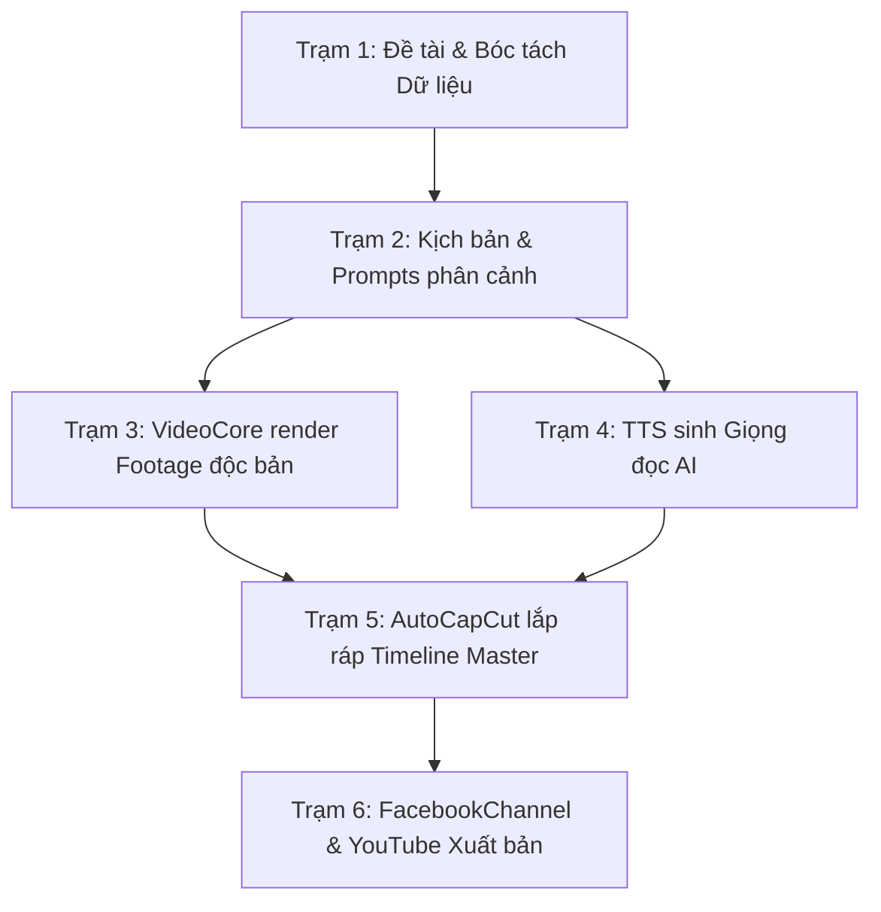

# Master SOP: Quy Trình Sản Xuất 1 Tập Video Từ Ý Tưởng Đến Xuất Bản

Quy trình sản xuất chuẩn gồm 6 trạm liên hoàn:

### Trạm 1: Nghiên cứu & Khởi tạo (Station 1)
- Lệnh: `python3 orchestrator.py new-episode --channel <kênh> --slug <tên-tập>`
- Nghiên cứu: Nạp tài liệu vào NotebookLM CLI, trích xuất dữ liệu GSO/WB/Kiểm toán vào `buc_tranh_toan_canh.md`.

### Trạm 2: Kịch bản phân cảnh (Station 2)
- Viết kịch bản theo nhịp điệu logic: Móc câu $\leftrightarrow$ Dữ liệu $\leftrightarrow$ Phản biện $\leftrightarrow$ Kết luận.
- Bẻ kịch bản thành từng cảnh quay chi tiết tại `prompts/chapter_XX.txt`.

### Trạm 3: Sản xuất Footage độc bản (Station 3)
- Bật Chrome Canary: `bash VideoCore/scripts/launch_canary_flow.sh`.
- Chạy: `python3 VideoCore/scripts/produce_episode_videos.py --episode <slug>`.
- Veo 3.1 Lite sinh toàn bộ các clip `.mp4` vào thư mục `videos/`.

### Trạm 4: Giọng đọc AI (Station 4)
- Chạy hệ thống TTS tổng hợp file âm thanh lồng tiếng chất lượng cao.

### Trạm 5: Dựng phim tự động (Station 5)
- AutoCapCut nạp `videos/` và `audio/`, tự động sinh timeline, khớp phụ đề, gắn nhạc nền.
- Xuất Master Video 4K/2K sang `~/Movies/CapCut/*_Master/`.

### Trạm 6: Phân phối đa nền tảng (Station 6)
- Chạy `FacebookChannel/scripts/adapt_content.py` để chuyển hóa bài đăng Facebook chuẩn *The Meta Strategist*.
- Chạy `FacebookChannel/scripts/upload_video.py` để upload file video lớn (5-11 GB) kèm thumbnail và hẹn giờ.
- Xuất bản đồng thời trên YouTube Official Channel.
