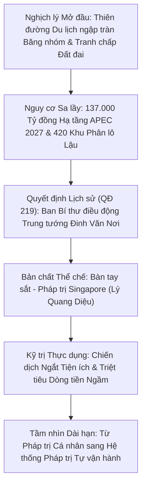
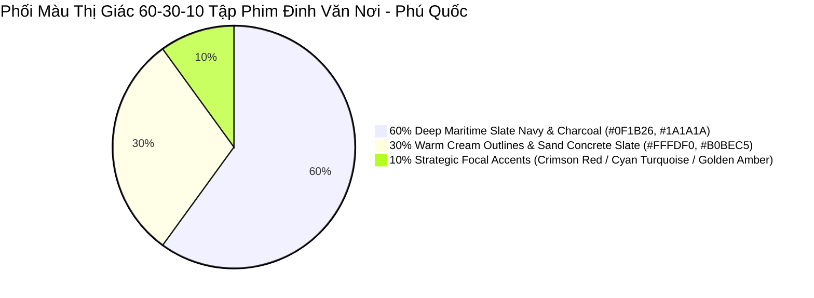

# I2V Production Plan: Vì sao Trung tướng Đinh Văn Nơi được chọn lãnh đạo Đặc khu Phú Quốc?

> **Tài liệu Kế hoạch Sản xuất Hình ảnh & Chuyển động (Image-to-Video Production Blueprint)**  
> **Kênh:** GocNhinPodcast (`https://www.youtube.com/@GocNhin_Podcast`)  
> **Tập phim:** `episodes/dinh-van-noi-phu-quoc`  
> **Phân loại:** Loại B — Chiến lược Quốc gia / Kinh tế Thể chế & An ninh Pháp trị  
> **Thời lượng ước tính:** 22 – 25 phút | 7 Chương  

---

## 1. Tổng Quan Dự Án & Định Vị Chủ Đề (Episode DNA & Thematic Core)

### 1.1. Luận điểm Trung tâm & Nghịch lý Cốt lõi (Central Paradox)
- **Nghịch lý trung tâm:** *"Muốn MỞ CỬA tự do thương mại bậc nhất (Khu phi thuế quan FTZ, Casino, Visa 180 ngày, APEC 2027) $\rightarrow$ Trung ương bắt buộc phải cử người SIẾT CHẶT kỷ cương và an ninh nhất."*
- **Bản chất vấn đề:** Phú Quốc không thiếu tiền (137.138 tỷ đồng đã có), không thiếu quy hoạch thế kỷ hay nhà đầu tư sẵn sàng. Điểm nghẽn chí tử nằm ở **"Phần mềm Thể chế"** (an ninh mặt đất bị giang hồ đe dọa, 420 khu phân lô lậu, cán bộ cơ sở buông lỏng/bắt tay ngầm, nguy cơ rửa tiền).
- **Mỏ neo Vật lý (Physical Anchor):** Số điện thoại đường dây nóng cá nhân **`096.229.7777`** (Tứ quý 7) — biểu tượng phá vỡ quan liêu, kết nối trực tiếp với nhân dân, thiết lập kênh tình báo lòng dân 24/24.

---

## 2. Tư Duy Thị Giác Chủ Đạo: Cinematic Institutional Noir (Pháp Trị Biển Đảo & Bàn Tay Sắt Thể Chế)

### 2.1. Triết lý Thiết kế 2D Báo chí Điện ảnh
- **Phong cách nghệ thuật (Art Medium):** `A 2D cinematic editorial noir illustration / flat vector illustration` kết hợp đồ họa tiểu thuyết tối giản (`minimalist graphic novel aesthetic, clean bold ink outlines, stylized flat vector textures`).
- **Nghiêm cấm ảnh chụp thực (Anti-Photorealism):** Tuyệt đối không dùng các từ chỉ ảnh chụp thật như `A photo of...`, `shot on 35mm lens` để tránh AI tạo ra ảnh photorealistic người thật.
- **Nghiêm cấm Talking Heads:** Tuyệt đối không vẽ nhân vật ngồi trước micro podcast hay nhìn camera nói chuyện. Toàn bộ hình ảnh phải là các phân cảnh hành động vật lý thực tế ngoài đời sống.
- **Nghiêm cấm Ẩn dụ Siêu thực Trừu tượng (Anti-Surrealism Rule):** Không vẽ cầu thang xoắn ốc vô tận Escher, không vẽ tượng đá Atlas gánh cầu, không vẽ cán cân công lý lơ lửng giữa trời hay đường nứt sấm sét. Mọi phân cảnh phải là không gian vật lý có thật:
  - *Hiện trường vụ án:* Xe ô tô dàn hàng tại ấp Bến Tràm, vỏ đạn hoa cải, ranh cọc bê tông đất rừng.
  - *Phòng điều hành Trung ương & A03:* Bản đồ vệ tinh địa chính Phú Quốc, hồ sơ niêm phong đại án, sơ đồ dòng tiền ngân hàng.
  - *Công trường & Hạ tầng APEC:* Máy xúc thi công hồ Cửa Cạn, đại lộ APEC 21 dự án, đường ray ngầm đô thị.
  - *Kỹ trị dòng tiền:* Tủ điện kỹ thuật và van nước bị niêm phong, công văn rút giấy phép kinh doanh, số hotline 096.229.7777 trên màn hình smartphone.

---

## 3. Hệ Phối Màu 60-30-10 Thể Chế Biển Đảo (Institutional Noir Palette)

Bảng màu được tính toán chính xác để phản ánh sự giằng co giữa bóng tối thế giới ngầm, sự uy nghiêm của pháp luật và tương lai cất cánh của Đặc khu:

### Chi tiết Phân lớp Màu sắc:

| Tỷ lệ | Tên Màu & Mã Hex | Ý nghĩa & Bối cảnh Sử dụng | Ứng dụng Visual Trong Phim |
| :--- | :--- | :--- | :--- |
| **60% Chủ đạo (Dominant Background)** | **Deep Maritime Slate Navy (`#0F1B26`)** & **Dark Charcoal (`#1A1A1A`)** | Đại diện cho biển sâu Đảo Ngọc trong màn đêm, không gian ngầm của các tổ chức tội phạm đất đai, sự nghiêm nghị của phòng họp chiến lược Trung ương. | Bầu trời đêm Phú Quốc, nền các hồ sơ án tích, bóng tối phòng điều hành an ninh, góc khuất các khu rừng bị lấn chiếm. |
| **30% Bổ trợ (Secondary Structural)** | **Warm Cream Outlines (`#FFFDF0`)** & **Sand Concrete Slate (`#B0BEC5 / #D7CCC8`)** | Nét viền đồ họa hữu cơ cao cấp, màu cát đảo ngọc, màu đá granite công quyền, các bức tường phòng xử án và mặt đường đại lộ. | Nét viền nhân vật, các khối kiến trúc trụ sở hành chính, bản vẽ quy hoạch giấy, máy bay và tàu tuần tra. |
| **10% Điểm nhấn 1 (Khủng hoảng / Vùng cấm)** | **Glowing Crimson Coral Red (`#EF5350`)** | Màu của sự nguy hiểm, vỏ đạn súng hoa cải, dấu triện đỏ niêm phong, laser rà soát sai phạm đất đai, dây cáp điện bị ngắt kết nối. | Vụ nổ súng Bến Tràm, 420 khu phân lô lậu, dấu mộc đại án Đỗ Hữu Ca / Mười Tường, công tắc cắt điện viễn thông. |
| **10% Điểm nhấn 2 (Dòng vốn / Quy hoạch APEC)** | **Glowing Cyan Turquoise (`#26A69A`)** | Đại diện cho làn nước biển trong xanh của thiên đường du lịch, dòng vốn FDI sạch 137.000 tỷ, lưới số hóa địa chính AI và hạ tầng hiện đại APEC 2027. | Bản đồ quy hoạch 21 dự án APEC, luồng dữ liệu quản lý đất đai Sandbox, ánh sáng hồ Cửa Cạn, tàu điện đô thị. |
| **10% Điểm nhấn 3 (Quyền lực / Dân sinh)** | **Glowing Golden Amber & Bronze (`#FFB300`)** | Màu của cấp bậc hàm Trung tướng, huy hiệu Công an Nhân dân, số điện thoại cứu trợ dân sinh và ánh bình minh pháp trị. | Cầu vai quân hàm Trung tướng, số hotline `096.229.7777`, đoàn xe cứu trợ Covid 58.000 hộ dân, cán cân pháp quyền Singapore. |

---

## 4. Dàn Nhân Vật Chuẩn Hóa (Cast Sheet & Character Anchoring)

Tất cả các prompt `[IMAGE]` khi tạo nhân vật bắt buộc phải dùng mô tả tiếng Anh cố định dưới đây để bảo đảm tính nhất quán 100% diện mạo:

### 4.1. Hình tượng Trung tướng Đinh Văn Nơi (Lãnh đạo Đặc khu / Cựu Cục trưởng A03)
- **Mô tả chuẩn 2D Vector:**
  > `"A distinguished Vietnamese senior police general and party secretary with resolute facial features, silvering close-cropped black hair, sharp observant eyes, wearing a crisp dark navy institutional jacket or police uniform with general insignia, dignified and authoritative presence."`
- **Quy tắc Prompt [VIDEO]:** Tuyệt đối cấm dùng tên riêng *Dinh Van Noi* trong prompt video. Thay thế bằng:
  > `"the Vietnamese senior leader / the resolute party secretary, preserving his facial features and the details of the reference image exactly without any character morphing, 8-second continuous documentary video --ar 16:9"`

### 4.2. Lực lượng Điều tra A03 & Cảnh sát Cơ động Thực địa
- **Mô tả chuẩn 2D Vector:**
  > `"A team of sharp Vietnamese male police investigators in tailored dark suits holding confidential dossiers, alongside tactical police officers in dark green service uniforms and black berets, standing firm and disciplined."`

### 4.3. Các Nhóm Đầu Nậu & Giang Hồ Bảo Kê Đất Rừng (Thái Bus, Đoàn Thiên Long)
- **Mô tả chuẩn 2D Vector:**
  > `"A group of aggressive shady syndicate operatives and land brokers in casual shirts and dark jackets, holding makeshift survey tools and forged paper blueprints in a tense clearing at the edge of a tropical forest."`

### 4.4. Giới Tinh hoa Quốc tế & Nhà Đầu tư FDI (APEC 2027)
- **Mô tả chuẩn 2D Vector:**
  > `"International executive delegates and global investors in sharp modern business suits observing a futuristic masterplan scale model inside a luxury architectural convention hall."`

### 4.5. Nhân dân & Ngư dân Bản địa Đảo Phú Quốc
- **Mô tả chuẩn 2D Vector:**
  > `"Local Vietnamese island residents and fishermen in simple sun-faded shirts and conical hats, with resilient and hopeful expressions standing near the coastal shoreline."`

---

## 5. Quy Chuẩn Kỹ Thuật Veo 3.1 & Selective Typography (~20-25%)

### 5.1. Công thức Toán học Veo 3.1 (8 Giây)
- **Quy chuẩn tốc độ đọc Voiceover:** $3.81\text{ từ/giây}$.
- **Ngưỡng thời lượng an toàn clip 8.0s:** $7.0\text{ giây}$ (Dự phòng 1.0s chuyển cảnh).
- **Số từ tối đa cho mỗi phân cảnh:** $\text{Max } 26\text{ từ/cảnh}$. Nếu câu thoại $>26$ từ, bắt buộc tách thành các phân cảnh phụ (`a`, `b`, `c`) và phân bổ đều từ ngữ.

### 5.2. Quy tắc Chọn Lọc Chữ (Selective Typography Rule)
- **20% - 25% Phân cảnh Trọng yếu (CÓ CHỮ):** Chèn Text Overlay tiếng Việt 3D trực diện (`facing camera directly, perfectly horizontal and straight 3D text overlay, heavy black drop shadow`) cho các mốc lịch sử, số liệu tài chính hoặc quyết định then chốt:
  - `"27.10.2022 - BẾN TRÀM"`
  - `"137.000 TỶ ĐỒNG - 21 DỰ ÁN APEC"`
  - `"QUYẾT ĐỊNH 219 / TW"`
  - `"HOTLINE: 096.229.7777"`
  - `"CHIẾN DỊCH NGẮT TIỆN ÍCH"`
  - `"SINGAPORE 1965"`
- **75% - 80% Phân cảnh Nghệ thuật (KHÔNG CHỮ):** Để `[TEXT OVERLAY]: Không`. Prompt `[VIDEO]` linh hoạt chuyển động camera điện ảnh (`slow push-in dolly shot`, `sweeping aerial panning shot`, `tracking shot`).
- **Khóa tĩnh lớp chữ ở Video Prompt:**
  > `"preserving all details and static graphic layers of the reference image exactly without any character morphing or alterations, 8-second continuous documentary video --ar 16:9"`

---

## 6. Lộ Trình Triển Khai 7 Chương (Visual Narrative Roadmap)

```mermaid
gantt
    title Lộ Trình Kịch Bản Thị Giác 7 Chương - Phú Quốc
    dateFormat  X
    axisFormat %s
    section Chương 1
    Hook: Tiếng Súng Bến Tràm & Nghịch Lý        :0, 10
    section Chương 2
    Khung Đối Chiếu & Khoảng Trống Thể Chế       :10, 25
    section Chương 3
    5 Cơ Chế Mở Khóa & Bài Học Singapore         :25, 40
    section Chương 4
    Phương Trình Nhân Sự & 5 Đại Án Đối Chiếu    :40, 60
    section Chương 5
    Kỹ Trị Dòng Tiền: Ngắt Tiện Ích Đất Rừng     :60, 75
    section Chương 6
    Phú Quốc Thay Đổi & 21 Siêu Dự Án APEC       :75, 90
    section Chương 7
    Kết Luận: Pháp Trị Cá Nhân vs Hệ Thống       :90, 100
```

| Chương | Tên Chương & Trọng Tâm | Tông Màu Chủ Đạo | Visual Highlight / Key Scenes |
| :--- | :--- | :--- | :--- |
| **Chương 1** | **HOOK: Tiếng Súng Ở Bến Tràm** | Crimson Red (`#EF5350`) + Slate Navy (`#0F1B26`) | 12 ô tô lao vào ấp Bến Tràm $\rightarrow$ 3 phát súng hoa cải $\rightarrow$ Zoom ra toàn cảnh đảo ngọc với con số 137.000 tỷ và dấu mộc QĐ 219. |
| **Chương 2** | **Phú Quốc Phải Đạt Chuẩn Gì?** | Slate Navy (`#0F1B26`) + Concrete Grey (`#B0BEC5`) | Khung đối chiếu 3 chiều (Dòng tiền FDI / Khách VIP APEC vs 420 khu phân lô lậu & 685 ha rừng bị xẻ thịt). |
| **Chương 3** | **Lấp Khoảng Trống Bằng Cách Nào?** | Cyan Turquoise (`#26A69A`) + Slate Navy (`#0F1B26`) | 5 cơ chế "Nếu $\rightarrow$ Thì", giải thích bản chất móng bê tông pháp trị, kết nối vắn tắt với Singapore 1965 của Lý Quang Diệu. |
| **Chương 4** | **Phương Trình Nhân Sự Của Trung Ương** | Golden Amber (`#FFB300`) + Slate Navy (`#0F1B26`) | Khắc họa Trung tướng Đinh Văn Nơi; 5 đại án kinh điển: Mười Tường (51kg vàng), 20 tỷ chạy điều chuyển, Đỗ Hữu Ca (35 tỷ), Hotline `096.229.7777`. |
| **Chương 5** | **Ngắt Dòng Tiền, Không Đập Nhà** | Crimson Red (`#EF5350`) + Golden Amber (`#FFB300`) | Chiến dịch ngắt điện, nước, viễn thông và rút GPKD công trình lấn chiếm; giải phẫu tủ kỹ thuật hạ tầng; triết lý nhân văn tránh lãng phí tiền dân. |
| **Chương 6** | **Phú Quốc Đang Thay Đổi Thế Nào?** | Cyan Turquoise (`#26A69A`) + Sand Cream (`#FFFDF0`) | Đại công trường 21 dự án APEC 2027 (hồ Cửa Cạn, đại lộ, tuyến tàu điện), bản đồ sáp nhập An Giang mới 10.000 km², số liệu tăng trưởng GRDP +37%. |
| **Chương 7** | **KẾT: Câu Hỏi Còn Lại** | Deep Slate Navy (`#0F1B26`) + Golden Amber (`#FFB300`) | Ngọn hải đăng Phú Quốc chiếu sáng trong đêm, chuyển giao từ pháp trị một vị tướng sang hệ thống pháp trị tự thân bền vững. |

---

## 7. Cổng Kiểm Tra Tự Động Trước Khi Render (Pre-Render QA Gate)

1. **Kiểm tra Đồng bộ Kịch bản - Prompt 100%:** Chạy script đối chiếu Scene ID giữa `chapter_XX_visual.md` và `prompts_chapter_XX.txt` để đảm bảo không thừa, không thiếu cảnh nào.
2. **Kiểm tra Tỷ lệ Typography $\le 25\%$:** Đảm bảo chỉ những cảnh mốc số liệu hoặc quyết định mang tính bước ngoặt mới có chữ 3D.
3. **Kiểm tra Khóa Tĩnh Lớp Đồ Họa:** Mọi prompt video phải có câu lệnh bảo toàn chi tiết ảnh gốc để tránh hiện tượng méo mặt nhân vật hoặc vỡ font chữ tiếng Việt.
