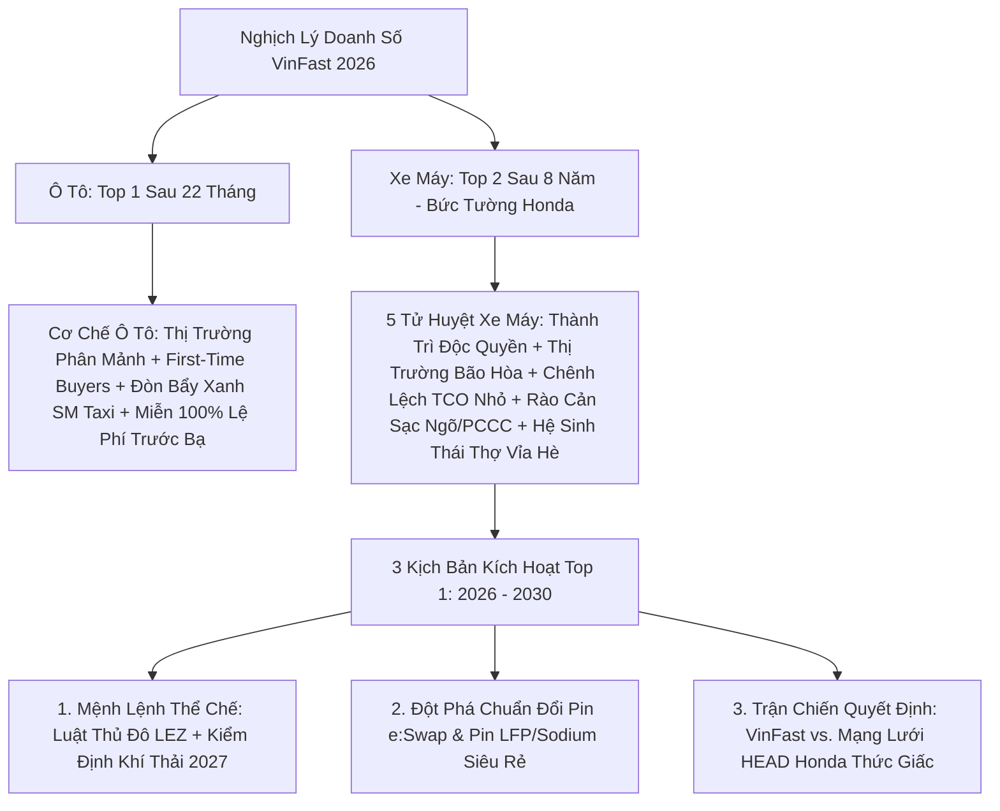

# Topic Qualification — Khi Nào Xe Máy VinFast Lên Top 1? (Giải Mã Nghịch Lý Ô Tô Vô Địch vs. Thành Trì Honda)

> **Chuyên gia thực thi:** Content Strategist & Script Architect (Dòng Chảy)  
> **Thời gian:** 22/08/2026  
> **Episode Slug:** `khi-nao-xe-may-vinfast-len-top-1`  
> **Phân loại nội dung:** **Loại B (Documentary / Phân Tích Cơ Chế & Chiến Lược Công Nghiệp)**

---

## 1. Bản Tóm Tắt & Định Vị Đề Tài (Executive Overview)

* **Chủ đề thô:** Phân tích nguyên nhân sâu xa vì sao ô tô VinFast chỉ mất hơn 20 tháng để chiếm lĩnh Top 1 thị phần toàn thị trường ô tô Việt Nam, trong khi xe máy điện VinFast dù ra mắt sớm hơn (từ 2018) và vừa vươn lên Top 2 (vượt Yamaha giữa 2026) nhưng vẫn chưa thể lật đổ ngai vàng của Honda (~60-70% thị phần). Khi nào và bằng những biến số nào thì xe máy VinFast mới có thể leo lên vị trí số 1?
* **Câu hỏi trung tâm (Core Question):** *Tại sao cùng một hệ sinh thái Vingroup, cùng một năng lực tài chính và tốc độ triển khai thần tốc, ô tô điện VinFast đã lên đỉnh vinh quang doanh số, nhưng xe máy điện lại mất gần 8 năm chỉ để leo lên vị trí thứ hai? Đâu là sự khác biệt bản chất giữa hai thị trường, và đâu là 3 "cú huých" kích hoạt thời điểm chuyển giao quyền lực lịch sử?*
* **Thông điệp cốt lõi (One-line Thesis):** Cuộc chiến xe máy điện không thể chiến thắng bằng quy luật thị trường tự do đơn thuần vì bức tường thành thói quen 30 năm và mạng lưới thợ vỉa hè của Honda; nó chỉ có thể đảo chiều khi 3 gọng kìm "Thể chế khí thải LEZ – Cách mạng pin an toàn – và Cú phản công trạm đổi pin" cùng lúc kích hoạt điểm bùng phát.

---

## 2. Bức Tranh Toàn Cảnh & Khung Phân Tích 5 Tầng (Master Panoramic Blueprint)

### 5 Tầng Khác Biệt Cốt Lõi:
1. **Cấu trúc thị trường:** Phân mảnh (Ô tô: Toyota/Hyundai nắm ~20% -> Top 1 dễ) vs. Độc quyền nhóm bám rễ sâu (Xe máy: Honda nắm ~60-70% -> Cực khó lật đổ).
2. **Hành vi tiêu dùng:** Mua xe đầu tiên (Ô tô: Người trẻ, thích công nghệ) vs. Mua xe thay thế (Xe máy: Thói quen 30 năm "xe máy là Honda", tính giữ giá xe cũ).
3. **Bài toán kinh tế TCO:** Tiết kiệm 40-70 triệu/năm (Ô tô: Cú sốc lợi ích đập vào mắt) vs. Tiết kiệm 100k-150k/tháng (Xe máy: Không đủ lớn để thay đổi thói quen).
4. **Đòn bẩy B2B:** Hàng vạn xe Xanh SM Taxi thay đổi diện mạo đô thị (Ô tô) vs. Xanh SM Bike chìm giữa đại dương 75 triệu xe máy xăng (Xe máy).
5. **Hạ tầng & Không gian sống:** Trạm sạc cao tốc/TTTM (Ô tô) vs. Nhà ống, ngõ hẹp 1-2m, nỗi sợ cháy nổ pin & lệnh cấm sạc hầm chung cư (Xe máy).

---

## 3. Khoảng Trống Thông Tin (Information Gaps) & Điểm Mù Của Dư Luận

### ❌ Bức tranh đám đông / Thiên kiến phổ biến:
1. *"VinFast xe máy chỉ cần giảm giá thật rẻ là Honda sẽ sụp đổ như Nokia."*
2. *"Xe máy điện chỉ là phong trào nhất thời của shipper Xanh SM, người dân bình thường không ai dại gì mua xe điện để lo sạc pin."*
3. *"Honda sẽ chết vì quá chậm chạp trong chuyển đổi xe điện."*

### 💡 Sự thật kinh tế học & Dữ liệu thực chứng (Counter-Intuitive Truths):
1. **Sự thật 1: Rào cản lớn nhất không phải giá xe, mà là "Hệ sinh thái thợ sửa xe vỉa hè" & Tính thanh khoản xe cũ.** Honda không bán mỗi chiếc xe, họ bán một mạng lưới hàng chục vạn tiệm sửa xe ven đường có sẵn phụ tùng thay trong 5 phút. Xe điện hỏng bo mạch, lỗi phần mềm thợ vỉa hè "bó tay", tạo ra chi phí tâm lý cực lớn.
2. **Sự thật 2: Honda là "Gã khổng lồ thức giấc", không phải Nokia.** Tháng 6/2026, Honda đã tung ra mạng lưới trạm đổi pin `Honda e:Swap` ngay tại các HEAD, kết hợp hai dòng xe chiến lược `ICON e:` và `CUV e:`. Honda chờ VinFast khai phá thị trường và giáo dục thói quen, sau đó dùng mạng lưới đại lý nghìn tỷ để phản công.
3. **Sự thật 3: Điểm đảo chiều không đến từ thị trường tự do, mà đến từ "Mệnh lệnh thể chế":** Lộ trình vùng phát thải thấp LEZ theo Luật Thủ đô 2024 (bắt đầu 7/2026 tại Hoàn Kiếm, mở rộng Vành đai 1 từ 2028), cùng quyết định kiểm định khí thải xe máy bắt buộc từ 1/7/2027 (QĐ 13/2026/QĐ-TTg) sẽ là đòn đánh trực diện vào chi phí sử dụng xe xăng cũ, buộc dòng người đổ sang xe điện.

---

## 4. Chân Dung Khán Giả Mục Tiêu (Audience Personas)

* **Primary Persona (Người đi xe máy hàng ngày & Người tiêu dùng phổ thông):** Đang phân vân giữa việc mua một chiếc Honda Vision/Lead/Air Blade hay chuyển sang VinFast Feliz S/Evo200; lo lắng về việc sạc pin ở nhà trọ/chung cư, độ bền pin và chi phí thay pin.
* **Secondary Persona (Nhà đầu tư & Người quan sát chiến lược kinh tế vĩ mô):** Muốn hiểu sâu bài toán cạnh tranh thị phần giữa VinFast và Honda, đòn bẩy chính sách công nghiệp xanh của Việt Nam và tương lai của ngành giao thông 2 bánh Đông Nam Á.

---

## 5. Ranh Giới An Toàn Tài Chính & Vùng Cấm (Financial & Editorial Boundaries)

* ⛔ **Cấm thiên vị cực đoan hoặc dìm hàng:** Không được tâng bốc VinFast một chiều hay phỉ báng Honda. Phải tôn trọng vị thế lịch sử, chuỗi cung ứng nội địa hóa >90% và độ bền của Honda, đồng thời ghi nhận nỗ lực đột phá công nghệ pin LFP và trạm sạc của VinFast.
* ⛔ **Cấm đưa lời khuyên đầu tư:** Không khuyến nghị mua bán cổ phiếu VIC, VFS hay bất kỳ tài sản tài chính nào.
* ⛔ **Tuyệt đối chính xác về văn bản pháp luật:** Dẫn chiếu chuẩn xác Luật Thủ đô 2024, Quyết định 13/2026/QĐ-TTg (kiểm định khí thải), Thông tư 31/2026/TT-BXD (PCCC sạc xe điện chung cư).

---

## 6. Quyết Định Đánh Giá (Qualification Verdict)

* **Data Availability:** **STRONG (Đã có dữ liệu thị trường 2024-2026, VAMM, chính sách pháp lý đầy đủ).**
* **Strategic Freshness:** **VERY HIGH (Chủ đề nóng hổi giữa lúc VinFast vượt Yamaha lên Top 2 và Honda kích hoạt trạm đổi pin e:Swap).**
* **Qualification Verdict:** **PROCEED (TIẾN HÀNH BƯỚC TIẾP THEO)**
