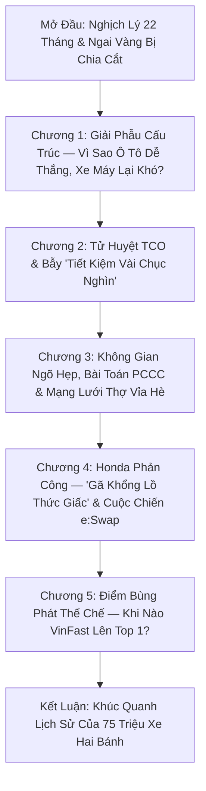

# 07_outline.md — Dàn Ý Kịch Bản Chi Tiết: Khi Nào Xe Máy VinFast Lên Top 1?

> **Episode Slug:** `khi-nao-xe-may-vinfast-len-top-1`  
> **Cấu trúc:** Mở đầu + 5 Chương + Kết luận  
> **Nguyên tắc biên soạn:** Không ép cứng số lượng từ cơ học; dung lượng từng chương hoàn toàn do độ chín của tư duy, tính trọn vẹn của luận điểm kinh tế học và nhịp thở tự nhiên quyết định.  
> **Nguồn sự thật:** `vault/MASTER_SYNTHESIS.md` & Master Vault

---

## 📌 TỔNG QUAN CẤU TRÚC 5 CHƯƠNG

---

## CHI TIẾT TỪNG PHÂN ĐOẠN

### Mở Đầu: Nghịch Lý 22 Tháng & Ngai Vàng Bị Chia Cắt
*   **Visual Hook & Cảnh mở:** Đối lập giữa sự áp đảo của ô tô điện VinFast (VF 3, VF 5 dẫn đầu bảng xếp hạng doanh số) và dòng chảy bất tận của hàng triệu xe máy xăng Honda trên các ngã tư Hà Nội/TP.HCM.
*   **Nghịch lý cốt lõi:** Ô tô VinFast ra sau nhưng chỉ cần 22 tháng để lên Top 1. Xe máy VinFast ra đời từ 2018 (Klara), tiêu tốn hàng tỷ USD, sau 8 năm mới vượt Yamaha lên Top 2.
*   **Đặt câu hỏi trung tâm:** *Vì sao cùng một tiềm lực tài chính và tốc độ của Vingroup, ô tô lại thắng nhanh còn xe máy lại vướng vào cuộc chiến tiêu hao? Khi nào ngai vàng số 1 xe máy tại Việt Nam mới đổi chủ?*

---

### Chương 1: Giải Phẫu Cấu Trúc — Vì Sao Ô Tô Dễ Thắng, Xe Máy Lại Khó?
*   **Luận điểm 1 — Thị trường phân mảnh vs. Pháo đài độc quyền:** Ô tô Việt Nam trước đây không có hãng nào giữ quá 25% (Toyota ~20%, Hyundai ~18%); VinFast chỉ cần chiếm 25-30% là lên đỉnh vinh quang. Xe máy là thành trì độc quyền của Honda (chiếm 85,9% thị phần khối VAMM năm 2025, doanh thu xe máy 97.196 tỷ đồng năm 2024).
*   **Luận điểm 2 — Người mua xe lần đầu vs. Thị trường bão hòa mua thay thế:** Người mua ô tô là *First-time buyers* (người trẻ, cởi mở công nghệ). Thị trường xe máy là *đại dương bão hòa 75 triệu xe*, người mua hôm nay là mua thay thế, bị trói buộc bởi thói quen 30 năm (*Path Dependency*).
*   **Luận điểm 3 — Đòn bẩy B2B của Xanh SM:** Hàng vạn xe Xanh SM Taxi chiếm lĩnh thị giác đô thị và giải quyết sản lượng ban đầu cho ô tô; trong khi Xanh SM Bike dù có 100.000 xe vẫn là hạt cát giữa 75 triệu xe máy xăng.
*   **Bridge sang Chương 2:** *Nhưng nếu cấu trúc thị trường chỉ là bức tranh bên ngoài, thì tại sao người dân khi rút hầu bao mua xe máy lại đắn đo từng đồng chi phí hơn rất nhiều so với mua ô tô?*

---

### Chương 2: Tử Huyệt TCO & Bẫy "Tiết Kiệm Vài Chục Nghìn"
*   **Luận điểm 1 — Cú sốc tiết kiệm của ô tô:** Đi ô tô xăng tốn 4–8 triệu/tháng; ô tô điện chỉ tốn 800k–1,5 triệu (tiết kiệm 40–70 triệu/năm) + miễn 100% trước bạ (tiết kiệm 30–100 triệu). Lợi ích kinh tế đập thẳng vào mắt.
*   **Luận điểm 2 — Bảng giải phẫu TCO xe máy 5 năm:** Xe xăng phổ thông (Wave Alpha, Vision) đi 1.000 km/tháng chỉ tốn ~200.000 – 250.000đ tiền xăng. Xe điện VinFast tốn 60k tiền điện + gói thuê pin 250k–350k/tháng = 310.000 – 410.000đ/tháng $\to$ Khoảng chênh lệch chỉ là vài chục đến một trăm nghìn đồng mỗi tháng.
*   **Luận điểm 3 — Tâm lý thanh khoản & Khấu hao pin:** Honda Wave/Vision sau 5 năm bán lại giữ 70-80% giá trị. Xe máy điện cũ bị trừ hao chai pin, chi phí thay pin mới 8-10 triệu đồng tạo áp lực tâm lý cho người mua xe cũ.
*   **Bridge sang Chương 3:** *Nếu bài toán chi phí chỉ mang tính tương đối, thì rào cản vật lý nào trong không gian sống đô thị Việt Nam đang khiến người dân ngại ngùng nhất khi nghĩ đến xe điện?*

---

### Chương 3: Không Gian Ngõ Hẹp, Bài Toán PCCC & Mạng Lưới Thợ Vỉa Hè
*   **Luận điểm 1 — Đặc thù nhà ống ngõ hẹp 1-2m:** Hàng triệu gia đình đô thị sống trong ngõ sâu không có chỗ cắm sạc; việc tháo vác cục pin LFP 10-15kg lên tầng cao mỗi tối là cực hình.
*   **Luận điểm 2 — Cú sốc PCCC chung cư & Thông tư 31/2026/TT-BXD:** Lệnh cấm sạc đêm tại nhiều khu trọ/chung cư cũ sau các vụ cháy pin trôi nổi. Thông tư 31/2026/TT-BXD siết chuẩn khoang sạc riêng, chữa cháy tự động, buộc chung cư hiện hữu phải hoàn thành nâng cấp trước 15/6/2027.
*   **Luận điểm 3 — Hệ sinh thái thợ sửa xe vỉa hè:** Hàng chục vạn tiệm sửa xe ven đường có sẵn đồ thay thế cho xe xăng trong 5 phút. Xe máy điện hỏng ECU, chết IC biến tần thợ ngoài bó tay, buộc phải vào xưởng 3S của hãng $\to$ Chi phí chuyển đổi tâm lý (Switching Costs) cực cao.
*   **Bridge sang Chương 4:** *Vậy trước sự bứt phá của VinFast lên vị trí số 2, đế chế Honda đang làm gì? Họ có thực sự ngủ quên như Nokia?*

---

### Chương 4: Honda Phản Công — "Gã Khổng Lồ Thức Giấc" & Cuộc Chiến e:Swap
*   **Luận điểm 1 — Bẫy Fixed Operations kìm chân Honda:** Đại lý HEAD thu tới 50% lợi nhuận gộp từ bảo dưỡng xe xăng (thay dầu nhớt, bugi, nhông xích). Xe điện không cần bảo dưỡng nhiều làm tổn thương dòng tiền của 800 HEAD, khiến Honda từng chần chừ chuyển dịch.
*   **Luận điểm 2 — Đòn phản công 2026:** Honda tung ra **ICON e:** (học sinh, sinh viên ~20,5-30tr), **CUV e:** và **UC3** (cao cấp 56-80tr). Kích hoạt mạng lưới **Trạm đổi pin `Honda e:Swap`** tại các HEAD từ 6/2026.
*   **Luận điểm 3 — Trận chiến hạ tầng đổi pin (V-GREEN vs. e:Swap):** VinFast/V-GREEN đang dẫn trước với >4.500 trạm hiện hữu và mục tiêu 45.000 tủ đổi pin công cộng tại 34 tỉnh thành (gấp 1,5 lần số cây xăng); Honda e:Swap mới thí điểm bên trong các HEAD.
*   **Bridge sang Chương 5:** *Nếu cuộc chiến thị trường tự do đang ở thế giằng co, thì biến số nào sẽ kích hoạt điểm bùng phát đưa xe máy VinFast lên vị trí số một?*

---

### Chương 5: Điểm Bùng Phát Thể Chế — Khi Nào VinFast Lên Top 1?
*   **Luận điểm 1 — Mệnh lệnh Thể chế LEZ & Khí thải (2026–2028):** Đề án Vùng phát thải thấp LEZ Hà Nội (Luật Thủ đô 2024, thí điểm 1/7/2026 Hoàn Kiếm, Vành đai 1 - 2028, Vành đai 3 - 2030); Quyết định 13/2026/QĐ-TTg kiểm định khí thải xe máy bắt buộc từ 01/7/2027 tại Hà Nội/TP.HCM $\to$ Đánh sập lợi thế chi phí của xe xăng cũ nát.
*   **Luận điểm 2 — Chiếc "Wave Alpha điện" dưới 15 triệu:** VinFast cần hoàn thiện dòng xe nồi đồng cối đá dùng pin LFP/Sodium-ion giá rẻ dưới 15 triệu để chinh phục thị trường nông thôn và lao động phổ thông.
*   **Luận điểm 3 — Dự báo 3 mốc chuyển giao quyền lực:**
    - *2026:* Củng cố Top 2 (thị phần xe điện 28%), phủ 45.000 tủ đổi pin.
    - *2027–2028:* Cú sốc kiểm định khí thải đẩy thị phần xe điện vượt 40%.
    - *2029–2030 (Điểm giao cắt Crossover Point):* Xe điện chiếm >55-60% doanh số bán mới toàn quốc, VinFast chính thức cạnh tranh sòng phẳng ngôi vị Top 1 với Honda.

---

### Kết Luận: Khúc Quanh Lịch Sử Của 75 Triệu Xe Hai Bánh
*   Đúc kết bài học công nghiệp: Không có đế chế nào là vĩnh cửu nếu không thích ứng với quy luật chuyển đổi năng lượng.
*   Khẳng định tương lai di chuyển xanh tại Việt Nam và lời kết mang tầm vóc chiến lược của Dòng Chảy.
