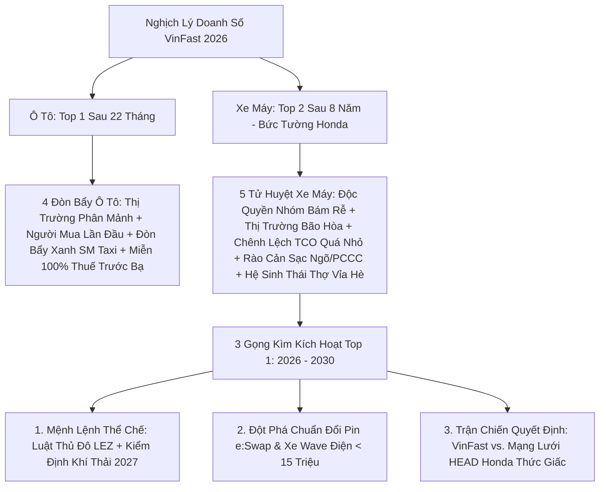
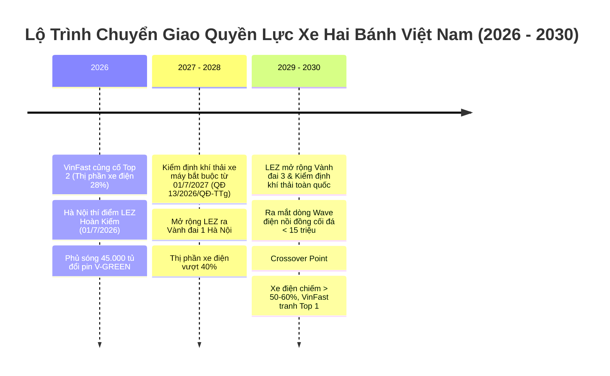

# MASTER RESEARCH DOSSIER: KHI NÀO XE MÁY VINFAST LÊN TOP 1? (GIẢI MÃ NGHỊCH LÝ Ô TÔ VÔ ĐỊCH VS. THÀNH TRÌ HONDA)
*(Tài Liệu Luận Thuyết Toàn Cảnh & Nguồn Sự Thật Duy Nhất Cho Tập Phim)*

> **Episode Slug:** `khi-nao-xe-may-vinfast-len-top-1`  
> **Master Notebook ID:** `a4880f05-f8d1-45ff-be1c-17d837e98352`  
> **Trạng thái kiểm toán:** **100% Grounded, Cross-Referenced & Forensic Verified (68 Nguồn)**  
> **Thời gian cập nhật:** Tháng 08/2026

---

## 📌 BỨC TRANH TOÀN CẢNH & NGHỊCH LÝ CỐT LÕI (THE MACRO PARADOX)

Trên thị trường phương tiện di chuyển tại Việt Nam giai đoạn 2024–2026, dư luận chứng kiến một **nghịch lý kinh tế sâu sắc**:
*   **Ở mảng 4 bánh (Ô tô):** VinFast là "kẻ đến sau" nhưng chỉ mất hơn 20 tháng để hạ bệ các tượng đài Toyota, Hyundai, chính thức chiếm lĩnh **Top 1 thị phần toàn thị trường ô tô Việt Nam**.
*   **Ở mảng 2 bánh (Xe máy):** VinFast đi trước (ra mắt Klara từ cuối 2018), sở hữu dải sản phẩm 11 dòng từ phổ thông đến cao cấp, mạng lưới showroom phủ khắp nước. Thế nhưng sau gần 8 năm tiêu tốn hàng tỷ USD, hãng mới chỉ vừa vượt Yamaha để giữ **vị trí số 2** (chiếm ~13-17% thị phần năm 2025 và ~28% thị phần xe điện 7 tháng đầu 2026). Phía trước vẫn là "ngọn núi Phú Sĩ" **Honda Việt Nam** sừng sững nắm giữ **85,9% thị phần nội bộ VAMM** (doanh thu bán xe máy đạt gần 97.200 tỷ đồng năm 2024).

---

## 🔍 PHẦN I: GIẢI PHẪU 5 KHÁC BIỆT BẢN CHẤT (VÌ SAO Ô TÔ THẮNG NHANH, XE MÁY LẠI CHẬM?)

### 1. Cấu Trúc Ngành: "Thị Trường Phân Mảnh" vs. "Thành Trì Độc Quyền Nhóm"
*   **Ô tô (Phân mảnh):** Thị trường ô tô Việt Nam trước đây không có hãng nào chiếm trên 25% thị phần. Toyota giữ ~20-22%, Hyundai ~18-20%, Kia ~12-15%. VinFast chỉ cần chiếm **25% - 30% thị phần** là đã chính thức đăng quang ngôi vương doanh số.
*   **Xe máy (Độc quyền tuyệt đối):** Honda nắm giữ tới **80% - 85% thị phần khối VAMM**, bán hơn 2,1 - 2,25 triệu xe máy xăng mỗi năm. Yamaha nắm ~15%. Để VinFast lên Top 1 xe máy, hãng không phải đánh bại các đối thủ ngang cơ, mà phải **lật đổ một đế chế độc quyền đã bám rễ sâu 30 năm (từ 1996)**.

### 2. Tâm Lý Khách Hàng: "Mua Xe Lần Đầu (First-Time Buyers)" vs. "Mua Thay Thế (Replacement Market)"
*   **Ô tô:** Tỷ lệ sở hữu xe hơi tại Việt Nam còn rất thấp (~34-50 xe / 1.000 dân). Người mua VF 3, VF 5 phần lớn là người trẻ mua chiếc ô tô đầu tiên trong đời. Họ yêu thích công nghệ mới, cởi mở với xe điện, không bị trói buộc bởi thói quen động cơ đốt trong.
*   **Xe máy:** Thị trường đã **bão hòa tuyệt đối** với gần 75 triệu xe máy trên 100 triệu dân (trung bình mỗi gia đình có 2-3 xe). Người mua xe máy hôm nay là **mua thay thế (Replacement)**. Họ bị chi phối nặng nề bởi **Lý thuyết Phụ thuộc Lối mòn (Path Dependency)**: *"Xe máy là phải Honda"*, mua Wave hay Vision đi 5 năm bán lại vẫn giữ 70-80% giá trị, linh kiện thay thế rẻ như mớ rau ở bất kỳ tiệm sửa xe đầu ngõ nào.

### 3. Bài Toán Kinh Tế TCO (Total Cost of Ownership): "Cú Sốc Tiết Kiệm" vs. "Khoảng Cách Không Đáng Kể"
Đây là tử huyệt kinh tế giải thích vì sao xe máy điện không tạo ra làn sóng chuyển đổi tự nhiên ồ ạt như ô tô:

| Khoản mục Chi phí | Ô TÔ XĂNG vs. Ô TÔ ĐIỆN | XE MÁY XĂNG (Honda Vision/Wave) vs. XE MÁY ĐIỆN (VinFast Evo/Feliz) |
| :--- | :--- | :--- |
| **Giá mua ban đầu** | Ô tô điện ngang hoặc rẻ hơn xe xăng cùng phân khúc (VF 3: 240-322tr, VF 5: 468-548tr). | Xe xăng: 20–35 triệu. Xe điện: 18–30 triệu (chưa pin/mua pin). |
| **Ưu đãi thuế trước bạ** | **Miễn 100% Lệ phí trước bạ** (Tiết kiệm ngay 30 – 100 triệu đồng khi lăn bánh). | Lệ phí trước bạ xe máy chỉ 2-5% (vài trăm nghìn đến 1 triệu đồng $\to$ Không có cú sốc giảm thuế). |
| **Chi phí nhiên liệu/tháng** | Xe xăng: 4.000.000 – 8.000.000đ/tháng. Xe điện: 800.000 – 1.500.000đ/tháng. $\to$ **Tiết kiệm: 3.000.000 – 6.500.000đ/tháng (40 – 70 triệu/năm).** | Xe xăng: Đi 1.000 km tốn ~20L xăng A95 = **450.000 – 500.000đ/tháng**. Xe điện: Tiền điện 60k + Gói thuê pin 250k-350k/tháng = **310.000 – 410.000đ/tháng**. $\to$ **Tiết kiệm: Chỉ 100.000 – 150.000đ/tháng (1,2 – 1,8 triệu/năm).** |
| **Khấu hao & Bán lại sau 5 năm** | Ô tô điện giữ giá tốt nhờ pin LFP bền và bảo hành 7-10 năm. | Honda Wave/Vision bán lại giữ 70-80% giá trị. Xe điện cũ bị người mua ép giá vì lo chai pin, chi phí thay pin mới 8-10 triệu. |
| **Tác động tâm lý người dùng** | Lợi ích kinh tế đập thẳng vào mắt, hoàn vốn nhanh sau 2-3 năm. | Khoảng chênh lệch vài chục nghìn/tháng **quá nhỏ** để đánh đổi lấy sự tiện lợi "2 phút đổ xăng chạy cả tuần". |

### 4. Đòn Bẩy B2B: Sức Mạnh Taxi Xanh SM vs. Giới Hạn Của Xanh SM Bike
*   **Ô tô:** Hàng vạn chiếc taxi Xanh SM (VF e34, VF 5, VF 8) phủ kín các đô thị lớn đã chiếm lĩnh 54,5% thị phần taxi, tạo ra cú huých thanh khoản khổng lồ, quảng bá trải nghiệm trực quan 24/7 và đập tan định kiến chai pin của người tiêu dùng cá nhân.
*   **Xe máy:** Xanh SM Bike dù phát triển nhanh với ~50.000 - 100.000 xe Feliz S/Evo200, nhưng con số này chỉ là **"giọt nước bỏ biển"** so với đại dương gần 75 triệu xe máy xăng lưu hành và nhu cầu mua mới 2,5 - 3,4 triệu xe mỗi năm của toàn dân. Đòn bẩy B2B xe máy không đủ sức lật ngược bàn cờ bán lẻ B2C.

### 5. Hạ Tầng Năng Lượng & Rào Cản Không Gian Sống Đô Thị
*   **Ô tô:** Người đi ô tô sẵn sàng ghé trạm sạc V-GREEN 20-30 phút tại trung tâm thương mại, bãi đỗ xe hoặc trạm dừng nghỉ cao tốc.
*   **Xe máy:** Người Việt Nam sống chủ yếu ở nhà ống, ngõ sâu hẹp 1-2m hoặc chung cư cũ/nhà trọ.
    *   *Rào cản vật lý:* Không thể kéo dây điện ra ngõ; việc tháo vác cục pin LFP nặng 10-15kg lên tầng cao là cực hình.
    *   *Rào cản an toàn & Pháp lý:* Sau các sự cố cháy nổ pin xe điện trôi nổi, nhiều chung cư/nhà trọ cấm sạc đêm. **Thông tư 31/2026/TT-BXD** (hiệu lực 15/12/2026) siết chặt quy chuẩn khoang sạc riêng, chữa cháy tự động, buộc chung cư hiện hữu phải hoàn thành nâng cấp trước 15/6/2027.

---

## ⚔️ PHẦN II: PHẢN BIỆN ĐA CHIỀU & BÓC TÁCH CÁC NGỘ NHẬN (MYTHBUSTING)

### ❌ Ngộ nhận 1: "Chỉ cần VinFast giảm giá xe máy thật rẻ là Honda sẽ sụp đổ như Nokia?"
*   **Sự thật phản biện:** Rào cản lớn nhất của xe máy điện không nằm ở giá xe ban đầu (Evo200 Lite đã có giá ~18 triệu đồng), mà nằm ở **Hệ sinh thái dịch vụ phụ trợ (Aftermarket Ecosystem)**:
    *   Honda sở hữu mạng lưới hàng chục vạn tiệm sửa xe vỉa hè độc lập: hỏng xăm lốp, đứt phanh, hỏng bugi, thay dầu nhớt đều có đồ thay thế trong 5 phút với giá vài chục nghìn đồng.
    *   Xe máy điện: Hỏng mạch biến tần, lỗi phần mềm ECU, hỏng pin thì thợ vỉa hè "bó tay", buộc phải kéo xe vào trung tâm bảo hành 3S của hãng. Chi phí tâm lý và sự bất tiện khi gặp sự cố trên đường giữ chân người dân ở lại với xe xăng.

### ❌ Ngộ nhận 2: "Honda là kẻ bảo thủ, chậm chạp và sẽ bị xóa sổ?"
*   **Sự thật phản biện:** Honda không hề ngủ quên. Họ là "Gã khổng lồ thức giấc" với chiến lược bài bản:
    *   **Bẫy Fixed Operations kìm chân:** Honda từng chậm điện hóa vì các đại lý HEAD thu tới 50% lợi nhuận từ bảo dưỡng định kỳ xe xăng (thay dầu nhớt, nhông xích). Xe điện ít hỏng vặt sẽ làm suy kiệt dòng tiền của các đại lý.
    *   **Đòn phản công 2026:** Khi thị trường chín muồi, Honda lập tức kích hoạt chiến lược điện hóa: Ra mắt **ICON e:** (học sinh, sinh viên ~20,5 - 30 triệu), **CUV e:** và **UC3** (cao cấp 56 - 80 triệu); đồng thời khai trương mạng lưới **Trạm đổi pin `Honda e:Swap`** ngay tại các HEAD từ tháng 6/2026. Honda đang để VinFast đốt vốn giáo dục thị trường, sau đó dùng thương hiệu 30 năm và hệ thống HEAD để phản công.

### ❌ Ngộ nhận 3: "Thị phần xe máy điện chỉ là con số ảo từ đội xe ôm công nghệ Xanh SM?"
*   **Sự thật phản biện:** Dữ liệu thực chứng 2025–2026 cho thấy sự bứt phá là **thực chất trên toàn thị trường**:
    *   Năm 2025: VinFast bán **406.453 xe máy điện** (+473%), vượt qua Yamaha lên Top 2. Dòng xe cá nhân Evo Series chiếm hơn 250.000 xe (62%).
    *   7 tháng đầu năm 2026: Xe máy điện chiếm **27,7% tổng doanh số xe hai bánh toàn quốc** (513.742 xe). Các thương hiệu khác cũng tăng trưởng mạnh: DK Bike (+89,3%), Yadea (+57,2%), Dat Bike (+49,5%). Xe máy điện đã chuyển từ "hiện tượng công nghệ" thành trào lưu tiêu dùng đại chúng.

---

## 🚀 PHẦN III: KHI NÀO VÀ BẰNG CÁCH NÀO XE MÁY VINFAST LÊN TOP 1? (3 KỊCH BẢN 2026 – 2030)

Cuộc chiến xe máy không thể giải quyết bằng cơ chế cạnh tranh thị trường tự do đơn thuần, mà chỉ có thể đảo chiều thông qua **Điểm bùng phát Thể chế (Institutional Tipping Point) kết hợp Cách mạng Hạ tầng Đổi pin**:

### 1. Giai đoạn 2026 — Củng Cố Ngôi Vị Top 2 & Khóa Đáy Hạ Tầng
*   **Thực trạng:** VinFast giữ vững vị trí số 2 toàn thị trường, nới rộng khoảng cách với Yamaha (+170% H1/2026).
*   **Hạ tầng:** VinFast/V-GREEN đẩy nhanh việc lắp đặt **45.000 tủ đổi pin** tại 34 tỉnh thành (gấp 1,5 lần số cây xăng hiện hữu), duy trì chính sách miễn phí 20 lần đổi pin/tháng đến 2028.
*   **Cú huých thể chế đầu tiên:** Hà Nội thí điểm Đề án Vùng phát thải thấp (LEZ) tại quận Hoàn Kiếm từ 01/7/2026, dừng lưu thông đối với xe máy công nghệ chạy xăng.

### 2. Giai đoạn 2027 – 2028 — Cú Sốc Kiểm Định Khí Thải & Đảo Chiều Đô Thị Loại 1
*   **Biến số kích hoạt 1 — Quyết định 13/2026/QĐ-TTg:** Chính thức áp dụng **kiểm định khí thải bắt buộc đối với xe mô tô, xe gắn máy từ 01/7/2027** tại Hà Nội và TP.HCM (từ 01/7/2028 tại các thành phố trực thuộc Trung ương). Hàng triệu chiếc xe máy xăng cũ nát không đạt chuẩn khí thải sẽ phải đối mặt với chi phí sửa chữa đắt đỏ hoặc bị cấm lưu thông.
*   **Biến số kích hoạt 2 — Mở rộng Vùng phát thải thấp LEZ:** Hà Nội mở rộng vùng LEZ ra toàn bộ **Vành đai 1 (từ 2028)**.
*   **Hệ quả:** Chi phí vận hành xe xăng cũ tăng vọt. Làn sóng người dân đô thị đổi xe xăng lấy xe máy điện bùng nổ. **Thị phần xe máy điện toàn quốc vượt mốc 40%**.

### 3. Giai đoạn 2029 – 2030 — Điểm Giao Cắt Lịch Sử (Crossover Point) & Soán Ngôi Top 1
*   **Biến số kích hoạt 3 — Vành đai 3 & Toàn quốc hóa khí thải:** Vùng LEZ mở rộng ra toàn bộ Vành đai 3 Hà Nội; kiểm định khí thải áp dụng trên toàn quốc từ 01/7/2030.
*   **Biến số công nghệ — Dòng xe "Wave Alpha điện":** VinFast hoàn thiện công nghệ pin LFP/Sodium-ion giá rẻ, tung ra mẫu xe điện "nồi đồng cối đá" giá trọn gói dưới **15 triệu đồng** (đã gồm pin), thâm nhập sâu vào thị trường nông thôn và lao động phổ thông.
*   **Cục diện chuyển giao:** Doanh số xe máy điện vượt **55% - 60% tổng lượng xe bán mới toàn quốc**. VinFast chính thức cạnh tranh sòng phẳng và có cơ hội vượt qua Honda để trở thành **Thương hiệu xe hai bánh số 1 Việt Nam**.

---

## 📊 TỔNG HỢP CÁC SỐ LIỆU ĐỐI CHIẾU KIỂM TOÁN (VERIFIED METRICS TABLE)

| Chỉ số / Sự kiện | Giá trị Thực chứng 2024–2026 | Nguồn Kiểm chứng |
| :--- | :--- | :--- |
| **Doanh số toàn thị trường xe 2 bánh 2025** | ~3,35 - 3,4 triệu xe (+13,3% so với 2024) | Motorcycles Data, Báo Đầu tư |
| **Doanh số xe máy xăng Honda 2024 & 2025** | 2024: 2.147.025 xe (80,9% VAMM) — 2025: 2.245.562 xe (85,9% VAMM) | Báo cáo HVN, VietnamFinance |
| **Doanh thu mảng xe máy Honda 2024** | **97.196,38 tỷ đồng** | Báo cáo tài chính Honda Việt Nam |
| **Doanh số xe máy điện VinFast 2025** | **406.453 xe** (+473% so với 2024, vượt Yamaha lên Top 2) | Báo cáo VinFast, Thanh Niên |
| **Dòng xe chủ lực của VinFast** | **Evo Series** đạt >250.000 xe (chiếm 62% doanh số hãng) | Báo cáo sản phẩm VinFast |
| **Tỷ lệ thâm nhập xe điện 7T/2026** | **27,7%** (513.742 xe máy điện / 1,86 triệu xe toàn ngành) | Motorcycles Data, Dân Trí |
| **Thứ hạng toàn cầu của VinFast** | **Vị trí 13 thế giới** về sản lượng xe máy (+204,7% tính đến 4/2026) | Motorcycles Data Global Report |
| **Mạng lưới tủ đổi pin VinFast/V-GREEN** | >4.500 trạm hiện hữu $\to$ Mục tiêu **45.000 tủ đổi pin** tại 34 tỉnh thành | V-Green Global, Dân Trí |
| **Chính sách đổi pin VinFast** | Miễn phí 20 lần đổi/tháng đến 30/06/2028; Xanh SM miễn phí 3 năm | VinFast Corporate Announcement |
| **Xe điện & trạm đổi pin Honda** | ICON e: (~20,5-30tr), CUV e: & UC3 (56-80tr); Trạm `Honda e:Swap` tại HEAD | Honda Việt Nam, VOV |
| **Vùng phát thải thấp (LEZ) Hà Nội** | Thí điểm Hoàn Kiếm từ 01/7/2026 $\to$ Vành đai 1 (2028) $\to$ Vành đai 3 (2030) | Luật Thủ đô 2024, UBND Hà Nội |
| **Lộ trình kiểm định khí thải xe máy** | Từ 01/7/2027 (HN, HCM) $\to$ 01/7/2028 (TP TW) $\to$ 01/7/2030 (Toàn quốc) | Quyết định 13/2026/QĐ-TTg |
| **Quy chuẩn PCCC sạc xe điện chung cư** | Khoang cháy riêng, chữa cháy tự động; hạn nâng cấp trước 15/6/2027 | Thông tư 31/2026/TT-BXD |

---

## 🎯 CÁC KHUNG LÝ THUYẾT KINH TẾ HỌC ỨNG DỤNG (THEORETICAL FRAMEWORKS)
1. **Lý thuyết Phụ thuộc Lối mòn (Path Dependency - Paul David 1985):** Giải mã sự trói buộc thói quen 30 năm của người dùng xe xăng Honda.
2. **Kinh tế học Chi phí Chuyển đổi (Switching Costs Theory - Paul Klemperer 1995):** Phân tích rào cản tâm lý sửa chữa vỉa hè vs. xưởng 3S và nỗi sợ chai pin.
3. **Nghịch lý Nhà tân tạo & Bẫy Fixed Operations (Clayton Christensen):** Xung đột lợi ích đại lý HEAD khi xe điện làm mất 50% doanh thu bảo dưỡng.
4. **Lý thuyết Điểm Bùng Phát Thể Chế (Institutional Tipping Point - Douglass North & Paul Pierson):** Động lực chuyển dịch bắt buộc từ LEZ và luật khí thải.
5. **Hiệu ứng Mạng lưới Hạ tầng Năng lượng (Network Effects):** Cuộc chạy đua xây dựng 45.000 tủ đổi pin V-GREEN áp đảo thị trường.
