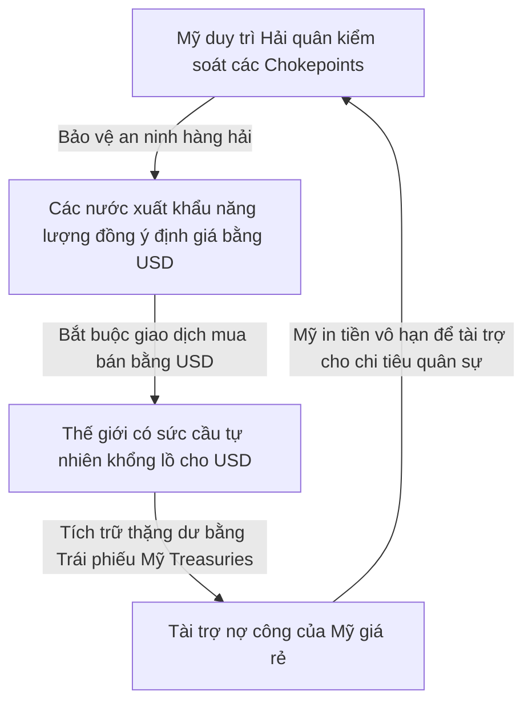

# Global Research Synthesis — Trận Chiến Petroyuan và Điểm Nghẽn Hormuz

> **Episode slug:** `remix_BkA0bkb6ZO0`
> **Lăng kính phân tích:** Phóng sự chiến lược, kết hợp trắc địa logistics vật lý với cấu trúc tiền tệ tài chính vĩ mô.

---

## 1. Bản Chất Cơ Chế Vĩ Mô (Systemic Mechanisms)

Để hiểu được tại sao eo biển Hormuz ở Trung Đông lại quyết định vận mệnh tài khóa của nước Mỹ ở Washington, chúng ta phải hiểu được mối quan hệ nhân quả khép kín giữa **Hỏa lực quân sự**, **Năng lượng vật lý**, và **Tiền tệ pháp định**:

### A. Vòng lặp Petrodollar (Petrodollar Recycling Loop)
Khi Mỹ đóng băng bản vị vàng vào năm 1971 (chấm dứt Bretton Woods), đồng USD trở thành một đồng tiền pháp định không có tài sản bảo chứng. Để duy trì sức mua của đồng tiền này, Washington đã thực hiện một bước đi thiên tài vào năm 1974 thông qua thỏa thuận với Saudi Arabia: **Định giá dầu mỏ toàn cầu độc tôn bằng USD**. 
Dầu mỏ là máu của nền công nghiệp toàn cầu. Bất kỳ quốc gia nào muốn phát triển đều phải nhập khẩu dầu, đồng nghĩa với việc họ bắt buộc phải tích lũy USD. Lượng USD thặng dư từ các nước xuất khẩu dầu mỏ (OPEC) sau đó được quay vòng, tái đầu tư trực tiếp vào Trái phiếu chính phủ Mỹ (US Treasuries). Đây là cơ chế in tiền và vay nợ giá rẻ vô hạn giúp Mỹ tài trợ cho thâm hụt ngân sách khổng lồ (hiện tại nợ công đạt mức kỷ lục **39.52 nghìn tỷ USD** vào tháng 7/2026).

### B. Học thuyết Điểm nghẽn (Chokepoint Doctrine)
Quyền lực của đồng tiền không nằm ở ngân hàng trung ương, nó nằm ở hải quân tuần tra ngoài biển khơi. Để duy trì vòng lặp Petrodollar, Mỹ bắt buộc phải kiểm soát các nút thắt logistics năng lượng quan trọng nhất hành tinh, tiêu biểu là **eo biển Hormuz** (nơi bình thường vận chuyển 15-20 triệu thùng/ngày, tương đương 20% lượng dầu tiêu thụ toàn cầu). Khi bất kỳ quốc gia nào đe dọa trật tự này (như Iran năm 2026), Mỹ sẽ dùng sức mạnh quân sự để răn đe. Tuy nhiên, việc vũ khí hóa địa chính trị này mang lại một phản tác dụng nguy hiểm: Nó buộc các đối thủ của Mỹ phải xây dựng một hệ thống logistics và tài chính song song.

---

## 2. Trục Xung Đột & Đánh Đổi Chiến Lược (Conflicts & Trade-offs)

### A. Hạ tầng ngầm đối đầu Chokepoint vật lý
Trục xung đột chính của cuộc chiến này không phải là tàu sân bay Mỹ đấu với tên lửa Iran, mà là **Mạng lưới logistics ngầm** đấu với **Rào cản chokepoint hàng hải**. 
Trung Quốc hiểu rằng họ không thể đánh bại Hải quân Mỹ trên biển trong ngắn hạn để bảo vệ tuyến đường Malacca hay Hormuz. Do đó, họ phát triển một hệ sinh thái tự vệ vật lý ngầm:
1. **Hạm đội Bóng tối (Shadow Fleet):** Gồm hơn 1,100 tàu chở dầu cũ nát, không sử dụng bảo hiểm của các nước G7, tắt radar transponder AIS và sử dụng các công ty bình phong ở quốc gia thứ ba. Hạm đội này tạo ra dòng chảy dầu mỏ ngầm liên tục chạy từ Nga và Iran đến các nhà máy lọc dầu độc lập ở Sơn Đông (teapot refineries).
2. **Kho dự trữ chiến lược + thương mại khổng lồ:** Với tổng trữ lượng ước tính **1.4 tỷ thùng** (gồm ~400 triệu thùng SPR chính phủ và 1 tỷ thùng kho thương mại), Trung Quốc có đủ năng lực hấp thụ các cú sốc cắt giảm nguồn cung trong hơn một năm mà không cần phải tham gia tranh giành mua dầu trên thị trường giao ngay quốc tế.

### B. Sự đánh đổi của Hạm đội Bóng tối
Mặc dù giúp Trung Quốc mua được dầu thô chiết khấu sâu (rẻ hơn giá thị trường từ $10-$15/thùng) và thanh toán trực tiếp bằng đồng Nhân dân tệ (RMB) qua hệ thống CIPS, hạm đội bóng tối mang lại những rủi ro cực lớn:
- **Nguy cơ thảm họa môi trường:** Các tàu cũ nát không có bảo hiểm tiêu chuẩn rất dễ gặp tai nạn chìm tàu trên biển, có thể kích hoạt các lệnh trừng phạt vật lý (Mỹ bắt giữ tàu thay vì trừng phạt tài chính trên giấy tờ).
- **Chi phí vận hành tăng:** Vận tải ngầm yêu cầu nhiều lần chuyển mạn tàu (Ship-to-Ship) ở vùng biển quốc tế, làm gia tăng chi phí ma sát thương mại dài hạn.

---

## 3. Điểm Nối Thực Tế Việt Nam (Vietnam Connectivity)

Là một quốc gia nhập khẩu ròng các sản phẩm xăng dầu tinh chế và có độ mở kinh tế lớn, Việt Nam nằm ngay trên đường chấn động của cuộc chiến vĩ mô này:

1. **Cú sốc tỷ giá và lạm phát nhập khẩu:** Khi giá dầu Brent vọt lên $120/thùng trong Q1/2026 do đóng cửa Hormuz, áp lực nhập khẩu lạm phát lập tức đè nặng lên nền kinh tế Việt Nam. Giá xăng dầu trong nước tăng mạnh, kéo theo chi phí logistics nội địa tăng, ảnh hưởng trực tiếp đến biên lợi nhuận của các doanh nghiệp xuất khẩu Việt Nam.
2. **Áp lực dự trữ năng lượng nội địa:** Khác với Trung Quốc có kho dự trữ 1.4 tỷ thùng (đáp ứng hơn 100 ngày tiêu thụ), hoặc Mỹ có SPR đáp ứng 60 ngày, năng lực dự trữ dầu mỏ chiến lược của Việt Nam còn rất mỏng (chỉ đáp ứng được vài tuần tiêu thụ). Khi chuỗi cung ứng toàn cầu đứt gãy, Việt Nam rất dễ rơi vào tình trạng khan hiếm nguồn cung xăng dầu cục bộ tại các cây xăng (tương tự như bài học cuối năm 2022).
3. **Chiến lược đa dạng hóa tiền tệ:** Việt Nam bắt buộc phải quan sát kỹ sự phân mảnh của hệ thống thanh toán toàn cầu. Sự lớn mạnh của CIPS/Petroyuan và sự phòng thủ của SWIFT đòi hỏi Ngân hàng Nhà nước phải linh hoạt quản lý dự trữ ngoại hối, không bỏ hết trứng vào một giỏ USD, đồng thời chuẩn bị sẵn sàng hạ tầng thanh toán đa phương để thích ứng với thế giới đa cực mới.
