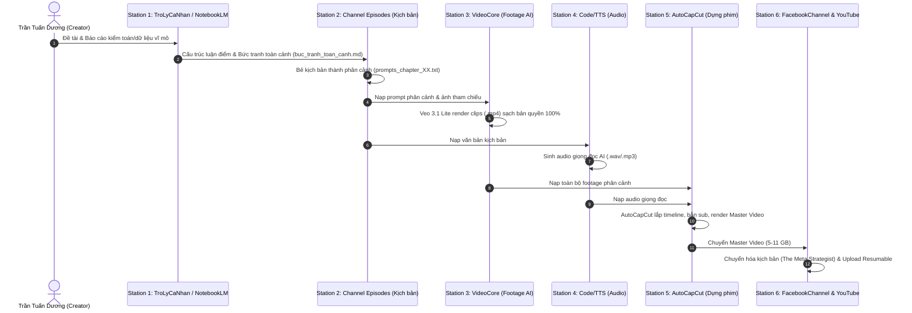

# BẢN ĐỒ LIÊN KẾT HỆ SINH THÁI (ECOSYSTEM INTEGRATION MAP)

Tài liệu này xác định giao diện dữ liệu (Data Interfaces) và cách thức luân chuyển tài nguyên giữa các trạm sản xuất:

---

## 🔄 Dòng Chảy Dữ Liệu Khép Kín (Data Flow)



---

## 📌 Quy Ước Đường Dẫn Chuẩn Của Mỗi Tập (Standard Episode Contract)

Mỗi tập video thuộc các kênh (`Dong_Chay`, `GocNhinPodcast`, `X-Economics`) đều tuân thủ cấu trúc chuẩn:

```text
episodes/[slug]/
├── buc_tranh_toan_canh.md              # Khung nghiên cứu, luận điểm phản biện, dữ liệu đối chứng
├── README.md                           # Metadata, trạng thái sản xuất, checklist
├── prompts/                            # Hoặc prompts_chapter_XX.txt (Dành cho VideoCore)
│   ├── chapter_01.txt
│   └── chapter_02.txt
├── ref_images/                         # Ảnh tham chiếu nhân vật/phong cách (@avatar.jpg)
├── videos/                             # Nơi chứa các clip footage MP4 do VideoCore sinh ra
└── audio/                              # File voiceover từ hệ thống TTS
```
