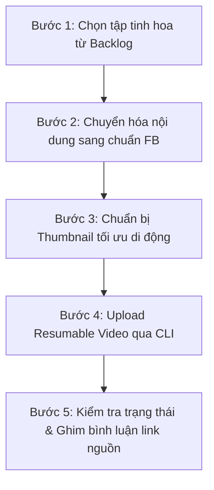

# SOP: Quy Trình Tái Bản Video YouTube Sang Kênh Facebook

Quy trình chuẩn gồm 5 bước khép kín:



### Bước 1: Chọn tập video tinh hoa
- Mở `01_management/curated_backlog.md`.
- Chọn một tập có đánh giá cao từ `Dong_Chay` hoặc `GocNhinPodcast`.
- Xác định đường dẫn file Master MP4 tương ứng (thường nằm ở `~/Movies/CapCut/*_Master/` hoặc trong thư mục tập).

### Bước 2: Chuyển hóa kịch bản sang bài đăng Facebook
- Chạy: `python scripts/adapt_content.py --source "<duong-dan-tap>" --channel "<dong_chay|gocnhin>"`
- Đọc lại file kết quả trong `storage/ready_posts/` và tinh chỉnh sắc thái ngôn từ nếu cần.

### Bước 3: Chuẩn bị Thumbnail
- Đặt thumbnail 16:9 hoặc 1:1 rõ chữ, độ tương phản cao vào `storage/thumbnails/<ten-tap>.jpg`.

### Bước 4: Tải video lên Facebook
- Chạy script upload:
  ```bash
  python scripts/upload_video.py \
    --file "/path/to/video_master.mp4" \
    --title "Tiêu đề video" \
    --desc-file "storage/ready_posts/<ten-tap>.txt" \
    --thumb "storage/thumbnails/<ten-tap>.jpg"
  ```

### Bước 5: Hoàn tất & Cập nhật Backlog
- Chạy `python scripts/check_video_status.py --video-id <ID>` để đảm bảo Facebook đã encode thành công.
- Vào Fanpage ghim bình luận đầu tiên chứa link video gốc trên YouTube.
- Đánh dấu `[x] Đã xuất bản` vào `01_management/curated_backlog.md`.
