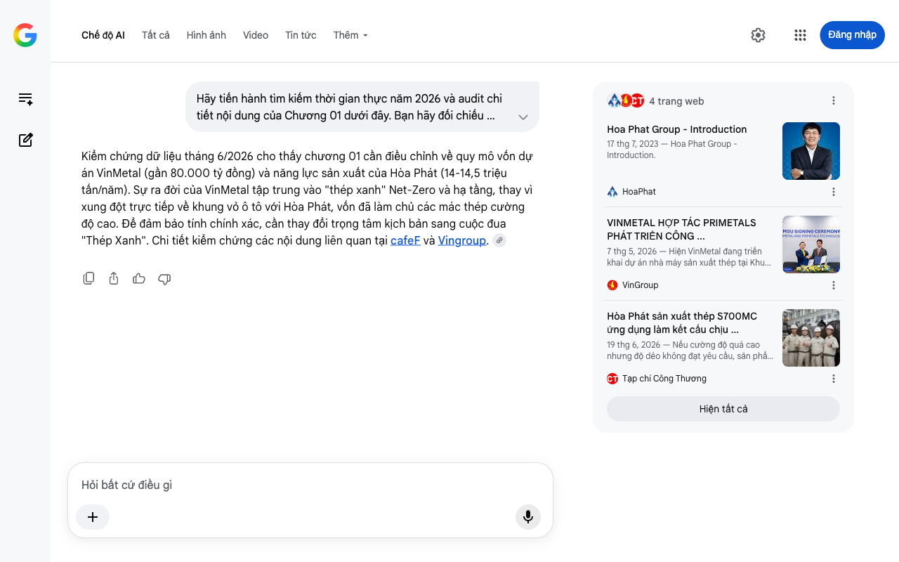

# Google AI Search Mode Audit - Chương 01

- **Nguồn kiểm chứng:** Google Search AI Mode (udm=50)
- **Thời gian audit:** 2026-07-27 15:16:09
- **File kịch bản:** [chapter_01.md](file:///Users/pro16/Documents/VideoProject/GocNhinPodcast/episodes/HoaPhat_VinMetal/chapter_01.md)

## Kết quả phản biện & Đối chiếu nguồn tin:

Kiểm chứng dữ liệu tháng 6/2026 cho thấy chương 01 cần điều chỉnh về quy mô vốn dự án VinMetal (gần 80.000 tỷ đồng) và năng lực sản xuất của Hòa Phát (14-14,5 triệu tấn/năm). Sự ra đời của VinMetal tập trung vào "thép xanh" Net-Zero và hạ tầng, thay vì xung đột trực tiếp về khung vỏ ô tô với Hòa Phát, vốn đã làm chủ các mác thép cường độ cao. Để đảm bảo tính chính xác, cần thay đổi trọng tâm kịch bản sang cuộc đua "Thép Xanh". Chi tiết kiểm chứng các nội dung liên quan tại cafeF và Vingroup. 
4 trang web
Hoa Phat Group - Introduction
17 thg 7, 2023 — Hoa Phat Group - Introduction.
HoaPhat
VINMETAL HỢP TÁC PRIMETALS PHÁT TRIỂN CÔNG ...
7 thg 5, 2026 — Hiện VinMetal đang triển khai dự án nhà máy sản xuất thép tại Khu Kinh tế Vũng Áng (Hà Tĩnh), với mục tiêu đưa vào vận hành giai đ...
VinGroup
Hòa Phát sản xuất thép S700MC ứng dụng làm kết cấu chịu ...
19 thg 6, 2026 — Nếu cường độ quá cao nhưng độ dẻo không đạt yêu cầu, sản phẩm sẽ khó tạo hình trong quá trình chế tạo. Ngược lại, nếu tăng độ dẻo ...
Tạp chí Công Thương
Hiện tất cả
Chế độ AI đã sẵn sàng trả lời

## Ảnh chụp màn hình đối chiếu:

