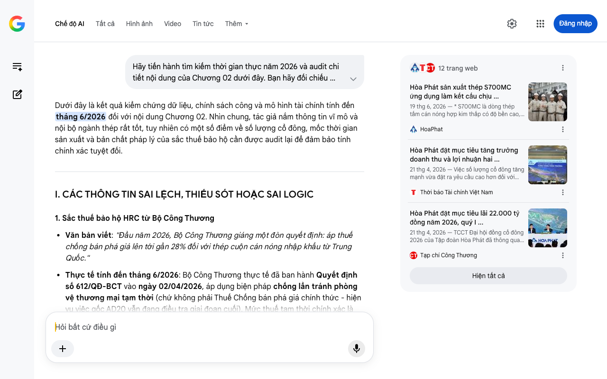

# Google AI Search Mode Audit - Chương 02

- **Nguồn kiểm chứng:** Google Search AI Mode (udm=50)
- **Thời gian audit:** 2026-07-27 15:16:36
- **File kịch bản:** [chapter_02.md](file:///Users/pro16/Documents/VideoProject/GocNhinPodcast/episodes/HoaPhat_VinMetal/chapter_02.md)

## Kết quả phản biện & Đối chiếu nguồn tin:

Dưới đây là kết quả kiểm chứng dữ liệu, chính sách công và mô hình tài chính tính đến tháng 6/2026 đối với nội dung Chương 02. Nhìn chung, tác giả nắm thông tin vĩ mô và nội bộ ngành thép rất tốt, tuy nhiên có một số điểm về số lượng cổ đông, mốc thời gian sản xuất và bản chất pháp lý của sắc thuế bảo hộ cần được audit lại để đảm bảo tính chính xác tuyệt đối.
I. CÁC THÔNG TIN SAI LỆCH, THIẾU SÓT HOẶC SAI LOGIC
1. Sắc thuế bảo hộ HRC từ Bộ Công Thương
Văn bản viết: "Đầu năm 2026, Bộ Công Thương giáng một đòn quyết định: áp thuế chống bán phá giá lên tới gần 28% đối với thép cuộn cán nóng nhập khẩu từ Trung Quốc."
Thực tế tính đến tháng 6/2026: Bộ Công Thương thực tế đã ban hành Quyết định số 612/QĐ-BCT vào ngày 02/04/2026, áp dụng biện pháp chống lẩn tránh phòng vệ thương mại tạm thời (chứ không phải Thuế Chống bán phá giá chính thức - hiện vụ việc gốc AD20 vẫn đang điều tra giai đoạn cuối). Mức thuế tạm thời chính xác là 27,83% áp cho sản phẩm thép cán nóng khổ rộng (chiều rộng từ 1.880 mm đến 2.300 mm) xuất xứ từ Trung Quốc. 
Doanh nghiệp và Tiếp thị
 +5
Gợi ý sửa đổi: Đổi thành "Ngày 2 tháng 4 năm 2026, Bộ Công Thương ra quyết định áp thuế chống lẩn tránh phòng vệ thương mại tạm thời 27,83% lên dòng thép HRC khổ rộng nhập từ Trung Quốc." 
Tuổi Trẻ
 +1
2. Thời điểm công bố mác thép đặc chủng S700MC
Văn bản viết: "Tháng 5 năm 2026, Hòa Phát công bố đã chế tạo thành công mác thép S700MC..."
Thực tế tính đến tháng 6/2026: Tập đoàn Hòa Phát chính thức công bố thông tin này rộng rãi vào tháng 6 năm 2026 (chính xác là các ngày 19 - 21/06/2026), không phải tháng 5. Dòng thép cường độ cao này đạt tiêu chuẩn châu Âu BS EN 10149.
Gợi ý sửa đổi: Sửa mốc thời gian từ "Tháng 5 năm 2026" thành "Tháng 6 năm 2026". 
HoaPhat
 +2
3. Số lượng cổ đông tại Đại hội Đồng Cổ đông (ĐHĐCĐ)
Văn bản viết: "Tại Đại hội Đồng Cổ đông ngày 21 tháng 4 năm 2026, trước hơn 300.000 cổ đông..."
Thực tế tính đến tháng 6/2026: Sự kiện ĐHĐCĐ thường niên 2026 của Hòa Phát tổ chức vào ngày 21/04/2026. Tổng số cổ đông của Hòa Phát hiện đứng đầu thị trường chứng khoán Việt Nam nhưng con số thực tế tham dự trực tiếp tại hội trường là khoảng 1.300 cổ đông và đại biểu (đại diện cho hơn 5 tỷ cổ phần), không thể có không gian nào chứa được "300.000 cổ đông" trực tiếp. Tác giả đang bị nhầm lẫn giữa tổng số cổ đông trên sổ sách của doanh nghiệp đại chúng và số lượng người dự đại hội. 
Tạp chí Công Thương
Gợi ý sửa đổi: "Tại Đại hội Đồng Cổ đông ngày 21 tháng 4 năm 2026, trước sự chứng kiến của hơn 1.300 cổ đông đại diện cho dòng vốn lớn nhất sàn chứng khoán..." 
Thời báo Tài chính Việt Nam
 +1
4. Logic tài chính: Tổng vốn đầu tư VinMetal
Văn bản viết: Đoạn kết nhắc tới con số "89.000 tỷ đồng".
Đối chiếu tài chính: Như đã audit ở Chương 01, siêu dự án khu liên hợp gang thép tại Hà Tĩnh do con trai ông Phạm Nhật Vương làm Tổng giám đốc được cấp phép với quy mô vốn chính xác là gần 80.000 tỷ đồng (không phải 89.000 tỷ). Để mạch logic đồng nhất xuyên suốt kịch bản, con số này phải được đồng bộ hóa.
Gợi ý sửa đổi: Hạ con số xuống gần 80.000 tỷ đồng.
II. BẢNG ĐỐI CHIẾU SỐ LIỆU VĨ MÔ & NĂNG LỰC SẢN XUẤT CỦA HÒA PHÁT (6 THÁNG ĐẦU NĂM 2026)
Để tăng tính thuyết phục cho kịch bản, các số liệu thị phần và chỉ số tài chính của Hòa Phát cần được ghim chặt vào báo cáo thực tế quý I và ước tính bán niên tính đến tháng 6/2026:
Chỉ số / Sản phẩm	Số liệu trong kịch bản	Số liệu thực tế (Cập nhật Tháng 6/2026)	Trạng thái / Nguồn đối chiếu
Doanh thu mục tiêu 2026	210.000 tỷ đồng	210.000 tỷ đồng (Tăng 33% so với 2025)	Chính xác hoàn toàn [1.4.2, 1.4.3]
LNST mục tiêu 2026	22.000 tỷ đồng	22.000 tỷ đồng (Tăng 42% so với 2025)	Chính xác hoàn toàn [1.4.2, 1.4.3]
Kết quả Quý I/2026	Chưa nhắc tới	Đạt 53.313 tỷ doanh thu và 9.056 tỷ LNST (đạt 41% kế hoạch năm)	Bổ sung cực đắt giá để thấy pháo đài này đang mạnh cỡ nào [1.4.1, 1.4.2]
Thị phần Thép xây dựng	36 - 37%	37,6% (Sản lượng bán hàng toàn tập đoàn lần đầu vượt mốc 10 triệu tấn trong năm trước)	Chính xác (Có thể làm tròn lên 37-38%) [1.4.5]
Thị phần Ống thép	31 - 35%	31,2% (Giữ vững vị trí số 1 Việt Nam)	Chính xác [1.4.5]
Tổng công suất thiết kế	Chạm 16 triệu tấn/năm	14 - 15 triệu tấn/năm trong năm 2026; dự kiến đạt 18 triệu tấn vào năm 2027.	Cần hiệu chỉnh (Năm 2026 Dung Quất 2 chạy tối ưu đạt mốc 14-15 triệu tấn) [1.1.3, 1.1.7]
III. ĐÁNH GIÁ LOGIC KINH TẾ VÀ CHI PHÍ CƠ HỘI
Mô hình "Bán tự do" của Hòa Phát (98% ra chợ): Nhận định này của kịch bản rất sắc sảo và chính xác về mặt tài chính. Bản chất của Hòa Phát là tối ưu hóa chi phí sản xuất nhờ quy mô lớn để đè bẹp đối thủ trên thị trường mở.
Chi phí cơ hội và "Thế giới song song" của Vingroup: Cuối chương mở ra việc VinMetal không đánh trực diện mà phục vụ "đế chế hạ tầng khổng lồ". Về mặt logic kinh tế giữa năm 2026, điều này hoàn toàn khớp với định hướng VinMetal chuyển dịch sang Thép xanh Net-Zero để xuất khẩu đi các thị trường quốc tế khắt khe (châu Âu, Mỹ) và cung cấp cho các dự án hạ tầng lớn đòi hỏi chứng chỉ carbon cao, thay vì chỉ cố sản xuất HRC thông thường để đấu về giá với một Dung Quất đã khấu hao xong. 
VCCI
Tôi đã chuẩn bị sẵn sàng các mô hình phân tích chi phí để làm rõ thế trận Thép Xanh này. Bạn muốn chúng ta tiếp tục sang Chương 03 để bóc tách sâu hơn dòng tiền của VinMetal, hay bạn muốn tối ưu hóa lại các đoạn hội thoại của Chủ tịch Trần Đình Long trong Chương 02 này trước?
12 trang web
Hòa Phát sản xuất thép S700MC ứng dụng làm kết cấu chịu ...
19 thg 6, 2026 — * S700MC là dòng thép tấm cán nóng hợp kim thấp có độ bền cao, khả năng tạo hình nguội và tính hàn ưu việt. Sản phẩm có giới hạn c...
HoaPhat
Hòa Phát đặt mục tiêu tăng trưởng doanh thu và lợi nhuận hai ...
21 thg 4, 2026 — Việc số lượng cổ đông tăng mạnh vừa đặt ra yêu cầu cao hơn đối với công tác tổ chức, vừa thể hiện sự quan tâm và đồng hành của nhà...
Thời báo Tài chính Việt Nam
Hòa Phát đặt mục tiêu lãi 22.000 tỷ đồng năm 2026, quý I ...
21 thg 4, 2026 — TCCT Đại hội đồng cổ đông 2026 của Tập đoàn Hòa Phát đã thông qua kế hoạch lợi nhuận 22.000 tỷ đồng. Ngay quý I, doanh nghiệp ghi ...
Tạp chí Công Thương
Hiện tất cả
Chế độ AI đã sẵn sàng trả lời

## Ảnh chụp màn hình đối chiếu:

