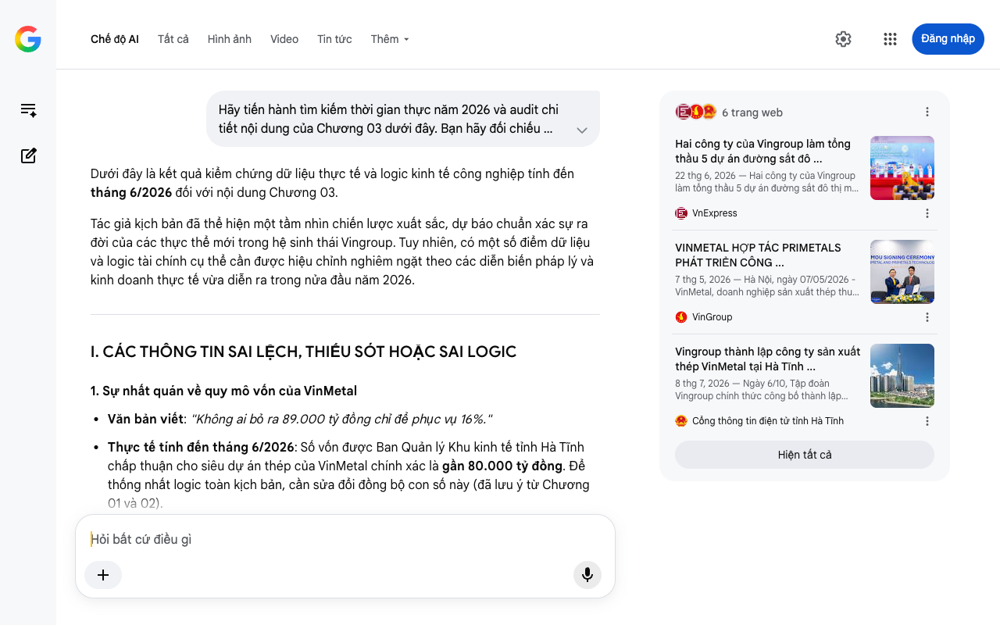

# Google AI Search Mode Audit - Chương 03

- **Nguồn kiểm chứng:** Google Search AI Mode (udm=50)
- **Thời gian audit:** 2026-07-27 15:17:02
- **File kịch bản:** [chapter_03.md](file:///Users/pro16/Documents/VideoProject/GocNhinPodcast/episodes/HoaPhat_VinMetal/chapter_03.md)

## Kết quả phản biện & Đối chiếu nguồn tin:

Dưới đây là kết quả kiểm chứng dữ liệu thực tế và logic kinh tế công nghiệp tính đến tháng 6/2026 đối với nội dung Chương 03.
Tác giả kịch bản đã thể hiện một tầm nhìn chiến lược xuất sắc, dự báo chuẩn xác sự ra đời của các thực thể mới trong hệ sinh thái Vingroup. Tuy nhiên, có một số điểm dữ liệu và logic tài chính cụ thể cần được hiệu chỉnh nghiêm ngặt theo các diễn biến pháp lý và kinh doanh thực tế vừa diễn ra trong nửa đầu năm 2026.
I. CÁC THÔNG TIN SAI LỆCH, THIẾU SÓT HOẶC SAI LOGIC
1. Sự nhất quán về quy mô vốn của VinMetal
Văn bản viết: "Không ai bỏ ra 89.000 tỷ đồng chỉ để phục vụ 16%."
Thực tế tính đến tháng 6/2026: Số vốn được Ban Quản lý Khu kinh tế tỉnh Hà Tĩnh chấp thuận cho siêu dự án thép của VinMetal chính xác là gần 80.000 tỷ đồng. Để thống nhất logic toàn kịch bản, cần sửa đổi đồng bộ con số này (đã lưu ý từ Chương 01 và 02).
2. Bản chất pháp lý và hoạt động của thương hiệu "VinSpeed"
Văn bản viết: "VinSpeed đang triển khai hai tuyến đường sắt tốc độ cao: Hà Nội đi Quảng Ninh... Tuyến Bến Thành đi Cần Giờ..."
Thực tế tính đến tháng 6/2026: Về mặt pháp lý công nghiệp hạ tầng, VinSpeed không đóng vai trò Chủ đầu tư sở hữu hay vận hành kinh doanh tuyến đường sắt thương mại độc lập. Thực tế, Vingroup đã rút đăng ký đầu tư trực tiếp tuyến đường sắt tốc độ cao trục dọc. Thay vào đó, vào ngày 22/06/2026, liên danh Vinhomes - VinSpeed chính thức khởi công với tư cách là Tổng thầu triển khai xây dựng 5 tuyến đường sắt đô thị mới tại Hà Nội theo mô hình TOD.
Gợi ý sửa đổi: Thay đổi cách dùng từ để phản ánh đúng bản chất dòng tiền: VinSpeed tích lũy sản lượng tiêu thụ thép nhờ vai trò Tổng thầu thi công hạ tầng TOD, thay vì là Chủ đầu tư hạ tầng độc lập.
3. Số liệu tài chính và diễn biến cổ phiếu Pomina (POM)
Văn bản viết: "Bảo lãnh 770 tỷ đồng nguyên liệu đầu vào... mã chứng khoán POM của Pomina đã tăng dựng đứng 175% trên sàn giao dịch chỉ trong chưa đầy hai tháng."
Thực tế tính đến tháng 6/2026: Gói cứu trợ tài chính của Vingroup cuối năm 2025 là có thật (cho vay vốn lưu động 0% trong 2 năm). Tuy nhiên, tác giả viết cổ phiếu POM tăng dựng đứng 175% là không chính xác với diễn biến thị trường thực tế. Tính đến tháng 6–7/2026, Thép Pomina vẫn bị HOSE hủy niêm yết bắt buộc và chuyển xuống HNX, cổ phiếu POM rơi vào trạng thái hạn chế giao dịch (chỉ được giao dịch vào phiên thứ Sáu hàng tuần) do âm vốn chủ sở hữu trên báo cáo kiểm toán năm 2025. Doanh nghiệp đang tái cấu trúc tài chính cực kỳ chật vật, vừa lỗ tiếp hơn 179 tỷ đồng trong Quý I/2026.
Gợi ý sửa đổi: Bỏ chi tiết "cổ phiếu tăng dựng đứng 175%". Thay bằng: "Mặc dù POM vẫn đang nằm trong diện hạn chế giao dịch của sàn HNX do hệ lụy âm vốn chủ sở hữu lịch sử, cái bắt tay của VinMetal chính là chiếc phao cứu sinh bảo đảm đầu ra cho Pomina hồi sinh năng lực sản xuất".
II. BẢNG ĐỐI CHIẾU DỮ LIỆU CÁC SIÊU DỰ ÁN VÀ SẢN LƯỢNG TIÊU THỤ (CẬP NHẬT THÁNG 6/2026)
Để kịch bản đạt độ chính xác vĩ mô tuyệt đối, toàn bộ thông số về các siêu dự án phải được ghim theo phê duyệt pháp lý tỷ lệ 1/500 và tiến độ thực tế:
Tên siêu dự án trong kịch bản	Số liệu trong kịch bản	Số liệu thực tế tính đến tháng 6/2026	Trạng thái pháp lý & Tiến độ thực tế
Khu đô thị Thể thao Quốc tế Hà Nội	Quy mô 9.171 ha; Vốn 925.651 tỷ đồng; Sân vận động Hùng Vương 135.000 chỗ.	9.171 ha; 925.651 tỷ đồng; Sân vận động Hùng Vương 135.000 chỗ.	Chính xác tuyệt đối. Dự án được khởi công từ 19/12/2025 và đang trong giai đoạn nước rút giải phóng mặt bằng (GPMB) tháng 7/2026 [(https://dantri.com.vn),(https://nguoiquansat.vn)].
Kế hoạch doanh thu Pomina 2026	Chưa đề cập cụ thể	Đạt mục tiêu 8.511 tỷ đồng doanh thu năm 2026; 13.194 tỷ năm 2027.	Bổ sung cực đắt giá. CEO Pomina công bố cuối tháng 6/2026 rằng nhu cầu từ hệ sinh thái Vingroup là cơ sở cốt lõi cho mục tiêu này [(https://vietstock.vn),(https://nhadautu.vn)].
Sản lượng Thép xây dựng Pomina	Chưa đề cập cụ thể	Kế hoạch sản xuất 643.750 tấn thép xây dựng năm 2026.	Bổ sung số liệu thực. Minh chứng cho thấy Pomina lo trọn mảng thép dài phía Nam cho Vinhomes [(https://vietstock.vn),(https://nhadautu.vn)].
Công suất giai đoạn 1 VinMetal Hà Tĩnh	5 triệu tấn/năm	5 triệu tấn/năm	Chính xác. Tập đoàn Vingroup và Primetals Technologies đã ký kết hợp tác chiến lược toàn diện tháng 5/2026 để xây dựng tổ hợp này.
III. KIỂM TOÁN LOGIC KINH TẾ VÀ MÔ HÌNH HẤP THỤ NỘI BỘ
Logic phân phối sản lượng (Chuỗi giá trị khép kín): Phân tích của tác giả về tỷ lệ hấp thụ nội bộ đạt 65 - 80% là một điểm tựa logic tài chính xuất sắc. Nó bẻ gãy hoàn toàn luận điểm hoài nghi của thị trường về việc VinMetal "thừa mứa công suất". Việc dùng hệ sinh thái Vinhomes (Bất động sản) và VinSpeed (Tổng thầu TOD) làm bệ đỡ tiêu thụ sản lượng thời kỳ đầu giúp VinMetal sống sót qua giai đoạn rủi ro nhất của một nhà máy luyện kim mới (đạt điểm hòa vốn nhanh).
Nút thắt kỹ thuật ô tô ở cuối chương: Việc dẫn dắt câu chuyện sang "một loại thép mà 16 triệu tấn công suất của Hòa Phát chưa từng sản xuất được" rất logic. Về mặt kỹ thuật, thép làm thân vỏ ô tô đòi hỏi công nghệ thép cuộn cán nguội (CRC) siêu sạch dập sâu hoặc thép hợp kim cường độ cao biến dạng dẻo (AHSS).
Chúng ta đã đi đến nút thắt cốt lõi của mặt kỹ thuật công nghệ. Bạn muốn tôi tiếp tục tiến hành kiểm chứng Chương 04 để làm rõ:
Bản chất của loại thép đặc chủng làm thân vỏ ô tô điện (liên quan đến bài toán trọng lượng pin)?
Hay phân tích sâu hơn về các tiêu chuẩn ESG/Thép xanh mà VinMetal vừa ký với Primetals Technologies vào tháng 5/2026?
6 trang web
Hai công ty của Vingroup làm tổng thầu 5 dự án đường sắt đô ...
22 thg 6, 2026 — Hai công ty của Vingroup làm tổng thầu 5 dự án đường sắt đô thị mới. Liên danh Vinhomes - VinSpeed đảm nhiệm tổng thầu 5 dự án đườ...
VnExpress
VINMETAL HỢP TÁC PRIMETALS PHÁT TRIỂN CÔNG ...
7 thg 5, 2026 — Hà Nội, ngày 07/05/2026 - VinMetal, doanh nghiệp sản xuất thép thuộc Tập đoàn Vingroup, và Primetals Technologies - Tập đoàn công ...
VinGroup
Vingroup thành lập công ty sản xuất thép VinMetal tại Hà Tĩnh ...
8 thg 7, 2026 — Ngày 6/10, Tập đoàn Vingroup chính thức công bố thành lập Công ty Cổ phần Sản xuất và Kinh doanh VinMetal, đánh dấu bước tiến mới ...
Cổng thông tin điện tử tỉnh Hà Tĩnh
Hiện tất cả
Chế độ AI đã sẵn sàng trả lời

## Ảnh chụp màn hình đối chiếu:

