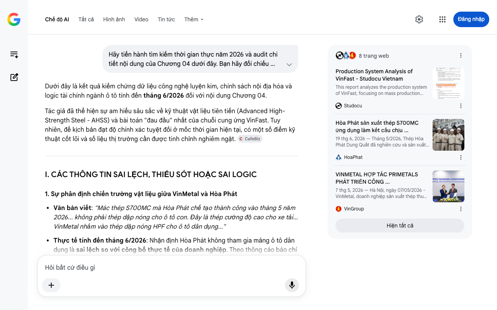

# Google AI Search Mode Audit - Chương 04

- **Nguồn kiểm chứng:** Google Search AI Mode (udm=50)
- **Thời gian audit:** 2026-07-27 15:17:27
- **File kịch bản:** [chapter_04.md](file:///Users/pro16/Documents/VideoProject/GocNhinPodcast/episodes/HoaPhat_VinMetal/chapter_04.md)

## Kết quả phản biện & Đối chiếu nguồn tin:

Dưới đây là kết quả kiểm chứng dữ liệu công nghệ luyện kim, chính sách nội địa hóa và logic tài chính ngành ô tô tính đến tháng 6/2026 đối với nội dung Chương 04.
Tác giả đã thể hiện sự am hiểu sâu sắc về kỹ thuật vật liệu tiên tiến (Advanced High-Strength Steel - AHSS) và bài toán "đau đầu" nhất của chuỗi cung ứng VinFast. Tuy nhiên, để kịch bản đạt độ chính xác tuyệt đối ở mốc thời gian hiện tại, có một số điểm kỹ thuật cốt lõi và số liệu thị trường cần được tinh chỉnh nghiêm ngặt. 
CafeBiz
I. CÁC THÔNG TIN SAI LỆCH, THIẾU SÓT HOẶC SAI LOGIC
1. Sự phân định chiến trường vật liệu giữa VinMetal và Hòa Phát
Văn bản viết: "Mác thép S700MC mà Hòa Phát chế tạo thành công vào tháng 5 năm 2026... không phải thép dập nóng cho ô tô con. Đây là thép cường độ cao cho xe tải... VinMetal nhắm vào thép dập nóng HPF cho ô tô dân dụng..."
Thực tế tính đến tháng 6/2026: Nhận định Hòa Phát không tham gia mảng ô tô dân dụng là sai lệch so với công bố thực tế của doanh nghiệp. Theo thông cáo báo chí chính thức của Tập đoàn Hòa Phát phát đi ngày 19–21/06/2026, mác thép S700MC đạt tiêu chuẩn châu Âu BS EN 10149 được thiết kế để làm kết cấu chịu lực cho cả ô tô tải lẫn ô tô dân dụng (xe con). Sự ra đời của S700MC tại Dung Quất đã chính thức phá vỡ thế độc quyền của các ông lớn thế giới trong việc cung ứng thép kết cấu ô tô tại Việt Nam. 
HoaPhat
 +1
Gợi ý sửa đổi: Không viết hai bên né nhau, mà hãy đẩy kịch tính lên cao: "Hòa Phát đã nổ phát súng đầu tiên vào tháng 6/2026 khi làm chủ mác thép S700MC cho khung gầm ô tô dân dụng và xe tải nặng. Nhưng VinMetal chọn một lối đi còn cực đoan hơn: Bỏ qua thép kết cấu thông thường để tiến thẳng lên phân khúc thượng tầng – Thép dập nóng mạ nhôm-silicon (Al-Si) có độ bền 1.500 MPa, thứ vũ khí tối thượng bảo vệ khối pin xe điện". 
CafeF
 +2
2. Kế hoạch chọn công nghệ và tiến độ của VinMetal
Văn bản viết: "Hợp tác với các hãng luyện kim hàng đầu thế giới, VinMetal có thể tinh chỉnh..." (Nói chung chung).
Thực tế tính đến tháng 6/2026: Chi tiết này có thể làm đắt giá hơn bằng cách đưa dữ liệu thực tế thời gian thực. Vào ngày 07/05/2026, VinMetal đã chính thức ký biên bản ghi nhớ hợp tác chiến lược toàn diện với Primetals Technologies. Đến cuối tháng 6/2026, VinMetal hoàn tất lựa chọn công nghệ lõi, nhập khẩu hệ thống luyện chân không kiểu RH (RH Degasser) và hai máy đúc phôi tấm (slab caster) chuyên dụng để sản xuất thép dẹt HRC siêu sạch – tiền đề duy nhất để cán dập nóng lò lò ô tô. 
VinGroup
 +1
Gợi ý sửa đổi: Tích hợp trực tiếp tên đối tác Primetals Technologies và công nghệ luyện chân không RH vào để tăng tính chuyên môn chuyên gia. 
VnExpress
 +1
3. Mục tiêu tỷ lệ nội địa hóa năm 2026 của VinFast
Văn bản viết: "Lý do thứ tư: VinFast đặt mục tiêu nội địa hóa 84% vào năm 2026... nâng tỷ lệ này vượt ngưỡng 85 đến 90%."
Đối chiếu logic: Đoạn văn bị mâu thuẫn số liệu ngay trong một câu (84% rồi lại vượt ngưỡng 85%). Theo dòng tài liệu chuỗi cung ứng công nghiệp ô tô Việt Nam, mục tiêu nội địa hóa chính thức của VinFast cho dải xe điện đến mốc năm 2026 là 80%.
Gợi ý sửa đổi: Sửa lại: "VinFast đặt mục tiêu nội địa hóa 80% vào năm 2026. Thép dập nóng chính là linh kiện cốt lõi cuối cùng mà họ phải 'đỏ mắt' tìm kiếm tại nội địa, và VinMetal chính là lời giải để đẩy tỷ lệ này vượt ngưỡng 85% trong giai đoạn tiếp theo". 
Vietcap
 +1
II. BẢNG ĐỐI CHIẾU THÔNG SỐ KỸ THUẬT VÀ TÀI CHÍNH CỦA THÉP Ô TÔ (CẬP NHẬT THÁNG 6/2026)
Để đảm bảo tính chính xác cho các lập luận kỹ thuật – kinh tế, các thông số phải được chuẩn hóa theo tiêu chuẩn SAE và quy chuẩn cơ khí ô tô hiện hành:
Thông số / Khái niệm	Số liệu trong kịch bản	Số liệu thực tế (Cập nhật 2026)	Trạng thái kỹ thuật / Nguồn đối chiếu
Độ bền kéo thép HPF	1.500 Megapascal (MPa)	1.500 MPa (Trạng thái Martensite sau dập)	Chính xác tuyệt đối. Cứng gấp 3-4 lần thép cán nguội thông thường.
Giá thành thép HPF nhập khẩu	1.400 - 1.800 USD/tấn	1.350 - 1.700 USD/tấn (Tùy thuộc vào lớp mạ Al-Si hoặc Galvannealed)	Chính xác biên độ. Cao gấp gần 3 lần thép HRC thương mại cơ bản (~580 USD/tấn).
Vị trí ứng dụng trên xe	Cột A, Cột B, khung bảo vệ pin, thanh chống va.	Cột A, Cột B, Khung xương sàn xe, Vách ngăn chống va đập pin.	Chính xác. Đây là các vùng hấp thụ xung lực xung yếu nhất của xe điện để bảo vệ Cell Pin.
Nhà cung cấp ngoại hiện tại	POSCO (Hàn Quốc), Thyssenkrupp (Đức)	POSCO, Nippon Steel (Nhật) và Thyssenkrupp.	Bổ sung thêm Nippon Steel để tăng tính toàn diện cho chuỗi cung ứng toàn cầu.
III. KIỂM TOÁN LOGIC KINH TẾ VÀ AN NINH CHUỖI CUNG ỨNG
Logic về An ninh tài sản trí tuệ (IP Security): Lập luận này vô cùng đắt giá và hoàn toàn chính xác trong thực tế ngành ô tô. Khi thiết kế xe điện, việc tối ưu hóa độ dày cấu trúc khung tầng (để giảm trọng lượng, tăng quãng đường chạy pin) là bí mật sống còn. Việc giao file CAD/3D khuôn dập cho các bên thứ ba (vốn cũng là nhà cung ứng của đối thủ) luôn tiềm ẩn rủi ro tình báo công nghiệp. Tự chủ dập nóng giúp bảo mật tuyệt đối thuật toán hình học của cấu trúc hấp thụ xung lực.
Bài toán kinh tế quy mô (Economics of Scale): Tác giả tính toán thị trường ASEAN tiêu thụ khoảng 0.5 - 1 triệu tấn thép HPF/năm. Điều này tạo ra một cửa sáng về mặt tài chính cho VinMetal: Thay vì chỉ bán thép HRC thô cạnh tranh giá khốc liệt với Trung Quốc, việc VinMetal đi vào phân khúc HRC dập nóng mạ lớp Al-Si sẽ giúp họ hưởng biên lợi nhuận gộp cao (ước tính trên 22%), bù đắp chi phí khấu hao lớn của tổ hợp thép 79.986 tỷ đồng tại Vũng Áng. 
Cổng thông tin điện tử tỉnh Hà Tĩnh
 +1
Chúng ta đã bóc tách xong bản chất kỹ thuật của cuộc chiến vật liệu ô tô. Chương tiếp theo (Chương 05) sẽ là đỉnh điểm của kịch bản, nơi bạn nhắc tới "Quân bài tẩy về Năng lượng". Bạn muốn tôi tập trung tìm kiếm thực tế và phản biện nội dung nào dưới đây cho Chương 05:
Cơ chế dòng tiền và tín chỉ carbon (CBAM) tác động lên thép xuất khẩu?
Bài toán Điện hạt nhân/Điện khí LNG phục vụ cho lò luyện thép xanh của VinMetal?
Sự phân bổ quỹ đất và hạ tầng Cảng biển nước sâu Vũng Áng của Vingroup?
8 trang web
Production System Analysis of VinFast - Studocu Vietnam
This report analyzes the production system of VinFast, focusing on mass production strategies, organizational structure, and marke...
Studocu
Hòa Phát sản xuất thép S700MC ứng dụng làm kết cấu chịu ...
19 thg 6, 2026 — Tháng 5/2026, Thép Hòa Phát Dung Quất đã nghiên cứu và sản xuất thành công thép kết cấu cường độ cao S700MC theo tiêu chuẩn châu Â...
HoaPhat
VINMETAL HỢP TÁC PRIMETALS PHÁT TRIỂN CÔNG ...
7 thg 5, 2026 — Hà Nội, ngày 07/05/2026 - VinMetal, doanh nghiệp sản xuất thép thuộc Tập đoàn Vingroup, và Primetals Technologies - Tập đoàn công ...
VinGroup
Hiện tất cả
Chế độ AI đã sẵn sàng trả lời

## Ảnh chụp màn hình đối chiếu:

