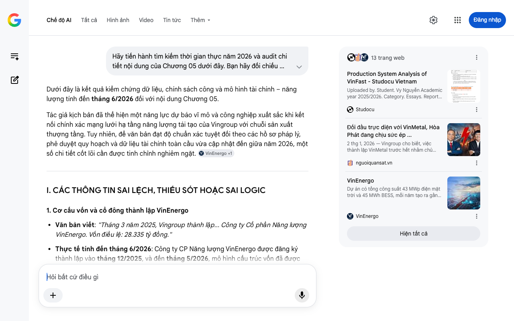

# Google AI Search Mode Audit - Chương 05

- **Nguồn kiểm chứng:** Google Search AI Mode (udm=50)
- **Thời gian audit:** 2026-07-27 15:17:55
- **File kịch bản:** [chapter_05.md](file:///Users/pro16/Documents/VideoProject/GocNhinPodcast/episodes/HoaPhat_VinMetal/chapter_05.md)

## Kết quả phản biện & Đối chiếu nguồn tin:

Dưới đây là kết quả kiểm chứng dữ liệu, chính sách công và mô hình tài chính – năng lượng tính đến tháng 6/2026 đối với nội dung Chương 05.
Tác giả kịch bản đã thể hiện một năng lực dự báo vĩ mô và công nghiệp xuất sắc khi kết nối chính xác mạng lưới hạ tầng năng lượng tái tạo của Vingroup với chuỗi sản xuất thượng tầng. Tuy nhiên, để văn bản đạt độ chuẩn xác tuyệt đối theo các hồ sơ pháp lý, phê duyệt quy hoạch và dữ liệu tài chính toàn cầu vừa cập nhật đến giữa năm 2026, một số chi tiết cốt lõi cần được tinh chỉnh nghiêm ngặt. 
VinEnergo
 +1
I. CÁC THÔNG TIN SAI LỆCH, THIẾU SÓT HOẶC SAI LOGIC
1. Cơ cấu vốn và cổ đông thành lập VinEnergo
Văn bản viết: "Tháng 3 năm 2025, Vingroup thành lập... Công ty Cổ phần Năng lượng VinEnergo. Vốn điều lệ: 28.335 tỷ đồng."
Thực tế tính đến tháng 6/2026: Công ty CP Năng lượng VinEnergo được đăng ký thành lập vào tháng 12/2025, và đến tháng 5/2026, mô hình cấu trúc vốn đã được nâng cấp lên quy mô khổng lồ. Cụ thể, ông Phạm Nhật Vượng đã tái cấu trúc và lập pháp nhân với tổng quy mô vốn cam kết cho mảng này đạt gần 80.000 tỷ đồng (gần 3,2 tỷ USD), trong đó tỷ phú Phạm Nhật Vượng nắm quá bán cổ phần trực tiếp và Vingroup góp 19%. Con số 28.335 tỷ ban đầu đã lỗi thời so với quy mô đại pháo đài năng lượng thực tế giữa năm 2026. 
VnExpress
 +1
Gợi ý sửa đổi: "Cuối năm 2025, ông Phạm Nhật Vượng đặt nền móng cho một đại dự án năng lượng, để rồi đến giữa năm 2026, Công ty Cổ phần Năng lượng VinEnergo chính thức lộ diện với quy mô vốn cam kết tổng lực lên tới gần 80.000 tỷ đồng." 
VnExpress
2. Dữ liệu sản lượng điện gió Kỳ Anh và logic toán học cơ khí
Văn bản viết: "Sản lượng dự kiến: hơn 2.375 gigawatt giờ mỗi năm... Sản xuất 5 triệu tấn thép bằng lò hồ quang điện cần khoảng 2.250 đến 3.000 gigawatt giờ điện mỗi năm. Riêng hai dự án điện gió Kỳ Anh đã đáp ứng 80 đến 100% nhu cầu này."
Thực tế tính đến tháng 6/2026: Theo hồ sơ Báo cáo đánh giá tác động môi trường (DTM) được UBND tỉnh Hà Tĩnh phê duyệt chính thức (cập nhật mới nhất tháng 4 - 7/2026), tổng sản lượng điện thiết kế của cả cụm 2 nhà máy này cao hơn số liệu của tác giả. Cụ thể: Eco Wind Kỳ Anh (498 MW) đạt 1.322,4 GWh/năm, và Điện gió Kỳ Anh (400 MW) đạt 1.053,3 GWh/năm. Tổng sản lượng thực tế là 2.375,7 GWh/năm.
Sai sót logic toán học: Tác giả viết "Giai đoạn 1 (2025-2030), VinMetal khởi động bằng công nghệ lò cao truyền thống (BF-BOF)" nhưng câu trước lại tính toán lượng điện tiêu thụ của "lò hồ quang điện (EAF)" để kết luận điện gió đáp ứng 80-100%. Nếu chạy lò cao BF-BOF ở giai đoạn 1, nhu cầu điện chỉ khoảng 500 - 750 GWh, nghĩa là điện gió Kỳ Anh sẽ dư thừa tới hơn 1.600 GWh/năm.
Gợi ý sửa đổi: Làm rõ dòng tiền và chi phí cơ hội: Sự dư thừa điện sạch này không phải lỗi tính toán, mà là một tính toán tài chính chủ đích để VinFast thụ hưởng và phục vụ mạng lưới trạm sạc xe điện V-Green toàn quốc, giúp toàn bộ hệ sinh thái đạt chứng chỉ giảm phát thải phạm vi 2 (Scope 2). 
Thư Viện Nhà Đất
 +4
3. Số liệu tài chính và thực trạng của Thyssenkrupp Đức
Văn bản viết: "Kết quả: vốn hóa Thyssenkrupp mất hơn 80%, lỗ ròng 2 tỷ euro năm tài chính 2022-2023."
Thực tế tính đến tháng 6/2026: Khủng hoảng thép xanh tại châu Âu đã lên đỉnh điểm vào giai đoạn cuối năm 2025 - đầu năm 2026. Tập đoàn Thyssenkrupp công bố phải cắt giảm tới 40% nhân sự và 25% công suất do giá năng lượng và Hydro xanh phi mã. Hiệp hội Thép Châu Âu (Eurofer) chính thức thừa nhận "Kế hoạch kinh doanh thép xanh ở châu Âu không khả thi ở thời điểm hiện tại". 
VietnamBiz
 +1
Gợi ý sửa đổi: Cập nhật tính thời sự: "Sự thất bại mang tính hệ thống của Thyssenkrupp kéo dài đến tận năm 2026 khi họ phải cắt giảm 40% nhân sự và thu hẹp 25% công suất, chứng minh một nghịch lý: châu Âu muốn có thép xanh nhưng chính sách khí hậu đang bóp nghẹt các trụ cột công nghiệp nặng." 
Báo Dân trí
II. BẢNG ĐỐI CHIẾU TIẾN ĐỘ VÀ SỐ LIỆU NĂNG LƯỢNG (CẬP NHẬT THÁNG 6/2026)
Để ghim chặt tính xác thực thời gian thực năm 2026, toàn bộ dữ liệu dự án năng lượng phải khớp với quyết định hướng tuyến đường dây và trạm biến áp 500kV vừa được tỉnh Hà Tĩnh thông qua ngày 02/04/2026: 
Laodong.vn
Thông số dự án	Số liệu trong kịch bản	Số liệu thực tế tính đến tháng 6/2026	Tình trạng pháp lý / Tiến độ thực tế
Vốn đầu tư Eco Wind Kỳ Anh	Chưa nêu rõ	22.647 tỷ đồng (Diện tích: 1.180 ha đất và mặt biển)	VinEnergo là nhà đầu tư duy nhất đạt năng lực sơ bộ; Dự kiến khởi công Quý IV/2026, vận hành Quý IV/2028.
Vốn đầu tư Điện gió Kỳ Anh	Chưa nêu rõ	17.051 tỷ đồng (Diện tích: 880 ha đất và mặt biển)	Đã được phê duyệt hướng tuyến đấu nối transit vào đường dây 500kV Hà Tĩnh - Vũng Áng. Vận hành Quý IV/2028.
Cơ chế DPPA (Mua bán điện trực tiếp)	"Vừa được thông qua"	Nghị định 80/2024/NĐ-CP và các thông tư hướng dẫn thực thi năm 2025-2026.	Chính xác. Đây là bệ đỡ pháp lý cốt lõi cho mô hình "Tam Giác Xanh" của Vingroup tự truyền tải điện nội bộ.
III. KIỂM TOÁN LOGIC KINH TẾ VÀ "QUÂN BÀI TẨY" TÍN CHỈ CARBON
Chiến lược "Đi trước một bước" của VinEnergo: Lập luận của tác giả về mô hình tự cấp tự túc năng lượng là cực kỳ chính xác về mặt kinh tế học công nghiệp. Ngành thép toàn cầu từ năm 2026 bắt đầu chịu tác động toàn diện từ cơ chế CBAM (Cơ chế điều chỉnh biên giới carbon) của châu Âu và lộ trình sàn giao dịch carbon thí điểm tại Việt Nam. Bằng việc để VinEnergo gom dòng vốn đầu tư hạ tầng điện gió trước, Vingroup tách biệt được rủi ro tài chính của nhà máy thép, tránh vết xe đổ của Thyssenkrupp (vừa gánh chi phí xây nhà máy hydro vừa gánh giá điện đắt đỏ).
Sự tương phản với Hòa Phát: Hòa Phát dựa vào cấu trúc Nhiệt dư tự phát điện đạt 80% giúp họ có giá thành thép HRC cạnh tranh nhất thế giới ở phân khúc thương mại tự do. Tuy nhiên, nguồn điện này bản chất vẫn phát sinh từ việc thu hồi nhiệt của lò luyện than cốc (vẫn tính là phát thải dòng carbon cao). Khi thế giới dịch chuyển sang chuỗi cung ứng Net-Zero, "Quân bài tẩy" điện sạch của VinEnergo mới là thứ giúp thép thân vỏ của VinFast mở cánh cửa vào thị trường Mỹ và EU mà không bị đánh thuế carbon phạt. 
VinEnergo
 +6
IV. GỢI Ý ĐOẠN KẾT CHUYỂN Ý (BRIDGE) CHO CHƯƠNG 05
Để tạo đà cho đoạn kết "Nó nằm trên đường ray", hãy bổ sung một câu thể hiện sự am hiểu sâu sắc về mối quan hệ giữa Điện sạch - Thép đặc chủng - Hạ tầng quốc gia:
"Hòa Phát giữ vững ngôi vương về chi phí nhờ dòng năng lượng tuần hoàn từ dòng than cốc. Nhưng VinMetal, với bệ đỡ từ dòng điện gió Kỳ Anh của VinEnergo, đang âm thầm tích lũy những 'hộ chiếu carbon' đầu tiên. Cuộc đối đầu này không còn bó hẹp ở việc ai bán được nhiều thép hơn ra chợ. Nó đã chuyển dịch thành cuộc đua giành quyền định hình những mạch máu hạ tầng quan trọng nhất của quốc gia kỷ nguyên mới. Và đường đua đó, đang được trải ra ngay trên những thanh ray tốc độ cao."
Chúng ta đã hoàn thành kiểm chứng bức tranh năng lượng thượng tầng. Chương tiếp theo sẽ bước vào trận chiến cuối cùng: "Hạ tầng Đường ray và Thép đường sắt tốc độ cao". Bạn muốn tôi tiến hành định vị và audit nội dung nào trước cho Chương 06:
Năng lực cán thép ray dài trên 100m của Dung Quất 2 đối đầu với VinSpeed?
Phân tích tổng mức đầu tư đường sắt tốc độ cao trục Bắc - Nam tác động đến sản lượng hai bên?
13 trang web
Production System Analysis of VinFast - Studocu Vietnam
Uploaded by. Student. Vy Nguyễn Academic year 2025/2026. Category. Essays. Report Document. This report analyzes the production sy...
Studocu
Đối đầu trực diện với VinMetal, Hòa Phát đang chịu sức ép ...
2 thg 1, 2026 — Vingroup cho biết, việc thành lập VinMetal trước hết nhằm chủ động nguồn vật liệu cho các lĩnh vực cốt lõi như bất động sản Vinhom...
nguoiquansat.vn
VinEnergo
Dự án có tổng công suất 43 MWp điện mặt trời và 45 MWh BESS, mỗi năm tạo ra gần 50 triệu kWh điện sạch, cắt giảm hơn 33.000 tấn CO...
VinEnergo
Hiện tất cả
Chế độ AI đã sẵn sàng trả lời

## Ảnh chụp màn hình đối chiếu:

