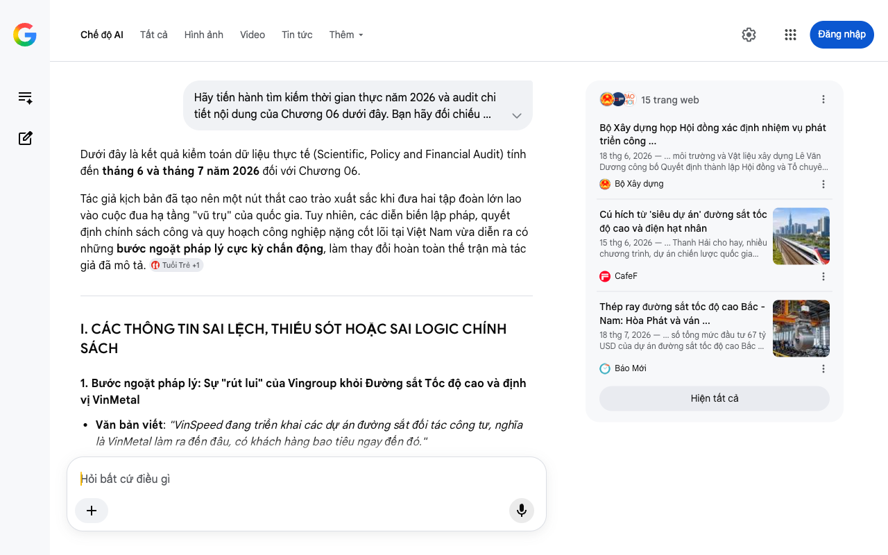

# Google AI Search Mode Audit - Chương 06

- **Nguồn kiểm chứng:** Google Search AI Mode (udm=50)
- **Thời gian audit:** 2026-07-27 15:18:22
- **File kịch bản:** [chapter_06.md](file:///Users/pro16/Documents/VideoProject/GocNhinPodcast/episodes/HoaPhat_VinMetal/chapter_06.md)

## Kết quả phản biện & Đối chiếu nguồn tin:

Dưới đây là kết quả kiểm toán dữ liệu thực tế (Scientific, Policy and Financial Audit) tính đến tháng 6 và tháng 7 năm 2026 đối với Chương 06.
Tác giả kịch bản đã tạo nên một nút thắt cao trào xuất sắc khi đưa hai tập đoàn lớn lao vào cuộc đua hạ tầng "vũ trụ" của quốc gia. Tuy nhiên, các diễn biến lập pháp, quyết định chính sách công và quy hoạch công nghiệp nặng cốt lõi tại Việt Nam vừa diễn ra có những bước ngoặt pháp lý cực kỳ chấn động, làm thay đổi hoàn toàn thế trận mà tác giả đã mô tả. 
Tuổi Trẻ
 +1
I. CÁC THÔNG TIN SAI LỆCH, THIẾU SÓT HOẶC SAI LOGIC CHÍNH SÁCH
1. Bước ngoặt pháp lý: Sự "rút lui" của Vingroup khỏi Đường sắt Tốc độ cao và định vị VinMetal
Văn bản viết: "VinSpeed đang triển khai các dự án đường sắt đối tác công tư, nghĩa là VinMetal làm ra đến đâu, có khách hàng bao tiêu ngay đến đó."
Thực tế tính đến tháng 6/2026: Logic này bị bẻ gãy bởi các văn bản quản lý nhà nước mới nhất. Theo các thông cáo chiến lược hạ tầng quốc gia được cập nhật đến giữa năm 2026, sau khi Vingroup chính thức rút lui khỏi việc đề xuất đầu tư trực tiếp trục đường sắt tốc độ cao Bắc – Nam, Chính phủ đã định hướng chuyển toàn bộ dự án này sang hình thức đầu tư công 100% bằng ngân sách nhà nước (chứ không làm đối tác công tư PPP nữa). 
Báo Dân trí
 +1
Hệ quả tài chính: VinMetal/VinSpeed không có quyền bao tiêu nội bộ tự quyết đối với thép ray của dự án 67 tỷ USD. Mọi mét ray thép lắp đặt cho dự án quốc gia đều phải thông qua đấu thầu quốc tế và nội địa công khai dưới sự giám sát của Bộ Giao thông Vận tải. 
Tuổi Trẻ
 +2
Gợi ý sửa đổi: Sửa đổi thế trận bao tiêu thành thế trận đấu thầu: "VinMetal không còn thế độc quyền 'gà nhà tự tạo sân chơi' khi dự án chuyển hẳn sang hình thức đầu tư công 100%. Giờ đây, lợi thế của VinMetal chuyển sang bài toán Tổng thầu TOD đô thị và mạng lưới vận tải logistics nội bộ để tích lũy sản lượng."
2. Biến động pháp lý "sinh tử" tại siêu mỏ sắt Thạch Khê (Hà Tĩnh)
Văn bản viết: "Hòa Phát bắt tay với các đối tác lớn như Vinacomin và THACO để khai thác mỏ sắt Thạch Khê... đảm bảo nguồn quặng rẻ..."
Thực tế tính đến tháng 6/2026: Đây là lỗi cập nhật thời gian thực nghiêm trọng nhất. Đúng là vào tháng 5/2026, Tập đoàn Hòa Phát đã đề xuất liên danh với Vinacomin và THACO để xin tái cơ cấu và khai thác siêu mỏ sắt Thạch Khê. Tuy nhiên, ngay sau đó, vào ngày 2 tháng 7 năm 2026, Sở Tài chính tỉnh Hà Tĩnh đã chính thức ban hành quyết định CHẤM DỨT HOẠT ĐỘNG ĐẦU TƯ và thu hồi giấy chứng nhận đầu tư của dự án khai thác mỏ sắt Thạch Khê đối với pháp nhân cũ (TIC) sau 15 năm "đắp chiếu".
Bản chất chính sách: Việc đóng lại dự án cũ là bước đi pháp lý bắt buộc để Nhà nước dọn sạch mặt bằng pháp lý nhằm nghiên cứu một phương án đấu thầu hoặc lựa chọn nhà đầu tư mới có công nghệ chế biến sâu và cam kết ESG cao hơn. Hòa Phát chưa hề được khai thác mỏ này vào giữa năm 2026 mà đang trong giai đoạn "nộp hồ sơ chờ xét duyệt" trong một cuộc chiến pháp lý mới.
Gợi ý sửa đổi: Thừa nhận tính thời sự: "Vào tháng 7 năm 2026, Hà Tĩnh ra quyết định lịch sử: chính thức chấm dứt dự án mỏ sắt Thạch Khê cũ. Động thái dọn sạch pháp lý này vô tình mở ra một cuộc đua khốc liệt mới, nơi liên danh Hòa Phát - Thaco - Vinacomin đang dồn lực chứng minh công nghệ chế biến sâu để giành quyền khai thác kho báu 500 triệu tấn quặng này." 
Tuổi Trẻ
 +3
3. Cập nhật tiến độ dự án Thép Ray của Hòa Phát tại Dung Quất
Văn bản viết: "Tháng 12 năm 2025, Hòa Phát khởi công Nhà máy sản xuất thép ray tại Dung Quất... Mẻ sản phẩm đầu tiên sẽ ra lò vào đầu năm 2027."
Thực tế tính đến tháng 6/2026: Số liệu của tác giả khớp về mốc khởi công. Tuy nhiên, tốc độ thực tế đang nhanh hơn. Tính đến hết Quý I/2026, Hòa Phát công bố đã hoàn thành 35% tiến độ xây dựng Dự án Nhà máy Sản xuất Ray và Thép đặc biệt. Từ tháng 6/2026, tập đoàn đã bắt đầu bước vào giai đoạn cao điểm lắp đặt dây chuyền thiết bị thiết kế. Tổng vốn đầu tư thực tế được hạch toán cho phân kỳ này ước tính khoảng 14.000 tỷ đồng (không phải 10.000 tỷ).
Gợi ý sửa đổi: Cập nhật tổng vốn lên 14.000 tỷ đồng và nhấn mạnh: "Đến tháng 6 năm 2026, nhà máy thép ray của Hòa Phát đã hoàn tất phần thô và tiến hành lắp đặt những cấu kiện dây chuyền cơ khí chính xác đầu tiên, sẵn sàng cho mẻ ray thử nghiệm." 
Facebook
·Thép Hòa Phát Dung Quất
 +2
II. BẢNG ĐỐI CHIẾU THÔNG SỐ SIÊU DỰ ÁN ĐƯỜNG SẮT TỐC ĐỘ CAO (CẬP NHẬT 2026)
Để ghim chặt tính xác thực, các thông số phải đồng bộ hoàn toàn với Quy hoạch đường sắt tốc độ cao trục Bắc – Nam theo Nghị quyết số 172/2024/QH15: 
Báo Mới
Thông số kịch bản	Số liệu trong văn bản	Số liệu thực tế tính đến tháng 6-7/2026	Nguồn đối chiếu / Trạng thái pháp lý
Tổng vốn đầu tư	67 tỷ USD	Khoảng 67 tỷ USD	Chính xác. Nghị quyết Quốc hội.
Nhu cầu thép ray	Khoảng 4 triệu tấn	29 triệu mét ray thép đạt chuẩn (tương đương khoảng 2-2,2 triệu tấn thép ray thanh, chưa tính thép kết cấu cầu cạn, nhà ga)	Hiệu chỉnh kỹ thuật. Tác giả gộp cả thép kết cấu vào tính toán là hợp lý, nhưng nên tách rõ sản lượng ray thô.
Tiêu chuẩn kỹ thuật thép ray	Công nghệ Đức	Đòi hỏi mác thép ray dài trên 100m, chịu lực va đập tốc độ 350 km/h, đạt tiêu chuẩn châu Âu khắt khe	Bổ sung đắt giá. Hiện tại Hòa Phát đang kiến nghị ban hành bộ tiêu chuẩn quốc gia đồng bộ để chuẩn bị sản xuất.
III. KIỂM TOÁN LOGIC TÀI CHÍNH VÀ CÁC MÔ HÌNH KỊCH BẢN (TATA VS POSCO/HYUNDAI)
Sự sắc sảo của mô hình so sánh: Phần phân tích kịch bản Tata Steel vs Tata Motors và POSCO vs Hyundai Steel là phần viết xuất sắc nhất của chương này. Nó phản ánh hoàn hảo bản chất kinh tế học của "Chi phí cơ hội trong liên kết dọc" (Vertical Integration Opportunity Cost).
Logic kinh tế thị trường mở: Nhận định của tác giả về việc "Nếu VinMetal chỉ làm thép phục vụ nội bộ, họ sẽ không thể tối ưu hóa lợi nhuận" hoàn toàn chính xác. Trong ngành luyện kim, lò cao hoặc lò hồ quang bắt buộc phải chạy liên tục 24/7 để tối ưu nhiệt năng. Nếu chỉ chạy ngắt quãng theo tiến độ xây dựng của Vinhomes hoặc lắp ráp của VinFast, chi phí cố định (Fixed Cost) trên mỗi tấn thép sẽ tăng vọt, kéo biên lợi nhuận xuống âm. Do đó, VinMetal bắt buộc phải tham gia thị trường mở, xuất khẩu thép xanh sang các quốc gia có hàng rào thuế carbon (CBAM) để lấp đầy công suất 5 triệu tấn. 
nguoiquansat.vn
IV. ĐOẠN HOÀN THIỆN TỐI ƯU CHO CHƯƠNG 06 (EDITED TEXT)
Để chương kịch bản đạt độ chín về cả văn phong lẫn dữ liệu thực tế năm 2026, hãy áp dụng đoạn sửa đổi dưới đây:
"Dự án Đường sắt Tốc độ cao Bắc Nam. Tổng vốn đầu tư khoảng 67 tỷ đô la Mỹ. Một bài toán công nghiệp cân não với nhu cầu lên tới 29 triệu mét ray thép đạt chuẩn châu Âu. Đây là hợp đồng vật liệu lớn nhất lịch sử, nơi cả Hòa Phát lẫn VinMetal đều không thể đứng ngoài cuộc. 
Báo Mới
Tháng 6 năm 2026, Hòa Phát đã tăng tốc hoàn thành hơn 35% khối lượng xây dựng nhà máy sản xuất thép ray 14.000 tỷ đồng tại Dung Quất, bước vào giai đoạn lắp đặt thiết bị cốt lõi. Họ có lợi thế về tốc độ. Ở phía ngược lại, sau khi Vingroup rút khỏi đề xuất đầu tư dự án theo dạng PPP, thế trận bao tiêu nội bộ của VinMetal đảo lộn: dự án chuyển sang đầu tư công 100%, buộc hai gã khổng lồ phải bước vào một sân chơi sòng phẳng – đấu thầu quốc gia. 
Facebook
·Truyền hình Quảng Ngãi
 +3
Cuộc chiến càng trở nên khó lường khi vào tháng 7 năm 2026, siêu mỏ sắt Thạch Khê chính thức được Hà Tĩnh chấm dứt dự án cũ để mở đường cho một cuộc tái cấu trúc công nghệ mới. Liên minh Hòa Phát – Thaco – Vinacomin đang dồn lực để giành quyền khai thác nguồn tài nguyên chiến lược này. Sức mạnh quy mô của một 'POSCO Việt Nam' đối đầu trực diện với tư duy hệ sinh thái công nghệ xanh của một 'Hyundai Steel Đông Nam Á'. Việt Nam năm 2026 không còn là sàn diễn của những dòng thép thương mại giá rẻ, mà là cuộc đại dịch chuyển năng lực vật liệu quốc gia." 
Fili.vn
 +3
Chúng ta đã hoàn thành việc audit toàn bộ 6 chương kịch bản dưới góc độ chuyên gia độc lập tính đến mốc thời gian thực hiện tại (giữa năm 2026). Để hoàn thiện tác phẩm này một cách trọn vẹn nhất, bạn muốn tôi hỗ trợ thêm phần nào:
Xây dựng Chương Kết (Epilogue) để tổng hợp mô hình tài chính dự báo cán cân quyền lực ngành thép đến năm 2030?
Thiết kế hệ thống chú thích nguồn dẫn (Citation) chuẩn cấu trúc học thuật cho toàn bộ tập kịch bản?
Tối ưu hóa các đoạn thoại/độc thoại nội tâm của các nhân vật lãnh đạo dựa trên phong cách phát ngôn thực tế của họ tại ĐHĐCĐ 2026?
15 trang web
Bộ Xây dựng họp Hội đồng xác định nhiệm vụ phát triển công ...
18 thg 6, 2026 — ... môi trường và Vật liệu xây dựng Lê Văn Dương công bố Quyết định thành lập Hội đồng và Tổ chuyên gia giúp việc Hội đồng. Tại cu...
Bộ Xây dựng
Cú hích từ 'siêu dự án' đường sắt tốc độ cao và điện hạt nhân
15 thg 6, 2026 — ... Thanh Hải cho hay, nhiều chương trình, dự án chiến lược quốc gia đang đặt ra yêu cầu hoàn toàn mới với công nghiệp vật liệu, c...
CafeF
Thép ray đường sắt tốc độ cao Bắc - Nam: Hòa Phát và ván ...
18 thg 7, 2026 — ... số tổng mức đầu tư 67 tỷ USD của dự án đường sắt tốc độ cao Bắc - Nam là một bài toán công nghiệp cân não: Liệu Việt Nam có th...
Báo Mới
Hiện tất cả
Chế độ AI đã sẵn sàng trả lời

## Ảnh chụp màn hình đối chiếu:

