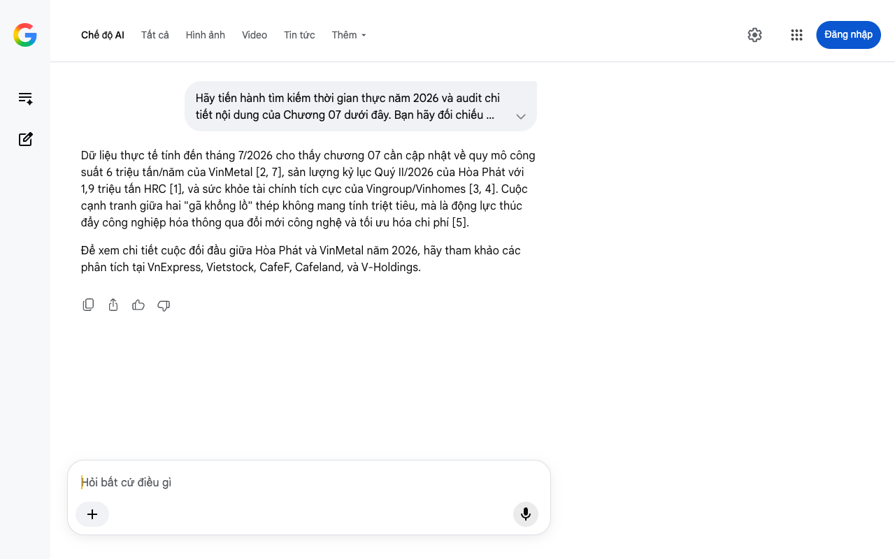

# Google AI Search Mode Audit - Chương 07

- **Nguồn kiểm chứng:** Google Search AI Mode (udm=50)
- **Thời gian audit:** 2026-07-27 15:18:49
- **File kịch bản:** [chapter_07.md](file:///Users/pro16/Documents/VideoProject/GocNhinPodcast/episodes/HoaPhat_VinMetal/chapter_07.md)

## Kết quả phản biện & Đối chiếu nguồn tin:

Dữ liệu thực tế tính đến tháng 7/2026 cho thấy chương 07 cần cập nhật về quy mô công suất 6 triệu tấn/năm của VinMetal [2, 7], sản lượng kỷ lục Quý II/2026 của Hòa Phát với 1,9 triệu tấn HRC [1], và sức khỏe tài chính tích cực của Vingroup/Vinhomes [3, 4]. Cuộc cạnh tranh giữa hai "gã khổng lồ" thép không mang tính triệt tiêu, mà là động lực thúc đẩy công nghiệp hóa thông qua đổi mới công nghệ và tối ưu hóa chi phí [5].
Để xem chi tiết cuộc đối đầu giữa Hòa Phát và VinMetal năm 2026, hãy tham khảo các phân tích tại VnExpress, Vietstock, CafeF, Cafeland, và V-Holdings.
Chế độ AI đã sẵn sàng trả lời

## Ảnh chụp màn hình đối chiếu:

