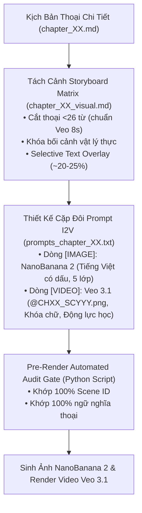
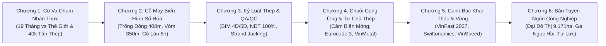

# Kế Hoạch Nghiên Cứu & Triển Khai Hình Ảnh/Video I2V: Siêu Dự Án Sân Vận Động VinFast

Tài liệu này xác lập bản quy hoạch và kế hoạch thực thi toàn diện cho hệ thống hình ảnh tĩnh (NanoBanana 2) và video động I2V (Google Veo 3.1) cho tập phim **"Sân Vận Động VinFast: Siêu Dự Án 135.000 Chỗ Ngồi, Liên Minh Công Nghiệp Việt Nam & Bàn Cờ Kinh Tế Vĩ Mô"**.

Kế hoạch được xây dựng dựa trên việc nghiên cứu sâu sắc toàn bộ hồ sơ tập phim (`03_brief.md`, `07_outline.md`, `08_chapter_briefs.md`, `chapter_01.md` đến `chapter_04.md`) và đối chiếu trực tiếp với tài liệu gốc [visual_engineering_anchors.md](file:///Users/pro16/Documents/VideoProject/GocNhinPodcast/episodes/SanVanDongVinfast/visual_engineering_anchors.md).

---

## 🎨 1. HỆ THỐNG MỸ THUẬT & QUY CHUẨN TRỰC QUAN TOÀN CỤC (GLOBAL VISUAL DNA)

### A. Triết lý Nghệ thuật: Cinematic Editorial Noir
- **Phong cách cốt lõi:** Đồ họa báo chí điện ảnh cao cấp (High-end Editorial Illustration), bán thực tế (semi-realistic), sắc sảo, tối giản, sang trọng. Tránh tuyệt đối cảm giác hoạt hình 2D trẻ con (cartoon) hoặc mô hình 3D game thô cứng.
- **Tính chân thực cơ học & vật lý (Physical Realism):** Mọi bối cảnh, máy móc, kết cấu thép và chuyển động camera phải phản ánh đúng các quy chuẩn công trình thực tế (không dùng hình ảnh siêu thực trừu tượng như bàn tay khổng lồ, con đường chia đôi ngả, hay lò rèn thủ công thời trung cổ).

### B. Bảng Màu 60-30-10 & Thích Ứng Chủ Đề Công Nghiệp Nặng
- **60% Nền/Bóng tối:** `Dark warm charcoal (#1A1A1A)` và `Deep industrial slate (#1E2522)` tạo chiều sâu điện ảnh và không gian noir bí ẩn.
- **30% Chủ thể/Kết cấu:** Màu xám thép titan công nghiệp, bề mặt bê tông mác cao, viền nét kem ấm `warm cream (#FFFDF0) outlines` tạo cảm giác đồ họa hữu cơ cao cấp.
- **10% Điểm nhấn Dẫn mắt (Visual Focal Points):**
  * *Bản sắc Văn hóa & Lịch sử:* Cam đồng Trống đồng rực rỡ `glowing terracotta orange (#FF7043)`.
  * *Công nghệ Số & Hạ tầng Tương lai:* Xanh ngọc công nghệ `glowing turquoise (#26A69A)` của màn hình LED 360 độ 8K, luồng dữ liệu BIM 4D/5D, cảm biến nhiệt bê tông và tàu cao tốc VinSpeed 350 km/h.
  * *Cảnh báo & Kỷ luật:* Đỏ san hô `glowing crimson coral red (#EF5350)` của đèn báo an toàn công trường đêm và chùm tia laser.

### C. Ngôn Ngữ Quang Học & Thiết Lập Ống Kính (Cinematography Specs)
- **Định dạng ống kính:** `Shot on 35mm anamorphic lens`, `shallow depth of field`, `cinematic chiaroscuro lighting` (tương phản sáng - tối sâu với viền sáng rim light).
- **Góc máy đặc trưng của tập phim:**
  * *Góc đại cảnh từ trên cao (`Epic top-down aerial shot` / `Bird's-eye view`):* Bắt trọn biểu tượng Trống đồng 408m và Quần thể Hùng Vương 400ha.
  * *Góc thấp ngước nhìn (`Low-angle wide shot`):* Phô diễn tầm vóc đồ sộ của mái vòm thép 40.000 tấn ở cao độ 120m và cụm kích thủy lực Strand Jacking.
  * *Góc mặt cắt kỹ thuật (`Cross-section technical cutaway`):* Lột tả cấu trúc hầm ươm cỏ ngầm Modular Pitch, hệ thống cảm biến nhiệt đài móng ngầm và gối tựa trượt giảm chấn.
  * *Góc cận cảnh chuyển động (`Macro tracking shot`):* Quét theo đầu dò sóng siêu âm NDT trên đường hàn thép hoàn hảo và cánh tay robot CNC plasma.

---

## 🏛️ 2. BỘ QUY TẮC BẢO TOÀN I2V & CHỐNG RỦI RO CÔNG NGHỆ

### 1. Quy tắc Chọn Lọc Chữ (Selective Typography Rule - BẮT BUỘC)
- Tuyệt đối **CẤM** chèn Text Overlay tiếng Việt trên 100% mọi phân cảnh.
- Text Overlay chỉ được xuất hiện ở **~20% - 25% các phân cảnh quan trọng nhất** (Mốc thời gian 19 tháng, Khẩu độ vòm >350m, 40.000 tấn thép, Vốn đầu tư, Tên công nghệ NDT/BIM/Strand Jacking).
- **75% - 80% phân cảnh còn lại** để `[TEXT OVERLAY]: Không` nhằm trả lại không gian nghệ thuật cho NanoBanana 2 và tạo điều kiện cho camera Veo 3.1 chuyển động tự do (`push-in dolly`, `orbit`, `pan`, `tracking`).

### 2. Quy tắc Khóa Tĩnh Lớp Chữ Tránh Lỗi Font trên Veo 3.1
- Đối với các phân cảnh có chữ tiếng Việt ở ảnh `[IMAGE]`: Tại dòng `[VIDEO]`, tuyệt đối **CẤM nhắc lại nội dung chữ** và bắt buộc sử dụng cú máy tĩnh (`steady shot`) kèm câu lệnh khóa lớp đồ họa:
  > `preserving all details and static graphic layers of the reference image exactly without any character morphing or alterations`
- Đối với phân cảnh không có chữ: Thoải mái sử dụng chuyển động camera linh hoạt và động học vật lý mượt mà.

### 3. Quy tắc Chống Lệch Mặt & Vượt Bộ Lọc An Ninh (Security & Identity Safety)
- Ở dòng `[IMAGE]`: Sử dụng tên thương hiệu/nhân vật thực tế (Vingroup, VinFast, Đại Dũng, VinCons, VinMetal, VinSpeed, Pham Nhat Vuong, Ratan Tata) để AI tái hiện chính xác mỏ neo thương hiệu.
- Ở dòng `[VIDEO]`: Tuyệt đối **KHÔNG dùng tên riêng**, thay bằng danh từ chung (*the chief engineer, the Vietnamese construction workers, the modern electric train*) kèm câu lệnh bảo tồn diện mạo: `preserving the facial features and structural details of the reference image`.

### 4. Quy Chuẩn Phân Đoạn Toán Học (Veo 3.1 8s Alignment)
- Tốc độ đọc narrator: **3.81 từ/giây**.
- Clip Veo 3.1: **8.0 giây** (Ngưỡng thoại an toàn tối đa: **7.0 giây** = **tối đa 26 từ/phân cảnh**).
- Mọi câu thoại dài hơn 26 từ bắt buộc phải chia thành các sub-scenes (`SCYYYa1`, `SCYYYa2`...) và phân bổ đều số lượng từ thoại, không để thoại rỗng.

---

## 🎬 3. BẢN ĐỒ MỎ NEO TRỰC QUAN THEO 6 CHƯƠNG (CHAPTER-BY-CHAPTER BLUEPRINT)

Dưới đây là thiết kế mỏ neo hình ảnh chi tiết cho từng chương, kết hợp chặt chẽ giữa kịch bản thoại và [visual_engineering_anchors.md](file:///Users/pro16/Documents/VideoProject/GocNhinPodcast/episodes/SanVanDongVinfast/visual_engineering_anchors.md):

### 📌 CHƯƠNG 1: Nghịch Lý Thời Gian Của Kỷ Lục Hành Tinh (The Cognitive Strike)
* **Trọng tâm tự sự:** Thiết lập cú va chạm nhận thức 15s đầu bằng sự đối chiếu không thể chối cãi giữa các siêu công trình thế giới và tiến độ 19 tháng của Việt Nam.
* **Mỏ neo trực quan cốt lõi:**
  1. *Cú va chạm thời gian thế giới:* Màn hình phân chia đa không gian (Multi-split screen) thể hiện SoFi Stadium (46 tháng), Tottenham (48 tháng), Tổ Chim Bắc Kinh (56 tháng) đối lập với đại công trường Sân VinFast (19 tháng) rực sáng.
  2. *Sức nặng 40.000 tấn thép:* Hình bóng đồ họa so sánh quy mô mái vòm với 4 tòa Tháp Eiffel và 10.000 con voi châu Á.
  3. *Hồ sơ World Cup của Đại Dũng:* Kỹ sư Việt Nam kiểm tra mối hàn kết cấu mái vòm tại Sân vận động Lusail (Qatar) và Sân 974.

### 📌 CHƯƠNG 2: Quy Mô Kỷ Lục & Kiến Trúc Siêu Công Nghệ (The Cyber-Physical Marvel)
* **Trọng tâm tự sự:** Dẫn dắt khán giả vào trải nghiệm "Cỗ máy số hóa biết biến hình" bên trong Quần thể Hùng Vương 400ha.
* **Mỏ neo trực quan cốt lõi:**
  1. *Top-down Aerial View Trống Đồng 408m:* Góc nhìn từ quỹ đạo chiếu thẳng xuống mái vòm Trống đồng Đông Sơn với các họa tiết chim Lạc mạ vàng óng ánh.
  2. *Khẩu độ vòm >350m vượt Singapore:* Cú máy Low-angle ngước nhìn hệ vòm thép 3D tự cân bằng, vành đai chịu kéo (Tension Ring) tựa trên siêu trụ bê tông đá gốc, đóng mở <30 phút.
  3. *Màn hình LED 360 độ 8K & Cổng Face-ID 3s:* Khán giả đi qua cổng nhận diện sinh trắc học không chạm và chiêm ngưỡng màn hình Halo vô cực lơ lửng giữa lòng chảo.
  4. *Làm mát vi khí hậu 135.000 ghế:* Cận cảnh họng gió làm mát mini dưới chân ghế và màn hình smartphone kết nối 5G tua lại pha bóng 4K.
  5. *Mặt sân Modular Pitch & Hầm ươm cỏ ngầm:* Cắt cảnh mặt cắt lòng đất (cross-section) khay cỏ tự nhiên trượt xuống hầm ngầm ánh sáng LED tím hồng trong 6-10h (đối chiếu chữa lành nỗi đau mặt cỏ Mỹ Đình).
  6. *Mái pin BIPV & Quần thể Olympic 400ha:* Mái quang điện tự sản xuất điện sạch kết hợp đại cảnh Khu liên hợp Hùng Vương (Sân Olympic 40k chỗ, Cung thể thao dưới nước).

### 📌 CHƯƠNG 3: Kỷ Luật Thép & Bí Mật Đảm Bảo Chất Lượng 100% (Fast-Track Engine & QA/QC)
* **Trọng tâm tự sự:** Đập tan hoài nghi "xây nhanh thì làm ẩu" bằng 4 tầng bảo chứng kỹ thuật khắt khe nhất thế giới.
* **Mỏ neo trực quan cốt lõi:**
  1. *Bản sao số BIM 4D/5D (Digital Twin):* Kỹ sư trưởng thao tác trên màn hình Hologram 3D phát sáng, mô phỏng xung đột không gian dầm thép theo thời gian thực (chính sách No-rework).
  2. *Gia công CNC & Siêu âm NDT 100% mối hàn:* Cánh tay robot CNC plasma cắt thép với dung sai 2mm tại 6 nhà máy Đại Dũng; kỹ sư quét đầu dò sóng siêu âm (UT) và chụp phim (RT) phát sáng trên đường hàn.
  3. *Kích nâng thủy lực Strand Jacking tại cốt 0:* Toàn bộ mái vòm 40.000 tấn được tổ hợp hoàn thiện ở mặt đất; cụm kích thủy lực máy tính kéo khối thép lên cao độ 120m an toàn tuyệt đối.
  4. *Đại công trường đêm 3 ca 4 kíp & 100.000 thợ VinCons:* Đại công trường sáng rực như ban ngày dưới dàn đèn cao áp 24/7; hình ảnh những người thợ Việt Nam mặc đồ bảo hộ VinCons làm việc kỷ luật, tự hào.

### 📌 CHƯƠNG 4: Đánh Đổi Tốc Độ & Bức Tranh Tự Chủ Công Nghiệp Thép (The Industrial Supply Chain)
* **Trọng tâm tự sự:** Bóc tách áp lực dòng tiền ngắn hạn và hé lộ chiến lược tự chủ chuỗi cung ứng công nghiệp nặng của Việt Nam.
* **Mỏ neo trực quan cốt lõi:**
  1. *Cảm biến nhiệt bê tông móng ngầm (Thermal Sensors):* Mặt cắt đài móng ngầm với các cảm biến nhiệt điện tử phát sáng xanh truyền dữ liệu nhiệt thủy hóa 24/7 về trung tâm để ngăn nứt bê tông khối lớn.
  2. *Thép tấm Eurocode 3 nhập khẩu cảng biển:* Cảng biển công nghiệp đêm rực rỡ ánh đèn; các cuộn thép tấm cường độ cao siêu dày được cẩu từ tàu quốc tế (POSCO/Metal One) xuống rơ-moóc chuyên dụng.
  3. *Tổ hợp luyện cán thép VinMetal 80.000 tỷ tại Vũng Áng:* Toàn cảnh tổ hợp luyện kim hiện đại ven biển Vũng Áng với dây chuyền đúc thép ray đường sắt tốc độ cao 350 km/h sạch sẽ, tự chủ.

### 📌 CHƯƠNG 5: Canh Bạc Tiếp Thị Quyền Lực & Cú Hích Kinh Tế Lan Tỏa Toàn Vùng (The Regional Multiplier)
* **Trọng tâm tự sự:** Giải mã bài toán khai thác kinh tế sau xây dựng (VinFast 2027, Swiftonomics, chuỗi du lịch thể thao - di sản liên vùng qua tuyến VinSpeed 350 km/h).
* **Mỏ neo trực quan cốt lõi:**
  1. *Hiệu ứng Swiftonomics & Mega-Concerts:* 135.000 khán giả cuồng nhiệt dưới biển ánh sáng laser và màn hình LED 360 độ trong đêm đại nhạc hội quốc tế.
  2. *Siêu tàu cao tốc VinSpeed 350 km/h nối Vịnh Hạ Long:* Đoàn tàu cao tốc khí động học màu bạc lướt đi trên cầu cạn hiện đại, đưa du khách từ Ga Ngọc Hồi về các resort 5 sao bên vịnh di sản trong 20 phút.
  3. *Mạng lưới kết nối Metro số 2 & Bãi đáp trực thăng Helipad:* Tuyến Metro ngầm đưa khách từ Sân bay Nội Bài về sân; trực thăng hạ cánh trên sân thượng đón tiếp quan chức FIFA và khách VVIP.
  4. *Hành lang du lịch di sản Tam Chúc - Tràng An:* Đại lộ 120m nối dài tỏa đi các trung tâm văn hóa tâm linh phía Nam đồng bằng sông Hồng.

### 📌 CHƯƠNG 6: Bản Tuyên Ngôn Công Nghiệp & Kỷ Nguyên Vươn Mình (The Grand Finale)
* **Trọng tâm tự sự:** Khép lại toàn bộ vòng lặp, đúc kết bản tuyên ngôn tự lực tự cường của liên minh công nghiệp Việt Nam.
* **Mỏ neo trực quan cốt lõi:**
  1. *Đại đô thị Thể thao 9.171ha & Đại lộ 120m:* Toàn cảnh quy hoạch đô thị thể thao thông minh hiện đại bậc nhất châu Á bên trục đại lộ 120m rực rỡ ánh sáng kết nối Ga Ngọc Hồi.
  2. *Đầu mối TOD Ga Ngọc Hồi & Đường sắt cao tốc 67 tỷ USD:* Tàu cao tốc Bắc Nam kết nối đồng bộ với tổ hợp sân vận động.
  3. *Bản hồ sơ năng lực sống của Người Việt:* Đội ngũ kỹ sư và công nhân Việt Nam đứng hiên ngang trước siêu công trình Trống Đồng hoàn thiện dưới ánh hoàng hôn tráng lệ, biểu tượng cho năng lực kiến tạo kỳ quan thế giới.

---

## 🛠️ 4. QUY TRÌNH THỰC THI CHI TIẾT (5-STAGE IMPLEMENTATION ROADMAP)

### Giai đoạn 1: Khởi tạo Storyboard Matrix (`chapter_XX_visual.md`)
- Chuyển thể tuần tự từng chương thoại (`chapter_01.md` đến `chapter_04.md` và sau đó là các chương tiếp theo) thành tệp `chapter_XX_visual.md`.
- Mỗi phân cảnh bắt buộc tuân thủ 3 trường:
  * `[THOẠI]:` Câu thoại chuẩn ngữ nghĩa $\le 26$ từ.
  * `[BỐI CẢNH]:` Chỉ định không gian vật lý, hành động cơ học cụ thể theo Sổ tay Mỏ neo.
  * `[TEXT OVERLAY]:` Ghi rõ nội dung chữ tiếng Việt có dấu (hoặc ghi "Không").

### Giai đoạn 2: Biên soạn Cặp đôi Prompts I2V (`prompts_chapter_XX.txt`)
- Biên soạn từng tệp prompt riêng biệt theo quy chuẩn:
  * Dòng `[IMAGE]`: NanoBanana 2 với cấu trúc 3 lớp (Subject & Action + Environment & Lighting + Camera & Style Specs).
  * Dòng `[VIDEO]`: Google Veo 3.1 với cú pháp `@CHXX_SCYYY.png -> [Camera & Physics motion], preserving details... --ar 16:9`.
- Toàn bộ prompt video không chứa ký tự tiếng Việt có dấu; áp dụng khóa tĩnh chữ cho các cảnh có text overlay.

### Giai đoạn 3: Rào cản Kiểm tra Đồng bộ Tự động (Pre-Render Automated Audit Gate)
- Chạy script kiểm tra đối chiếu tự động giữa `chapter_XX_visual.md` và `prompts_chapter_XX.txt`.
- Xác thực 100% khớp Scene ID và không lệch pha câu thoại trước khi cho phép render.

### Giai đoạn 4: Thiết kế Thumbnail Kiệt Tác Điện Ảnh (`thumbnail_prompts.md`)
- Thiết kế 3 phương án Thumbnail CTR cao (Góc Trống Đồng từ trên cao, Góc Mái Vòm Kích Nâng 40.000 tấn, và Góc Đại Công Trường Đêm 100.000 Người).

---

## 📋 DANH MỤC TỆP SẼ ĐƯỢC TẠO & TRIỂN KHAI

| STT | Tệp Tin Mục Tiêu | Trạng Thái | Vai Trò & Mục Đích |
|:---|:---|:---|:---|
| 1 | `episodes/SanVanDongVinfast/chapter_01_visual.md` | `[NEW]` | Storyboard Matrix Chương 1 (Nghịch lý thời gian) |
| 2 | `episodes/SanVanDongVinfast/chapter_02_visual.md` | `[NEW]` | Storyboard Matrix Chương 2 (Quy mô & Siêu công nghệ) |
| 3 | `episodes/SanVanDongVinfast/chapter_03_visual.md` | `[NEW]` | Storyboard Matrix Chương 3 (Kỷ luật thép & QA/QC) |
| 4 | `episodes/SanVanDongVinfast/chapter_04_visual.md` | `[NEW]` | Storyboard Matrix Chương 4 (Chuỗi cung ứng & VinMetal) |
| 5 | `episodes/SanVanDongVinfast/prompts_chapter_01.txt` | `[NEW]` | Tệp Prompts I2V độc lập Chương 1 (Veo 3.1 + NanoBanana 2) |
| 6 | `episodes/SanVanDongVinfast/prompts_chapter_02.txt` | `[NEW]` | Tệp Prompts I2V độc lập Chương 2 |
| 7 | `episodes/SanVanDongVinfast/prompts_chapter_03.txt` | `[NEW]` | Tệp Prompts I2V độc lập Chương 3 |
| 8 | `episodes/SanVanDongVinfast/prompts_chapter_04.txt` | `[NEW]` | Tệp Prompts I2V độc lập Chương 4 |
| 9 | `episodes/SanVanDongVinfast/thumbnail_prompts.md` | `[NEW]` | Bộ prompt thiết kế Thumbnail YouTube chuẩn CTR cao |

---

## 🔍 KẾ HOẠCH KIỂM CHỨNG (VERIFICATION PLAN)

### 1. Kiểm thử Tự động (Automated Verification)
- Chạy script Python quét tính hợp lệ của toàn bộ tệp prompt:
  * Kiểm tra 100% khớp Scene ID giữa `chapter_XX_visual.md` và `prompts_chapter_XX.txt`.
  * Kiểm tra số từ mỗi cảnh $\le 26$ từ thoại (khớp thời lượng 8s của Veo 3.1).
  * Kiểm tra tỷ lệ Text Overlay đạt ngưỡng 20% - 25% (không bị spam chữ 100%).
  * Kiểm tra không rò rỉ boilerplate text hoặc ký tự tiếng Việt có dấu trong prompt video.

### 2. Đánh giá Thẩm mỹ & Đạo diễn (Manual Quality Audit)
- Kiểm tra tính liên kết không gian (Background Anchoring) và logic ánh sáng chiaroscuro giữa các cảnh kế tiếp.
- Đảm bảo bảo toàn 100% tên các thương hiệu thật (VinFast, Vingroup, Đại Dũng, VinCons, VinMetal, VinSpeed) và tính chân thực của công trình kỹ thuật.
