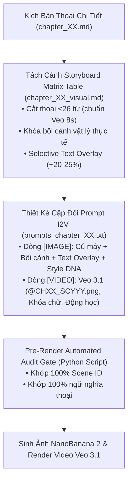
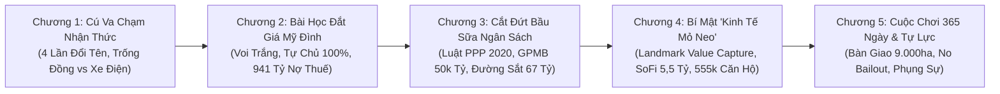

# Kế Hoạch Nghiên Cứu & Triển Khai Hình Ảnh/Video I2V: Siêu Dự Án Sân Vận Động VinFast (Tập 2)

Tài liệu này xác lập bản quy hoạch và kế hoạch thực thi toàn diện cho hệ thống hình ảnh tĩnh (NanoBanana 2) và video động I2V (Google Veo 3.1) cho tập phim **"Sân Vận Động VinFast (Tập 2): Bản Quyền Tên Gọi, Luật PPP 2020, Bài Toán 941 Tỷ Thuế Mỹ Đình & Mô Hình Landmark Value Capture"**.

Kế hoạch được xây dựng dựa trên việc nghiên cứu sâu sắc toàn bộ hồ sơ tập phim (`03_brief.md`, `07_outline.md`, `08_chapter_briefs.md`, `chapter_01.md` đến `chapter_05.md`) và quy chuẩn kỹ thuật đồng bộ với Tập 1.

---

## 🎨 1. HỆ THỐNG MỸ THUẬT & QUY CHUẨN TRỰC QUAN TOÀN CỤC (GLOBAL VISUAL DNA)

### A. Triết lý Nghệ thuật: Cinematic Editorial Noir
- **Phong cách cốt lõi:** Đồ họa báo chí điện ảnh cao cấp (High-end Editorial Illustration / Minimalist Graphic Novel Aesthetic), bán thực tế (semi-realistic), sắc sảo, tối giản, sang trọng. Tránh tuyệt đối cảm giác hoạt hình 2D trẻ con hoặc render 3D ảnh chụp máy cơ thô sơ.
- **Tính chân thực cơ học & vật lý (Physical Realism):** Mọi bối cảnh, tài liệu, sa bàn quy hoạch và công trường thi công phải phản ánh đúng không gian vật lý thực tế tại Hà Nội và các chuẩn mực quốc tế.

### B. Bảng Màu 60-30-10 & Thích Ứng Chủ Đề Thể Chế - Kinh Tế Mỏ Neo
- **60% Nền/Bóng tối:** `Dark warm charcoal (#1A1A1A)`, `Deep industrial slate (#1E2522)` và `Deep Prussian navy (#131D26)`.
- **30% Chủ thể/Kết cấu:** Màu xám thép titan, bề mặt bê tông mác cao, viền nét kem ấm `warm cream (#FFFDF0) outlines` tạo cảm giác đồ họa hữu cơ cao cấp.
- **10% Điểm nhấn Dẫn mắt (Visual Focal Points):**
  * *Bản sắc & Trống Đồng:* Cam đồng Trống đồng rực rỡ `glowing terracotta orange (#FF7043)`.
  * *Hạ tầng TOD & Kết nối Giao thông:* Xanh ngọc công nghệ `glowing turquoise (#26A69A)` của tuyến Metro, đường sắt cao tốc 67 tỷ USD, bản đồ phân vùng TOD.
  * *Cảnh báo & Cưỡng chế Thuế:* Đỏ san hô `glowing crimson coral red (#EF5350)` của quyết định cưỡng chế thuế 941 tỷ đồng, dòng chi phí chìm.

### C. Ngôn Ngữ Quang Học & Thiết Lập Cú Máy
- **Mở đầu prompt [IMAGE] bằng loại cú máy trực diện:** `High-angle aerial wide shot`, `Low-angle wide perspective`, `Cutaway 3D architectural perspective cross-section`, `Top-down close-up shot`.
- **Đuôi prompt chuẩn mực:** `warm cream outlines, dramatic chiaroscuro lighting, deep noir shadows, cinematic editorial illustration style, minimalist graphic novel aesthetic, highly detailed atmospheric background, 16:9`.

---

## 🏛️ 2. BỘ QUY TẮC BẢO TOÀN I2V & CHỐNG RỦI RO CÔNG NGHỆ

### 1. Quy tắc Chọn Lọc Chữ (Selective Typography Rule - BẮT BUỘC)
- Tuyệt đối **CẤM** chèn Text Overlay tiếng Việt trên 100% mọi phân cảnh.
- Text Overlay chỉ được xuất hiện ở **~20% - 25% các phân cảnh quan trọng nhất** (Mốc 135.000 chỗ, 941 tỷ thuế Mỹ Đình, Luật PPP 2020, Đền bù >50.000 tỷ, Mô hình TOD, Đường sắt 67 tỷ USD, SoFi 5,5 tỷ USD, 555.000 căn hộ).
- **75% - 80% phân cảnh còn lại** để `[TEXT OVERLAY]: Không`.

### 2. Quy tắc Khóa Tĩnh Lớp Chữ Tránh Lỗi Font trên Veo 3.1
- Đối với các phân cảnh có chữ tiếng Việt ở ảnh `[IMAGE]`: Tại dòng `[VIDEO]`, tuyệt đối **CẤM nhắc lại nội dung chữ** và bắt buộc sử dụng cú máy tĩnh (`steady shot`) kèm câu lệnh khóa lớp đồ họa:
  > `preserving all details and static graphic layers of the reference image exactly without any character morphing or alterations, 8-second continuous documentary video --ar 16:9`

### 3. Quy Chuẩn Phân Đoạn Toán Học (Veo 3.1 8s Alignment)
- Tốc độ đọc narrator: **3.81 từ/giây**.
- Clip Veo 3.1: **8.0 giây** (Ngưỡng thoại an toàn tối đa: **7.0 giây** = **tối đa 26 từ/phân cảnh**).

---

## 🎬 3. BẢN ĐỒ MỎ NEO TRỰC QUAN THEO 5 CHƯƠNG

