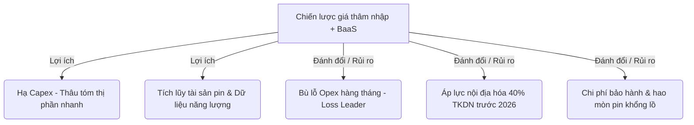

# 02_research_synthesis.md — Tổng hợp Nghiên cứu Toàn cầu (Global Research Synthesis)

Tệp này đóng vai trò là la bàn vĩ mô định hướng cho việc xây dựng kịch bản chi tiết, giải nghĩa bản chất kinh tế và các động lực chính trị-xã hội chi phối cấu trúc giá của VinFast tại các thị trường châu Á và toàn cầu.

---

## 1. Bản chất Cơ chế Vĩ mô (Systemic Mechanisms)

Nghịch lý địa lý khi một sản phẩm xuất khẩu có giá bán thấp hơn tại thị trường gốc không phải là một hiện tượng ngẫu nhiên, mà là sự vận hành có điều kiện của các quy luật kinh tế khách quan dưới tác động của chính sách công. Tuy nhiên, trong trường hợp ô tô điện VinFast, nghịch lý này phần lớn xuất phát từ một **lỗi so sánh lệch hệ quy chiếu** do sự thay đổi chính sách đột ngột của doanh nghiệp.

### A. Lỗi so sánh lệch hệ quy chiếu (The Reference Frame Fallacy)
Tại **Việt Nam**, kể từ ngày **01/03/2025**, VinFast đã **chính thức dừng chính sách thuê pin mới** đối với ô tô điện. Người tiêu dùng mua xe mới bắt buộc phải mua kèm pin. 
Ngược lại, tại **Indonesia và Philippines**, VinFast vẫn đang áp dụng chính sách **Battery-as-a-Service (BaaS - Thuê pin)** cực kỳ linh hoạt để thâm nhập thị trường. 
Sự chênh lệch lớn về giá mua ban đầu (ví dụ VF 3 tại Việt Nam có giá tối thiểu 322 triệu VND ~ 12.251 USD, trong khi tại Indonesia là 156 triệu IDR ~ 8.700 USD) thực chất là do người tiêu dùng so sánh:
- **Giá kèm pin bắt buộc tại Việt Nam** với **Giá không kèm pin (chỉ mua thân xe) tại nước ngoài**.
Khi đưa về cùng một hệ quy chiếu **MUA KÈM PIN (Outright Purchase)**, sự thật kinh tế được phơi bày:
- **VF 3 kèm pin:** Giá tại Indonesia (12.848 USD) thực chất **đắt hơn** tại Việt Nam (12.251 USD). Chỉ có tại Philippines là rẻ hơn một chút (12.098 USD) nhờ sắc lệnh EO 12.
- **VF 6 Plus kèm pin:** Giá tại Philippines (27.606 USD) **đắt hơn** tại Việt Nam (26.595 USD) khoảng 1.011 USD.
- **VF 7 Plus kèm pin:** Giá tại Philippines (38.648 USD) **đắt hơn** tại Việt Nam (36.107 USD) khoảng 2.541 USD.

### B. Ngoại lệ của VF 5 và Cơ chế Địa phương hóa Cấu hình (Spec Localization)
Mẫu **VF 5 Plus** là ngoại lệ duy nhất thực sự rẻ hơn ở cả 2 hình thức (Indo rẻ hơn ~2.800 USD, Philippines rẻ hơn ~3.000 USD).
- **Cơ chế:** Để chen chân vào phân khúc xe đô thị giá rẻ cực kỳ nhạy cảm về giá (đang bị thống trị bởi xe xăng như Honda Brio, Toyota Agya và xe điện Trung Quốc), VinFast buộc phải thực hiện chiến lược "Địa phương hóa cấu hình". 
- **Cắt giảm trang bị:** Phiên bản VF 5 Plus tại Indonesia bị giảm số lượng túi khí từ 6 xuống còn 4 túi khí (lược bỏ túi khí rèm bảo vệ hông), đồng thời cắt bớt các trang bị tiện nghi không cốt lõi để ép giá thành xuống mức thấp nhất.

### C. Rào cản thuế quan và Quy trình Landed Cost
- Tại **Philippines**, sắc lệnh **EO 12** đã đưa thuế nhập khẩu MFN của xe điện CBU từ 30% về 0% cho đến năm 2028. Điều này làm phẳng hoàn toàn rào cản thuế quan nhập khẩu, giúp landed cost của xe điện gần như tương đương với sản xuất nội địa.
- Tại **Indonesia**, việc dỡ bỏ thuế nhập khẩu và giảm thuế giá trị gia tăng (PPN) cho xe CBU thông qua các quy định **Perpres 79/2023** và **PMK 4/2025** được thiết kế như một "mồi nhử FDI". Chính phủ nước này cho phép miễn thuế nhập khẩu tạm thời với điều kiện nhà sản xuất phải cam kết bằng văn bản và tiến hành xây dựng nhà máy lắp ráp trong nước.
- **Chiến lược CKD tại Ấn Độ:** Tại thị trường có hàng rào thuế quan bảo hộ cực đoan như Ấn Độ (thuế nhập khẩu CBU thông thường từ 70% đến 100%), VinFast không thể áp dụng chiến lược nhập khẩu CBU giá rẻ cho các phân khúc phổ thông. Vì chính sách SMEC mới chỉ giảm thuế xuống 15% cho các xe điện cao cấp trên 35.000 USD. Do đó, VinFast bắt buộc phải triển khai mô hình lắp ráp CKD (Completely Knocked Down) trực tiếp tại nhà máy Thoothukudi, Tamil Nadu (khánh thành tháng 8/2025) để tối ưu hóa chi phí sản xuất và thuế quan của lục địa này.

---

## 2. Trục Xung đột và Đánh đổi Chiến lược (Conflicts & Strategic Trade-offs)

Chiến lược định giá thâm nhập kết hợp BaaS của VinFast tại Đông Nam Á không phải là một chiến thắng dễ dàng, mà là một chuỗi các đánh đổi và rủi ro tài chính sâu sắc.

### A. Trục xung đột: Doanh nghiệp vs Người tiêu dùng nội địa
- **Xung đột nhận thức:** Khán giả Việt Nam tự hỏi tại sao họ là những người ủng hộ thương hiệu từ đầu nhưng lại phải trả mức giá cao hơn cho cùng một sản phẩm so với khách hàng ở Indonesia hay Philippines. 
- **Bản chất kinh tế:** Việt Nam là thị trường "sân nhà" đã chín muồi, nơi VinFast đã xây dựng được nhận diện thương hiệu và hệ thống trạm sạc bao phủ toàn quốc. Mức giá tại Việt Nam phản ánh chi phí thực tế và biên lợi nhuận cần thiết để duy trì dòng tiền vận hành. Ngược lại, tại nước ngoài, VinFast là "kẻ thách thức" (Challenger) chưa có hệ sinh thái trạm sạc và thương hiệu mới mẻ, buộc phải áp dụng chiến lược định giá thâm nhập (Penetration Pricing) để "mua thị phần".

### B. Sự đánh đổi tài chính: Dòng tiền Capex ngắn hạn vs Thu nhập Opex dài hạn
- **Chiến lược Loss Leader:** Mức phí thuê pin VF 3 tại Indonesia chỉ 14,13 USD/tháng (gói cố định không giới hạn quãng đường) là mức giá dưới giá thành (Loss Leader). VinFast chấp nhận bù lỗ chi phí sản xuất pin ban đầu để đổi lấy lượng người dùng xe điện tăng nhanh chóng.
- **Rủi ro dòng tiền:** Mô hình BaaS yêu cầu VinFast phải có nguồn lực tài chính cực lớn để tài trợ cho chi phí sản xuất pin trước, sau đó thu hồi vốn nhỏ giọt trong nhiều năm. Nếu tốc độ tăng trưởng quy mô không đạt điểm hòa vốn kinh tế, gánh nặng nợ và chi phí quản lý vận hành pin sẽ đè nặng lên doanh nghiệp mẹ.

### C. Áp lực thời gian của chính sách bảo hộ địa phương
- Cửa sổ ưu đãi nhập khẩu miễn thuế CBU của Indonesia chỉ kéo dài đến hết năm 2025. Từ năm 2026 trở đi, nếu nhà máy Subang của VinFast không đi vào vận hành lắp ráp nội địa đạt tỷ lệ nội địa hóa (TKDN) trên 40%, các mẫu xe nhập khẩu sẽ lập tức bị áp thuế dội ngược, bóp nghẹt biên lợi nhuận của hãng. Đây là cuộc đua khốc liệt với thời gian.

---

## 3. Điểm nối Thực tế và Đời sống Việt Nam (Vietnam Connectivity)

Nghiên cứu này mang lại bài học sâu sắc cho người tiêu dùng và giới quan sát kinh tế tại Việt Nam:

- **Giải tỏa tâm lý bức xúc:** Chỉ ra rằng sự so sánh lệch hệ quy chiếu là nguồn gốc của các tranh cãi tiêu cực trên mạng xã hội. Khi so sánh sòng phẳng kèm pin, giá xe tại Việt Nam thực tế rất ưu đãi và phản ánh đúng lợi thế sản xuất nội địa.
- **Thay đổi thói quen sở hữu:** Việc dừng chính sách thuê pin từ tháng 3/2025 tại Việt Nam cho thấy VinFast đang muốn chuẩn hóa mô hình "sở hữu toàn vẹn" tại thị trường quê nhà khi người dùng đã có lòng tin vững chắc vào xe điện, trong khi vẫn dùng BaaS làm "vũ khí thâm nhập" tại các thị trường mới nơi người dùng còn nhiều e ngại về tuổi thọ pin.
- **Giá trị cốt lõi của thương hiệu quốc gia:** Việc VinFast chấp nhận tham chiến sòng phẳng, dùng cả nhà máy và công cụ tài chính BaaS để đối đầu với các ông lớn Trung Quốc tại khu vực Đông Nam Á là một phép thử quan trọng cho khả năng vươn ra toàn cầu của ngành công nghiệp chế tạo Việt Nam.
