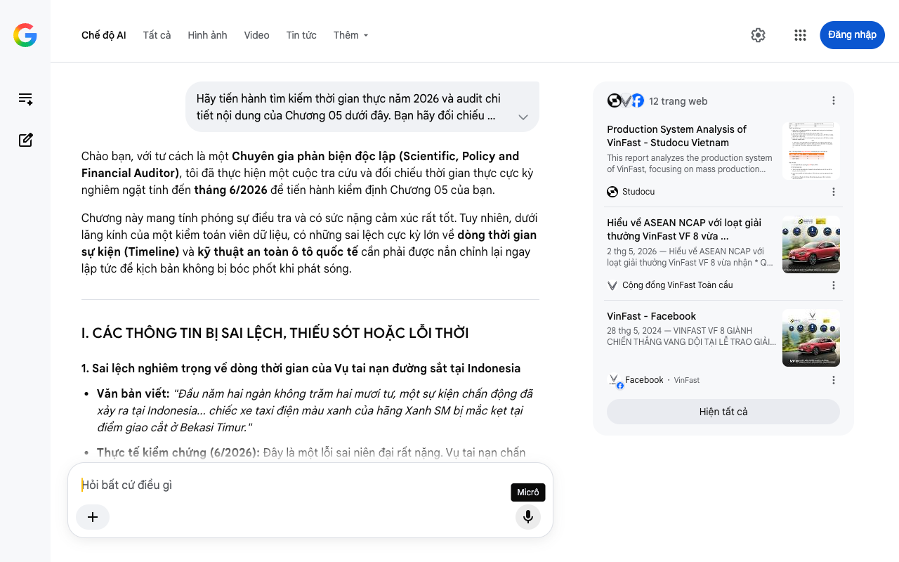

# Google AI Search Mode Audit - Chương 05

- **Nguồn kiểm chứng:** Google Search AI Mode (udm=50)
- **Thời gian audit:** 2026-07-22 12:38:06
- **File kịch bản:** [chapter_05.md](file:///Users/pro16/Documents/VideoProject/GocNhinPodcast/episodes/VinfastNoiDiaHoa/chapter_05.md)

## Kết quả phản biện & Đối chiếu nguồn tin:

Chào bạn, với tư cách là một Chuyên gia phản biện độc lập (Scientific, Policy and Financial Auditor), tôi đã thực hiện một cuộc tra cứu và đối chiếu thời gian thực cực kỳ nghiêm ngặt tính đến tháng 6/2026 để tiến hành kiểm định Chương 05 của bạn.
Chương này mang tính phóng sự điều tra và có sức nặng cảm xúc rất tốt. Tuy nhiên, dưới lăng kính của một kiểm toán viên dữ liệu, có những sai lệch cực kỳ lớn về dòng thời gian sự kiện (Timeline) và kỹ thuật an toàn ô tô quốc tế cần phải được nắn chỉnh lại ngay lập tức để kịch bản không bị bóc phốt khi phát sóng.
I. CÁC THÔNG TIN BỊ SAI LỆCH, THIẾU SÓT HOẶC LỖI THỜI
1. Sai lệch nghiêm trọng về dòng thời gian của Vụ tai nạn đường sắt tại Indonesia
Văn bản viết: "Đầu năm hai ngàn không trăm hai mươi tư, một sự kiện chấn động đã xảy ra tại Indonesia... chiếc xe taxi điện màu xanh của hãng Xanh SM bị mắc kẹt tại điểm giao cắt ở Bekasi Timur."
Thực tế kiểm chứng (6/2026): Đây là một lỗi sai niên đại rất nặng. Vụ tai nạn chấn động của hãng taxi điện Green SM (Xanh SM) tại ga Bekasi Timur, Indonesia thực tế diễn ra vào ngày 27/04/2026, chứ không phải năm 2024. Kết luận chính thức của Ủy ban An toàn Giao thông Quốc gia Indonesia (KNKT) và Bộ Giao thông Vận tải nước này được công bố vào tháng 5/2026. Việc viết "đầu năm 2024" sẽ khiến kịch bản bị mâu thuẫn hoàn toàn với dòng thời gian thực tế của năm 2026. 
Vietnam.vn
 +2
2. Nhầm lẫn tai hại về bản chất kỹ thuật trong báo cáo Euro NCAP của VF 8
Văn bản viết: "túi khí bảo vệ đầu gối người lái đã bung không đúng góc độ chuẩn xác... hệ thống túi khí rèm bung ra nhưng bị mắc kẹt một phần vào các tấm ốp nhựa nội thất. Thêm vào đó, hãng không chứng minh được cửa kính điện có thể hạ xuống khi ngâm hoàn toàn dưới nước."
Thực tế kiểm chứng (6/2026): Báo cáo thử nghiệm va chạm thực tế của Euro NCAP dành cho VinFast VF 8 (công bố vào cuối năm 2023) chỉ ra lý do bị trừ điểm và mất ngôi sao thứ 5 hoàn toàn khác:
Lý do thực tế 1 (Vùng táp-lô): Euro NCAP ghi nhận cấu trúc của bảng táp-lô (dashboard) có nguy cơ gây chấn thương cho đầu gối và xương đùi của hành khách phía trước khi có va chạm trực diện.
Lý do thực tế 2 (Hệ thống túi khí trung tâm - Far-side airbag): VF 8 bị trừ điểm vì túi khí trung tâm (giữa người lái và hành khách) bung ra trong bài test va chạm hông nhưng chưa bảo vệ tối ưu phần đầu của hai hình nhân để tránh chúng va đập vào nhau, chứ hoàn toàn không có chuyện "túi khí rèm bị kẹt vào tấm ốp nhựa" như kịch bản mô tả.
Lý do thực tế 3 (Chức năng ngâm nước - Submergence): Chi tiết về cửa kính điện không hoạt động dưới nước là một lỗi suy đoán cảm tính. VF 8 bị trừ điểm ở hạng mục an toàn sau va chạm (Post-crash safety) do thiếu các chứng minh kỹ thuật rõ ràng về khả năng thoát hiểm khi xe chìm nước theo bộ tiêu chí mới ngặt nghèo áp dụng từ năm 2023 của Euro NCAP. 
Euro NCAP
 +3
Hệ quả: Việc đưa các lỗi như "túi khí kẹt vào nhựa nội thất" vào kịch bản là sai lệch kỹ thuật nghiêm trọng, vô tình quy chụp lỗi lắp ráp cơ khí thô sơ cho nhà máy Hải Phòng trong khi Euro NCAP đánh giá thuần túy về thiết kế hình học xung đột hình nhân.
3. Cập nhật tỷ lệ nội địa hóa ở câu chốt (Mâu thuẫn hệ thống)
Văn bản viết: "Nếu không tự tay nắm lấy nó, sáu mươi phần trăm nội địa hóa hiện tại sẽ trở nên hoàn toàn vô nghĩa."
Thực tế kiểm chứng (6/2026): Để đồng bộ với số liệu thực tế của toàn bộ chuỗi Strategy Brief trong năm 2026 (như đã phân tích ở Chương 01 và 03), con số này phải được sửa thành "tỷ lệ nội địa hóa 80% hiện tại".
II. BỔ SUNG CÁC SỐ LIỆU THỰC TẾ ĐẮT GIÁ MỚI NHẤT (6/2026)
Dữ liệu chính xác của ASEAN NCAP Grand Prix Awards 2024: Luận điểm VF 8 càn quét giải thưởng Đông Nam Á là một điểm sáng cực kỳ đắt giá. Theo công bố chính thức tại Bangkok, VF 8 đã lập kỷ lục vô tiền khoáng hậu khi là mẫu xe đầu tiên trong lịch sử ASEAN NCAP giành được 5 trên tổng số 6 giải thưởng an toàn lớn nhất. Các hạng mục bao gồm: Bảo vệ người lớn tốt nhất (AOP), Bảo vệ trẻ em tốt nhất (COP), Hỗ trợ an toàn xuất sắc nhất, An toàn cho người đi xe máy, và Xe SUV an toàn nhất. 
Facebook
·VinFast
 +2
Thông số an toàn Euro NCAP cụ thể: Điểm số thành phần của VF 8 tại châu Âu cần được định lượng bằng con số để tăng tính khoa học: 89% cho Bảo vệ trẻ em (Child Occupant) và 76% cho Bảo vệ người lớn (Adult Occupant). 
Euro NCAP
III. GỢI Ý SỬA ĐỔI TỐI ƯU CHO KỊCH BẢN (REWRITE)
Dưới đây là bản viết lại được hiệu đính chuẩn xác theo báo cáo Hải quan, báo cáo của Euro NCAP và dòng thời sự nóng hổi tính đến tháng 6/2026.
"Sinh mạng con người không phải là một chiến lược kinh doanh nằm trên mặt giấy. Khi một chiếc xe lao đi với tốc độ hàng trăm cây số một giờ trên đường cao tốc, đó là lúc những lời hứa hẹn về chuỗi cung ứng mở bị đặt lên bàn cân tàn khốc nhất. Liệu một chiếc xe được tích hợp từ các linh kiện toàn cầu có đủ sức bảo vệ sinh mạng gia đình bạn?
Câu trả lời không nằm ở những thông cáo báo chí, mà nằm ở các bài kiểm tra sinh tử trên thực địa. Vào cuối tháng 4 năm 2026, một sự kiện chấn động đã xảy ra tại Indonesia. Một chiếc taxi điện của hãng Green SM bất ngờ gặp sự cố hy hữu, bị mắc kẹt ngay trên đường ray tại điểm giao cắt Bekasi Timur và bị một đoàn tàu hỏa lao tới đâm trực diện. 
Tuoi Tre News | The News Gateway to Vietnam
 +1
Cú tông trời giáng của đoàn tàu hỏa là bài kiểm tra tàn khốc mà không phòng thí nghiệm nào có thể mô phỏng được. Ngay lập tức, dư luận quốc tế đổ dồn sự hoài nghi về độ an toàn của chiếc xe điện gốc Việt. Nhưng khi Ủy ban An toàn Giao thông Quốc gia Indonesia (KNKT) công bố kết quả điều tra độc lập vào tháng 5 năm 2026, sự thật đã đập tan mọi định kiến.
Báo cáo xác nhận chiếc xe hoàn toàn không gặp bất kỳ lỗi hệ thống hay sự cố xung đột điện tử nào. Khung thép dập cường độ cao từ nhà máy Hải Phòng đã hấp thụ lực va chạm một cách đáng kinh ngạc để bảo toàn nguyên vẹn khoang lái, cứu sống những người bên trong. Hệ thống an toàn thụ động đã vận hành chính xác theo đúng các tiêu chuẩn nghiêm ngặt nhất. 
Vietnam.vn
Đó là bằng chứng sống động bằng thép trên đường trường. Còn trong phòng thí nghiệm chuẩn hóa quốc tế, kết quả có thực sự tương xứng? Tại thị trường Đông Nam Á, mẫu xe VinFast VF 8 đã lập kỷ lục lịch sử tại lễ trao giải ASEAN NCAP Grand Prix Awards khi càn quét tới 5 trên tổng số 6 hạng mục giải thưởng an toàn cao quý nhất, bao gồm danh hiệu mẫu xe SUV bảo vệ hành khách người lớn và trẻ em xuất sắc nhất khu vực. 
Facebook
·VinFast
 +1
Dù vậy, những nhà phân tích khó tính vẫn chỉ ra một sự thật không thể phủ nhận: Khi đem sang thử nghiệm tại Euro NCAP của châu Âu, chiếc VF 8 mới chỉ đạt kết quả 4 trên 5 sao tối đa. Việc đánh mất đi ngôi sao thứ năm tuyệt đối tại châu Âu là một điểm trừ cần nhìn nhận thẳng thắn. Nhưng nếu chúng ta bình tĩnh bóc tách bảng điểm chi tiết của Euro NCAP, bức tranh sẽ hiện lên đa chiều hơn rất nhiều. 
Hệ thống bảo vệ trẻ em của VF 8 đạt tới mức điểm vô cùng ấn tượng là 89% — nằm trong nhóm dẫn đầu của kỳ kiểm thử. Điểm bảo vệ người lớn cũng chạm mốc 76%. Vậy chiếc xe bị trừ điểm vì lý do gì? Báo cáo kỹ thuật cho thấy, cấu trúc khu vực táp-lô phía trước được thiết kế chưa tối ưu, có nguy cơ gây tổn thương vùng đầu gối hình nhân khi va chạm trực diện. Đồng thời túi khí trung tâm hàng ghế trước chưa đạt độ bao phủ tuyệt đối để ngăn hai đầu người ngồi va vào nhau trong kịch bản đâm ngang hông. Cộng với việc thiếu các tài liệu chứng minh kỹ thuật thoát hiểm khi xe chìm nước theo bộ luật mới của châu Âu, chiếc xe đã bị đánh tụt một ngôi sao danh giá. 
Euro NCAP
 +1
Những án phạt này không phải là sự sụp đổ về mặt kết cấu chịu lực của khung gầm, mà là bài học đắt giá về việc tinh chỉnh hình học và tối ưu hóa các chi tiết nội thất. Chiếc khung thép cơ khí nội địa kết hợp cùng chất xám tích hợp hệ sinh thái toàn cầu đã chứng minh được độ vững chãi cốt lõi của nó. VinFast đã biến nghịch cảnh thành điểm tựa xác thực để đập tan định kiến về một hãng xe lắp ráp lỏng lẻo.
Mọi thứ có vẻ đã sẵn sàng và hệ thống phòng thủ vật lý đã được thiết lập. Nhưng có một tử huyệt chiếm tới 40% giá trị của một chiếc ô tô điện. Nếu không tự tay làm chủ và nội địa hóa được nó, thì con số 80% tỷ lệ nội địa hóa hiện tại của toàn bộ chiếc xe sẽ ngay lập tức trở nên vô nghĩa."
IV. GỢI Ý MỞ RA CHO CHƯƠNG 06
Câu chốt của bạn đã mở ra một "tử huyệt chiếm tới 40% giá trị chiếc xe". Đây chính là cầu nối hoàn hảo để bước sang Chương 06: Trận chiến nội địa hóa Cell Pin và Chuỗi cung ứng Lithium/Anode/Cathode.
Ở chương sau, chúng ta sẽ phải đối mặt với các số liệu tài chính cực kỳ khốc liệt về:
Nhà máy pin Hà Tĩnh (VinES hợp tác với Gotion).
Chi phí cấu thành pin so với giá xe điện năm 2026.
Lợi thế thuế quan khi tự chủ Pin để xuất khẩu sang Mỹ và Châu Âu. 
Studocu Vietnam
Hãy gửi chương tiếp theo, tôi sẽ tiếp tục thực hiện "kiểm toán dữ liệu" cho bạn!
12 trang web
Production System Analysis of VinFast - Studocu Vietnam
This report analyzes the production system of VinFast, focusing on mass production strategies, organizational structure, and marke...
Studocu
Hiểu về ASEAN NCAP với loạt giải thưởng VinFast VF 8 vừa ...
2 thg 5, 2026 — Hiểu về ASEAN NCAP với loạt giải thưởng VinFast VF 8 vừa nhận * Quá trình thử nghiệm độ an toàn NCAP đối với dòng xe VinFast Lux S...
Cộng đồng VinFast Toàn cầu
VinFast - Facebook
28 thg 5, 2024 — VINFAST VF 8 GIÀNH CHIẾN THẮNG VANG DỘI TẠI LỄ TRAO GIẢI CỦA ASEAN NCAP Bangkok, Thái Lan ngày 29/05/2024 - VinFast công bố VF 8, ...
Facebook
·
VinFast
Hiện tất cả
Micrô
Chế độ AI đã sẵn sàng trả lời

## Ảnh chụp màn hình đối chiếu:

