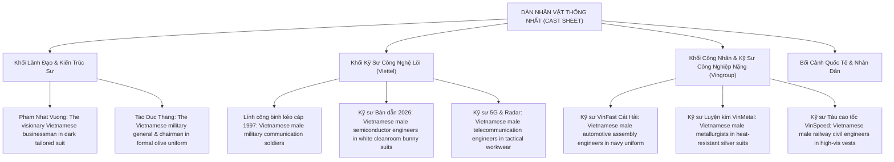
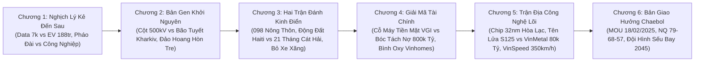
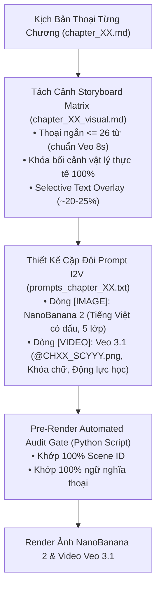
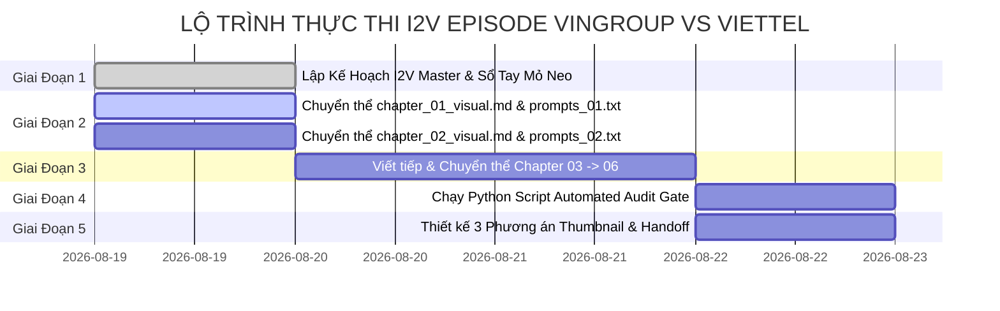

# Kế Hoạch Nghiên Cứu & Triển Khai Hình Ảnh/Video I2V: Vingroup vs Viettel — Bản Giao Hưởng Sếu Đầu Đàn Việt Nam

> **EPISODE ID:** `episodes/VingroupVsViettel`  
> **CHỦ ĐỀ:** Hai Cỗ Máy Kinh Tế, Hai Bản Thiết Kế Vĩ Mô & Thế Cờ "Lưỡng Long Hội Tụ" Vì Mục Tiêu Tự Cường 2045  
> **THỜI LƯỢNG MỤC TIÊU:** 22 – 25 phút (~4.800 – 5.400 từ thoại, 6 chương)  
> **MÔ HÌNH THỰC THI:** Sinh ảnh tĩnh **NanoBanana 2** (5 lớp đồ họa báo chí) $\rightarrow$ Sinh video động **Google Veo 3.1** (I2V 8 giây, Khóa chữ, Động lực học điện ảnh).  
> **NGUỒN SỰ THẬT DUY NHẤT:** Tổng hợp từ `00_Global_Vision_Synthesis.md`, `03_brief.md`, `07_outline.md`, `08_chapter_briefs.md` và hệ thống kịch bản thoại `chapter_01.md`, `chapter_02.md`...

---

## 🎨 1. HỆ THỐNG MỸ THUẬT & QUY CHUẨN TRỰC QUAN TOÀN CỤC (GLOBAL VISUAL DNA)

### A. Triết lý Nghệ thuật: Cinematic Editorial Noir (Đồ họa Báo chí Điện ảnh)
* **Bản chất phong cách:** Đồ họa báo chí cao cấp (High-end Editorial Illustration), bán thực tế (semi-realistic), sắc sảo, tối giản, sang trọng như các ấn phẩm phóng sự điều tra của *Bloomberg Markets*, *The Financial Times* hay *The Economist*. Tránh hoàn toàn nét vẽ hoạt hình 2D trẻ con (cartoon) hoặc mô hình 3D game thô cứng.
* **BẮT BUỘC FRONT-LOAD PHONG CÁCH 2D BÁO CHÍ (2D Art Medium Front-Loading - BẮT BUỘC):** 100% prompt ảnh tĩnh `[IMAGE]` bắt buộc phải bắt đầu bằng cụm từ cố định:  
  `A 2D cinematic editorial noir illustration of [Chủ thể & Hành động], minimalist graphic novel aesthetic, clean bold ink outlines, stylized flat vector textures...`  
  *Tuyệt đối CẤM mở đầu bằng các từ chỉ góc máy chụp ảnh như `A photo of...`, `A wide shot of...`, `A low-angle shot of...`, `An exterior shot of...` (khiến AI hiểu lầm là ảnh chụp thật photorealism).*
* **Tính chân thực vật lý & Không gian sống (100% Physical Realism & Living Scene):** Mọi bối cảnh, phòng sạch bán dẫn, đại công trường luyện kim, dây chuyền robot hàn xe điện hay tuyến đường sắt cao tốc phải là không gian vật lý thực tế. Tuyệt đối cấm các ẩn dụ siêu thực trừu tượng (như bàn tay khổng lồ, con đường chia đôi ngả dưới trời bão, bánh răng lơ lửng trên mây, hoặc lò rèn thủ công thời trung cổ).

### B. Bảng Màu 60-30-10 & Thích Ứng Theo Tuyến Động Lực Kép
Toàn bộ tập phim tuân thủ nghiêm ngặt nguyên tắc phối màu điện ảnh để phân biệt rõ ràng hai bản sắc văn hóa doanh nghiệp:

```
┌─────────────────────────────────────────────────────────────────────────────┐
│                       BẢNG PHỐI MÀU ĐIỆN ẢNH 60-30-10                       │
├──────────────────────────────┬──────────────────────────────┬───────────────┤
│    60% NỀN / BÓNG TỐI        │    30% CHỦ THỂ / NÉT VẼ      │ 10% ĐIỂM NHẤN │
├──────────────────────────────┼──────────────────────────────┼───────────────┤
│ • Dark warm charcoal (#1A1A) │ • Warm cream (#FFFDF0) lines │ • Cyber Teal  │
│ • Deep military olive (#1E25)│ • Titanium steel grey        │ • Terracotta  │
│ • Deep indigo night gradient │ • Clean architectural white  │ • Ruby Red    │
└──────────────────────────────┴──────────────────────────────┴───────────────┘
```

* **60% Chủ đạo (Nền & Bóng tối Noir):** Gam màu than chì ấm `dark warm charcoal (#1A1A1A)`, xanh rêu quân đội trầm `deep military olive slate (#1E2522)` và gradient chàm đêm sâu thẳm `deep indigo night gradient`.
* **30% Bổ trợ (Chủ thể & Kết cấu):** Nét vẽ màu kem ấm `warm cream (#FFFDF0) outlines`, bề mặt kim loại titan xám bạc, bê tông mác cao và các tấm pano kiến trúc phẳng.
* **10% Điểm nhấn dẫn mắt (Visual Focal Points):**
  * *Tuyến Viettel (Kỷ luật Áo lính & Công nghệ Lõi):* Xanh ngọc công nghệ số `electric cyber turquoise (#26A69A)` (Data Center, 5G Open RAN, Viettel Cloud GPU H200) kết hợp với sắc đỏ san hô cờ Tổ quốc `glowing crimson red (#EF5350)` (Tổ hợp tên lửa S125-VT, Radar quân sự).
  * *Tuyến Vingroup (Tốc độ Khởi nghiệp & Công nghiệp Nặng):* Cam đất nhiệt huyết `glowing terracotta orange (#FF7043)` (VinFast, nhà máy Cát Hải, lò đúc thép xanh VinMetal) kết hợp xanh xô thơm năng lượng sạch `electric sage green (#81C784)` (Siêu trạm sạc V-Green BESS, Tàu cao tốc VinSpeed 350 km/h).

### C. Ngôn Ngữ Quang Học & Thiết Lập Ống Kính (Cinematography Specs)
* **Định dạng ống kính:** `Shot on 35mm anamorphic lens`, `shallow depth of field`, `cinematic chiaroscuro lighting` (tương phản sáng - tối kịch tính, viền sáng rim light nổi bật chủ thể).
* **Góc máy đặc trưng của tập phim:**
  * *Góc đại cảnh từ trên cao (`Epic top-down aerial shot` / `Bird's-eye view`):* Bắt trọn tổ hợp nhà máy Cát Hải 335 ha, đại công trường VinMetal Vũng Áng 461 ha, và tuyến đường sắt cao tốc VinSpeed 350 km/h cắt ngang cánh đồng châu thổ.
  * *Góc thấp ngước nhìn (`Low-angle wide shot`):* Phô diễn tầm vóc đồ sộ của tháp Landmark 81, cột điện cao thế 500kV, tháp ăng-ten 5G gNodeB và tòa nhà trụ sở Data Center An Khánh.
  * *Góc mặt cắt kỹ thuật (`Cross-section technical cutaway`):* Lột tả cấu trúc phòng sạch đúc Chip 32nm Hòa Lạc với 1.000 bước kỹ thuật, siêu trạm sạc V-Green tích hợp khối pin BESS lưu trữ ngầm, và hệ thống pin xe điện dưới sàn xe.
  * *Góc cận cảnh theo dấu (`Macro tracking shot`):* Quét theo cánh tay robot ABB đang hàn laser thân xe VF 3, đầu máy quang khắc trên tấm wafer silicon 300mm, và dòng thép cuộn HRC đỏ rực chạy trên băng chuyền tự động.

---

## 👥 2. DÀN NHÂN VẬT THỐNG NHẤT (CAST SHEET & DEMOGRAPHICS)

Để đảm bảo tính nhất quán tuyệt đối về diện mạo giữa các phân cảnh và tuân thủ nguyên tắc an toàn nhân dạng:



### A. Quy Chuẩn Prompt Nhân Vật (Cast Descriptions)
1. **Chủ tịch Phạm Nhật Vượng (Vingroup):**
   * *Dòng [IMAGE]:* `a middle-aged Vietnamese visionary businessman, sharp intense gaze, short neat black hair, dressed in a sleek dark charcoal tailored suit, crisp white dress shirt, confident posture, distinct East Asian facial features.`
   * *Dòng [VIDEO]:* `the visionary leader, dressed in dark tailored suit, preserving his facial features and the details of the reference image exactly without alterations.`
2. **Trung tướng Tào Đức Thắng & Ban Lãnh Đạo Quân Đội (Viettel):**
   * *Dòng [IMAGE]:* `a high-ranking Vietnamese military commander and corporate chairman, dignified resolute expression, wearing formal Vietnam People's Army (VPA) dark moss-green service dress uniform, red-bordered golden army rank shoulder epaulets (cấp hiệu quân hàm lục quân) and peaked military service cap with red-bordered gold army crest (strictly Vietnam People's Army military general/commander, NOT police, NO law enforcement badges).`
   * *Dòng [VIDEO]:* `the military chairman in formal army uniform, preserving his dignified features and the details of the reference image exactly.`
3. **Đội ngũ Kỹ sư & Người Lính Viettel (Quân Đội Nhân Dân Việt Nam - VPA):**
   * *Lính thông tin hiện trường / Kéo cáp / Trạm BTS:* `Vietnamese military telecommunication soldiers with East Asian features wearing authentic Vietnam People's Army (VPA) dark moss-green field fatigues, classic military pith helmets (mũ cối) with red star army badges (strictly Vietnam People's Army soldiers, NOT police, NO law enforcement badges).`
   * *Kỹ sư Phòng sạch Bán dẫn & R&D:* `a team of Vietnamese male semiconductor engineers wearing sterile white cleanroom bunny suits, protective goggles, and nitrile gloves, operating high-tech silicon wafer stepper machines.`
   * *Kỹ sư 5G & Radar Quốc phòng:* `two Vietnamese male military engineers in dark moss-green Vietnam People's Army (VPA) tactical utility workwear, inspecting an outdoor 5G Massive MIMO gNodeB antenna on a telecommunication tower.`
4. **Đội ngũ Kỹ sư & Công nhân Vingroup (Nhà máy Cát Hải & VinMetal & VinSpeed):**
   * `a Vietnamese male chief automotive engineer in a navy blue VinFast uniform and safety helmet, monitoring orange robotic assembly arms in a high-tech smart factory.`
   * `Vietnamese male industrial metallurgists in heat-resistant silver protective suits and dark face shields, observing continuous casting of steel slabs in a modern green steel plant.`
   * `Vietnamese male railway engineers in high-visibility orange vests and white hard hats, examining the aerodynamic nose cone of a sleek white-and-blue 350 km/h high-speed train.`
5. **Nhân khẩu học Quốc tế & Lịch sử:**
   * *Bão tuyết Kharkiv 1990s:* `a young Vietnamese male student entrepreneur in a thick dark wool coat and scarf, walking through a heavy blizzard in 1990s Kharkiv Ukraine, standing outside a brick instant noodle factory.`
   * *Thực chiến Viettel Toàn cầu:* `Vietnamese male telecommunication engineers working alongside local Haitian technicians in earthquake-damaged Port-au-Prince (2010)` / `Vietnamese engineers installing solar-powered microwave towers on a 4,000-meter high peak in the Peruvian Andes.`

### B. Quy Tắc Vượt Bộ Lọc & Chống Lệch Mặt
* **Dòng `[IMAGE]`:** Được phép sử dụng tên riêng chính xác (Pham Nhat Vuong, Tao Duc Thang, Le Thi Thu Thuy, VinFast, Viettel, VinMetal, VinSpeed) để mô hình NanoBanana 2 kết xuất đúng đặc trưng thương hiệu và nhân vật.
* **Dòng `[VIDEO]`:** Tuyệt đối **CẤM nhắc lại tên riêng**, bắt buộc thay bằng danh từ chung (*the visionary leader, the military chairman, the chief engineer, the workers*) kèm câu lệnh bảo tồn: `preserving the facial features and the structural details of the reference image exactly`.
* **Quy chuẩn Chống Tạo Nhầm Quân Đội Thành Công An (Strict VPA Army Lock):** Mọi hình ảnh người lính Viettel bắt buộc ghi rõ `Vietnam People's Army (VPA)`, `mũ cối (military pith helmet)` hoặc `mũ kê-pi lục quân viền đỏ`, và câu lệnh phủ định `strictly military army soldiers of Vietnam People's Army, NOT police, NO law enforcement uniform`.

---

## 🏛️ 3. DANH MỤC MỎ NEO THƯƠNG HIỆU & ĐẠI CÔNG TRÌNH THỰC TẾ (REAL ASSETS)

Tuyệt đối tuân thủ **Nguyên tắc Tôn trọng Tên Thực thể & Thương hiệu Gốc (Brand Integrity Principle)**. Không tự ý đổi tên hay giả định:

```mermaid
flowchart LR
    subgraph VIETTEL["HỆ SINH THÁI TỰ CHỦ VIETTEL"]
        V1["Nhà Máy Chip 32nm Hòa Lạc<br>(1,3B USD, 27 ha, 100M chip/năm)"]
        V2["30.000 Trạm 5G Make in VN<br>(Open RAN gNodeB 64T64R)"]
        V3["Data Center An Khánh 60MW<br>(NVIDIA H200/B200 AI-Native)"]
        V4["Tổ Hợp Khí Tài A1<br>(Tên lửa S125-VT, Tên lửa Trường Sơn)"]
        V5["Hạ Tầng Lịch Sử<br>(Cáp quang 1A trên 500kV, VoIP 178, SIM 098)"]
    end

    subgraph VINGROUP["HỆ SINH THÁI CÔNG NGHIỆP VINGROUP"]
        G1["Tổ Hợp VinFast Cát Hải 335ha<br>(197k EV, VF 2 188tr, VF 3 240tr)"]
        G2["Siêu Trạm Sạc V-Green BESS<br>(10.000 tỷ, 150k cổng sạc toàn quốc)"]
        G3["Thép Xanh VinMetal Vũng Áng<br>(80.000 tỷ, 461 ha, 5M tấn thép/năm)"]
        G4["Đường Sắt Cao Tốc VinSpeed<br>(150.000 tỷ, Hà Nội - Q.Ninh 350km/h 23p)"]
        G5["Biểu Tượng Khởi Nguyên<br>(Mì Mivina Ukraine, Vinpearl Hòn Tre, Landmark 81)"]
    end

    subgraph LIENMINH["LIÊN MINH CHIẾN LƯỢC (MOU 18/02/2025)"]
        L1["Viettel cấp Chip 32nm & 5G IoT cho VinFast"]
        L2["Viettel Post chuyển 100% sang Xe Điện VinFast"]
        L3["V-Green phủ trạm sạc tại toàn bộ Bưu cục Viettel"]
        L4["Viettel Cloud AI H200 tối ưu tự hành cho VinFast"]
    end

    VIETTEL <==> LIENMINH <==> VINGROUP
```



---

## 🎬 4. BẢN ĐỒ MỎ NEO TRỰC QUAN THEO 6 CHƯƠNG (6-CHAPTER VISUAL BLUEPRINT)



### 📌 CHƯƠNG 1: Nghịch Lý Của Những Kẻ Đến Sau (The Hook Paradigm)
* **Thời lượng & Số từ:** 1:30 – 2:00 phút (~320 từ thoại, ~12–14 phân cảnh).
* **Trọng tâm tự sự:** Va chạm nhận thức ngay từ 15 giây đầu: Hai tiện ích bình dân quen thuộc (Data 7.000đ/GB và Ô tô điện 188–240 triệu) mở ra hai pháo đài công nghệ và công nghiệp nặng trụ cột quốc gia.
* **Mỏ neo trực quan cốt lõi:**
  1. *Bản đồ so sánh cước data toàn cầu:* Màn hình split-screen hiển thị cước 1GB: Việt Nam 0,28 USD (Top 1 ASEAN) đối lập với Singapore (0,63 USD) và Mỹ (5,50 USD).
  2. *Dải ô tô điện bình dân lăn bánh trên phố:* Cận cảnh những chiếc VF 2 (188 triệu), VF 3 (240 triệu) và Minio Green màu sắc trẻ trung lướt qua đường phố Hà Nội/TP.HCM nhộn nhịp, sánh vai cùng xe máy tay ga.
  3. *Tương phản vĩ mô đa tầng:* 
     * Bên cạnh data là: Trạm 5G Open RAN, Phòng sạch Chip 32nm Hòa Lạc, Data Center AI GPU H200, và Bệ phóng Tên lửa S125-VT.
     * Bên cạnh xe điện là: Đại công trường VinMetal Vũng Áng 80k tỷ, Dây chuyền robot Cát Hải 95%, và Siêu tàu cao tốc VinSpeed 350 km/h.
  4. *Khung cảnh biểu tượng hai trụ cột:* Người lính kỹ sư viễn thông trong bộ quân phục dã chiến và kỹ sư công nghiệp VinFast đứng song song trước bản đồ quy hoạch quốc gia.

### 📌 CHƯƠNG 2: Bản Gen Khởi Nguyên — Từ Bão Tuyết Ukraine Đến Đường Dây 500kV
* **Thời lượng & Số từ:** 4:00 phút (~900 từ thoại, ~35–38 phân cảnh).
* **Trọng tâm tự sự:** Truy nguyên cội nguồn lịch sử thập niên 1990: Hai bàn tay trắng, hoàn cảnh ngặt nghèo, tôi luyện nên hai triết lý quản trị đối lập ("Thực tiễn là chân lý" vs "Sunk Cost Immunity").
* **Mỏ neo trực quan cốt lõi:**
  1. *Căn nhà cấp bốn Cát Linh 1989 & Sigelco:* 10 người lính công binh đi thuê xe đạp, trèo cột vi ba sắt giữa rừng sâu Tây Bắc trong sương mù.
  2. *Trận kéo cáp quang 1A trên đường dây 500kV (1997):* Những người lính Viettel treo mình trên cột điện cao thế 500kV cao vút, tự tay kéo 2.300 km sợi cáp quang đơn sắc dọc dãy Trường Sơn.
  3. *Tiếng súng VoIP 178 (2000):* Biển quảng cáo "178 - Mã số tiết kiệm" nổi bật trên phố cổ Hà Nội; hàng dài người dân xếp hàng gọi điện thoại công cộng đường dài giá rẻ, đập tan thế độc quyền.
  4. *Bão tuyết Kharkiv & Mì Mivina (1990s):* Ông Phạm Nhật Vượng trong áo khoác dạ dày giữa trời bão tuyết Kharkiv, xưởng sản xuất mì ăn liền bốc khói nghi ngút, gói mì Mivina trên kệ hàng siêu thị Ukraine (97% thị phần); thương vụ chuyển nhượng 150 triệu USD cho Nestlé năm 2009.
  5. *Canh bạc đảo hoang Hòn Tre (2003):* Tàu kéo đường ống nước ngọt khổng lồ đặt xuống đáy biển Nha Trang; trụ cáp treo vượt biển Vinpearl vươn lên giữa làn nước xanh ngọc.
  6. *Tháp đôi Vincom Bà Triệu (2004) & Kỷ lục Landmark 81:* Đại công trường Landmark 81 rực sáng trong đêm đổ móng 12 tiếng liên tục; tòa tháp 461m vươn lên trời cao đón bình minh Sài Gòn.

### 📌 CHƯƠNG 3: Hai Trận Đánh Kinh Điển — "Chiến Tranh Nhân Dân" vs "Tốc Độ Nén Thời Gian"
* **Thời lượng & Số từ:** 4:00 phút (~850 từ thoại, ~32–35 phân cảnh).
* **Trọng tâm tự sự:** Hai chiến lược mở rộng thị trường: Viettel kiên trì cắm rễ kiểu vết dầu loang toàn cầu vs Vingroup dũng mãnh nén thời gian và cú pivot xe điện sinh tử.
* **Mỏ neo trực quan cốt lõi:**
  1. *Mạng di động 098 nông thôn:* Trạm thu phát sóng Viettel dựng trên đỉnh núi đá vùng cao Hà Giang; người nông dân và đồng bào dân tộc thiểu số cầm điện thoại di động gọi về bản làng.
  2. *Thực chiến toàn cầu Viettel:*
     * Kỹ sư Natcom bám trụ dựng lại trạm sóng giữa đống đổ nát sau thảm họa động đất Haiti 2010.
     * Kỹ sư Bitel vác thiết bị viễn thông trèo lên đỉnh Andes hiểm trở >4.000m tại Peru.
     * Cờ Viettel tung bay tại 7 quốc gia đứng Top 1 thị phần; dòng ngoại tệ 4,5 tỷ USD chuyển về Tổ quốc.
  3. *Kỳ tích 21 tháng đầm lầy Cát Hải:* Đại công trường san lấp đầm lầy biến thành tổ hợp sản xuất ô tô hiện đại 335 ha với 1.200 cánh tay robot ABB tự động hóa 95%.
  4. *Quyết định sinh tử 2022 (Khai tử xe xăng):* Dây chuyền sản xuất dỡ bỏ động cơ đốt trong, thay thế bằng các khối pin lithium và động cơ điện; hàng dài xe VF 8, VF 9 xuất bến cảng Hải Phòng lên tàu Silver Queen sang Mỹ.
  5. *Pivot Châu Á & Vũ khí Taxi Xanh SM:* Đoàn xe taxi điện màu xanh cyan Xanh SM phủ kín đường phố Jakarta (Indonesia) và New Delhi (Ấn Độ); lễ khởi công nhà máy Subang (1B USD) và Tamil Nadu (2B USD).

### 📌 CHƯƠNG 4: Giải Mã Tài Chính — "Cỗ Máy Tiền Mặt" vs "Động Cơ Kép Mua Thời Gian"
* **Thời lượng & Số từ:** 4:30 phút (~950 từ thoại, ~36–40 phân cảnh).
* **Trọng tâm tự sự:** Bóc tách chuyên sâu BCTC kiểm toán (E&Y, SEC Form 20-F), đập tan định kiến mạng xã hội về nợ 800k tỷ; đối chiếu cỗ máy tiền mặt tự tài trợ của Viettel với mô hình động cơ kép Vinhomes - VinFast.
* **Mỏ neo trực quan cốt lõi:**
  1. *Cỗ máy tiền mặt Viettel:* Bảng cân đối kế toán vững như bàn thạch: Doanh thu 220k tỷ, LNTT 56.8k tỷ, Nợ vay ~ 0; kho tiền mặt & tiền gửi >45.000 tỷ của Viettel Global thu lãi 6,3 tỷ đồng mỗi ngày.
  2. *Giải mã khối nợ 800.000 tỷ Vingroup:*
     * Đồ họa 3D bóc tách cơ cấu nợ: Nợ vay ngân hàng thực 279k tỷ (D/E = 1,76 an toàn).
     * Khối vốn chiếm dụng 353k tỷ (110k tỷ người mua trả trước + 243k tỷ tiền cọc) — nguồn vốn float tự hóa thành doanh thu khi giao nhà.
     * Quỹ tiền mặt dự trữ kỷ lục 85.689 tỷ đồng trong két sắt doanh nghiệp.
  3. *Mô hình "Bình oxy thặng dư" Vinhomes:* Đại đô thị Ocean Park với hàng vạn căn hộ sáng đèn, dòng tiền lợi nhuận bất động sản chuyển tiếp bơm máu nuôi khát vọng công nghiệp nặng VinFast nén chu kỳ 100 năm vào 1 thập kỷ.
  4. *Thu hẹp biên lỗ VinFast:* Biểu đồ tài chính kiểm toán thể hiện biên lỗ gộp thu hẹp từ -62,7% về -41,1%, hướng tới điểm hòa vốn EBITDA 2026–2027.

### 📌 CHƯƠNG 5: Trận Địa Công Nghệ Lõi 2025–2026 — Từ Đầm Lầy Cát Hải Đến Wafer Silicon Hòa Lạc
* **Thời lượng & Số từ:** 4:30 phút (~950 từ thoại, ~38–42 phân cảnh).
* **Trọng tâm tự sự:** Tầm vóc các đại công trình công nghệ tự chủ 2026: Đúc chip 32nm, Khí tài A1, 5G Open RAN, Thép xanh VinMetal và Đường sắt cao tốc VinSpeed 350 km/h.
* **Mỏ neo trực quan cốt lõi:**
  1. *Nhà máy đúc Chip 32nm Hòa Lạc (Khởi công 16/01/2026):* Phòng sạch Class 1 vô trùng rực ánh vàng quang khắc; kỹ sư Viettel điều khiển máy quét laser trên tấm wafer silic 300mm qua 1.000 bước kỹ thuật (công suất 100 triệu chip/năm).
  2. *Data Center An Khánh 60MW & GPU NVIDIA H200:* Dãy máy chủ siêu mật độ cao phát sáng xanh ngọc; luồng dữ liệu Viettel Cloud AI-Native xử lý thuật toán tự hành và chủ quyền số quốc gia.
  3. *Tổ hợp Khí tài Quốc phòng Đề án A1:* Bệ phóng tên lửa phòng không S125-VT cải tiến phóng đạn xé toạc bầu trời đêm (diệt 90% mục tiêu); Tên lửa đất đối hải Trường Sơn và Radar 3D canh giữ biển trời Tổ quốc.
  4. *Mạng lưới Siêu trạm sạc V-Green BESS 10.000 tỷ:* Trạm sạc 150kW tích hợp khối pin lưu trữ BESS dùng năng lượng mặt trời bên quốc lộ; hàng xe điện đang cắm sạc siêu nhanh trong 15 phút.
  5. *Đại công trường Thép xanh VinMetal Vũng Áng (80.000 tỷ):* Mặt cắt nhà máy luyện cán thép 461 ha bên vịnh Vũng Áng; dây chuyền đúc thép ray đường sắt cao tốc 350 km/h và thép tấm HRC sạch sẽ, hiện đại.
  6. *Siêu hạ tầng VinSpeed 350 km/h (Hà Nội – Quảng Ninh 23 phút):* Đoàn tàu cao tốc khí động học màu trắng bạc lướt đi trên cầu cạn bê tông hiện đại từ ga Cổ Loa xuyên qua đồng bằng Bắc Bộ về vịnh Hạ Long.

### 📌 CHƯƠNG 6: Bản Giao Hưởng Chaebol Việt Nam — Lời Giải Cho Bài Toán 2045
* **Thời lượng & Số từ:** 4:00 phút (~850 từ thoại, ~32–36 phân cảnh).
* **Trọng tâm tự sự:** Sự cộng hưởng lịch sử tại Lễ ký MOU 18/02/2025; Bộ ba Nghị quyết Bộ Chính trị (79 - 68 - 57) và biểu tượng "Đội hình sếu bay hình chữ V" đưa Việt Nam hóa rồng 2045.
* **Mỏ neo trực quan cốt lõi:**
  1. *Lễ Ký kết Thỏa thuận Hợp tác Toàn diện (18/02/2025):* Lãnh đạo Viettel và Vingroup bắt tay dưới cờ Tổ quốc; màn hình hiển thị 4 trụ cột liên minh (Chip 32nm lên xe VinFast, Viettel Post dùng 100% xe điện, V-Green phủ bưu cục toàn quốc, Cloud AI GPU H200).
  2. *Bộ ba Nghị quyết trụ cột thể chế:* Biểu đồ đồ họa 3D hiển thị Nghị quyết 79 (Kinh tế Nhà nước chủ đạo) - Nghị quyết 68 (Kinh tế Tư nhân động lực quan trọng) - Nghị quyết 57 (Đột phá KHCN).
  3. *Trợ lực thể chế thực tế:* Văn bản Nghị định 202/2026/NĐ-CP miễn 100% lệ phí trước bạ xe điện đến 2030 và cơ chế EPR 0% thu hồi pin.
  4. *Hình tượng Đội hình Sếu Bay Hình Chữ V:* Đàn chim sếu đầu đàn sải cánh bay vút lên bầu trời hoàng hôn rực rỡ, bên dưới là hình bóng non sông Việt Nam với mạng lưới hạ tầng số 5G, đường sắt cao tốc 350 km/h và các tổ hợp công nghiệp tự cường hướng về mốc son 2045.

---

## ⚙️ 5. BỘ QUY TẮC KỸ THUẬT I2V & CHỐNG RỦI RO CÔNG NGHỆ



### 1. Quy Chuẩn Phân Đoạn Toán Học (Veo 3.1 8s / 26 Từ Thoại)
* **Tốc độ đọc trung bình narrator:** **3.81 từ/giây**.
* **Thời lượng clip Google Veo 3.1:** **8.0 giây**.
* **Ngưỡng an toàn tối đa cho mỗi phân cảnh:** **7.0 giây** = **tối đa 26 từ thoại**.
* **Nguyên tắc gom/tách:** Mọi câu thoại dài hơn 26 từ bắt buộc phải chia nhỏ thành các phân cảnh phụ (`SCYYYa1`, `SCYYYa2`...) và phân bổ đều từ thoại. Tuyệt đối không để thoại rỗng.

### 2. Quy Tắc Chọn Lọc Chữ (Selective Typography Rule - BẮT BUỘC)
* Tuyệt đối **CẤM** chèn Text Overlay tiếng Việt trên 100% mọi phân cảnh.
* Text Overlay chỉ xuất hiện tại **~20% - 25% các phân cảnh quan trọng nhất** (Mốc thời gian 16/01/2026, Giá data 7.000đ/GB, VF 2 188 triệu, Chip 32nm, Nợ thực 279k tỷ, Thép 80k tỷ, ĐSKT 350 km/h, Bộ ba Nghị quyết).
* **75% - 80% phân cảnh còn lại** bắt buộc để `[TEXT OVERLAY]: Không` nhằm trả lại không gian nghệ thuật cho NanoBanana 2 và cho phép camera Veo 3.1 chuyển động linh hoạt (`push-in dolly`, `pan`, `tracking`, `tilt-up`).

### 3. Quy Tắc Khóa Tĩnh Lớp Chữ Tránh Lỗi Font trên Veo 3.1
* Với cảnh có Text Overlay tiếng Việt ở ảnh `[IMAGE]`: Tại dòng `[VIDEO]`, tuyệt đối **CẤM nhắc đến nội dung chữ** và bắt buộc dùng cú máy tĩnh (`steady shot`) kèm câu lệnh khóa lớp đồ họa:
  > `preserving all details and static graphic layers of the reference image exactly without any character morphing or alterations`
* Với cảnh không có Text Overlay: Tự do sử dụng các chuyển động camera điện ảnh và động lực học vật lý mượt mà.

### 4. Định Dạng Cặp Đôi Prompts Chuẩn trong `prompts_chapter_XX.txt`
Mỗi phân cảnh bắt buộc gồm 2 dòng liên tiếp không ngắt quãng và cách phân cảnh khác bằng 1 dòng trống:

```text
CH01_SC001 [IMAGE]: A 2D cinematic editorial noir illustration of a global digital connectivity map, bold infographic comparison showing mobile data cost per gigabyte with Vietnam at 0.28 USD, minimalist graphic novel aesthetic, clean bold ink outlines, stylized flat vector textures, dark warm charcoal background with deep indigo undertones, warm cream outlines, glowing turquoise data lines, facing camera directly, 3D horizontal typography with heavy black drop shadow reading "VIỆT NAM: 7.000 ĐỒNG / GB", shot on 35mm anamorphic lens, dramatic chiaroscuro lighting, deep noir shadows, 16:9

CH01_SC001 [VIDEO]: @CH01_SC001.png -> steady camera shot with glowing digital data streams pulsing subtly across the network grid lines, preserving all details and static graphic layers of the reference image exactly without any character morphing or alterations, 8-second continuous documentary video --ar 16:9
```

---

## 🛠️ 6. LỘ TRÌNH THỰC THI 5 BƯỚC (5-STAGE IMPLEMENTATION ROADMAP)



| Giai Đoạn | Tác Vụ Cụ Thể | Sản Phẩm Đầu Ra (Output File) |
|---|---|---|
| **Giai đoạn 1** | Xác lập Quy chuẩn Mỹ thuật & Kế hoạch I2V Master | `episodes/VingroupVsViettel/i2v_production_plan.md` |
| **Giai đoạn 2** | Tách cảnh Storyboard Matrix cho Chương 1 & Chương 2 | `chapter_01_visual.md`, `chapter_02_visual.md` |
| **Giai đoạn 3** | Biên soạn Cặp đôi Prompts I2V cho Chương 1 & Chương 2 | `prompts_chapter_01.txt`, `prompts_chapter_02.txt` |
| **Giai đoạn 4** | Tiếp tục triển khai tuần tự cho các Chương 3, 4, 5, 6 | `chapter_03_visual.md` $\rightarrow$ `chapter_06_visual.md`, `prompts_chapter_03.txt` $\rightarrow$ `06.txt` |
| **Giai đoạn 5** | Chạy Python Audit Gate đối chiếu 100% khớp Scene ID & Thiết kế Thumbnail Brief | `08_thumbnail_brief.md`, `thumbnail_prompts.md` |

---
*Kế hoạch này là bản quy hoạch trực quan và công nghệ duy nhất để triển khai toàn bộ hệ thống hình ảnh và video I2V cho tập phim Vingroup vs Viettel.*
