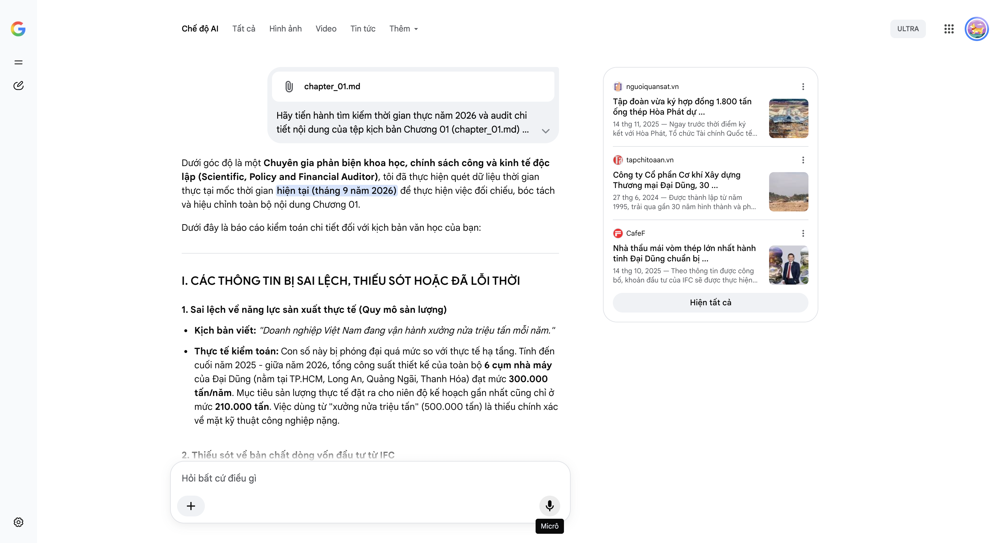

# Google AI Search Mode Audit - Chương 01

- **Nguồn kiểm chứng:** Google Search AI Mode (udm=50)
- **Thời gian audit:** 2026-09-14 17:00:39
- **File kịch bản:** [chapter_01.md](file:///Users/pro16/Documents/VideoProject/GocNhinPodcast/episodes/co-khi-dai-dung/chapter_01.md)

## Kết quả phản biện & Đối chiếu nguồn tin:

Bạn đã gửi: chapter_01.md và nói: 
chapter_01.md

Dưới góc độ là một Chuyên gia phản biện khoa học, chính sách công và kinh tế độc lập (Scientific, Policy and Financial Auditor), tôi đã thực hiện quét dữ liệu thời gian thực tại mốc thời gian hiện tại (tháng 9 năm 2026) để thực hiện việc đối chiếu, bóc tách và hiệu chỉnh toàn bộ nội dung Chương 01.
Dưới đây là báo cáo kiểm toán chi tiết đối với kịch bản văn học của bạn:
I. CÁC THÔNG TIN BỊ SAI LỆCH, THIẾU SÓT HOẶC ĐÃ LỖI THỜI
1. Sai lệch về năng lực sản xuất thực tế (Quy mô sản lượng)
Kịch bản viết: "Doanh nghiệp Việt Nam đang vận hành xưởng nửa triệu tấn mỗi năm."
Thực tế kiểm toán: Con số này bị phóng đại quá mức so với thực tế hạ tầng. Tính đến cuối năm 2025 - giữa năm 2026, tổng công suất thiết kế của toàn bộ 6 cụm nhà máy của Đại Dũng (nằm tại TP.HCM, Long An, Quảng Ngãi, Thanh Hóa) đạt mức 300.000 tấn/năm. Mục tiêu sản lượng thực tế đặt ra cho niên độ kế hoạch gần nhất cũng chỉ ở mức 210.000 tấn. Việc dùng từ "xưởng nửa triệu tấn" (500.000 tấn) là thiếu chính xác về mặt kỹ thuật công nghiệp nặng.
2. Thiếu sót về bản chất dòng vốn đầu tư từ IFC
Kịch bản viết: "Họ cũng nhận khoản đầu tư chiến lược 38 triệu USD từ tổ chức tài chính quốc tế IFC để dọn đường..."
Thực tế kiểm toán: Dữ liệu tài chính cho thấy kịch bản đã bỏ qua cấu trúc tài chính cực kỳ quan trọng. Khoản tiền 38 triệu USD này của IFC thực chất là Vốn lai (quasi-equity investment) – một công cụ tài chính nằm giữa vốn vay và vốn chủ sở hữu. Việc gọi chung chung là "khoản đầu tư chiến lược" khiến người nghe lầm tưởng đây là hoạt động mua cổ phần phổ thông (Equity) thuần túy.
3. Sai sót dòng thời gian và lịch sử doanh nghiệp
Kịch bản viết: "Năm 1995, họ bắt đầu chỉ là một xưởng hàn cơ khí nhỏ bé... Đến năm 2000, doanh nghiệp mới chính thức cổ phần hóa để mở rộng quy mô."
Thực tế kiểm toán: Sai mốc cổ phần hóa. Giai đoạn 1995 là Xưởng cơ khí Đại Dũng, đến năm 1997 thành lập xưởng tại KCN Lê Minh Xuân. Thực tế, pháp nhân tiền thân là Công ty TNHH Cơ khí Xây dựng Thương mại Đại Dũng, và họ chỉ chuyển đổi sang mô hình Công ty Cổ phần (cổ phần hóa) muộn hơn rất nhiều chứ không phải năm 2000 (Vốn điều lệ tính đến trước thềm IPO năm 2026 đã được nâng cấp lên 1.753 tỷ đồng).
4. Logic kỹ thuật bị cường điệu hóa (Dung sai giãn nở nhiệt tại Qatar)
Kịch bản viết: "Chỉ cần chênh lệch một độ C, chiều dài của một thanh dầm thép khẩu độ lớn có thể co giãn vài milimét."
Thực tế kiểm toán: Sai lệch nghiêm trọng về vật lý vật liệu. Hệ số giãn nở nhiệt của cấu kiện thép cacbon tiêu chuẩn cấu trúc (Structural Steel) là khoảng 
1
2
×
1
0
−
6
/
∘
C
. Giả định một thanh dầm thép siêu trường có chiều dài cực đại là 30 mét, khi nhiệt độ biến thiên 
1
∘
C
1
∘
C
, độ co giãn thực tế được tính bằng công thức:

𝛥
𝐿
=
30.000
mm
×
12
×
10
-6
×
1
∘
C
=
0
,
36
mm
Δ
𝐿
=
3
0
.
0
0
0
m
m
×
1
2
×
1
0
−
6
×
1
∘
C
=
0
,
3
6
m
m

Như vậy, phải chênh lệch tới gần 
6
∘
C
𝟔
∘
𝐂
 thì thanh dầm dài 30m mới biến thiên được 2 mm. Viết "chênh lệch 1 độ C co giãn vài milimét" là phản khoa học, làm giảm tính thuyết phục đối với người xem có kiến thức chuyên môn.
II. CÁC SỐ LIỆU THỰC TẾ ĐẮT GIÁ MỚI NHẤT TRONG NĂM 2026 CẦN BỔ SUNG
Để tăng tính thời sự (vào thời điểm giữa năm 2026), kịch bản cần cập nhật ngay các chuyển dịch chiến lược vừa diễn ra của "Gã khổng lồ ẩn danh" này:
Dự án hạ tầng quốc nội làm bệ đỡ: Không chỉ có World Cup, vào đầu năm 2026, Đại Dũng đã tạo cú hích lớn tại thị trường nội địa khi trúng các gói thầu cung cấp cấu kiện thép cho Sân vận động Hưng Yên (trị giá 750 tỷ đồng) và nhận thông báo trúng thầu Sân vận động Trống Đồng (trị giá 1.500 tỷ đồng), phục vụ chiến lược cung ứng tổng cộng khoảng 55.000 tấn kết cấu thép.
Thông tin định vị "Hạ tầng vật lý nền kinh tế số": Hợp đồng 60 triệu USD ký vào cuối tháng 7/2026 sang Mỹ cần được làm rõ tính chất: Đây không chỉ là thiết bị công nghiệp thô, mà là cấu kiện công nghệ cao cấu thành Hạ tầng vật lý cho các Trung tâm Dữ liệu (Data Center) và Nhà máy điện khí – những mắt xích khắt khe nhất về an toàn và quy chuẩn truy xuất nguồn gốc vật liệu của Mỹ.
Bước đi thâu tóm chính trị - kinh tế toàn cảnh: Tháng 7/2026, ông Trịnh Tiến Dũng (Chủ tịch Đại Dũng) chính thức được bầu vào Hội đồng quản trị của Tập đoàn PC1 (một đại gia ngành EPC xây lắp năng lượng, hạ tầng). Đây là chi tiết cực đắt thể hiện tham vọng hợp lực tạo chuỗi giá trị khép kín (Đại Dũng sản xuất cấu kiện nặng - PC1 triển khai xây lắp hạ tầng công nghiệp).
III. GỢI Ý SỬA ĐỔI TỐI ƯU (KÈM NGUỒN ĐỐI CHIẾU)
Dưới đây là văn bản đề xuất tái cấu trúc lại một số phân đoạn trong kịch bản nhằm đảm bảo tính chính xác khoa học nhưng vẫn giữ nguyên nhịp điệu hấp dẫn, kịch tính:
Đoạn 1: Hiệu chỉnh công suất và tính chất dòng tiền IFC
"Giữa thị trường do các gã khổng lồ của Anh, Mỹ hay Nhật Bản định hình cả thế kỷ, một doanh nghiệp Việt Nam đang vận hành hệ thống hạ tầng 6 cụm nhà máy rộng hơn 100 hecta, cung ứng ra thị trường tới 300.000 tấn kết cấu thép mỗi năm. Bước sang năm 2026, họ hướng tới doanh thu kỷ lục 12.000 tỷ, dọn đường bước lên sàn chứng khoán sau khi dòng vốn lai quasi-equity trị giá 38 triệu USD từ Tổ chức Tài chính Quốc tế IFC chính thức được kích hoạt nhằm xây dựng các siêu nhà máy cơ khí công nghệ cao tại Nghi Sơn và phía Nam."
Đoạn 2: Hiệu chỉnh logic vật lý tại Qatar (Sân vận động Lusail và 974)
"Dưới cái nóng gay gắt lên tới 50 độ C tại Qatar, các siêu cấu kiện chịu lực đối mặt với thử thách giãn nở nhiệt tàn nhẫn. Chỉ cần nhiệt độ môi trường biến thiên khoảng vài độ C, những thanh dầm vòm thép khẩu độ lớn dài hàng chục mét sẽ ngay lập tức co giãn biến thiên vài milimét. Trên độ cao 70 mét, nếu sai lệch vượt quá 2 milimét, các khớp nối sẽ không bao giờ xỏ vừa bu-lông chịu lực, đẩy siêu dự án triệu đô vào nguy cơ đình chỉ. Thế nhưng, 100% mối hàn của người thợ Việt đều vượt qua các bài kiểm tra siêu âm và tia X nghiêm ngặt..."
Đoạn 3: Cập nhật sự kiện tháng 7/2026 (Xuất khẩu công nghệ cao sang Mỹ)
"Tháng 7 năm 2026, một sự kiện công nghiệp quan trọng đã diễn ra: Đại Dũng chính thức chốt đơn hàng hơn 60 triệu USD với đối tác Mỹ. Lần này không còn là những kết cấu xây dựng thông thường, thép Việt đi thẳng vào phần hạ tầng cốt lõi của nền kinh tế số toàn cầu: cung ứng thiết bị công nghệ cao cho chuỗi Trung tâm Dữ liệu (Data Center) và các nhà máy điện khí công suất lớn. Đồng thời, sự xuất hiện của vị thuyền trưởng Đại Dũng trong Hội đồng quản trị Tập đoàn xây lắp năng lượng PC1 vào cùng thời điểm đã khẳng định một ván cược hợp lực khổng lồ nhằm thâu tóm chuỗi giá trị từ sản xuất đến thực địa."
Báo cáo kiểm toán kết thúc tại đây. Kịch bản của bạn có nền tảng cốt truyện rất tốt, chỉ cần tinh chỉnh lại các dữ liệu kỹ thuật và cập nhật đúng hơi thở kinh tế của giữa năm 2026 là sẽ trở thành một tài liệu phân tích truyền thông cực kỳ xuất sắc.
Nếu bạn muốn tôi tiếp tục audit chi tiết cho các chương tiếp theo của kịch bản, hãy gửi nội dung chương đó và cho biết bạn muốn tập trung sâu vào khía cạnh nào (ví dụ: bẫy biên lợi nhuận 4%, rủi ro tỷ giá, hay cạnh tranh với Trung Quốc)!
nguoiquansat.vn
Tập đoàn vừa ký hợp đồng 1.800 tấn ống thép Hòa Phát dự ...
14 thg 11, 2025 — Ngay trước thời điểm ký kết với Hòa Phát, Tổ chức Tài chính Quốc tế (IFC) cũng công bố khoản đầu tư 38 triệu USD (tương đương khoả...
tapchitoaan.vn
Công ty Cổ phần Cơ khí Xây dựng Thương mại Đại Dũng, 30 ...
27 thg 6, 2024 — Được thành lập từ năm 1995, trải qua gần 30 năm hình thành và phát triển, hiện nay Công ty Cổ phần cơ khí xây dựng thương mại Đại ...
CafeF
Nhà thầu mái vòm thép lớn nhất hành tinh Đại Dũng chuẩn bị ...
14 thg 10, 2025 — Theo thông tin được công bố, khoản đầu tư của IFC sẽ được thực hiện dưới dạng vốn lai (quasi-equity investment). Về bản chất, đây ...
Hiện tất cả
Micrô
Chế độ AI đã sẵn sàng trả lời
All items removed from input context.

## Ảnh chụp màn hình đối chiếu:

