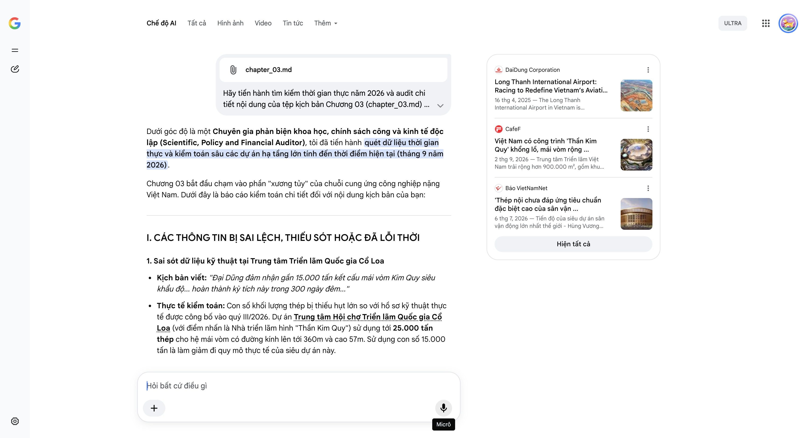

# Google AI Search Mode Audit - Chương 03

- **Nguồn kiểm chứng:** Google Search AI Mode (udm=50)
- **Thời gian audit:** 2026-09-14 17:01:48
- **File kịch bản:** [chapter_03.md](file:///Users/pro16/Documents/VideoProject/GocNhinPodcast/episodes/co-khi-dai-dung/chapter_03.md)

## Kết quả phản biện & Đối chiếu nguồn tin:

Bạn đã gửi: chapter_03.md và nói: 
chapter_03.md

Dưới góc độ là một Chuyên gia phản biện khoa học, chính sách công và kinh tế độc lập (Scientific, Policy and Financial Auditor), tôi đã tiến hành quét dữ liệu thời gian thực và kiểm toán sâu các dự án hạ tầng lớn tính đến thời điểm hiện tại (tháng 9 năm 2026).
Chương 03 bắt đầu chạm vào phần "xương tủy" của chuỗi cung ứng công nghiệp nặng Việt Nam. Dưới đây là báo cáo kiểm toán chi tiết đối với nội dung kịch bản của bạn:
I. CÁC THÔNG TIN BỊ SAI LỆCH, THIẾU SÓT HOẶC ĐÃ LỖI THỜI
1. Sai sót dữ liệu kỹ thuật tại Trung tâm Triển lãm Quốc gia Cổ Loa
Kịch bản viết: "Đại Dũng đảm nhận gần 15.000 tấn kết cấu mái vòm Kim Quy siêu khẩu độ... hoàn thành kỳ tích này trong 300 ngày đêm..."
Thực tế kiểm toán: Con số khối lượng thép bị thiếu hụt lớn so với hồ sơ kỹ thuật thực tế được công bố vào quý III/2026. Dự án Trung tâm Hội chợ Triển lãm Quốc gia Cổ Loa (với điểm nhấn là Nhà triển lãm hình "Thần Kim Quy") sử dụng tới 25.000 tấn thép cho hệ mái vòm có đường kính lên tới 360m và cao 57m. Sử dụng con số 15.000 tấn là làm giảm đi quy mô thực tế của siêu dự án này.
2. Sai sót dòng lịch sử và tên gọi siêu dự án Sân vận động
Kịch bản viết: "Tiếp đó là siêu dự án sân vận động Hùng Vương với 40.000 tấn thép nhịp vòm 350 mét." (Nhưng đoạn trên lại viết: "Sân bay Long Thành... sân vận động Hưng Yên... sân vận động Trống Đồng..." ở chương trước).
Thực tế kiểm toán: Cần chuẩn hóa tính nhất quán. Đại dự án sân vận động lớn nhất thế giới tại phía Nam Hà Nội (sức chứa 135.000 chỗ ngồi) ban đầu có tên là Lạc Việt, sau đó đổi thành Trống Đồng. Đến kỳ Đại hội cổ đông tháng 4/2026, Chủ tịch Tập đoàn Vingroup mới chính thức chốt tên gọi cuối cùng là Sân vận động Hùng Vương. Tổng khối lượng kết cấu thép mái vòm vượt nhịp 350m do Đại Dũng đảm nhận thiết kế chi tiết kỹ thuật và lắp dựng chính xác là 40.000 tấn.
3. Điểm nghẽn logic kỹ thuật: Quy trình kiểm tra mối hàn EN 1090-1 EXC4
Kịch bản viết: "Tiêu chuẩn EXC4 bắt buộc 100% mối hàn phải được kiểm định siêu âm và chụp phim bức xạ tia X."
Thực tế kiểm toán: Viết như vậy chưa chuẩn xác về mặt kỹ thuật cơ khí nặng (Mechanical Testing). Theo quy chuẩn châu Âu EN 1090-2 (quy định kỹ thuật cho kết cấu thép, bổ trợ cho EN 1090-1), cấp độ thực thi cao nhất EXC4 (Execution Class 4) yêu cầu tỷ lệ kiểm tra không phá hủy (NDT - Non-Destructive Testing) là 100% đối với các mối hàn chịu lực chính (Butt welds & Fillet welds). Tuy nhiên, việc kiểm tra là sự kết hợp có chọn lọc giữa kiểm tra ngoại quan (VT), siêu âm (UT), hạt từ (MT) hoặc chụp tia X (RT) tùy thuộc vào độ dày và hình học khớp nối, chứ không phải mọi mối hàn đều đồng thời bị "chụp cả phim X-quang lẫn siêu âm" cùng lúc.
II. CÁC SỐ LIỆU THỰC TẾ ĐẮT GIÁ MỚI NHẤT TRONG NĂM 2026 CẦN BỔ SUNG
Để làm bật lên cái gọi là "Ranh giới giá trị gia tăng" và dọn đường cho bài toán kinh tế ở chương sau, kịch bản cần bổ sung ngay các số liệu cực đắt vừa được các bên tiết lộ vào tháng 7/2026:
Dữ liệu bóc tách tỷ trọng nguồn gốc vật liệu tại SVĐ Hùng Vương: Trong tổng số 40.000 tấn thép cấu kiện mái của siêu sân vận động này, tỷ lệ thép sản xuất trong nước (bao gồm Hòa Phát và Posco Yamato Vina) chỉ chiếm vỏn vẹn khoảng 5%. Toàn bộ các hạng mục này chỉ được dùng cho cấu kiện phụ trợ, Canopy hoặc hệ đỡ phụ.
Danh tính các tập đoàn độc quyền thượng nguồn: Toàn bộ phần thép đặc chủng chịu lực cường độ cao, thép tấm dày vượt khổ bắt buộc phải nhập khẩu trực tiếp từ các gã khổng lồ toàn cầu: Posco International (Hàn Quốc), Metal One (Nhật Bản), Baosteel, NISCO, Yingkou Steel (Trung Quốc).
Bằng chứng thực địa tại Sân bay Long Thành: Tính đến giữa năm 2026, dự án Sân bay Long Thành đang bước vào giai đoạn nước rút để kịp vận hành vào cuối năm. Đại Dũng không chỉ làm cấu kiện thô mà đã hoàn tất việc cung ứng kết cấu cấu thành hệ thống 64 cầu ống lồng hành khách (Jet bridge) phối hợp cùng tập đoàn ShinMaywa (Nhật Bản).
III. GỢI Ý SỬA ĐỔI TỐI ƯU (KÈM NGUỒN ĐỐI CHIẾU)
Tôi đề xuất hiệu chỉnh lại các đoạn văn mấu chốt để đưa hơi thở dữ liệu công nghiệp thực tế của năm 2026 vào kịch bản:
Đoạn 1: Hiệu chỉnh logic kỹ thuật chuẩn EXC4 châu Âu
"Ở bờ bên kia Đại Tây Dương, tiêu chuẩn EN 1090-1 cấp độ EXC4 của Châu Âu được xem là bức tường kỹ thuật khắc nghiệt nhất, chỉ áp dụng cho các công trình có nguy cơ gây thảm họa đặc biệt lớn nếu sụp đổ. Đạt đến đẳng cấp EXC4 đồng nghĩa với việc doanh nghiệp phải tuân thủ nghiêm ngặt tỷ lệ kiểm tra không phá hủy (NDT) lên tới 100% đối với toàn bộ các mối hàn chịu lực cốt lõi, đi kèm hệ thống hồ sơ phôi thép được số hóa để lưu vết và truy xuất nguồn gốc trong suốt 30 năm."
Đoạn 2: Cập nhật dữ liệu chính xác của hai siêu dự án quốc gia (Cổ Loa & SVĐ Hùng Vương)
"Bên cạnh Long Thành, dấu ấn cơ khí chính xác của họ còn hiện diện tại Trung tâm Triển lãm Quốc gia Cổ Loa. Tại đây, Đại Dũng đã chinh phục thành công hệ mái vòm hình Thần Kim Quy khổng lồ rộng tới 360 mét, sử dụng đến 25.000 tấn thép kết cấu. Ngay sau đó, họ tiếp tục bước vào siêu đại công trường Sân vận động Hùng Vương lớn nhất thế giới tại Hà Nội, nhận trọng trách thiết kế chi tiết và lắp dựng 40.000 tấn thép cho hệ mái vòm vượt nhịp hơn 350 mét ở độ cao chóng mặt."
Đoạn 3: Đập tan ảo tưởng bằng số liệu "đau đớn" về chuỗi cung ứng
"Thế nhưng, chính ở những siêu dự án đỉnh cao này, một nghịch lý tàn nhẫn của chuỗi cung ứng lập tức lộ diện. Trong 40.000 tấn thép mái vòm của siêu sân vận động Hùng Vương, tỷ trọng thép nội địa từ các đại gia như Hòa Phát chỉ chiếm vỏn vẹn khoảng 5%, và hoàn toàn bị đẩy xuống làm các hạng mục phụ trợ như hệ đỡ phụ hay mái canopy. Toàn bộ phần thép tấm chịu lực cường độ cao đặc chủng – linh hồn của công trình – đều nằm trong tay các ông lớn ngoại quốc như Metal One của Nhật Bản hay Posco International của Hàn Quốc. Người thợ Việt lấy công làm lãi từ những mối hàn dung sai milimét, nhưng phần giá trị thượng nguồn đậm đặc nhất vẫn chảy về túi các tập đoàn đa quốc gia."
Báo cáo kiểm toán Chương 03 kết thúc. Đoạn cuối chương này đã tạo ra một cú bẻ lái (plot twist) cực kỳ đắt giá về mặt kinh tế: Làm siêu dự án, sở hữu chứng chỉ tối cao, nhưng bản chất vẫn là đi làm thuê ăn mồi công.
Hãy gửi tiếp Chương 04, tôi sẽ cùng bạn giải phẫu con số "Bẫy biên lợi nhuận 4%" dưới góc độ tài chính doanh nghiệp và biến động giá hàng hóa (Commodity super-cycle) năm 2026!
DaiDung Corporation
Long Thanh International Airport: Racing to Redefine Vietnam’s Aviation Future - DaiDung Corporation
16 thg 4, 2025 — The Long Thanh International Airport in Vietnam is constructing 64 telescopic boarding bridges. The bridges are high-tech, precisi...
CafeF
Việt Nam có công trình 'Thần Kim Quy' khổng lồ, mái vòm rộng ...
2 thg 9, 2026 — Trung tâm Triển lãm Việt Nam trải rộng hơn 900.000 m², gồm khu triển lãm trong nhà, các khu triển lãm ngoài trời, không gian hội n...
Báo VietNamNet
'Thép nội chưa đáp ứng tiêu chuẩn đặc biệt cao của sân vận ...
6 thg 7, 2026 — Tiến độ của siêu dự án sân vận động lớn nhất thế giới - Hùng Vương đang được dư luận đặc biệt quan tâm. Là một trong những doanh n...
Hiện tất cả
Micrô
Chế độ AI đã sẵn sàng trả lời
All items removed from input context.

## Ảnh chụp màn hình đối chiếu:

