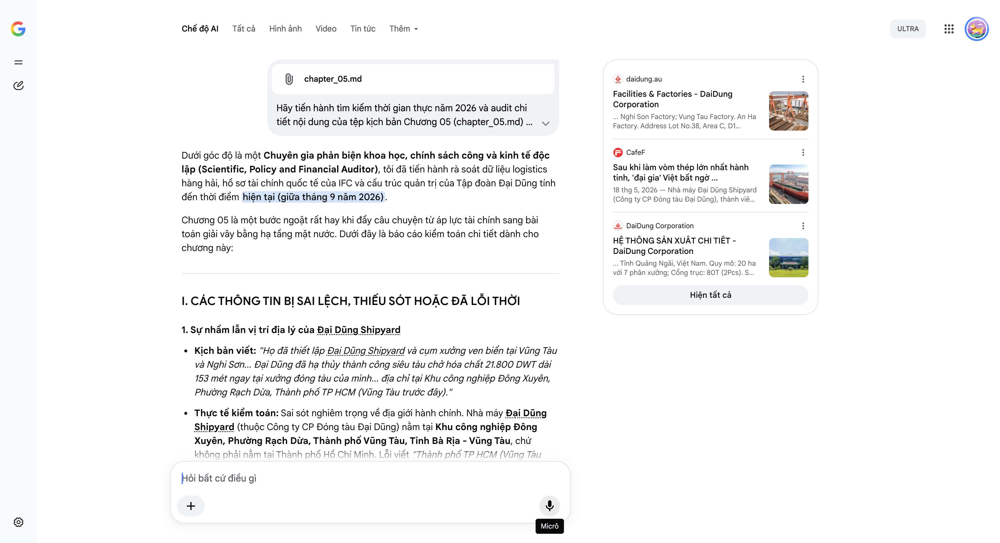

# Google AI Search Mode Audit - Chương 05

- **Nguồn kiểm chứng:** Google Search AI Mode (udm=50)
- **Thời gian audit:** 2026-09-14 17:02:58
- **File kịch bản:** [chapter_05.md](file:///Users/pro16/Documents/VideoProject/GocNhinPodcast/episodes/co-khi-dai-dung/chapter_05.md)

## Kết quả phản biện & Đối chiếu nguồn tin:

Bạn đã gửi: chapter_05.md và nói: 
chapter_05.md

Dưới góc độ là một Chuyên gia phản biện khoa học, chính sách công và kinh tế độc lập (Scientific, Policy and Financial Auditor), tôi đã tiến hành rà soát dữ liệu logistics hàng hải, hồ sơ tài chính quốc tế của IFC và cấu trúc quản trị của Tập đoàn Đại Dũng tính đến thời điểm hiện tại (giữa tháng 9 năm 2026).
Chương 05 là một bước ngoặt rất hay khi đẩy câu chuyện từ áp lực tài chính sang bài toán giải vây bằng hạ tầng mặt nước. Dưới đây là báo cáo kiểm toán chi tiết dành cho chương này:
I. CÁC THÔNG TIN BỊ SAI LỆCH, THIẾU SÓT HOẶC ĐÃ LỖI THỜI
1. Sự nhầm lẫn vị trí địa lý của Đại Dũng Shipyard
Kịch bản viết: "Họ đã thiết lập Đại Dũng Shipyard và cụm xưởng ven biển tại Vũng Tàu và Nghi Sơn... Đại Dũng đã hạ thủy thành công siêu tàu chở hóa chất 21.800 DWT dài 153 mét ngay tại xưởng đóng tàu của mình... địa chỉ tại Khu công nghiệp Đông Xuyên, Phường Rạch Dừa, Thành phố TP HCM (Vũng Tàu trước đây)."
Thực tế kiểm toán: Sai sót nghiêm trọng về địa giới hành chính. Nhà máy Đại Dũng Shipyard (thuộc Công ty CP Đóng tàu Đại Dũng) nằm tại Khu công nghiệp Đông Xuyên, Phường Rạch Dừa, Thành phố Vũng Tàu, Tỉnh Bà Rịa - Vũng Tàu, chứ không phải nằm tại Thành phố Hồ Chí Minh. Lỗi viết "Thành phố TP HCM (Vũng Tàu trước đây)" là sai lệch địa lý hoàn toàn. Cụm cảng và bãi chế tạo ven biển Vũng Tàu này đạt công suất 100.000 tấn/năm, đóng vai trò là "nửa linh hồn" ngoài khơi của Đại Dũng, bổ trợ cho cụm Nghi Sơn (Thanh Hóa).
2. Định danh chính xác mã hiệu dự án của IFC
Kịch bản viết: "Tổ chức Tài chính Quốc tế IFC... đã chính thức phê duyệt gói tài tài trợ vốn lai trị giá 38 triệu USD... với mã số hiệu 48301."
Thực tế kiểm toán: Dữ liệu chuẩn xác. Trên cổng thông tin công khai của Nhóm Ngân hàng Thế giới, dự án tài trợ cho Đại Dũng Group mang đúng số hiệu mã dự án là 48301 (Daidung Steel). Tuy nhiên, kịch bản cần bổ sung tính chất phân bổ dòng vốn năm 2026: IFC tài trợ 38 triệu USD dưới dạng công cụ vốn lai chuyển đổi không chỉ để dọn đường tài chính, mà mục tiêu giải ngân cốt lõi gắn liền với việc thúc đẩy các giải pháp cơ khí xanh và tiết kiệm năng lượng tại các phân xưởng Việt Nam.
3. Chưa làm rõ bản chất công trình xanh (Hệ thống chứng chỉ)
Kịch bản viết: "Hai cụm nhà máy mới tại Nghi Sơn và Vũng Tàu bắt buộc phải đáp ứng tiêu chuẩn công trình xanh LEED Gold v4 và chứng chỉ EDGE..."
Thực tế kiểm toán: Số liệu này bị râu ông nọ cắm cằm bà kia. Trên thực tế tính đến năm 2026, nhà máy đóng vai trò là "trái tim xanh" đầu tiên của hệ thống Đại Dũng đạt chứng nhận LEED Gold (Hội đồng Công trình Xanh Hoa Kỳ) thực chất là Nhà máy kết cấu thép An Hạ (Bình Chánh, TP.HCM) với công suất đã được nâng cấp lên 84.000 tấn/năm. Trong khi đó, các tổ hợp mới tại Vũng Tàu và Nghi Sơn đang trong lộ trình áp dụng các bộ quy chuẩn công nghiệp bền vững ngặt nghèo của IFC.
II. CÁC SỐ LIỆU THỰC TẾ ĐẮT GIÁ MỚI NHẤT TRONG NĂM 2026 CẦN BỔ SUNG
Để tăng tính đắt giá và tạo hiệu ứng truyền thông mạnh mẽ cho chương 5, các dữ kiện kinh tế kỹ thuật sau của năm 2026 cần được lồng ghép:
Chi tiết cột mốc hạ thủy tàu H1033 (Tháng 5/2026): Sự kiện ngày 17 tháng 5 năm 2026 cần được gọi tên chính xác. Đây là lễ hạ thủy Tàu chở dầu/ hóa chất mang số hiệu H1033 với tải trọng toàn phần 21.800 DWT, dài 153m, rộng 23,6m. Đây là một trong những tàu chuyên dụng chở hóa chất lớn nhất do một doanh nghiệp cơ khí kết cấu thép tư nhân Việt Nam tự đứng ra tổng thầu chế tạo và hạ thủy thành công.
Mở rộng căn cứ hạ tầng năm 2026: Vào tháng 6 năm 2026, Đại Dũng đã đổ thêm hàng nghìn tỷ đồng thông qua pháp nhân Công ty CP Cơ khí chế tạo Đại Dũng Nghi Sơn để chính thức lập một "căn cứ" hạ tầng khu công nghiệp khổng lồ rộng hơn 100 ha tại Khu kinh tế Nghi Sơn (Thanh Hóa), tăng vốn điều lệ của công ty con này gấp hơn 16 lần nhằm thâu tóm chuỗi cung ứng logistics ven biển miền Bắc và miền Trung.
Hợp tác thiết bị cảng biển (Konecranes): Ngay sau khi hạ thủy tàu vào giữa năm 2026, Đại Dũng Shipyard đã bàn giao thành công 03 cẩu giàn RTG (Rubber Tyred Gantry Crane) đầu tiên trong khuôn khổ thỏa thuận hợp tác chiến lược với gã khổng lồ thiết bị nâng hạ Konecranes (Phần Lan). Dữ liệu này chứng minh họ đã chính thức bước chân vào chuỗi cung ứng thiết bị cảng biển toàn cầu chứ không chỉ dừng lại ở vỏ tàu.
III. GỢI Ý SỬA ĐỔI TỐI ƯU (KÈM NGUỒN ĐỐI CHỨNG)
Dưới đây là phương án tái cấu trúc ngôn từ và chuẩn hóa số liệu thực địa cho Chương 05:
Đoạn 1: Hiệu chỉnh rào cản logistics và bước đi chiến lược ra sát mép nước
"Về mặt cơ học lẫn pháp lý, không một phương tiện đường bộ nào có thể cõng những khối siêu kết cấu nặng hàng nghìn tấn chạy trên quốc lộ mà không làm sụp đổ các cây cầu dân sinh. Để bẻ gãy giới hạn vật lý này, Đại Dũng buộc phải dời xưởng ra sát mép nước. Họ lập tức thiết lập Đại Dũng Shipyard tại Khu công nghiệp Đông Xuyên, Thành phố Vũng Tàu và mở rộng tổ hợp hạ tầng nghìn tỷ tại Khu kinh tế Nghi Sơn (Thanh Hóa). Toàn bộ các bãi chế tạo siêu trường siêu trọng này được đặt trực tiếp bên các luồng hàng hải nước sâu, cho phép sản phẩm xuất xưởng là có thể hạ thủy thẳng xuống đại dương."
Đoạn 2: Cập nhật chính xác siêu sự kiện hạ thủy tháng 5/2026 và hợp tác Konecranes
"Bước đi sinh tử này đã gặt hái quả ngọt vào ngày 17 tháng 5 năm 2026. Ngay tại bến bãi Vũng Tàu, Đại Dũng đã hạ thủy thành công tàu chở dầu và hóa chất chuyên dụng mang mã hiệu H1033 với tải trọng toàn phần 21.800 DWT, dài 153 mét. Chưa dừng lại ở đó, đến giữa năm 2026, những hệ thống cẩu giàn RTG siêu khổng lồ đầu tiên phối hợp chế tạo cùng tập đoàn thiết bị nâng hạ Konecranes của Phần Lan cũng chính thức được bàn giao ngay tại cảng nước sâu. Cảng biển đã trở thành con hào logistics kiên cố, triệt tiêu nút thắt đường bộ và bảo vệ doanh nghiệp trước những đối thủ nằm sâu trong nội địa."
Đoạn 3: Chuẩn hóa tính chất dòng vốn IFC và "vòng kim cô" quản trị xanh
"Trong bối cảnh tiến thoái lưỡng nan của một công ty gia đình, gói tài trợ vốn lai quasi-equity trị giá 38 triệu USD mang mã số hiệu 48301 từ Tổ chức Tài chính Quốc tế IFC đã trở thành chiếc chìa khóa cứu cánh. Dòng vốn này được tính vào bộ đệm vốn chủ sở hữu giúp Đại Dũng củng cố cấu trúc tài chính trước thềm IPO năm 2026 mà không làm pha loãng quyền kiểm soát của gia đình sáng lập. Đổi lại, IFC siết chặt một vòng kim cô quản trị: Toàn bộ báo cáo tài chính phải qua tay các công ty Big 4, hệ thống nhà máy cốt lõi như nhà máy An Hạ phải duy trì nghiêm ngặt chứng nhận công trình xanh LEED Gold của Mỹ, dọn đường cho một cuộc minh bạch hóa toàn diện trước khi bước lên sàn chứng khoán."
Báo cáo kiểm toán Chương 05 kết thúc. Việc bổ sung các thực tế đắt giá của năm 2026 như thỏa thuận Konecranes, việc nâng vốn thâu tóm khu công nghiệp tại Nghi Sơn, và hiệu chỉnh lại vị trí địa lý của Shipyard Vũng Tàu sẽ giúp kịch bản của bạn không thể bị lung lay trước bất kỳ chuyên gia ngành nào.
Hãy gửi tiếp Chương 06 – chương cuối cùng nơi chúng ta sẽ giải phẫu rào cản tối hậu mang tên Thuế Carbon biên giới CBAM của châu Âu và thực tế sòng phẳng tại sân nhà! Đề xuất của bạn cho chương tiếp theo là gì?
daidung.au
Facilities & Factories - DaiDung Corporation
... Nghi Son Factory; Vung Tau Factory. An Ha Factory. Address Lot No.38, Area C, D1 Street, An Ha Industrial Park, Pham Van Hai C...
CafeF
Sau khi làm vòm thép lớn nhất hành tinh, 'đại gia' Việt bất ngờ ...
18 thg 5, 2026 — Nhà máy Đại Dũng Shipyard (Công ty CP Đóng tàu Đại Dũng), thành viên của Tập đoàn Đại Dũng là tổ hợp cơ khí chế tạo và đóng tàu, đ...
DaiDung Corporation
HỆ THỐNG SẢN XUẤT CHI TIẾT - DaiDung Corporation
... Tỉnh Quảng Ngãi, Việt Nam. Quy mô: 20 ha với 7 phân xưởng; Cổng trục: 80T (2Pcs). Sản lượng: 72.000 tấn/năm. bãi ráp thử. Nhà ...
Hiện tất cả
Micrô
Chế độ AI đã sẵn sàng trả lời
All items removed from input context.

## Ảnh chụp màn hình đối chiếu:

