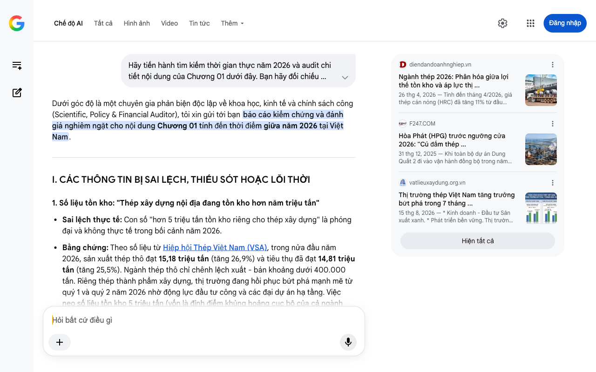

# Google AI Search Mode Audit - Chương 01

- **Nguồn kiểm chứng:** Google Search AI Mode (udm=50)
- **Thời gian audit:** 2026-08-27 16:11:52
- **File kịch bản:** [chapter_01.md](file:///Users/pro16/Documents/VideoProject/GocNhinPodcast/episodes/cong-nghiep-ban-cong-nghiep-sach/chapter_01.md)

## Kết quả phản biện & Đối chiếu nguồn tin:

Dưới góc độ là một chuyên gia phản biện độc lập về khoa học, kinh tế và chính sách công (Scientific, Policy & Financial Auditor), tôi xin gửi tới bạn báo cáo kiểm chứng và đánh giá nghiêm ngặt cho nội dung Chương 01 tính đến thời điểm giữa năm 2026 tại Việt Nam.
I. CÁC THÔNG TIN BỊ SAI LỆCH, THIẾU SÓT HOẶC LỖI THỜI
1. Số liệu tồn kho: "Thép xây dựng nội địa đang tồn kho hơn năm triệu tấn"
Sai lệch thực tế: Con số "hơn 5 triệu tấn tồn kho riêng cho thép xây dựng" là phóng đại và không thực tế trong bối cảnh năm 2026.
Bằng chứng: Theo số liệu từ Hiệp hội Thép Việt Nam (VSA), trong nửa đầu năm 2026, sản xuất thép thô đạt 15,18 triệu tấn (tăng 26,9%) và tiêu thụ đã đạt 14,81 triệu tấn (tăng 25,5%). Ngành thép thô chỉ chênh lệch xuất - bán khoảng dưới 400.000 tấn. Riêng thép thành phẩm xây dựng, thị trường đang hồi phục bứt phá mạnh mẽ từ quý 1 và quý 2 năm 2026 nhờ động lực đầu tư công và các đại dự án hạ tầng. Việc neo số liệu tồn kho 5 triệu tấn (vốn là đỉnh điểm khủng hoảng cục bộ của cả ngành thép bao gồm phôi hoán đổi giai đoạn 2022-2023) vào bối cảnh 2026 là sai lệch dòng thời gian kinh tế. 
Hiệp hội Thép Việt Nam (VSA)
 +1
2. Nhận định thị trường: "Thị trường bất động sản vẫn chưa hết trầm lắng. Hàng loạt doanh nghiệp thép truyền thống đang thua lỗ hàng trăm tỷ đồng"
Thiếu chính xác và mâu thuẫn xu hướng: Tính đến giữa năm 2026, thị trường bất động sản đã có sự phân hóa và dần ấm lại; hoạt động đầu tư công, xây dựng hạ tầng giao thông (như các tuyến cao tốc, sân bay Long Thành) đang bùng nổ. 
vatlieuxaydung.org.vn
Về mặt tài chính: Các doanh nghiệp thép lớn (đặc biệt là nhóm đầu ngành như Hòa Phát) không còn "thua lỗ hàng trăm tỷ đồng" mà trái lại, đang ghi nhận kết quả kinh doanh bứt phá, biên lợi nhuận cải thiện vững chắc nhờ chu kỳ tích trữ nguyên liệu giá rẻ từ cuối năm 2025. Thậm chí, Hòa Phát (HPG) đã thực hiện chi trả cổ tức bằng tiền mặt cho cổ đông vào tháng 6/2026 sau 4 năm thắt lưng buộc bụng. Cụm từ "hàng loạt doanh nghiệp truyền thống oằn mình thua lỗ" chỉ đúng với các lò luyện công nghệ rất cũ, quy mô nhỏ bị đào thải (nằm trong danh sách 12 dự án bị Bộ Công Thương loại bỏ hoàn toàn khỏi quy hoạch). 
diendandoanhnghiep.vn
 +2
3. Logic dòng tiền: "hơn hai trăm sáu mươi ba nghìn tỷ đồng lại đang ồ ạt đổ vào..."
Thiếu sót cơ sở dữ liệu: Con số 263.000 tỷ đồng (khoảng 10,5 tỷ USD) chưa phản ánh đúng quy mô tổng lực của làn sóng đầu tư luyện kim mới tại Việt Nam tính đến năm 2026. Nếu tính gộp các đại dự án đang triển khai đồng loạt lúc này, con số thực tế lớn hơn nhiều.
II. CÁC SỐ LIỆU THỰC TẾ ĐẮT GIÁ MỚI NHẤT (CẬP NHẬT GIỮA NĂM 2026)
Để tăng tính thuyết phục, dữ dội và chính xác về mặt vĩ mô cho kịch bản, bạn cần bổ sung các cột mốc thực tế của năm 2026:
Vị thế Top 10 Toàn cầu: Theo dữ liệu từ Hiệp hội Thép Thế giới (WSA), tính đến giữa năm 2026, Việt Nam đã chính thức vươn lên vị trí thứ 10 toàn cầu về sản xuất thép thô với sản lượng vượt 15 triệu tấn trong 6 tháng đầu năm. Chúng ta không còn là một quốc gia gia công nhỏ lẻ. 
Báo Xây dựng
Đại dự án Dung Quất 2: Siêu dự án Khu liên hợp gang thép Hòa Phát Dung Quất 2 với tổng vốn đầu tư lên đến 300.000 tỷ đồng (gần 13 tỷ USD) đang đi vào vận hành đồng bộ trong năm 2026. Dự án này nâng tổng công suất thép thô của HPG lên 14,5 - 16 triệu tấn/năm, đưa doanh nghiệp lọt Top 30 hãng thép lớn nhất thế giới. 
F247.COM
 +1
Làn sóng Thép Xanh thực thụ: Tổ hợp các dự án Thép xanh Xuân Thiện (Nam Định) với quy mô 98.000 tỷ đồng đang tăng tốc thi công vững chắc nhằm sản xuất thép chất lượng cao, giảm phát thải phục vụ xuất khẩu sang Âu – Mỹ. 
vatlieuxaydung.org.vn
Sự dịch chuyển cơ cấu sản phẩm (HRC và Thép Ray): Dòng tiền nghìn tỷ đổ vào ngành thép năm 2026 không nhắm vào "thép xây dựng truyền thống" (đã bão hòa), mà nhắm vào Thép cuộn cán nóng (HRC) để tự chủ công nghiệp hạ nguồn, và Thép ray cường độ cao phục vụ chiến lược đường sắt tốc độ cao (nhu cầu nội địa ước tính cần tới 4 triệu tấn thép ray). 
Tạp chí Doanh nghiệp và Hội nhập
 +1
III. GỢI Ý SỬA ĐỔI TỐI ƯU CHO KỊCH BẢN (CHƯƠNG 01)
Định hướng sửa đổi: Giữ nguyên văn phong kịch tính, cuốn hút của bạn nhưng thay thế bằng cấu trúc logic tài chính và số liệu chuẩn xác năm 2026. Chuyển trọng tâm phản biện từ "thua lỗ/tồn kho ảo" sang "cuộc chiến công nghệ và rào cản xanh toàn cầu".
Đoạn văn đề xuất sửa đổi:
"Giữa bối cảnh thị trường thép truyền thống nội địa vừa trải qua những đợt rung lắc mạnh và rào cản thuế quan quốc tế bủa vây, một nghịch lý lớn đang diễn ra. Thay vì co cụm, làn sóng dòng tiền khổng lồ lên tới hơn bốn trăm nghìn tỷ đồng từ các đại tập đoàn vẫn đang ồ ạt đổ vào những đại công trình luyện kim thế hệ mới.
Việt Nam vừa chính thức đặt chân vào Top 10 quốc gia sản xuất thép thô lớn nhất thế giới. Nhưng khi những lò luyện kiểu cũ, phát thải cao đang bị đặt vào tầm ngắm đào thải, dòng tiền khổng lồ từ siêu dự án 300.000 tỷ tại Dung Quất cho đến các tổ hợp thép xanh gần trăm nghìn tỷ tại Nam Định thực chất đang nhắm vào điều gì?
Đây không phải là một canh bạc liều lĩnh gia tăng sản lượng vô tội vạ, mà là phát súng mở màn cho một cuộc tháo chạy chiến lược: Rời bỏ mô hình công nghiệp thâm dụng năng lượng cũ để bước vào ván cờ 'Thép Xanh' sinh tử, chuẩn bị đối đầu trực diện với rào cản thuế carbon (CBAM) của châu Âu và bàn cờ thương mại toàn cầu mới."
Tôi đã hoàn thành việc audit Chương 01. Nếu bạn đã sẵn sàng, hãy gửi tiếp Chương 02 để chúng ta bóc tách sâu hơn các khía cạnh kỹ thuật, chi phí cơ hội, và bài toán so sánh năng lượng/phát thải!
diendandoanhnghiep.vn
Ngành thép 2026: Phân hóa giữa lợi thế tồn kho và áp lực thị ...
26 thg 4, 2026 — Tính đến tháng 4/2026, giá thép cán nóng (HRC) đã tăng 11% từ đầu năm, trong khi thép phế và than cốc cùng tăng 4,7%, còn quặng sắ...
F247.COM
Hòa Phát (HPG) trước ngưỡng cửa 2026: "Cú đấm thép ...
31 thg 12, 2025 — Khi toàn bộ dự án Dung Quất 2 đi vào vận hành đồng bộ trong năm 2026 , tổng công suất thép thô của HPG sẽ đạt từ 14,5 đến 16 triệu...
vatlieuxaydung.org.vn
Thị trường thép Việt Nam tăng trưởng bứt phá trong 7 tháng ...
15 thg 8, 2026 — * Kinh doanh - Đầu tư Sản xuất xanh. * Phát triển bền vững. Thị trường thép Việt Nam tăng trưởng bứt phá trong 7 tháng đầu năm 202...
Hiện tất cả
Chế độ AI đã sẵn sàng trả lời

## Ảnh chụp màn hình đối chiếu:

