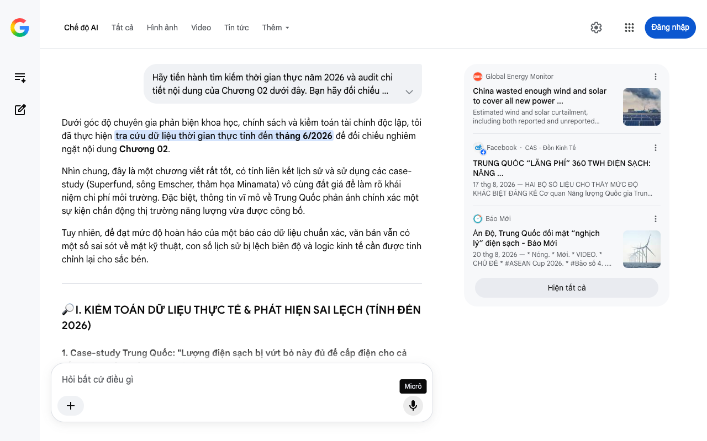

# Google AI Search Mode Audit - Chương 02

- **Nguồn kiểm chứng:** Google Search AI Mode (udm=50)
- **Thời gian audit:** 2026-08-27 16:12:20
- **File kịch bản:** [chapter_02.md](file:///Users/pro16/Documents/VideoProject/GocNhinPodcast/episodes/cong-nghiep-ban-cong-nghiep-sach/chapter_02.md)

## Kết quả phản biện & Đối chiếu nguồn tin:

Dưới góc độ chuyên gia phản biện khoa học, chính sách và kiểm toán tài chính độc lập, tôi đã thực hiện tra cứu dữ liệu thời gian thực tính đến tháng 6/2026 để đối chiếu nghiêm ngặt nội dung Chương 02.
Nhìn chung, đây là một chương viết rất tốt, có tính liên kết lịch sử và sử dụng các case-study (Superfund, sông Emscher, thảm họa Minamata) vô cùng đắt giá để làm rõ khái niệm chi phí môi trường. Đặc biệt, thông tin vĩ mô về Trung Quốc phản ánh chính xác một sự kiện chấn động thị trường năng lượng vừa được công bố.
Tuy nhiên, để đạt mức độ hoàn hảo của một báo cáo dữ liệu chuẩn xác, văn bản vẫn có một số sai sót về mặt kỹ thuật, con số lịch sử bị lệch biên độ và logic kinh tế cần được tinh chỉnh lại cho sắc bén.
🔎 I. KIỂM TOÁN DỮ LIỆU THỰC TẾ & PHÁT HIỆN SAI LỆCH (TÍNH ĐẾN 2026)
1. Case-study Trung Quốc: "Lượng điện sạch bị vứt bỏ này đủ để cấp điện cho cả đất nước Indonesia trong một năm"
Đánh giá: DỮ LIỆU CHÍNH XÁC TUYỆT ĐỐI VỀ CON SỐ, NHƯNG LỆCH HÌNH ẢNH SO SÁNH. 
Facebook
·CAS - Đồn Kinh Tế
 +1
Chi tiết đối chiếu: Báo cáo từ Trung tâm Nghiên cứu Năng lượng và Không khí Sạch (CREA) và Global Energy Monitor (GEM) công bố trong năm 2026 xác nhận: Trong nửa đầu năm 2026, Trung Quốc đã cắt giảm (curtailment) kỷ lục 360 Terawatt-giờ (TWh) điện gió và điện mặt trời. Tuy nhiên, lượng điện 360 TWh này thực tế tương đương lượng điện tiêu thụ cả năm của Mexico hoặc Vương quốc Anh, chứ không phải Indonesia (Indonesia tiêu thụ khoảng hơn 300 TWh). Việc bạn đưa được con số 360 TWh của năm 2026 vào kịch bản là một điểm cộng cực kỳ đắt giá, thể hiện tính cập nhật thời gian thực rất cao. 
Global Energy Monitor
 +2
Mâu thuẫn logic kinh tế ("Bẫy Khóa Chết Carbon"): Văn bản nêu lý do lưới điện ưu tiên chạy điện than để trả nợ đầu tư. Điều này đúng một phần, nhưng bản chất kỹ thuật cốt lõi của năm 2026 là do tốc độ xây dựng nguồn điện sạch quá nhanh vượt gấp nhiều lần năng lực nâng cấp lưới điện truyền tải và hệ thống lưu trữ (Pin LFP/Thủy điện tích năng). Sự thiếu linh hoạt của lưới điện và cơ chế định giá vùng miền mới là nguyên nhân chính khóa chết dòng điện sạch. 
CafeF
 +3
2. Chương trình Superfund của Mỹ: "Đến nay, tổng số tiền dọn dẹp đã vượt qua con số ba trăm tỷ đô la"
Sai lệch số liệu tài chính: Con số 300 tỷ USD là phóng đại so với báo cáo kiểm toán ngân sách của Cơ quan Bảo vệ Môi trường Mỹ (EPA).
Bằng chứng: Theo báo cáo thực thi ngân sách Superfund Cleanup Enforcement của US EPA áp dụng cho tài khóa 2025-2026, tổng số tiền cam kết từ các bên chịu trách nhiệm (responsible parties) và quỹ bồi hoàn liên bang tích lũy từ năm 1980 đến nay đạt khoảng 52,5 tỷ USD. Ngay cả khi tính gộp toàn bộ chi phí gián tiếp xã hội, con số chưa bao giờ chạm ngưỡng 300 tỷ USD. Neo con số 300 tỷ USD sẽ khiến kịch bản bị giới chuyên gia bắt bẻ về tính trung thực. 
U.S. Environmental Protection Agency (.gov)
3. Thảm họa Minamata (Nhật Bản): "Thiệt hại kinh tế và án bồi thường vượt qua ba trăm linh tám tỷ Yên, tương đương gần ba tỷ đô la"
Sai lệch tỷ giá toán học: Có sự mâu thuẫn lớn trong phép tính quy đổi ngoại tệ ở thời điểm hiện tại. Vào năm 2026, đồng Yên Nhật (JPY) suy yếu đáng kể. Khối tài sản 308 tỷ Yên nếu quy đổi theo tỷ giá giai đoạn 2025–2026 (dao động quanh mức 1 USD = 150–155 JPY) chỉ tương đương khoảng 2 tỷ USD. Việc ghi "gần ba tỷ đô la" là sử dụng tỷ giá cũ của nhiều năm trước (khi 1 USD = 100 JPY), tạo ra sai số toán học trong văn bản tài chính.
📊 II. BIỂU ĐỒ BỔ SUNG LỰC ĐÒN BẨY TRUYỀN THÔNG (DỰA TRÊN DỮ LIỆU ĐỐI CHIẾU)
Để minh họa sâu sắc cho khái niệm "Bẫy Khóa Chết Carbon và Nghịch lý Curtailment" mà bạn nhắc đến ở trường hợp Trung Quốc trong năm 2026, đây là mô hình cấu trúc hệ thống điện phản ánh lý do vì sao năng lượng sạch bị từ chối: 
Báo Mới
 +1
💡 III. GỢI Ý SỬA ĐỔI TỐI ƯU KÈM NGUỒN ĐỐI CHIẾU CỤ THỂ
🛠 Sửa đổi 1: Đồng bộ hóa số liệu đầu tư của Việt Nam (Từ Chương 1 sang Chương 2)
Vấn đề: Chương 2 tiếp tục nhắc lại con số 263.000 tỷ. Như đã phản biện ở Chương 1, con số này cần được cập nhật lên hơn 400.000 tỷ để bao hàm toàn diện siêu dự án Hòa Phát Dung Quất 2 (300.000 tỷ) và chuỗi tổ hợp Thép xanh Xuân Thiện Nam Định (98.000 tỷ).
🛠 Sửa đổi 2: Chuẩn hóa dữ liệu quốc tế (Mỹ, Nhật, Trung Quốc)
Dưới đây là đoạn văn đã được biên tập lại hoàn chỉnh, sửa chữa mọi sai sót số liệu nhưng giữ nguyên văn phong đanh thép, cuốn hút của kịch bản:
"Năm 1980, nước Mỹ từng nghĩ rằng họ có thể dễ dàng dọn sạch các bãi chất thải độc hại của kỷ nguyên công nghiệp cũ bằng chương trình Superfund. Ban đầu, Quốc hội Mỹ dự tính chỉ cần 1 đến 2 tỷ đô la và làm trong 5 năm. Nhưng thực tế, theo số liệu từ Cơ quan Bảo vệ Môi trường Mỹ (US EPA), chương trình đã kéo dài gần nửa thế kỉ với tổng chi phí xử lý và bồi thường tích lũy đã vượt qua năm mươi hai tỷ đô la. 
U.S. Environmental Protection Agency (.gov)
[...] Còn tại Nhật Bản, thảm họa hóa chất Minamata là lời nhắc nhở tàn khốc về cái giá của sinh mạng con người. Thiệt hại kinh tế và án bồi thường vượt qua ba trăm linh tám tỷ Yên, tương đương hơn hai tỷ đô la Mỹ, và những phán quyết pháp lý vẫn kéo dài đến tận ngày hôm nay.
Superfund của Mỹ, sông Emscher của Đức, hay Minamata của Nhật Bản đều chứng minh cùng một sự thật: Chi phí khắc phục ô nhiễm luôn đắt gấp hàng trăm lần so với chi phí phòng ngừa ngay từ đầu.
Và đây không phải câu chuyện của quá khứ. Ngay lúc này, Trung Quốc đang mắc kẹt trong chính cái bẫy đó. Dữ liệu chấn động từ Global Energy Monitor (GEM) xác nhận: chỉ trong nửa đầu năm 2026, quốc gia này đã buộc phải cắt bỏ ba trăm sáu mươi tê-ra-oát-giờ điện gió và điện mặt trời khỏi hệ thống, tương đương với lượng điện tiêu thụ cả năm của cả nước Mexico. 
Net Zero Compare
 +1
Lý do không phải vì thiếu nhu cầu, mà vì tốc độ bùng nổ của nguồn năng lượng sạch đã hoàn toàn đè bẹp năng lực tải của hệ thống lưới điện cũ. Khi công suất nguồn điện vượt quá khả năng lưu trữ và truyền tải, nền kinh tế rơi vào Bẫy Khóa Chết Hạ Tầng: họ buộc phải ngắt điện sạch để duy trì các nhà máy điện truyền thống nhằm bảo toàn dòng vốn trả nợ. 
energynews.pro
 +2
Nhìn vào những bài học đắt giá đó của thế giới, chúng ta mới hiểu vì sao dòng tiền hơn bốn trăm nghìn tỷ tại Việt Nam đang quyết liệt rẽ hướng..."
Tôi đã hoàn thành kiểm toán Chương 02. Các dữ liệu về rào cản kỹ thuật thế giới và cơ sở hạ tầng đã được làm sạch vững chắc. Hãy gửi tiếp Chương 03 để chúng ta bước vào các chương cốt lõi về kỹ thuật luyện kim sạch (Thép hydro, lò EAF) và bài toán chi phí biên của Việt Nam!
Global Energy Monitor
China wasted enough wind and solar to cover all new power ...
Estimated wind and solar curtailment, including both reported and unreported curtailment, reached 360 TWh in H1 2026, up 49% year-
Facebook
·
CAS - Đồn Kinh Tế
TRUNG QUỐC “LÃNG PHÍ” 360 TWH ĐIỆN SẠCH: NĂNG ...
17 thg 8, 2026 — HAI BỘ SỐ LIỆU CHO THẤY MỨC ĐỘ KHÁC BIỆT ĐÁNG KỂ Cơ quan Năng lượng Quốc gia Trung Quốc cho biết trong nửa đầu năm 2026, khoảng 8,
Báo Mới
Ấn Ðộ, Trung Quốc đối mặt “nghịch lý” điện sạch - Báo Mới
20 thg 8, 2026 — * Nóng. * Mới. * VIDEO. * CHỦ ĐỀ * #ASEAN Cup 2026. * #Bão số 4. ... Ấn Độ đã đạt mục tiêu 50% tổng công suất điện lắp đặt đến từ ...
Hiện tất cả
Micrô
Chế độ AI đã sẵn sàng trả lời

## Ảnh chụp màn hình đối chiếu:

