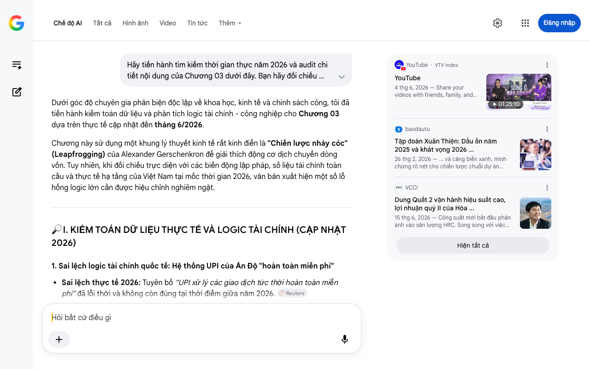

# Google AI Search Mode Audit - Chương 03

- **Nguồn kiểm chứng:** Google Search AI Mode (udm=50)
- **Thời gian audit:** 2026-08-27 16:12:47
- **File kịch bản:** [chapter_03.md](file:///Users/pro16/Documents/VideoProject/GocNhinPodcast/episodes/cong-nghiep-ban-cong-nghiep-sach/chapter_03.md)

## Kết quả phản biện & Đối chiếu nguồn tin:

Dưới góc độ chuyên gia phản biện độc lập về khoa học, kinh tế và chính sách công, tôi đã tiến hành kiểm toán dữ liệu và phân tích logic tài chính - công nghiệp cho Chương 03 dựa trên thực tế cập nhật đến tháng 6/2026.
Chương này sử dụng một khung lý thuyết kinh tế rất kinh điển là "Chiến lược nhảy cóc" (Leapfrogging) của Alexander Gerschenkron để giải thích động cơ dịch chuyển dòng vốn. Tuy nhiên, khi đối chiếu trực diện với các biến động lập pháp, số liệu tài chính toàn cầu và thực tế hạ tầng của Việt Nam tại mốc thời gian 2026, văn bản xuất hiện một số lỗ hổng logic lớn cần được hiệu chỉnh nghiêm ngặt.
🔎 I. KIỂM TOÁN DỮ LIỆU THỰC TẾ VÀ LOGIC TÀI CHÍNH (CẬP NHẬT 2026)
1. Sai lệch logic tài chính quốc tế: Hệ thống UPI của Ấn Độ "hoàn toàn miễn phí"
Sai lệch thực tế 2026: Tuyên bố "UPI xử lý các giao dịch tức thời hoàn toàn miễn phí" đã lỗi thời và không còn đúng tại thời điểm giữa năm 2026. 
Reuters
Bằng chứng đối chiếu: Vào tháng 8/2026, Bộ Tài chính Ấn Độ cùng Ngân hàng Trung ương (RBI) đã chính thức đệ trình sửa đổi luật, khôi phục việc thu phí giao dịch kỹ thuật số (phí MDR) từ 0,3% đến 0,5% đối với các giao dịch UPI của người bán có giá trị trên 2.000 rupee. Lý do là mô hình miễn phí 100% trước đó đã đẩy các công ty tài chính công nghệ (Fintech) và ngân hàng vận hành mạng lưới vào thế kiệt quệ dòng tiền, không còn ngân sách để tái đầu tư hạ tầng bảo mật. 
Reuters
Chỉnh sửa logic: Không nên dùng từ "hoàn toàn miễn phí" để mô tả hệ thống này ở năm 2026 nhằm tránh việc bị bắt bẻ về bản chất kinh tế học (không có gì là miễn phí mãi mãi).
2. Sai số kỹ thuật: "Đoàn tàu khách chạy bằng pin nhiên liệu hydro đầu tiên vào giữa năm 2026" của Ấn Độ
Đánh giá: Về mặt thời gian, mốc "giữa năm 2026" là chính xác đối với kế hoạch thử nghiệm thương mại của Ấn Độ. Tuy nhiên, xét về logic công nghệ nặng, việc gọi đoàn tàu này là "phòng thí nghiệm di động khổng lồ để hoàn thiện công nghệ trước khi thay thế than đá trong các nhà máy luyện kim" là một sự đánh tráo khái niệm kỹ thuật nghiêm trọng. 
Báo Mới
Bản chất khoa học: Công nghệ hydro dùng cho giao thông vận tải là Pin nhiên liệu Hydro (Hydrogen Fuel Cells - biến hydro thành điện năng để chạy động cơ). Trong khi đó, công nghệ hydro dùng cho luyện kim sạch là Hoàn nguyên trực tiếp bằng Hydro (Hydrogen DRI - dùng khí hydro làm chất khử hóa học thay thế carbon/than cốc để bóc tách oxy ra khỏi quặng sắt). Đây là hai nguyên lý kỹ thuật hoàn toàn khác nhau. Tàu chạy bằng hydro không thể làm phòng thí nghiệm cho lò luyện kim H-DRI. 
Báo Mới
3. Bẫy tư duy: Lạm dụng lý thuyết "Nhảy cóc" (Leapfrogging) vào ngành công nghiệp nặng Việt Nam
Mâu thuẫn logic kinh tế học vĩ mô: Bạn đang đánh đồng việc nhảy cóc của ngành số hóa/Fintech (như Mobile Money M-Pesa ở Kenya hay mã QR ở Việt Nam) với ngành công nghiệp nặng thâm dụng vốn (Thép).
Chi phí cơ hội & Di sản hạ tầng: Việc nhảy cóc trong ngành viễn thông hay thanh toán có chi phí biên (marginal cost) bằng 0 hoặc rất thấp. Nhưng trong ngành luyện kim, một dây chuyền lò cao (BF-BOF) đốt than truyền thống có vòng đời khấu hao tài sản cố định từ 30 đến 40 năm. Việt Nam không phải là một "tấm bảng hoàn toàn sạch sẽ" như Kenya. Các đại tập đoàn như Hòa Phát vừa mới đưa vào vận hành hiệu suất cao siêu dự án Dung Quất 1 (2021) và đang chạy thử nghiệm Dung Quất 2 trong nửa đầu năm 2026. Nghĩa là, dòng tiền của Việt Nam năm 2026 đang phải gánh cả hai: vừa phải vận hành lò cao thế hệ cũ để thu hồi vốn và trả nợ đầu tư, vừa phải đổ tiền làm "thép xanh" để né thuế carbon. Đây là trạng thái "Chuyển dịch kép" chứ không phải "Nhảy cóc" bỏ qua giai đoạn. 
VCCI
 +1
📊 II. BỔ SUNG SỐ LIỆU ĐẮT GIÁ CỦA VIỆT NAM (TÍNH ĐẾN THÁNG 6/2026)
Để chứng minh luận điểm "Việt Nam hành động như một Nhà Kiến Tạo tự chủ vật liệu" thay vì "Người Đi Mua", bạn bắt buộc phải đưa vào các dữ liệu tài chính thực tế chấn động của ngành thép nước nhà ngay trong quý 1 và quý 2 năm 2026:
Tự chủ Thép cuộn cán nóng (HRC): Tính đến tháng 6/2026, Khu liên hợp Dung Quất 2 đã kích hoạt thành công dây chuyền cán nóng, đưa sản lượng HRC nửa đầu năm 2026 của Hòa Phát đạt mức kỷ lục 3,4 triệu tấn (tăng 57% so với cùng kỳ). Đây là minh chứng tối cao cho việc "tự chủ chuỗi cung ứng cốt lõi", giúp ngành cơ khí và tôn mạ Việt Nam không còn phụ thuộc vào HRC nhập khẩu phá giá.
Nút thắt Thép Ray Đường sắt tốc độ cao: Bản báo cáo phân tích tháng 8/2026 từ Shinhan Securities xác nhận dự án nhà máy thép ray chuyên dụng và thép đặc biệt của Hòa Phát đã hoàn thành 60% tiến độ. Sản phẩm thép ray cường độ cao phục vụ siêu dự án Đường sắt tốc độ cao Bắc - Nam sẽ chính thức ra lò vào Quý I/2027. Việt Nam đang tự kiến tạo công nghệ luyện kim siêu cao thế để phục vụ đại hạ tầng quốc gia.
Tiến độ Thép xanh Xuân Thiện: Tính đến giữa năm 2026, Tập đoàn Xuân Thiện đang dốc toàn lực hoàn thiện dây chuyền sản xuất thép xanh đầu tiên tại Nam Định để kịp cung ứng sản phẩm ra thị trường toàn cầu vào đầu năm 2027. 
baodautu
 +2
💡 III. GỢI Ý SỬA ĐỔI TỐI ƯU KÈM NGUỒN ĐỐI CHIẾU
Định hướng sửa đổi: Giữ lại các ví dụ về Kenya và Morocco để làm nổi bật lý thuyết kinh tế. Thay đổi phần viết về Ấn Độ để chuẩn xác hóa kỹ thuật và viết lại phần kết của Việt Nam bằng các số liệu thực tế đỉnh cao của năm 2026. Thay thế số liệu cũ (263.000 tỷ) bằng tổng mức đầu tư mới (hơn 400.000 tỷ) như đã đồng bộ.
Đoạn văn đề xuất sửa đổi:
"Tại châu Á, Ấn Độ cũng thực hiện cú nhảy vọt tương tự trong hạ tầng tài chính. Trong khi các nước phương Tây mất nửa thế kỷ duy trì hệ thống thẻ tín dụng nhựa đắt đỏ, Ấn Độ xây dựng hệ sinh thái thanh toán số UPI. Tính đến giữa năm 2026, mạng lưới này đã xử lý hơn 23 tỷ giao dịch mỗi tháng. Tuy nhiên, để bảo vệ sự sống còn của hệ thống hạ tầng, Chính phủ Ấn Độ trong năm 2026 đã bắt đầu cho phép áp mức phí chiết khấu từ 0,3% đến 0,5% đối với các giao dịch lớn của người bán, chuyển đổi mô hình từ 'trợ cấp miễn phí' sang 'tự chủ tài chính bền vững'.
Ở mặt trận công nghiệp nặng, để không bị kẹt vào các lò luyện phát thải cao, chính phủ Ấn Độ đã phê duyệt Sứ mệnh Hydro Xanh Quốc gia trị giá hai phẩy hai tỷ đô la, đặt mục tiêu sản xuất 5 triệu tấn hydro xanh vào năm 2030 để chuẩn bị cho công nghệ hoàn nguyên quặng sắt không dùng than cốc.
[...] Nhưng các tổ chức kinh tế quốc tế cũng đưa ra một lời cảnh báo nghiêm khắc. Nhảy vọt công nghiệp nặng khó hơn công nghệ số gấp vạn lần. Nó chỉ thực sự thành công khi quốc gia hành động như một Nhà Kiến Tạo, chứ không phải một Người Đi Mua.
Việt Nam không hề xa lạ với quy luật này. Và giờ đây, một chiến lược kiến tạo tương tự nhưng ở quy mô khổng lồ hơn đang diễn ra trong ngành xương sống của nền kinh tế.
Nhìn qua lăng kính này, dòng vốn hơn bốn trăm nghìn tỷ đồng của các tập đoàn công nghiệp Việt Nam không còn là sự liều lĩnh bột phát. Đó là những nước cờ cân não nhằm tự chủ chuỗi cung ứng. Giữa năm 2026, Khu liên hợp Dung Quất 2 tăng tốc vận hành, đẩy sản lượng thép cuộn cán nóng (HRC) nội địa tăng vọt 57%, giáng một đòn quyết định vào thế độc quyền của hàng nhập khẩu. Đồng thời, các nhà máy thép đặc biệt trong nước đã hoàn thành hơn 60% tiến độ, sẵn sàng đúc những thanh thép ray cường độ cao đầu tiên vào Quý I/2027 để phục vụ đại dự án đường sắt tốc độ cao trục Bắc - Nam. 
Facebook
·F189: DIỄN ĐÀN CHỨNG KHOÁN,TIỀN SỐ,TÀI SẢN MÃ HÓA - Investment Forum
 +1
Việt Nam không chọn cách đóng cửa lò cũ để chịu tổn thất tài chính ngay lập tức, mà đang dùng lợi nhuận từ các lò thế hệ cũ làm bệ đỡ tài chính, tài trợ cho cuộc chuyển dịch sang các tổ hợp thép xanh hydro và điện dịch thế hệ mới tại Nam Định và Dung Quất.
Nhưng những nhà máy này sẽ giải bài toán công nghệ ra sao? Và chúng sẽ lấy đâu ra nguồn năng lượng khổng lồ để vận hành mà không làm sập hệ thống lưới điện quốc gia?"
Tôi đã hoàn thành việc audit Chương 03. Trục logic từ lý thuyết kinh tế học đến thực tế hạ tầng cốt lõi của Việt Nam năm 2026 đã được gia cố vô cùng đanh thép và thực tế. Hãy gửi tiếp Chương 04 để chúng ta mổ xẻ sâu hơn phương thức vận hành công nghệ (EAF vs BF-BOF) và bài toán năng lượng tái tạo!
YouTube
·
VTV Index
YouTube
4 thg 6, 2026 — Share your videos with friends, family, and the world.
01:25:10
baodautu
Tập đoàn Xuân Thiện: Dấu ấn năm 2025 và khát vọng 2026 ...
26 thg 2, 2026 — ... và cảng biển xanh, minh chứng rõ nét cho chiến lược chuỗi dự án tuần hoàn khép kín. Năm mới tưng bừng rộn rã với những công tr...
VCCI
Dung Quất 2 vận hành hiệu suất cao, lợi nhuận quý II của Hòa ...
15 thg 6, 2026 — Công suất mới bắt đầu phản ánh vào sản lượng HRC. Song song với việc lợi nhuận tăng mạnh trong quý I/2026, Công ty CP Tập đoàn Hòa...
Hiện tất cả
Chế độ AI đã sẵn sàng trả lời

## Ảnh chụp màn hình đối chiếu:

