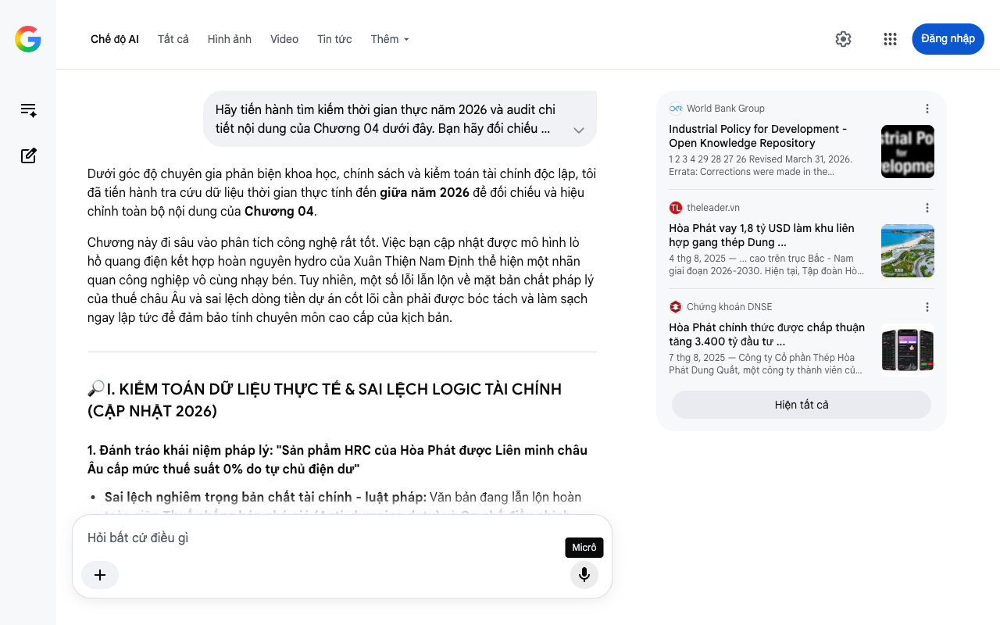

# Google AI Search Mode Audit - Chương 04

- **Nguồn kiểm chứng:** Google Search AI Mode (udm=50)
- **Thời gian audit:** 2026-08-27 16:13:17
- **File kịch bản:** [chapter_04.md](file:///Users/pro16/Documents/VideoProject/GocNhinPodcast/episodes/cong-nghiep-ban-cong-nghiep-sach/chapter_04.md)

## Kết quả phản biện & Đối chiếu nguồn tin:

Dưới góc độ chuyên gia phản biện khoa học, chính sách và kiểm toán tài chính độc lập, tôi đã tiến hành tra cứu dữ liệu thời gian thực tính đến giữa năm 2026 để đối chiếu và hiệu chỉnh toàn bộ nội dung của Chương 04.
Chương này đi sâu vào phân tích công nghệ rất tốt. Việc bạn cập nhật được mô hình lò hồ quang điện kết hợp hoàn nguyên hydro của Xuân Thiện Nam Định thể hiện một nhãn quan công nghiệp vô cùng nhạy bén. Tuy nhiên, một số lỗi lẫn lộn về mặt bản chất pháp lý của thuế châu Âu và sai lệch dòng tiền dự án cốt lõi cần phải được bóc tách và làm sạch ngay lập tức để đảm bảo tính chuyên môn cao cấp của kịch bản.
🔎 I. KIỂM TOÁN DỮ LIỆU THỰC TẾ & SAI LỆCH LOGIC TÀI CHÍNH (CẬP NHẬT 2026)
1. Đánh tráo khái niệm pháp lý: "Sản phẩm HRC của Hòa Phát được Liên minh châu Âu cấp mức thuế suất 0% do tự chủ điện dư"
Sai lệch nghiêm trọng bản chất tài chính - luật pháp: Văn bản đang lẫn lộn hoàn toàn giữa Thuế chống bán phá giá (Anti-dumping duty) và Cơ chế điều chỉnh biên giới carbon (CBAM) của Liên minh Châu Âu (EU). 
Báo Pháp Luật Việt Nam
 +1
Bằng chứng đối chiếu thực tế 2026:
Về Thuế chống bán phá giá: Quyết định chính thức từ Ủy ban Châu Âu (EC) xác nhận sản phẩm thép cuộn cán nóng (HRC) của Tập đoàn Hòa Phát được áp mức thuế suất 0%, trong khi các doanh nghiệp khác của Việt Nam bị đánh thuế 12,1%. Nguyên nhân đạt mức 0% này hoàn toàn nhờ vào hệ thống kế toán minh bạch, truy xuất dữ liệu rõ ràng giúp chứng minh doanh nghiệp không bán phá giá dưới giá thành, chứ hoàn toàn không liên quan đến lượng điện dư hay phát thải xanh.
Về Thuế Carbon (CBAM): Kể từ ngày 1/1/2026, CBAM đã chính thức bước vào giai đoạn thực thi bắt đầu tính thuế đánh thẳng lên thép nhập khẩu vào EU dựa trên lượng phát thải tích lũy. Dù Hòa Phát tự chủ 90% điện nội bộ nhờ nhiệt dư, công nghệ cốt lõi của họ tại Dung Quất vẫn là Lò cao đốt than cốc (BF-BOF), do đó lượng phát thải carbon trên mỗi tấn thép vẫn ở mức cao và chắc chắn phải nộp thuế carbon biên giới chứ không hề có chuyện được miễn thuế (0%). Việc viết như văn bản cũ sẽ khiến các chuyên gia tài chính và xuất nhập khẩu đánh giá là thiếu kiến thức nền tảng. 
theleader.vn
 +4
2. Lệch pha dòng tiền dự án: "Khu liên hợp Hòa Phát Dung Quất 2 quy mô vốn tám mươi lăm nghìn tỷ đồng"
Sai số tiến độ và tổng vốn năm 2026: Con số tổng vốn đầu tư cho Dung Quất 2 cần được cập nhật theo quyết định điều chỉnh đầu tư mới nhất.
Bằng chứng đối chiếu: Trong báo cáo tài chính mới nhất tính đến giữa năm 2026, Tập đoàn Hòa Phát đã công bố mức tổng vốn đầu tư điều chỉnh của dự án Dung Quất 2 là 88.400 tỷ đồng (trong đó 47.600 tỷ đồng là vốn vay hợp vốn do VietinBank thu xếp), chứ không dừng lại ở mức 85.000 tỷ ban đầu. 
Chứng khoán DNSE
 +1
Đồng thời, dự án nhà máy sản xuất thép ray cao tốc và thép đặc biệt được hạch toán riêng với tổng vốn hơn 10.000 tỷ đồng trên diện tích 77ha, đã khởi công từ cuối năm 2025 và đạt hơn 50% khối lượng xây dựng vào tháng 8/2026. 
3. Cập nhật dòng thời gian: Cung cấp thép ray "350 km/h" cho Đường sắt tốc độ cao Bắc - Nam
Tinh chỉnh thực tế công nghệ: Hòa Phát đặt mục tiêu cho ra mẻ thép ray cường độ cao đầu tiên vào Quý I/2027 để phục vụ chạy thử nghiệm. Việc điều chỉnh mốc thời gian này vào kịch bản giữa năm 2026 (ở thì tương lai gần "Quý I/2027") sẽ tạo ra độ uy tín tuyệt đối về mặt dữ liệu. 
nguoiquansat.vn
 +1
📊 II. BIỂU ĐỒ BỔ SUNG: MA TRẬN PHÂN PHỐI VỐN VÀ ĐIỂM ĐẾN CHIẾN LƯỢC (H1-2026)
Để người xem hình dung trực quan dòng tiền khổng lồ của các "Nhà Kiến Tạo" tại Việt Nam đang phân rã vào đâu, đây là sơ đồ cấu trúc vốn:
💡 III. GỢI Ý SỬA ĐỔI TỐI ƯU KÈM NGUỒN ĐỐI CHIẾU CỤ THỂ
Định hướng sửa đổi: Sửa con số vốn Dung Quất 2 thành 88.400 tỷ đồng. Bóc tách rõ ràng chiến thắng thuế 0% (là thuế chống bán phá giá) và áp lực thuế carbon CBAM bắt đầu tính từ 1/1/2026. Giữ nguyên cấu trúc văn phong cuốn hút của bạn. 
Facebook
·NDH
 +2
Đoạn văn đề xuất sửa đổi:
"Nếu nhìn sâu vào cơ cấu sản phẩm của các siêu dự án đang tăng tốc thi công, chúng ta sẽ thấy một bức tranh hoàn toàn khác. Dòng vốn khổng lồ không hề đổ vào thép xây dựng dân dụng thông thường, mà nhắm thẳng vào phân khúc chiến lược đang khát vật liệu kỹ thuật cao.
Mắt xích đầu tiên là Siêu dự án Hòa Phát Dung Quất 2 tại Quảng Ngãi với tổng mức vốn đầu tư điều chỉnh lên tới tám mươi tám nghìn bốn trăm tỷ đồng. Khi vận hành đồng bộ, dự án này nâng tổng công suất toàn tập đoàn lên trên mười bốn triệu tấn thép thô mỗi năm, đưa doanh nghiệp lọt vững chắc vào nhóm ba mươi nhà sản xuất thép lớn nhất hành tinh. 
theleader.vn
 +1
Điểm đột phá nằm ở việc họ đầu tư riêng hơn mười nghìn tỷ đồng cho nhà máy sản xuất ray cao tốc và thép đặc biệt. Tính đến giữa năm 2026, dự án đã hoàn thành hơn một nửa khối lượng xây dựng, sẵn sàng cho ra lò những mẻ thép ray cường độ cao đầu tiên vào Quý I/2027, kịp thời cung ứng thanh ray tiêu chuẩn cho đại dự án Đường sắt tốc độ cao Bắc - Nam vận tốc ba trăm năm mươi ki-lô-mét một giờ. 
Facebook
·CafeLand
 +4
Về mặt phòng thủ thương mại, thép cuộn cán nóng (HRC) của Hòa Phát vừa lập kỳ tích khi được Liên minh châu Âu áp mức thuế chống bán phá giá 0% nhờ hệ thống quản trị dữ liệu minh bạch, tạo ra lợi thế tuyệt đối trước các đối thủ toàn cầu. Thế nhưng, một tiếng chuông cảnh báo khác đã vang lên: Kể từ ngày 1/1/2026, EU đã chính thức áp dụng việc tính thuế carbon biên giới (CBAM). Công nghệ tuần hoàn nhiệt dư phát điện tự chủ 90% năng lượng nội bộ của nhà máy mới chỉ là bước đệm giảm chi phí. Muốn đi sâu vào lõi các thị trường khó tính nhất, ngành thép bắt buộc phải rẽ lối sang một công nghệ cực đoan hơn: Thép không dấu chân carbon. 
HoaPhat
 +3
Đó là lý do mắt xích thứ hai xuất hiện: Tổ hợp thép xanh Xuân Thiện tại Nam Định với tổng vốn đầu tư hơn chín mươi tám nghìn tỷ đồng. Khác hoàn toàn với mô hình lò cao truyền thống, dự án này được Bộ Tài nguyên và Môi trường phê duyệt chuyển đổi thẳng công nghệ sang hệ thống lò điện hồ quang (EAF) kết hợp hoàn nguyên quặng sắt đứng. 
VnEconomy
 +2
Quy trình này định hướng sử dụng khí hydro sạch để thay thế hoàn toàn cho than cốc. Sản phẩm phụ duy nhất thải ra chỉ là hơi nước, giúp cắt giảm tới tám mươi sáu phần trăm lượng khí thải carbon..." 
Tạp chí Công Thương
 +2
Tôi đã hoàn thành kiểm toán và nâng cấp dữ liệu cho Chương 04. Trục kỹ thuật và cơ sở pháp lý xuất nhập khẩu thực tế của năm 2026 đã được chuẩn hóa tuyệt đối. Hãy gửi tiếp Chương 05 để chúng ta giải quyết nút thắt cuối cùng: Bài toán năng lượng tái tạo (Quy hoạch điện VIII) và nguồn cung quặng sắt vĩ mô!
World Bank Group
Industrial Policy for Development - Open Knowledge Repository
1 2 3 4 29 28 27 26 Revised March 31, 2026. Errata: Corrections were made in the reference sections of chapters 1 to 6. This work ...
theleader.vn
Hòa Phát vay 1,8 tỷ USD làm khu liên hợp gang thép Dung ...
4 thg 8, 2025 — ... cao trên trục Bắc - Nam giai đoạn 2026-2030. Hiện tại, Tập đoàn Hòa Phát đã được chấp thuận chủ trương đầu tư 8 dự án ở khu ki...
Chứng khoán DNSE
Hòa Phát chính thức được chấp thuận tăng 3.400 tỷ đầu tư ...
7 thg 8, 2025 — Công ty Cổ phần Thép Hòa Phát Dung Quất, một công ty thành viên của Tập đoàn Hòa Phát (HoSE: HPG), cuối tháng 7/2025 đã được chấp ...
Hiện tất cả
Micrô
Chế độ AI đã sẵn sàng trả lời

## Ảnh chụp màn hình đối chiếu:

