# 06_retention_map.md

episode_slug: cu-soc-cam-xe-xang-vf2-vf3

---

## ⚡ 1. ENGAGEMENT HIGHLIGHTS (CÁC ĐIỂM GIỮ CHÂN KHÁN GIẢ)

*   **0:00 - 1:30 (Hook - Cửa hẹp xe máy xăng):** Khai thác trực diện nỗi lo cấm xe xăng LEZ tại Hà Nội bắt đầu từ ngày một tháng bảy năm 2026 và đòn phản kích bằng VF 2 giá một trăm tám mươi tám triệu đồng.
*   **3:30 (Re-hook #1 - Sự lụi tàn xe xăng hạng A):** Chỉ ra đà lao dốc doanh số của xe xăng đô thị cỡ nhỏ (Morning, i10) từ mười một nghìn xe xuống còn sáu nghìn xe để chứng minh sự dịch chuyển không phải tạm thời.
*   **7:00 (Re-hook #2 - Liên minh hạ tầng V-Green):** Bật mí cách V-Green bắt tay cùng Thế Giới Di Động (5.000 Thợ Điện Máy Xanh) và MediaMart để gỡ bỏ nút thắt sạc pin ngõ hẻm Việt Nam.
*   **9:00 (Stakes cuối - Lựa chọn triết lý giao thông):** Khép lại bằng phép thử tài chính cá nhân: bán chiếc xe máy xăng để bước lên ô tô bốn bánh mini.

---

## 📈 2. BIỂU ĐỒ NĂNG LƯỢNG KỊCH BẢN (ENERGY FLOW PROFILE)

```mermaid
gantt
    title Biểu đồ năng lượng kịch bản (Tập 2)
    dateFormat  X
    axisFormat %s

    section Nhịp năng lượng
    Hook (0:00 - 1:30)        :active, 0, 90
    Ch2: Áp lực xe xăng       :crit, 90, 210
    Ch3: VF 2 xuất hiện (Re-hook) :active, 210, 360
    Ch4: Hệ sinh thái V-Green :crit, 360, 480
    Ch5: Kết luận & Phân cực   :normal, 480, 600
```

*   **High Energy (Hook & Ch3):** Nhịp văn nhanh, dồn dập với nhiều số liệu sốc về giá bán xe (188 triệu) và sức ép cấm đường.
*   **Deep Analysis (Ch2 & Ch4):** Nhịp điệu điềm tĩnh, tập trung mổ xẻ cơ chế TCO và cấu trúc hạ tầng đổi pin của liên minh V-Green.
*   **Tension Release (Ch5):** Kết thúc mở giữ lại sự suy ngẫm cho khán giả về triết lý xuống tiền mua xe đô thị.
