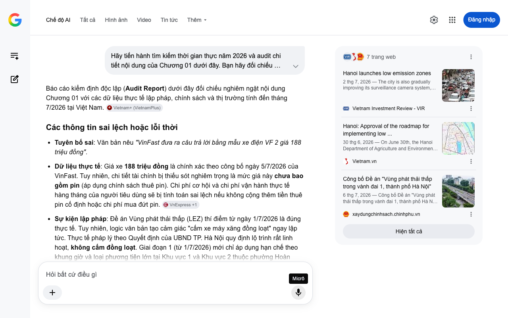

# Google AI Search Mode Audit - Chương 01

- **Nguồn kiểm chứng:** Google Search AI Mode (udm=50)
- **Thời gian audit:** 2026-07-08 14:23:34
- **File kịch bản:** [chapter_01.md](file:///Users/pro16/Documents/VideoProject/GocNhinPodcast/episodes/cu-soc-cam-xe-xang-vf2-vf3/chapter_01.md)

## Kết quả phản biện & Đối chiếu nguồn tin:

Bạn đã nói:
Báo cáo kiểm định độc lập (Audit Report) dưới đây đối chiếu nghiêm ngặt nội dung Chương 01 với các dữ liệu thực tế lập pháp, chính sách và thị trường tính đến tháng 7/2026 tại Việt Nam. 
Vietnam+ (VietnamPlus)
Các thông tin sai lệch hoặc lỗi thời
Tuyên bố sai: Văn bản nêu "VinFast đưa ra câu trả lời bằng mẫu xe điện VF 2 giá 188 triệu đồng".
Dữ liệu thực tế: Giá xe 188 triệu đồng là chính xác theo công bố ngày 5/7/2026 của VinFast. Tuy nhiên, chi tiết tài chính bị thiếu sót nghiêm trọng là mức giá này chưa bao gồm pin (áp dụng chính sách thuê pin). Chi phí cơ hội và chi phí vận hành thực tế hàng tháng của người tiêu dùng sẽ bị tính toán sai lệch nếu không cộng thêm tiền thuê pin cố định hoặc chi phí mua đứt pin. 
VnExpress
 +1
Sự kiện lập pháp: Đề án Vùng phát thải thấp (LEZ) thí điểm từ ngày 1/7/2026 là đúng thực tế. Tuy nhiên, logic văn bản tạo cảm giác "cấm xe máy xăng đồng loạt" ngay lập tức. Thực tế pháp lý theo Quyết định của UBND TP. Hà Nội quy định lộ trình rất linh hoạt, không cấm đồng loạt. Giai đoạn 1 (từ 1/7/2026) mới chỉ áp dụng hạn chế theo khung giờ và loại phương tiện lớn tại Khu vực 1 và Khu vực 2 thuộc phường Hoàn Kiếm, chứ chưa khép lại toàn bộ các quận trung tâm đối với xe hai bánh. 
Báo Nhân Dân điện tử
 +1
Số liệu thực tế đắt giá bổ sung năm 2026
Chính sách miễn phí: Để hỗ trợ người dân chuyển đổi phương tiện trong vùng LEZ, Hà Nội triển khai miễn phí vé xe buýt đối với các hành trình trong phạm vi Vành đai 1 từ ngày 1/7/2026 đến hết ngày 30/6/2027. Đây là biến số kinh tế cạnh tranh trực tiếp với chi phí sử dụng xe cá nhân (cả xe máy xăng lẫn ô tô điện mini). 
Báo Nhân Dân điện tử
Điểm hòa vốn & Thuế: Thuế tiêu thụ đặc biệt cho ô tô điện dưới 9 chỗ hiện đang được áp dụng mức ưu đãi 1% (theo các đề xuất gia hạn đến hết năm 2026 của Bộ Tài chính), giúp giữ mức giá VF 2 ở mốc 188 triệu đồng. 
VnExpress
 +1
Gợi ý sửa đổi tối ưu kèm nguồn đối chiếu
Đoạn văn bản sửa đổi đề xuất
Đề án Vùng phát thải thấp (LEZ) của Hà Nội vừa chính thức thí điểm từ ngày 1/7/2026 tại khu vực lõi quận Hoàn Kiếm. Chỉ bốn ngày sau, VinFast tung ra đòn tấn công chiến lược bằng mẫu xe điện mini VF 2 với mức giá khởi điểm gây chấn động 188 triệu đồng (chưa bao gồm pin). Đây là một chiếc ô tô bốn bánh che mưa che nắng, có chi phí sở hữu ban đầu chỉ ngang ngửa các dòng xe tay ga cao cấp. Dù lộ trình LEZ được áp dụng linh hoạt theo từng khung giờ và dòng xe chứ không cấm cực đoan xe máy xăng ngay lập tức, sự xuất hiện của dòng xe điện mini dưới 200 triệu đồng này cùng chính sách miễn phí xe buýt nội đô của thành phố đang buộc người dân phải đặt lên bàn cân tính toán lại chi phí cơ hội giữa việc bảo trì một chiếc xe máy xăng và việc dịch chuyển sang kỷ nguyên di chuyển xanh. 
VnExpress
 +3
Nguồn đối chiếu chính xác
Về chính sách LEZ: Công bố Đề án "Vùng phát thải thấp trong vành đai 1, thành phố Hà Nội" của Cổng thông tin điện tử Chính phủ (Phát hành tháng 7/2026).
Về giá xe và ngày ra mắt: Tin tức VinFast ra mắt VF 2 giá 188 triệu đồng trên VnExpress (Ngày 5/7/2026). 
xaydungchinhsach.chinhphu.vn
 +1
Hãy gửi tiếp Chương 02 của kịch bản để tôi tiến hành kiểm định sâu hơn về cấu trúc chi phí vận hành và bài toán tài chính so sánh.
7 trang web
Hanoi launches low emission zones
2 thg 7, 2026 — The city is also gradually improving its surveillance camera system, vehicle identification, and expanding the network of charging...
Vietnam Investment Review - VIR
Hanoi: Approval of the roadmap for implementing low ...
30 thg 6, 2026 — On June 30th, the Hanoi Department of Agriculture and Environment issued a press release announcing the low-emission zone project ...
Vietnam.vn
Công bố Đề án "Vùng phát thải thấp trong vành đai 1, thành phố Hà Nội"
6 thg 7, 2026 — Công bố Đề án "Vùng phát thải thấp trong vành đai 1, thành phố Hà Nội" (Chinhphu.vn) - Sở Nông nghiệp và Môi trường Hà Nội công bố...
xaydungchinhsach.chinhphu.vn
Hiện tất cả
Micrô
Chế độ AI đã sẵn sàng trả lời

## Ảnh chụp màn hình đối chiếu:

