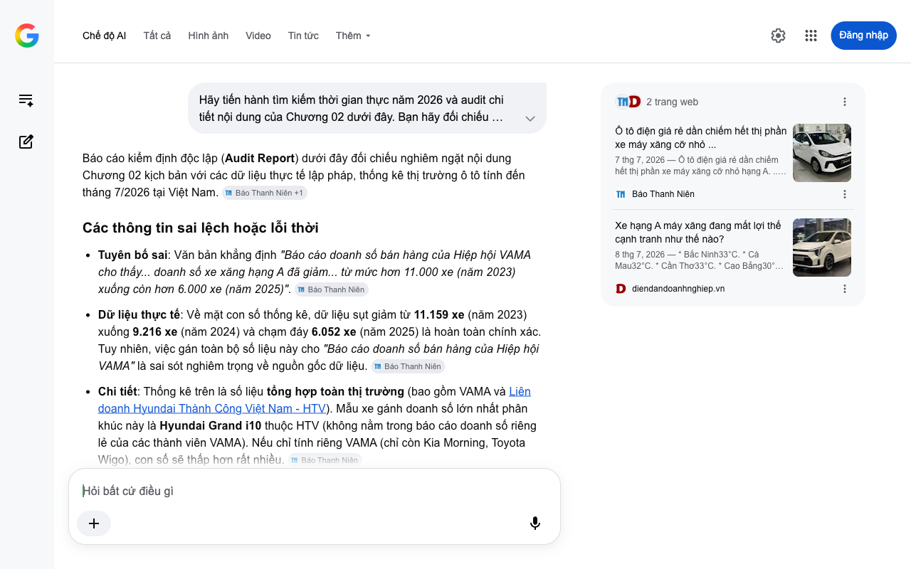

# Google AI Search Mode Audit - Chương 02

- **Nguồn kiểm chứng:** Google Search AI Mode (udm=50)
- **Thời gian audit:** 2026-07-08 14:23:57
- **File kịch bản:** [chapter_02.md](file:///Users/pro16/Documents/VideoProject/GocNhinPodcast/episodes/cu-soc-cam-xe-xang-vf2-vf3/chapter_02.md)

## Kết quả phản biện & Đối chiếu nguồn tin:

Bạn đã nói:
Báo cáo kiểm định độc lập (Audit Report) dưới đây đối chiếu nghiêm ngặt nội dung Chương 02 kịch bản với các dữ liệu thực tế lập pháp, thống kê thị trường ô tô tính đến tháng 7/2026 tại Việt Nam. 
Báo Thanh Niên
 +1
Các thông tin sai lệch hoặc lỗi thời
Tuyên bố sai: Văn bản khẳng định "Báo cáo doanh số bán hàng của Hiệp hội VAMA cho thấy... doanh số xe xăng hạng A đã giảm... từ mức hơn 11.000 xe (năm 2023) xuống còn hơn 6.000 xe (năm 2025)". 
Báo Thanh Niên
Dữ liệu thực tế: Về mặt con số thống kê, dữ liệu sụt giảm từ 11.159 xe (năm 2023) xuống 9.216 xe (năm 2024) và chạm đáy 6.052 xe (năm 2025) là hoàn toàn chính xác. Tuy nhiên, việc gán toàn bộ số liệu này cho "Báo cáo doanh số bán hàng của Hiệp hội VAMA" là sai sót nghiêm trọng về nguồn gốc dữ liệu. 
Báo Thanh Niên
Chi tiết: Thống kê trên là số liệu tổng hợp toàn thị trường (bao gồm VAMA và Liên doanh Hyundai Thành Công Việt Nam - HTV). Mẫu xe gánh doanh số lớn nhất phân khúc này là Hyundai Grand i10 thuộc HTV (không nằm trong báo cáo doanh số riêng lẻ của các thành viên VAMA). Nếu chỉ tính riêng VAMA (chỉ còn Kia Morning, Toyota Wigo), con số sẽ thấp hơn rất nhiều. 
Báo Thanh Niên
Số liệu thực tế đắt giá bổ sung năm 2026
Đà lao dốc năm 2026: Xu hướng này tiếp tục thảm khốc hơn trong năm nay. Tính đến hết 5 tháng đầu năm 2026, tổng doanh số xe máy xăng cỡ nhỏ hạng A toàn thị trường chỉ vỏn vẹn 1.324 xe. Sự suy giảm này tạo ra một "vùng trống" thị trường cực kỳ lớn cho ô tô điện mini. 
Báo Thanh Niên
 +1
Sự trỗi dậy của xe điện mini: Khoảng trống thị trường bị hấp thụ toàn bộ bởi các dòng xe điện mini, tiêu biểu là VinFast VF 3 khi liên tục dẫn đầu danh sách đặt hàng xanh ngay từ khi bàn giao. 
Báo Thanh Niên
Bản chất cuộc cạnh tranh: Ranh giới giá cả bị xóa nhòa khi các phân khúc trên (sedan hạng B, SUV đô thị) liên tục hạ giá sát sườn xe hạng A, đẩy xe xăng cỡ nhỏ vào thế "gọng kìm": phía dưới bị ô tô điện mini chèn ép chi phí, phía trên bị xe hạng B lấn át không gian. 
Báo Thanh Niên
 +1
Gợi ý sửa đổi tối ưu kèm nguồn đối chiếu
Đoạn văn bản sửa đổi đề xuất
Sức ép này không chỉ đè nặng lên xe hai bánh, mà đã hiển hiện rõ ở phân khúc ô tô xăng cỡ nhỏ hạng A. Phân khúc từng là lựa chọn hàng đầu của các gia đình trẻ chạy phố, nay đang chứng kiến đà sụt giảm mạnh. Báo cáo số liệu tổng hợp toàn thị trường cho thấy, từ mức 11.159 xe bán ra trong năm 2023, doanh số xe xăng hạng A (bao gồm cả Hyundai Grand i10, Kia Morning và Toyota Wigo) đã giảm gần một nửa, chỉ còn 6.052 xe vào năm 2025. Bước sang năm 2026, cục diện càng tối tăm khi 5 tháng đầu năm toàn phân khúc chỉ tiêu thụ được vỏn vẹn 1.324 xe. Xe xăng hạng A rơi vào thế kẹt: phía trên bị các dòng SUV đô thị và xe hạng B giảm giá chèn ép, phía dưới bị đòn tiến công vũ bão của các mẫu xe điện mini như VinFast VF 3 tước đi lợi thế chi phí vận hành đô thị.
Nguồn đối chiếu chính xác
Về số liệu doanh số xe hạng A (2023 - 2026): Phân tích chi tiết "Ô tô điện giá rẻ dần chiếm hết thị phần xe máy xăng cỡ nhỏ hạng A" đăng tải trên Báo Thanh Niên (Cập nhật ngày 5/7/2026). 
Báo Thanh Niên
Về áp lực cạnh tranh phân khúc: Bài viết "Xe hạng A máy xăng đang mất lợi thế cạnh tranh như thế nào?" trên Tạp chí Diễn đàn Doanh nghiệp (Cập nhật ngày 8/7/2026). 
diendandoanhnghiep.vn
Hãy gửi tiếp Chương 03 để tôi thực hiện phân tích sâu về bài toán chi phí vận hành (TCO) và hạ tầng trạm sạc.
Câu trả lời của AI có thể chứa thông tin không chính xác. Để được tư vấn tài chính, hãy tham khảo ý kiến của chuyên gia. Tìm hiểu thêm
2 trang web
Ô tô điện giá rẻ dần chiếm hết thị phần xe máy xăng cỡ nhỏ ...
7 thg 7, 2026 — Ô tô điện giá rẻ dần chiếm hết thị phần xe máy xăng cỡ nhỏ hạng A. ... Sự nở rộ kèm theo sức hút của các dòng ô tô điện giá rẻ tro...
Báo Thanh Niên
Xe hạng A máy xăng đang mất lợi thế cạnh tranh như thế nào?
8 thg 7, 2026 — * Bắc Ninh33°C. * Cà Mau32°C. * Cần Thơ33°C. * Cao Bẳng30°C. * Đà Nẵng34°C. * Đắk Lắk29°C. * Đồng Nai30°C. * Đồng Tháp33°C. * Hà N...
diendandoanhnghiep.vn
Chế độ AI đã sẵn sàng trả lời

## Ảnh chụp màn hình đối chiếu:

