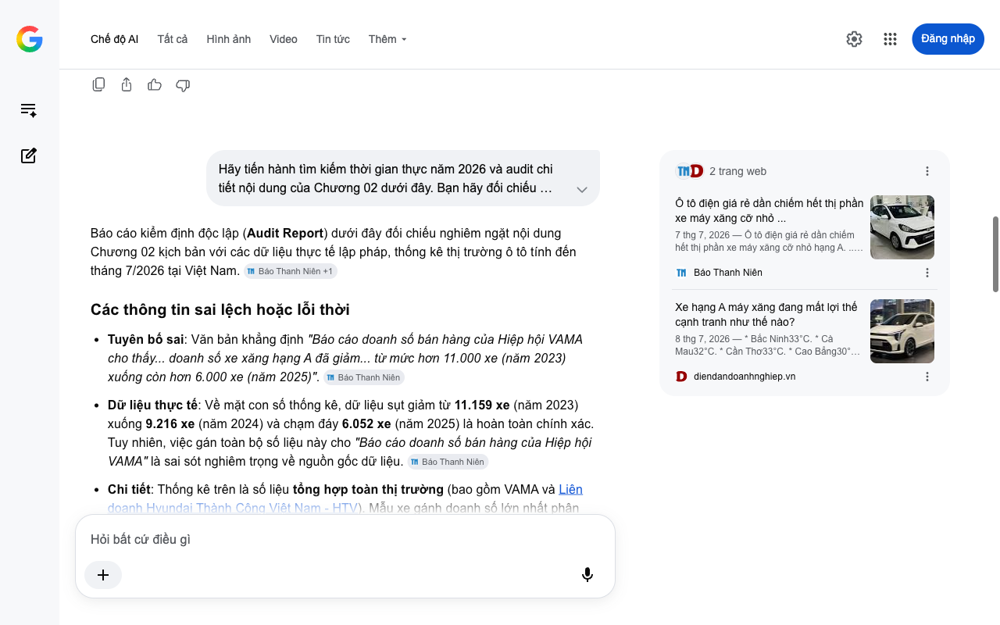

# Google AI Search Mode Audit - Chương 03

- **Nguồn kiểm chứng:** Google Search AI Mode (udm=50)
- **Thời gian audit:** 2026-07-08 14:24:22
- **File kịch bản:** [chapter_03.md](file:///Users/pro16/Documents/VideoProject/GocNhinPodcast/episodes/cu-soc-cam-xe-xang-vf2-vf3/chapter_03.md)

## Kết quả phản biện & Đối chiếu nguồn tin:

Bạn đã nói:
Báo cáo kiểm định độc lập (Audit Report) dưới đây đối chiếu nghiêm ngặt nội dung Chương 03 kịch bản với các thông số kỹ thuật thực tế và dữ liệu thị trường tính đến tháng 7/2026 tại Việt Nam.
Các thông tin sai lệch hoặc lỗi thời
Tuyên bố sai về thông số động cơ: Văn bản nêu "công suất động cơ 20 kW" và "cự ly di chuyển thực tế giới hạn mẫu xe này cho nhu cầu đi phố ngắn". 
VinFast Nam Thái Bình Dương
 +1
Dữ liệu thực tế: Thông số công suất động cơ của VinFast VF 2 được công bố chính thức vào ngày 5/7/2026 là 30 kW (chứ không phải 20 kW). Động cơ này đi kèm mô-men xoắn 65 Nm và hệ dẫn động cầu sau (RWD). Công suất 30 kW (~40 mã lực) là tương đối mạnh mẽ cho một dòng xe siêu nhỏ (supermini), thậm chí ngang ngửa một số dòng xe xăng hạng A cũ. 
VnExpress
 +1
Mâu thuẫn logic cự ly di chuyển: Cự ly di chuyển của VF 2 đạt tới 210 km/lần sạc (theo tiêu chuẩn NEDC) nhờ bộ pin dung lượng 18,3 kWh. Tầm hoạt động này hoàn toàn vượt trội so với định nghĩa "phố ngắn hàng ngày" và không hề thua kém đàn anh VinFast VF 3. Do đó, rào cản đường trường nằm ở tốc độ tối đa bị giới hạn điện tử ở 80 km/h chứ không phải do dung lượng pin hay công suất yếu. 
VnExpress
 +1
Sai lệch kích thước vật lý: Văn bản ghi "Với chiều rộng khoảng một mét rưỡi, VF 2 không thể đi vào các ngõ sâu dưới hai mươi mét".
Dữ liệu thực tế: Thông số chiều rộng chính xác của xe là 1.496 mm (~1,5m). Với các con ngõ đô thị tại Hà Nội và TP.HCM, ngõ rộng dưới 2m xe vẫn có thể tiến vào nếu đi thẳng, nhưng rào cản vật lý thực tế nằm ở bán kính quay đầu và không gian mở cửa xe chứ không thuần túy là chiều rộng thân xe. 
VnExpress
 +1
Số liệu thực tế đắt giá bổ sung năm 2026
So sánh giá xe máy tay ga: Giá xe tay ga cao cấp được nêu từ 100 - 150 triệu đồng là chính xác đối với các dòng như Honda SH160i (giá lăn bánh tại đại lý tháng 7/2026 dao động từ 103 - 115 triệu đồng) hay Vespa GTS. Mức chênh lệch tài chính từ chiếc xe máy đắt nhất đến ô tô rẻ nhất chỉ còn khoảng 73 triệu đồng, biến đây thành một bài toán chi phí cơ hội cực kỳ thực tế. 
Giá Xe 2 Bánh
Giải pháp sạc đột phá: Để giải quyết rào cản sạc tại chung cư cũ, VinFast áp dụng chính sách sạc nhanh 24 kW cho phép nạp từ 10% lên 70% pin chỉ trong 34 phút. Đồng thời, hãng tung ưu đãi miễn phí sạc pin 10 lần/tháng tại trạm sạc V-Green cho đến hết ngày 10/2/2029, giúp xóa bỏ áp lực phải có ổ cắm cố định tại nhà. 
Chungauto
Gợi ý sửa đổi tối ưu kèm nguồn đối chiếu
Đoạn văn bản sửa đổi đề xuất
Với khoản đầu tư chênh lệch chỉ từ vài chục triệu đồng so với một chiếc Honda SH 160i có giá lăn bánh lên tới 115 triệu đồng, mẫu xe điện mini VF 2 mang lại lợi thế bảo vệ tuyệt đối của một cabin bốn bánh. Tuy nhiên, đặc thù ngõ ngách siêu nhỏ tại các đô thị lớn vẫn là rào cản vật lý không thể chối cãi. Sở hữu chiều rộng sát mốc 1,5 mét, VF 2 về lý thuyết có thể lọt qua ngõ nhỏ nhưng việc quay đầu, lùi xe hay mở cửa trong không gian chật hẹp là bất khả thi. Người dùng bắt buộc phải gửi xe ngoài bãi và đi bộ vào nhà.
Thêm vào đó, dù sở hữu khối động cơ cầu sau 30 kW khá khỏe khoắn và tầm vận hành lên tới 210 km mỗi lần sạc, vận tốc tối đa của xe bị giới hạn ở mức 80 km/h. Điều này định vị rõ ràng VF 2 là một phương tiện thuần đô thị, thay vì các hành trình cao tốc đường dài. Đặc biệt, đối với nhóm cư dân tại các khu tập thể hay chung cư cũ - nơi không có hạ tầng sạc nội khu, rào cản tiếp cận nguồn điện tưởng chừng là nút thắt chí mạng. Thế nhưng, khả năng sạc nhanh 24 kW từ 10% lên 70% chỉ trong 34 phút cùng đặc quyền miễn phí sạc từ hệ sinh thái trạm sạc công cộng đang trở thành quân bài chiến lược để VinFast hóa giải bài toán hóc búa này.
Nguồn đối chiếu chính xác
Về thông số kỹ thuật, công suất 30kW và pin của VF 2: Bài phân tích chi tiết "Đánh Giá VinFast VF 2: Thông Số Chi Tiết & Ưu Nhược Điểm" trên ChungAuto (Cập nhật ngày 5/7/2026).
Về giá xe máy tay ga Honda SH năm 2026: Báo cáo "Bảng giá xe Honda 2026 mới nhất hôm nay" từ mạng xã hội xe máy Giaxe.2banh.vn (Cập nhật tháng 7/2026).
Nếu bạn muốn tiếp tục, hãy gửi tiếp Chương 04 để phân tích sâu hơn về hạ tầng trạm sạc toàn quốc và các chính sách tác động đến dòng tiền của người dùng.
Câu trả lời của AI có thể chứa thông tin không chính xác. Để được tư vấn pháp lý, hãy tham khảo ý kiến của chuyên gia. Tìm hiểu thêm
4 trang web
Bảng giá thông số xe VinFast Minio Green 2026 (VF 2)
Chiều dài cơ sở (mm) 2.065. Dẫn động RWD/Cầu sau. Công suất tối đa (kW) 20. Mô men xoắn cực đại (Nm) 65. Quãng đường chạy một lần ...
VinFast Nam Thái Bình Dương
VinFast VF 2: giá lăn bánh 7/2026, TSKT, đánh giá chi tiết
Mô tả / đánh giá chi tiết. VF 2 tối ưu từ phiên bản Minio Green, hướng tới phân khúc khách hàng cá nhân, thiết kế nhỏ gọn để di ch...
VnExpress
Bảng giá xe Honda 2026 mới nhất hôm nay tháng 7/2026 tại ...
4 thg 7, 2026 — * Bảng giá xe. * Bảng giá xe Honda 2026 mới nhất hôm nay tháng 7/2026 tại đại lý ... Table_title: 1. Bảng giá xe Honda 2026 mới nh...
Giá Xe 2 Bánh
Hiện tất cả
Chế độ AI đã sẵn sàng trả lời

## Ảnh chụp màn hình đối chiếu:

