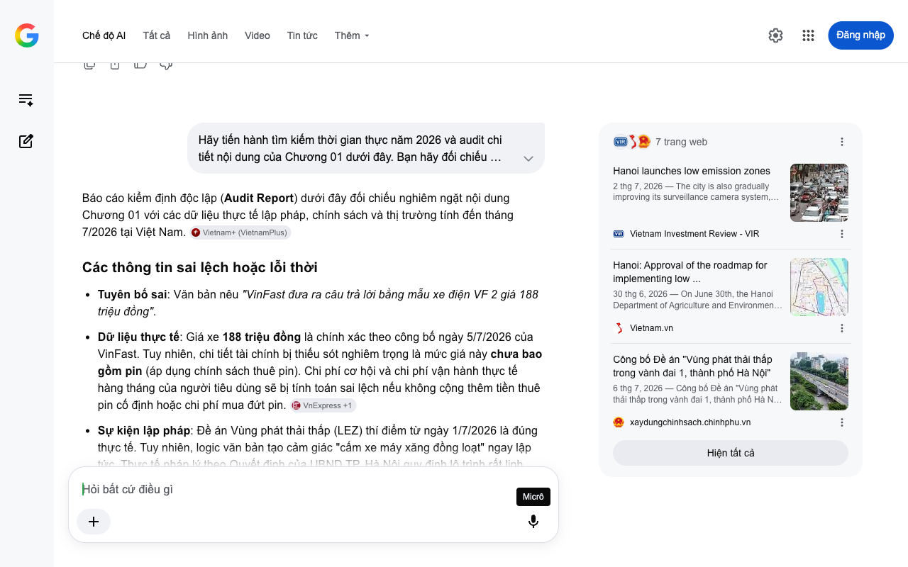

# Google AI Search Mode Audit - Chương 04

- **Nguồn kiểm chứng:** Google Search AI Mode (udm=50)
- **Thời gian audit:** 2026-07-08 14:24:44
- **File kịch bản:** [chapter_04.md](file:///Users/pro16/Documents/VideoProject/GocNhinPodcast/episodes/cu-soc-cam-xe-xang-vf2-vf3/chapter_04.md)

## Kết quả phản biện & Đối chiếu nguồn tin:

Bạn đã nói:
Báo cáo kiểm định độc lập (Audit Report) dưới đây đối chiếu nghiêm ngặt nội dung Chương 04 kịch bản với các thỏa thuận thương mại, báo cáo tài chính và dữ liệu doanh số thực tế tại Việt Nam tính đến giữa năm 2026.
Các thông tin sai lệch hoặc lỗi thời
Lỗi logic phân phối hạ tầng: Văn bản ghép việc V-Green hợp tác với MediaMart lắp tủ đổi pin xe máy điện làm hạ tầng liên kết giúp "người dùng xe điện mini an tâm hơn".
Dữ liệu thực tế: Hệ thống tủ đổi pin tại MediaMart được thiết kế độc quyền cho xe máy điện (sử dụng pin LFP tháo rời thế hệ mới). Các dòng ô tô điện mini như VinFast VF 2 hay VF 3 sử dụng cơ chế cắm sạc trực tiếp vào súng sạc, hoàn toàn không thể sử dụng hay trích xuất năng lượng từ các tủ đổi pin xe máy này. Việc gộp chung hai khái niệm làm sai lệch hoàn toàn giải pháp kỹ thuật cho ô tô mini. 
MediaMart
 +1
Thiếu sót số liệu doanh số: Văn bản ghi doanh số VF 3 đạt "hơn 44.000 xe trong năm 2025".
Dữ liệu thực tế: Số liệu chính xác được công bố là 44.585 xe (hoặc làm tròn là gần 45.000 xe). Để tăng tính thuyết phục của một báo cáo tài chính - chính sách, con số cần được định danh chính xác vì đây là kỷ lục vô tiền khoáng hậu của thị trường ô tô Việt Nam. 
Znews
 +2
Số liệu thực tế đắt giá bổ sung năm 2026
Cú hích tài chính từ V-Green và MWG: Sự kiện Thợ Điện Máy Xanh (thuộc Thế Giới Di Động) tham gia lắp đặt và bảo trì trạm sạc cho V-Green mang lại doanh thu khổng lồ gần 1.200 tỷ đồng chỉ riêng trong Quý II/2026. Điều này chứng minh tốc độ phủ trạm sạc của V-Green đang được công nghiệp hóa thần tốc bằng nguồn lực 5.000 nhân sự chất lượng cao. 
nguoiquansat.vn
 +2
Mạng lưới phủ rộng: Thỏa thuận hợp tác chiến lược giữa V-Green và MediaMart đã hoàn tất lắp đặt 1.000 tủ đổi pin tại 330 siêu thị điện máy ngay trong tháng 5/2026. 
MediaMart
 +1
Gợi ý sửa đổi tối ưu kèm nguồn đối chiếu
Đoạn văn bản sửa đổi đề xuất
Nút thắt về hạ tầng đang được tháo gỡ bằng những cái bắt tay thương mại mang tính lịch sử. Mạng lưới trạm sạc V-Green đã kích hoạt chiến dịch thần tốc khi hợp tác cùng Thế Giới Di Động, đưa 5.000 nhân sự của Thợ Điện Máy Xanh vào vận hành, bảo trì trạm sạc, đem về doanh thu gần 1.200 tỷ đồng cho chuỗi bán lẻ này chỉ trong quý II năm 2026.
Song song đó, V-Green cũng hoàn tất phủ 1.000 tủ đổi pin xe máy điện tại 330 siêu thị MediaMart khắp cả nước. Dù các tủ đổi pin này chỉ phục vụ xe hai bánh chứ không dành cho ô tô điện mini, dòng chảy chuyển đổi năng lượng xanh đồng bộ này chính là bước đệm tâm lý quan trọng. Nó tiếp nối sự bùng nổ của mẫu xe điện quốc dân VinFast VF 3 với doanh số kỷ lục 44.585 xe trong năm 2025, tạo dựng một hệ sinh thái di chuyển vững chắc khiến người tiêu dùng sắm sửa VF 2 hay VF 3 không còn cô độc trong hành trình tìm kiếm nguồn sạc công cộng.
Nguồn đối chiếu chính xác
Về doanh thu và nhân sự Thợ Điện Máy Xanh làm trạm sạc: Báo cáo tài chính và hoạt động "Thợ Điện Máy Xanh thu gần 1.200 tỷ đồng quý II nhờ hợp tác triển khai trạm sạc V-Green" trên Người Quan Sát (Cập nhật ngày 7/7/2026).
Về thỏa thuận 1.000 tủ đổi pin: Thông cáo báo chí "V-Green và MediaMart hợp tác triển khai 1.000 tủ đổi pin xe máy điện trong tháng 5/2026" công bố tại trang chủ MediaMart (Cập nhật tháng 4/2026).
Về số liệu chính xác của VF 3: Báo cáo số liệu cuối năm "Khách Việt mua gần 45.000 VF 3, VinFast lập kỷ lục 175.099 xe năm 2025" phát hành bởi ZNews (Ngày 13/1/2026).
Hãy tiếp tục gửi Chương 05 để chúng ta bóc tách bài toán tài chính cốt lõi: Khấu hao tài sản và Chi phí sử dụng (TCO) giữa xe máy xăng và ô tô điện mini dưới 200 triệu đồng.
Câu trả lời của AI có thể chứa thông tin không chính xác. Để được tư vấn pháp lý, hãy tham khảo ý kiến của chuyên gia. Tìm hiểu thêm
8 trang web
V-Green và MediaMart hợp tác triển khai 1.000 tủ đổi pin xe ...
24 thg 4, 2026 — V-Green và MediaMart hợp tác triển khai 1.000 tủ đổi pin xe máy điện trong tháng 5/2026. Biên tập bởi: Trần Oanh - Cập nhật ngày 2...
MediaMart
V-Green và MediaMart hợp tác lắp đặt 1.000 tủ đổi pin xe máy ...
26 thg 4, 2026 — Hệ thống 330 siêu thị MediaMart sẽ hoàn tất lắp đặt 1.000 tủ đổi pin xe máy điện vào tháng 5/2026, góp phần hiện thực hóa mạng lướ...
Báo Hà Tĩnh
Thợ Điện Máy Xanh thu về gần 1.600 tỷ sau 5 tháng, 5.000 ...
9 thg 6, 2026 — Trong 5 tháng đầu năm 2026, doanh thu của Thợ Điện Máy Xanh tăng 49% so với cùng kỳ, lên mức 1.584 tỷ đồng.
nguoiquansat.vn
Hiện tất cả
Micrô
Chế độ AI đã sẵn sàng trả lời

## Ảnh chụp màn hình đối chiếu:

