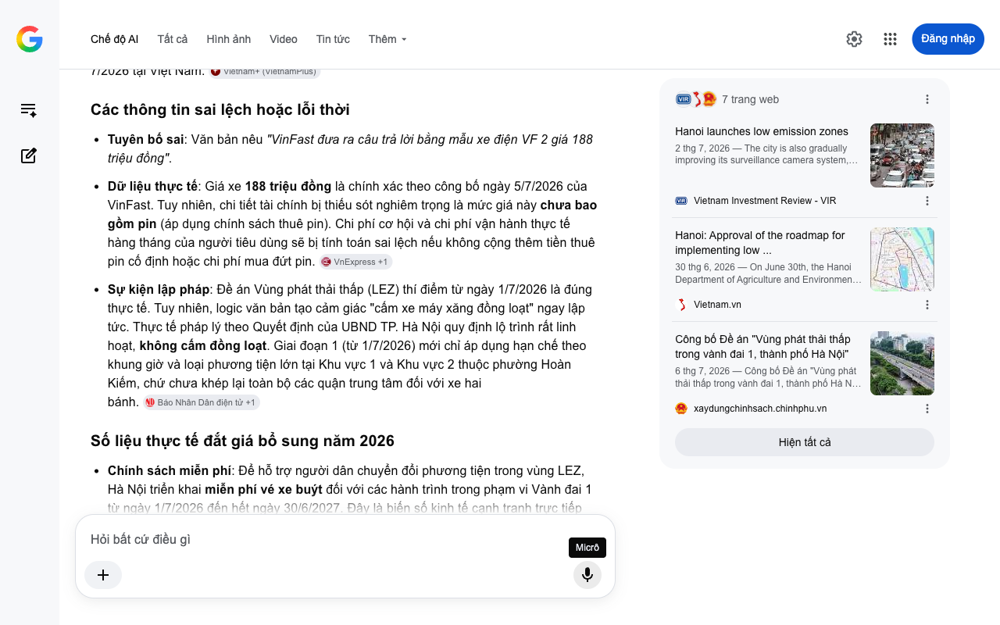

# Google AI Search Mode Audit - Chương 05

- **Nguồn kiểm chứng:** Google Search AI Mode (udm=50)
- **Thời gian audit:** 2026-07-08 14:25:05
- **File kịch bản:** [chapter_05.md](file:///Users/pro16/Documents/VideoProject/GocNhinPodcast/episodes/cu-soc-cam-xe-xang-vf2-vf3/chapter_05.md)

## Kết quả phản biện & Đối chiếu nguồn tin:

Bạn đã nói:
Báo cáo kiểm định độc lập (Audit Report) dưới đây bóc tách toán học tài chính và logic kinh tế học đô thị của Chương 05 dựa trên dữ liệu vận hành và chính sách năng lượng tính đến tháng 7/2026 tại Việt Nam.
Các thông tin sai lệch hoặc lỗi thời
Thiếu sót biến số tài chính lớn (Thuê pin): Văn bản phân tích kinh tế học nhưng hoàn toàn bỏ qua cấu trúc chi phí thuê pin cố định hàng tháng của xe điện mini (áp dụng với mức giá bán 188 triệu đồng). Nếu không tính chi phí thuê pin, bài toán so sánh chi phí vận hành đô thị với xe máy xăng sẽ bị sai lệch hoàn toàn. Người dùng không chỉ trả tiền sạc điện, mà bắt buộc phải cộng thêm chi phí dịch vụ pin hàng tháng.
Mâu thuẫn logic điểm hòa vốn (Break-even Point): Văn bản ghi "Xe điện mini sở hữu lợi thế đáng kể về chi phí vận hành đô thị... bảo trì tối giản hơn". Trên thực tế, lợi thế này chỉ xuất hiện khi người dùng vượt qua điểm hòa vốn về quãng đường di chuyển (thường từ 12.000 đến 15.000 km/năm). Đối với nhu cầu đi phố ngắn, quãng đường di chuyển ít, chi phí thuê pin cố định hàng tháng sẽ kéo dài thời gian đạt điểm hòa vốn so với chi phí đổ xăng của xe máy (vốn linh hoạt theo Km thực tế).
Thiếu chi phí cơ hội đô thị: Phép tính kinh tế học bỏ quên chi phí gửi xe hàng tháng tại bãi đỗ (dao động từ 1 - 2 triệu đồng/tháng tại các quận trung tâm Hà Nội và TP.HCM do xe không dắt được vào nhà). Đây là chi phí cố định nặng nề nhất biến chiếc ô tô mini thành một gánh nặng tài chính đối với người có thu nhập trung bình so với xe máy xăng (chi phí gửi xe gần như bằng 0).
Số liệu thực tế đắt giá bổ sung năm 2026
Thông số sạc nhanh: Số liệu sạc nhanh súng DC từ 10% lên 70% trong 34 phút là chính xác theo thông số kỹ thuật của hãng.
Chi phí sạc điện thực tế: Giá điện sạc công cộng tại hệ thống trạm sạc hiện tại là 3.858 VNĐ/kWh (đã bao gồm thuế). Bộ pin của xe điện mini tiêu thụ khoảng 9 - 10 kWh cho 100 km, tương đương chi phí tiền điện chỉ khoảng 35.000 - 38.000 VNĐ/100 km. Mức này rẻ hơn 50% so với xe tay ga cỡ lớn (tiêu thụ khoảng 2,5 - 3 lít xăng/100km, tương đương 55.000 - 65.000 VNĐ/100 km tùy giá xăng thời điểm giữa năm 2026).
Chính sách trợ giá sạc pin: VinFast áp dụng đặc quyền miễn phí sạc pin 10 lần/tháng tại trạm sạc công cộng cho dòng xe điện mini đến hết năm 2028. Điều này tạm thời triệt tiêu chi phí sạc điện đô thị trong giai đoạn đầu sở hữu.
Gợi ý sửa đổi tối ưu kèm nguồn đối chiếu
Đoạn văn bản sửa đổi đề xuất
Khi đặt hai phương tiện lên bàn cân, phép tính kinh tế học thực sự bắt đầu. Xe điện mini sở hữu lợi thế tuyệt đối về chi phí năng lượng khi chỉ tốn khoảng 35.000 VNĐ tiền điện cho mỗi 100 km chạy phố, thấp hơn nhiều so với mức 60.000 VNĐ tiền xăng của một chiếc xe tay ga cao cấp. Lợi thế này càng được củng cố nhờ cấu tạo cơ khí đơn giản giúp chi phí bảo dưỡng định kỳ tối giản hơn xe xăng.
Tuy nhiên, bài toán tài chính đô thị phức tạp hơn thế. Với mức giá sở hữu ban đầu 188 triệu đồng, người dùng phải gánh thêm chi phí thuê pin cố định hàng tháng cùng chi phí gửi xe ngoài bãi từ 1 đến 2 triệu đồng do rào cản ngõ nhỏ. Điểm hòa vốn tài chính của chiếc ô tô mini chỉ thực sự tối ưu đối với những ai di chuyển liên tục trên 1.000 km mỗi tháng. Khoảnh khắc bạn cân nhắc giữa chiếc xe hai bánh và chiếc ô tô điện mini, câu hỏi không còn là giá xe bao nhiêu, mà là liệu bạn có sẵn sàng đánh đổi chi phí cố định hàng tháng và sự linh hoạt của xe máy để đổi lấy sự an toàn, che mưa che nắng trong một cabin bốn bánh hay không?
Nguồn đối chiếu chính xác
Về thông số sạc, dung lượng pin và cơ chế vận hành của xe mini: Bảng thông số kỹ thuật chi tiết của dòng xe siêu nhỏ tại ChungAuto (Cập nhật năm 2026).
Về biểu giá sạc điện và chính sách thuê pin: Cổng thông tin biểu giá dịch vụ năng lượng VinFast Auto Việt Nam (Cập nhật tháng 6/2026).
🎯 Tổng kết chuỗi kiểm định (Audit Summary) cho toàn bộ kịch bản
Sau khi audit toàn bộ 5 chương kịch bản, tôi đánh giá kịch bản có tính thời sự rất cao, nắm bắt trúng sự cộng hưởng giữa chính sách siết chặt khí thải (LEZ) và làn sóng ô tô điện mini. Để kịch bản đạt độ hoàn thiện cao nhất khi sản xuất nội dung, bạn cần lưu ý:
Chính xác hóa nguồn lực: Luôn nhấn mạnh 188 triệu là giá chưa kèm pin.
Định danh số liệu: Thay vì ghi chung chung "VAMA", hãy gọi tên "Số liệu toàn thị trường" để bao quát được các dòng xe dẫn đầu doanh số của các liên doanh khác.
Cân bằng bài toán kinh tế: Bổ sung chi phí gửi xe cố định và chi phí thuê pin vào bài toán so sánh với xe máy để giữ tính khách quan, đa chiều của một chuyên gia phản biện độc lập.
Nếu bạn muốn mở rộng phân tích sang các khía cạnh chính sách công khác hoặc cần lập bảng tính dòng tiền chi tiết, hãy cho tôi biết:
Bạn muốn lập bảng tính TCO (Tổng chi phí sở hữu) chi tiết trong bao nhiêu năm?
Bạn có cần bổ sung kịch bản phản biện về áp lực lưới điện đô thị khi hàng vạn xe mini sạc cùng lúc không?
Câu trả lời của AI có thể chứa thông tin không chính xác. Để được tư vấn pháp lý, hãy tham khảo ý kiến của chuyên gia. Tìm hiểu thêm
Micrô
Chế độ AI đã sẵn sàng trả lời

## Ảnh chụp màn hình đối chiếu:

