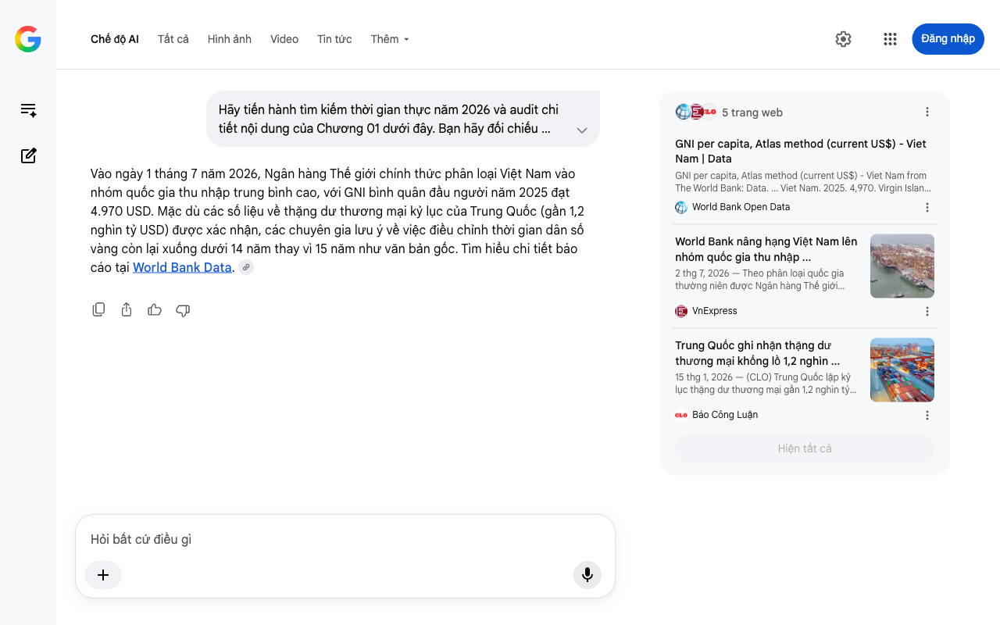

# Google AI Search Mode Audit - Chương 01

- **Nguồn kiểm chứng:** Google Search AI Mode (udm=50)
- **Thời gian audit:** 2026-07-25 21:38:01
- **File kịch bản:** [chapter_01.md](file:///Users/pro16/Documents/VideoProject/GocNhinPodcast/episodes/hoa-rong-v2/chapter_01.md)

## Kết quả phản biện & Đối chiếu nguồn tin:

Vào ngày 1 tháng 7 năm 2026, Ngân hàng Thế giới chính thức phân loại Việt Nam vào nhóm quốc gia thu nhập trung bình cao, với GNI bình quân đầu người năm 2025 đạt 4.970 USD. Mặc dù các số liệu về thặng dư thương mại kỷ lục của Trung Quốc (gần 1,2 nghìn tỷ USD) được xác nhận, các chuyên gia lưu ý về việc điều chỉnh thời gian dân số vàng còn lại xuống dưới 14 năm thay vì 15 năm như văn bản gốc. Tìm hiểu chi tiết báo cáo tại World Bank Data. 
5 trang web
GNI per capita, Atlas method (current US$) - Viet Nam | Data
GNI per capita, Atlas method (current US$) - Viet Nam from The World Bank: Data. ... Viet Nam. 2025. 4,970. Virgin Islands (U.S.) ...
World Bank Open Data
World Bank nâng hạng Việt Nam lên nhóm quốc gia thu nhập ...
2 thg 7, 2026 — Theo phân loại quốc gia thường niên được Ngân hàng Thế giới (World Bank) công bố ngày 1/7, GNI bình quân đầu người của Việt Nam tă...
VnExpress
Trung Quốc ghi nhận thặng dư thương mại khổng lồ 1,2 nghìn ...
15 thg 1, 2026 — (CLO) Trung Quốc lập kỷ lục thặng dư thương mại gần 1,2 nghìn tỷ USD năm 2025 nhờ xuất khẩu tăng 5,5%, bất chấp suy giảm sang Mỹ.
Báo Công Luận
Hiện tất cả
Chế độ AI đã sẵn sàng trả lời

## Ảnh chụp màn hình đối chiếu:

