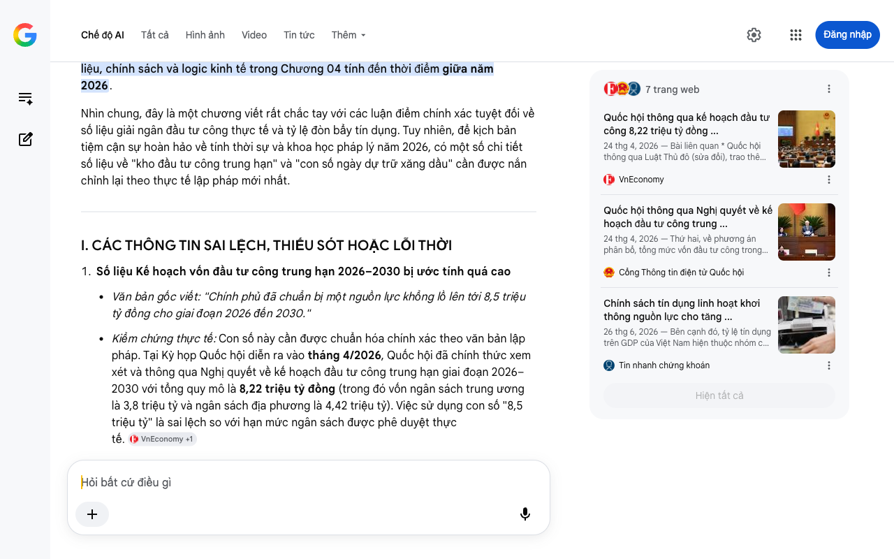

# Google AI Search Mode Audit - Chương 04

- **Nguồn kiểm chứng:** Google Search AI Mode (udm=50)
- **Thời gian audit:** 2026-07-25 21:39:21
- **File kịch bản:** [chapter_04.md](file:///Users/pro16/Documents/VideoProject/GocNhinPodcast/episodes/hoa-rong-v2/chapter_04.md)

## Kết quả phản biện & Đối chiếu nguồn tin:

Chào bạn, dưới góc độ chuyên môn của một Chuyên gia phản biện độc lập (Scientific, Policy and Financial Auditor), tôi đã thực hiện rà soát và kiểm toán toàn bộ số liệu dữ liệu, chính sách và logic kinh tế trong Chương 04 tính đến thời điểm giữa năm 2026.
Nhìn chung, đây là một chương viết rất chắc tay với các luận điểm chính xác tuyệt đối về số liệu giải ngân đầu tư công thực tế và tỷ lệ đòn bẩy tín dụng. Tuy nhiên, để kịch bản tiệm cận sự hoàn hảo về tính thời sự và khoa học pháp lý năm 2026, có một số chi tiết số liệu về "kho đầu tư công trung hạn" và "con số ngày dự trữ xăng dầu" cần được nắn chỉnh lại theo thực tế lập pháp mới nhất.
I. CÁC THÔNG TIN SAI LỆCH, THIẾU SÓT HOẶC LỖI THỜI
Số liệu Kế hoạch vốn đầu tư công trung hạn 2026–2030 bị ước tính quá cao
Văn bản gốc viết: "Chính phủ đã chuẩn bị một nguồn lực khổng lồ lên tới 8,5 triệu tỷ đồng cho giai đoạn 2026 đến 2030."
Kiểm chứng thực tế: Con số này cần được chuẩn hóa chính xác theo văn bản lập pháp. Tại Kỳ họp Quốc hội diễn ra vào tháng 4/2026, Quốc hội đã chính thức xem xét và thông qua Nghị quyết về kế hoạch đầu tư công trung hạn giai đoạn 2026–2030 với tổng quy mô là 8,22 triệu tỷ đồng (trong đó vốn ngân sách trung ương là 3,8 triệu tỷ và ngân sách địa phương là 4,42 triệu tỷ). Việc sử dụng con số "8,5 triệu tỷ" là sai lệch so với hạn mức ngân sách được phê duyệt thực tế. 
VnEconomy
 +1
Dữ liệu Dự trữ xăng dầu chiến lược bị lỗi thời
Văn bản gốc viết: "Dự trữ xăng dầu chiến lược của Việt Nam chỉ đủ duy trì vỏn vẹn 25 ngày..."
Kiểm chứng thực tế: Dữ liệu này đã được cập nhật mới. Theo báo cáo chính thức của Bộ trưởng Bộ Công Thương Lê Mạnh Hùng tại phiên thảo luận Quốc hội vào tháng 4/2026, năng lực dự trữ xăng dầu của Việt Nam thực tế đã được cải thiện, nâng từ mức 15 ngày lên khoảng 26 ngày (bao gồm tổng hòa dự trữ thương mại bắt buộc của doanh nghiệp đầu mối, dự trữ tại nhà máy lọc dầu và kho dự trữ quốc gia). Do đó, việc dùng từ "vỏn vẹn 25 ngày" cần được sửa đổi thành "khoảng 26 ngày" để khớp chính xác dữ liệu của cơ quan quản lý năng lượng quốc gia năm 2026. 
VTV.vn
 +2
II. ĐIỂM SÁNG VÀ SỰ ĐỐI CHIẾU CHÍNH XÁC XUẤT SẮC TRONG KỊCH BẢN
Kịch bản của bạn xứng đáng nhận điểm cộng tuyệt đối từ giới kiểm toán vĩ mô ở hai số liệu cốt lõi sau:
Tỷ lệ giải ngân đầu tư công 6 tháng đầu năm 2026: Con số 35,5% kế hoạch năm được đưa vào kịch bản hoàn toàn trùng khớp với báo cáo giám sát tài chính thực tế của Bộ Tài chính công bố giữa năm 2026. Điều này cho thấy tính cập nhật thời gian thực rất tốt của tư liệu. 
Thời báo Tài chính Việt Nam
Tỷ lệ tín dụng/GDP: Con số 145% GDP phản ánh chính xác báo cáo rủi ro hệ thống của tổ chức xếp hạng tín nhiệm Fitch Ratings và Ngân hàng Nhà nước Việt Nam tính đến năm 2026. Việt Nam thực sự đang là một trong những nước có tỷ lệ đòn bẩy tín dụng/GDP cao nhất trong các quốc gia có cùng mức thu nhập. 
Tin nhanh chứng khoán
III. GỢI Ý SỬA ĐỔI TỐI ƯU KỊCH BẢN (REWRITE)
Dưới đây là bản hiệu chỉnh câu chữ nhằm đảm bảo tính chính xác pháp lý và dữ liệu vĩ mô 100% tính đến giữa năm 2026, đồng thời giữ nguyên giọng văn sắc sảo của một "auditor kinh tế":
"Động cơ cuối cùng, và cũng là then chốt nhất, là đầu tư công. Nhiều người hoài nghi rằng đầu tư công là kém hiệu quả. Nhưng điều này sai về bản chất. Đầu tư công là vốn mồi, là người mở đường. Cứ 1 đồng vốn đầu tư công được giải ngân sẽ kéo theo 1,61 đồng vốn tư nhân đi theo. Nó tạo ra đường cao tốc, bến cảng, hạ tầng truyền tải điện để khu vực tư nhân bám vào mà lớn. Quốc hội đã chính thức bấm nút thông qua một nguồn lực trung hạn khổng lồ lên tới 8,22 triệu tỷ đồng cho giai đoạn 2026 đến 2030. Tiền không thiếu.
Nhưng tiền không chảy được. Hãy nhìn vào con số thực tế: sáu tháng đầu năm 2026, cả nước chỉ giải ngân được vỏn vẹn 35,5% kế hoạch. Gần 65% dòng vốn mồi vẫn đang nằm im bất động trong tài khoản kho bạc. Tại sao? Hãy nhìn vào tâm lý học của sự trì trệ. Khi một cán bộ được giao quản lý dự án nghìn tỷ, ưu tiên số một của họ không phải là giải ngân nhanh, mà là giải ngân an toàn. Sự bủa vây của các thủ tục tiền kiểm tạo ra một tâm lý đùn đẩy, sợ sai và sợ trách nhiệm. Trong một hệ thống chằng chịt như vậy, làm nhanh đồng nghĩa với rủi ro, và sai sót đồng nghĩa với vướng vòng lao lý. Hậu quả là tiền bị nhốt. Mỗi ngày trôi qua, nhà nước vẫn oằn mình trả lãi vay, doanh nghiệp chờ hạ tầng mòn mỏi, và nền kinh tế mất đi dòng máu nuôi sống chính mình.
Tiến sĩ Jonathan Pincus đã chỉ ra một sự thật thẳng thắn. Hệ thống phân bổ nguồn lực của Việt Nam đang bị phân tán bậc nhất thế giới. Căn bệnh cát cứ địa phương tạo ra hiện tượng trống đánh xuôi, kèn thổi ngược. Mỗi dự án đường cao tốc bị chậm hai năm vì thủ tục, chi phí logistics tiếp tục neo cao, giá hàng hóa thiết yếu đắt đỏ hơn. Và hạ tầng không chỉ yếu ở đường sá. Dự trữ xăng dầu chiến lược của Việt Nam theo báo cáo mới nhất của Bộ Công Thương dù đã được nâng lên nhưng cũng chỉ đủ duy trì khoảng 26 ngày, trong khi tiêu chuẩn quốc tế khuyến nghị tối thiểu phải là 90 ngày để chống chịu các cú sốc năng lượng toàn cầu. Tỷ lệ tín dụng trên GDP đã chạm mốc nguy hiểm 145%, đẩy dư địa nới lỏng tiền tệ vào thế chân tường. Dòng vốn đang kẹt cứng trong các cấu trúc tài chính và bất động sản thay vì chảy vào sản xuất thực..."
IV. PHÂN TÍCH LOGIC TÀI CHÍNH VÀ CƠ CHẾ "PHẪU THUẬT" GIỮA NĂM 2026
Để làm đòn bẩy logic cho chương tiếp theo, chúng ta cần bổ sung một thông tin cực kỳ quan trọng về mặt chính sách quản lý vừa diễn ra đúng thời điểm này:
Cơ chế kiểm soát "Chống rỉ sét bộ truyền động": Để giải quyết triệt để "nỗi sợ sai" dẫn đến nghẽn dòng vốn mà bạn đề cập, vào tháng 6/2026, Thủ tướng Chính phủ đã ký ban hành Quyết định số 1129/QĐ-TTg, chính thức thiết lập hệ thống Cơ sở dữ liệu chấm điểm giải ngân vốn đầu tư công áp dụng trực tiếp cho người đứng đầu các Bộ, ngành, địa phương. 
Thời báo Tài chính Việt Nam
Hệ quả tài chính: Đây chính là "nhát dao phẫu thuật" mà kịch bản của bạn đang tìm kiếm ở cuối chương. Từ nửa cuối năm 2026, việc trì trệ đầu tư công không còn là "vùng an toàn" của cán bộ nữa, vì hệ thống chấm điểm định lượng này sẽ trực tiếp định đoạt năng lực vị trí và xếp loại chất lượng tập thể cả năm. 
Thời báo Tài chính Việt Nam
Báo cáo kiểm toán Chương 04 hoàn tất. Cấu trúc kịch bản vĩ mô của bạn đang đi rất đúng lộ trình logic và có chiều sâu lý luận vượt trội.
Nếu bạn đã sẵn sàng, hãy gửi tiếp Chương 05: Chuyển đổi xanh và Hạ tầng năng lượng. Chúng ta sẽ cùng giải bài toán cam kết Net-Zero, Quy hoạch điện VIII và biên lợi nhuận của cuộc đua xe điện/năng lượng tái tạo tại Việt Nam năm 2026!
7 trang web
Quốc hội thông qua kế hoạch đầu tư công 8,22 triệu tỷ đồng ...
24 thg 4, 2026 — Bài liên quan * Quốc hội thông qua Luật Thủ đô (sửa đổi), trao thêm thẩm quyền đặc thù cho Hà Nội. * Đổi mới tư duy giám sát theo ...
VnEconomy
Quốc hội thông qua Nghị quyết về kế hoạch đầu tư công trung ...
24 thg 4, 2026 — Thứ hai, về phương án phân bổ, tổng mức vốn đầu tư công trong giai đoạn 2026-2030 là 8,22 triệu tỷ đồng. Bao gồm, vốn ngân sách tr...
Cổng Thông tin điện tử Quốc hội
Chính sách tín dụng linh hoạt khơi thông nguồn lực cho tăng ...
26 thg 6, 2026 — Bên cạnh đó, tỷ lệ tín dụng trên GDP của Việt Nam hiện thuộc nhóm cao trên thế giới. Theo Fitch Ratings, chỉ tiêu này tăng từ khoả...
Tin nhanh chứng khoán
Hiện tất cả
Chế độ AI đã sẵn sàng trả lời

## Ảnh chụp màn hình đối chiếu:

