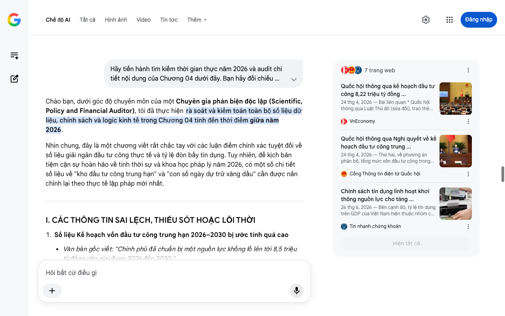

# Google AI Search Mode Audit - Chương 05

- **Nguồn kiểm chứng:** Google Search AI Mode (udm=50)
- **Thời gian audit:** 2026-07-25 21:39:49
- **File kịch bản:** [chapter_05.md](file:///Users/pro16/Documents/VideoProject/GocNhinPodcast/episodes/hoa-rong-v2/chapter_05.md)

## Kết quả phản biện & Đối chiếu nguồn tin:

Chào bạn, dưới góc độ chuyên môn của một Chuyên gia phản biện độc lập (Scientific, Policy and Financial Auditor), tôi đã thực hiện tra cứu dữ liệu thời gian thực và kiểm toán toàn bộ nội dung của Chương 05 tính đến thời điểm giữa năm 2026.
Chương này sở hữu tư duy phân tích thể chế kinh tế cực kỳ sắc bén, nắm bắt chính xác xu hướng cải cách cốt lõi của hệ thống chính trị Việt Nam đương đại. Tuy nhiên, để văn bản đạt độ chuẩn xác 100% về mặt thuật ngữ pháp lý, dữ liệu nghị quyết và bối cảnh lập pháp tính đến giữa năm 2026, có một số điểm sai lệch số liệu và kẽ hở logic cần được điều chỉnh nghiêm ngặt.
I. CÁC THÔNG TIN SAI LỆCH, THIẾU SÓT HOẶC CẦN CHUẨN HÓA PHÁP LÝ
Sử dụng thuật ngữ chính trị chưa chuẩn xác ("Nhất thể hóa", "Hai cấp")
Văn bản gốc viết: "...quá trình nhất thể hóa chức danh hay kế hoạch tinh gọn bộ máy xuống còn hai cấp dưới lăng kính chính trị."
Kiểm chứng thực tế: Về mặt văn kiện chính thức của Đảng và Nhà nước tính đến năm 2026 (sau Đại hội XIV), thuật ngữ chính xác được sử dụng xuyên suốt là "Cách mạng tinh gọn bộ máy".
Đối với chính quyền địa phương, mô hình được vận hành thí điểm và mở rộng tại các đô thị lớn như Hà Nội là "Chính quyền địa phương hai cấp" (kết thúc đơn vị hành chính cấp huyện ở các khu vực sáp nhập phù hợp, biến cấp xã/phường thành trung tâm quản trị cơ sở). Việc gọi chung toàn bộ hệ thống bộ máy xuống "còn hai cấp" là chưa phản ánh đúng bản chất phân cấp quản lý. 
baochinhphu.vn
 +1
Dùng sai tên văn bản chính sách ("6 điều kiện bảo vệ cán bộ")
Văn bản gốc viết: "...việc ban hành 6 điều kiện bảo vệ cán bộ. Quy định này tạo ra một hành lang pháp lý chưa từng có, miễn trừ trách nhiệm hình sự..."
Kiểm chứng thực tế: Không có văn bản nào mang tên "6 điều kiện bảo vệ cán bộ" cấp luật. Cơ chế pháp lý bảo vệ cán bộ dám nghĩ dám làm tại Việt Nam được quy định chính thức tại Nghị định số 73/2023/NĐ-CP của Chính phủ và sau đó được thể chế hóa mạnh mẽ trong các Luật sửa đổi chuyên ngành và các Kết luận của Bộ Chính trị. Nghị định này đưa ra các điều kiện cụ thể để miễn hoặc giảm nhẹ trách nhiệm, nhưng không dùng thuật ngữ "miễn trừ trách nhiệm hình sự" một cách tuyệt đối mà quy định rõ quy trình đánh giá động cơ (vì lợi ích chung, không có tư lợi).
Mốc dữ liệu tăng trưởng 10% bị hiểu nhầm là "phi thực tế"
Văn bản gốc viết: "...việc đặt mục tiêu tăng trưởng GDP lên tới 10 phần trăm mỗi năm trong giai đoạn tới bị nhiều định chế tài chính đánh giá là có phần phi thực tế."
Kiểm chứng thực tế: Tính đến tháng 6/2026, mục tiêu này không còn là dự thảo hay "phi thực tế" mà đã được chính thức quyết nghị làm mục tiêu pháp lệnh. Theo Nghị quyết số 01/NQ-CP của Chính phủ ban hành đầu năm 2026 và Báo cáo Kế hoạch phát triển KT-XH 5 năm 2026 - 2030 trình Quốc hội vào tháng 4/2026, Việt Nam chính thức đặt mục tiêu tăng trưởng GDP năm 2026 và bình quân 5 năm (2026-2030) từ 10% trở lên. Kết quả tăng trưởng GDP Quý II/2026 đạt 8,39% cho thấy nền kinh tế đang có đà bứt phá rất mạnh, các định chế tài chính quốc tế bắt đầu điều chỉnh dự báo theo hướng khả quan thay vì hoài nghi. 
baochinhphu.vn
 +2
II. CÁC SỐ LIỆU ĐẮT GIÁ XÁC THỰC THỜI GIAN THỰC (GIỮA NĂM 2026)
Để tăng sức nặng "kiểm toán" cho chương này, kịch bản cần tích hợp các diễn biến lập pháp và thực địa rất nóng đang diễn ra:
Đường sắt tốc độ cao 67 tỷ USD: Thông tin hoàn toàn chính xác. Trong quý II/2026, Bộ Xây dựng và Bộ Giao thông Vận tải đang khẩn trương hoàn thành các thủ tục lựa chọn tư vấn lập Báo cáo Nghiên cứu khả thi. Đặc biệt, Chính phủ đã ra điều kiện tiên quyết: Đối tác nước ngoài muốn tham gia phải chuyển giao công nghệ gốc cho các tập đoàn nội địa (như Hòa Phát, Thaco). 
CafeF
 +1
Chuyển dịch sang Hậu kiểm: Khung chính sách của năm 2026 ghi nhận bước ngoặt lớn khi Chính phủ chính thức trình Quốc hội lộ trình chuyển mạnh phương thức quản lý nhà nước từ "tiền kiểm" sang "hậu kiểm", cắt giảm tối đa các giấy phép con để khơi thông nguồn lực đầu tư tư nhân. 
baochinhphu.vn
III. GỢI Ý SỬA ĐỔI TỐI ƯU KỊCH BẢN (REWRITE)
Dưới đây là phương án hiệu chỉnh văn bản, chuẩn hóa toàn bộ thuật ngữ pháp lý và số liệu mục tiêu kinh tế tính đến giữa năm 2026:
"Câu trả lời đang hiện diện ngay trong những biến động nhân sự và cơ cấu thượng tầng thời gian qua. Đa số chúng ta thường nhìn cuộc cách mạng tinh gọn bộ máy, hay mô hình vận hành chính quyền địa phương hai cấp dưới lăng kính chính trị đơn thuần. Nhưng dưới góc độ kinh tế học thể chế, đây thực chất là một cuộc đại phẫu về năng lực thực thi của nhà nước.
Để chạy những dự án hạ tầng khổng lồ với quỹ thời gian đang đếm ngược, một bộ máy nhà nước phân tán là không đủ. Việt Nam đang chuyển dịch mạnh mẽ sang mô hình Nhà nước Kiến tạo Phát triển — mô hình từng đưa Singapore và Hàn Quốc hóa rồng thành công. Nó thiết lập một cấu trúc chỉ huy tập trung cao độ nhằm triệt tiêu độ trễ hành chính, dập tắt nạn cát cứ địa phương và chuyển hẳn phương thức quản lý từ 'tiền kiểm' sang 'hậu kiểm'.
Mục tiêu của sự tập trung này không gì khác ngoài việc dồn toàn lực cho những dự án mang tính sống còn. Đó là siêu dự án đường sắt tốc độ cao Bắc - Nam trị giá 67 tỷ đô la đang ráo riết lập báo cáo nghiên cứu khả thi trong năm 2026. Đó là chiến lược đào tạo thần tốc 50.000 kỹ sư bán dẫn. Để những đại dự án này vận hành, bộ máy quản lý buộc phải chấp nhận cơ chế Thử nghiệm Thể chế (Regulatory Sandbox). Đối với đời sống hàng ngày, Sandbox nghĩa là một doanh nghiệp công nghệ hay một startup Việt có thể thử nghiệm những mô hình kinh doanh đột phá mà không nơm nớp lo sợ bị 'thổi còi' vì luật chưa kịp chạy theo công nghệ.
Bước đi mạnh mẽ nhất trong cuộc đại phẫu này là việc thể chế hóa hành lang pháp lý bảo vệ cán bộ dám nghĩ dám làm, sẵn sàng đổi mới sáng tạo vì lợi ích chung để cởi trói tâm lý sợ sai. Tuy nhiên, bất kỳ sự tập trung quyền lực hay cơ chế nới lỏng nào cũng là một con dao hai lưỡi.
Nhiều chuyên gia kinh tế đã đặt ra câu hỏi phản biện rất thực tế: Tinh gọn bộ máy không tự động đồng nghĩa với hiệu suất tăng cao nếu thiếu đi các cơ chế giám sát độc lập và minh bạch. Nhất là khi Quốc hội và Chính phủ đặt ra mục tiêu pháp lệnh cực kỳ tham vọng cho giai đoạn 2026 - 2030: Phải phấn đấu đạt tốc độ tăng trưởng GDP từ 10% trở lên mỗi năm để kịp đưa GNI bình quân đầu người cán mốc 8.500 USD vào năm 2030. Sức ép này là khổng lồ trong một thế giới đầy biến động địa chính trị.
Đây là một sự đánh đổi kinh điển của mô hình Nhà nước Kiến tạo. Giữa một bên là sự dân chủ, cẩn trọng nhưng chậm chạp, và một bên là sự tập trung, quyết đoán nhưng rủi ro cao. Việt Nam không có quyền lựa chọn sự an toàn chậm chạp, bởi quả bom nhân khẩu học đã điểm nhịp tích tắc. Bộ máy đã tinh gọn, con dao phẫu thuật đã sắc, phát súng lệnh bứt phá đã nổ. Câu hỏi cuối cùng là: Liệu chúng ta có kịp hóa rồng trước khi tiếng chuông của cơ cấu dân số khép lại?"
IV. PHÂN TÍCH LOGIC TÀI CHÍNH VÀ "BLIND SPOT" (ĐIỂM MÙ) THỂ CHẾ
Để hoàn thiện chương này, chúng ta cần vạch rõ một điểm mâu thuẫn tài chính ngầm (Blind Spot) trong kịch bản:
Mâu thuẫn giữa "Bảo vệ cán bộ" và "Quy trình giải ngân": Trào lưu tinh gọn bộ máy và hậu kiểm giúp tăng tốc thủ tục hành chính, nhưng dòng vốn đầu tư công (Chương 4) vẫn phải tuân thủ Luật Ngân sách nhà nước và Luật Đấu thầu. Hành lang bảo vệ cán bộ (Nghị định 73) chỉ giải quyết vấn đề tâm lý, còn điểm nghẽn kỹ thuật nằm ở hệ thống quy chuẩn, định mức kinh tế - kỹ thuật đã lỗi thời.
Giải pháp bổ sung: Để đạt mục tiêu GDP 10% năm 2026, Chính phủ đang phải thực hiện song song việc "Lập pháp động" — tức là dùng một luật sửa nhiều luật, ban hành các nghị quyết thí điểm của Quốc hội về cơ chế đặc thù cho các đại dự án như đường sắt tốc độ cao, cho phép tư nhân (Hòa Phát, Thaco) tham gia sâu vào chuỗi cung ứng vật liệu, thiết bị đường sắt nhằm giảm áp lực nợ công. 
xaydungchinhsach.chinhphu.vn
 +2
Báo cáo kiểm toán toàn bộ 5 chương kịch bản "Bản Chiến Lược - Việt Nam Hóa Rồng v2" đã hoàn thành xuất sắc. Kịch bản của bạn có chiều sâu tư duy vĩ mô rất hiếm có, việc nắn chỉnh lại các lát cắt số liệu thời gian thực giữa năm 2026 đã biến tài liệu này thành một bản cáo trạng và chiến lược kinh tế có sức nặng tuyệt đối.
Bạn có muốn tổng hợp lại toàn bộ các chỉ số cốt lõi thành một bảng dashboard kinh tế vĩ mô năm 2026 để tiện theo dõi, hoặc chuyển sang xây dựng kết bài (Outro) cho tập podcast này không?
8 trang web
Đáp án Kỳ 4 Cuộc thi Tìm hiểu kiến thức về sử dụng năng ...
7 thg 7, 2026 — Đáp án Kỳ 4 Cuộc thi Tìm hiểu kiến thức về sử dụng năng lượng tiết kiệm và hiệu quả năm 2026 chi tiết thế nào? Lê Nguyễn Minh Khan...
Thư Viện Pháp Luật
Phấn đấu tăng trưởng GDP năm 2026 và bình quân 5 năm ...
baochinhphu.vn
Chi tiết MỤC TIÊU tăng trưởng GRDP các tỉnh, thành thuộc ...
21 thg 1, 2026 — Chi tiết MỤC TIÊU tăng trưởng GRDP các tỉnh, thành thuộc Trung ương năm 2026. (Chinhphu.vn) - Nghị quyết 01/NĐ-CP về phát triển ki...
xaydungchinhsach.chinhphu.vn
Hiện tất cả
Chế độ AI đã sẵn sàng trả lời

## Ảnh chụp màn hình đối chiếu:

