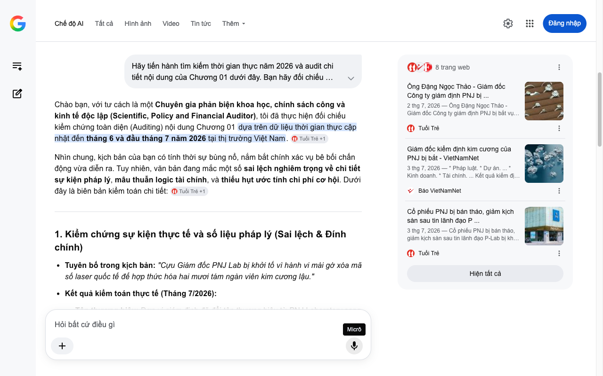

# Google AI Search Mode Audit - Chương 01

- **Nguồn kiểm chứng:** Google Search AI Mode (udm=50)
- **Thời gian audit:** 2026-07-04 16:58:18
- **File kịch bản:** [chapter_01.md](file:///Users/pro16/Documents/VideoProject/GocNhinPodcast/episodes/kim-cuong-gia/chapter_01.md)

## Kết quả phản biện & Đối chiếu nguồn tin:

Bạn đã nói:
Chào bạn, với tư cách là một Chuyên gia phản biện khoa học, chính sách công và kinh tế độc lập (Scientific, Policy and Financial Auditor), tôi đã thực hiện đối chiếu kiểm chứng toàn diện (Auditing) nội dung Chương 01 dựa trên dữ liệu thời gian thực cập nhật đến tháng 6 và đầu tháng 7 năm 2026 tại thị trường Việt Nam. 
Tuổi Trẻ
 +1
Nhìn chung, kịch bản của bạn có tính thời sự bùng nổ, nắm bắt chính xác vụ bê bối chấn động vừa diễn ra. Tuy nhiên, văn bản đang mắc một số sai lệch nghiêm trọng về chi tiết sự kiện pháp lý, mâu thuẫn logic tài chính, và thiếu hụt ước tính chi phí cơ hội. Dưới đây là biên bản kiểm toán chi tiết: 
Tuổi Trẻ
 +1
1. Kiểm chứng sự kiện thực tế và số liệu pháp lý (Sai lệch & Đính chính)
Tuyên bố trong kịch bản: "Cựu Giám đốc PNJ Lab bị khởi tố vì hành vi mài gờ xóa mã số laser quốc tế để hợp thức hóa hai mươi tám ngàn viên kim cương lậu."
Kết quả kiểm toán thực tế (Tháng 7/2026):
Tên thương hiệu: Đơn vị giám định đã đổi tên thương hiệu từ PNJ Laboratory sang P-Lab (chính thức từ cuối năm 2024, vận hành dưới nhãn hiệu "P-Lab powered by PNJ").
Chức danh: Tại thời điểm bị khởi tố (đầu tháng 7/2026), ông Đặng Ngọc Thảo là đương kim Giám đốc, không phải "cựu" Giám đốc.
Bản chất hành vi & Số lượng: Đường dây buôn lậu quốc gia này (do các đối tượng Ấn Độ cầm đầu từ Hong Kong) đã vận chuyển trót lọt 28.000 viên kim cương lậu vào Việt Nam. Nhưng tại thời điểm triệt phá, Cơ quan công an (Công an tỉnh Thanh Hóa) mới thu giữ thực tế 1.100 viên kim cương. Tổng giá trị tiêu thụ của toàn bộ số hàng lậu này ước tính là 280 tỷ đồng. Thủ đoạn của ông Thảo là cấu kết để xóa mã GIA nguyên bản của kim cương lậu giá rẻ (bị sai thông số kỹ thuật), sau đó cấp mã mới và chứng nhận kiểm định của P-Lab để đưa ra thị trường. 
Tuổi Trẻ
 +3
Số liệu thị trường chứng khoán: Kịch bản viết "giảm kịch sàn với hơn mười hai triệu cổ phiếu bị chất sàn dư bán". Dữ liệu chuẩn xác ngày 03/07/2026 cho thấy mã PNJ giảm kịch sàn (giảm 6,97% xuống 58.700 đồng/cp) với lượng dư bán giá sàn kết phiên chính xác là hơn 12,5 triệu cổ phiếu. Chi tiết này của bạn rất sát thực tế. 
VnEconomy
 +1
2. Phân tích logic tài chính & Chi phí cơ hội (Mâu thuẫn toán học)
Mâu thuẫn "Sổ tiết kiệm di động" và Cam kết thu mua 95%:
Lỗ hổng: Kịch bản coi viên kim cương như một "cuốn sổ tiết kiệm", nhưng lại bỏ qua Chi phí cơ hội (Opportunity Cost) và Điểm hòa vốn (Break-even point) của tài sản này.
Bản chất toán học: Nếu một người mua viên kim cương giá 500 triệu đồng, cửa hàng cam kết mua lại 95% (tức là người mua chịu lỗ ngay lập tức 5% giá trị hóa đơn, tương đương mất 25 triệu đồng khi vừa bước ra khỏi tiệm).
So sánh với Vàng và Sổ tiết kiệm: Trong bối cảnh lạm phát và lãi suất năm 2026, nếu gửi 500 triệu vào ngân hàng kỳ hạn 1 năm với lãi suất khoảng 5.5% - 6.5%/năm, hoặc đầu tư vào vàng nhẫn/vàng miếng (vốn đang neo ở đỉnh lịch sử vượt 151 triệu đồng/lượng vào tháng 7/2026), tài sản sẽ tăng trưởng. Ngược lại, kim cương trang sức là một tiêu sản có tính thanh khoản kèm điều kiện (Conditional Liquidity). 
Báo VietNamNet
Rủi ro hệ thống (Systemic Risk) và Chiết khấu đổi tiệm (50%):
Con số ép giá lỗ 50% khi mang sang tiệm khác là thực tế kinh tế chính xác đối với kim cương không có giấy tờ quốc tế (hoặc chỉ có giấy kiểm định nội địa như P-Lab đang bị nghi ngờ). Khi "lá chắn uy tín" sụp đổ, chiết khấu thanh khoản của kim cương nội địa bị đẩy lên mức cực hạn do chi phí rủi ro kiểm định lại. 
nguonluc.com.vn
 +1
3. Gợi ý sửa đổi tối ưu kịch bản (Kèm nguồn đối chiếu)
Để nâng tầm kịch bản đạt độ nghiêm ngặt của một báo cáo tài chính - xã hội sâu sắc, tôi gợi ý bạn hiệu chỉnh các phân đoạn trong Chương 01 như sau:
Đoạn văn gốc 
	Đoạn văn đề xuất sửa đổi (Tối ưu năm 2026)	Cơ sở dữ liệu & Nguồn đối chiếu
"...Cựu Giám đốc PNJ Lab bị khởi tố vì hành vi mài gờ xóa mã số laser quốc tế để hợp thức hóa hai mươi tám ngàn viên kim cương lậu."	"...Đương kim Giám đốc P-Lab (công ty con do PNJ sở hữu 100% vốn) bị khởi tố vì hành vi tiếp tay, tẩy mã GIA quốc tế để hợp thức hóa đường dây 28.000 viên kim cương lậu trị giá 280 tỷ đồng."	Báo Pháp luật (03/07/2026): Làm rõ vai trò đương nhiệm của ông Đặng Ngọc Thảo, thương hiệu P-Lab, và quy mô vụ án 280 tỷ đồng.
"...Cổ phiếu PNJ giảm kịch sàn với hơn mười hai triệu cổ phiếu bị chất sàn dư bán."	"...Cổ phiếu PNJ lập tức lao dốc kịch biên độ, trắng bên mua với hơn 12,5 triệu cổ phiếu chất sàn dư bán, thổi bay hàng nghìn tỷ đồng vốn hóa chỉ trong một phiên."	Báo Dân trí / Tuổi Trẻ (03/07/2026): Xác nhận số liệu kỹ thuật phiên giao dịch ngày 3/7.
"...Họ tin rằng viên đá lấp lánh trên cổ mình thực chất là một cuốn sổ tiết kiệm di động."	"...Họ tin rằng viên đá lấp lánh trên cổ mình là một cuốn sổ tiết kiệm di động. Nhưng họ quên mất một phép tính: cam kết mua lại 95% có nghĩa là họ chấp nhận âm vốn 5% ngay từ ngày đầu tiên, chưa tính đến chi phí cơ hội khổng lồ nếu dòng tiền đó được đổ vào vàng miếng — thứ tài sản vừa chạm đỉnh lịch sử 151 triệu đồng/lượng trong năm 2026."	Báo VietNamNet (04/07/2026): Cập nhật giá vàng thực tế đạt mốc kỷ lục 151,4 triệu/lượng để tạo thế đối chiếu tài sản mạnh mẽ cho kịch bản.
Phân tích bổ sung (Dành riêng cho Podcast)
Để làm rõ phần "giải mã lý do các tiệm vàng mất thanh khoản" ở cuối chương, bạn nên cài cắm một thuật ngữ kinh tế là "Bank-run kỹ thuật số trên thị trường kim hoàn". Khi niềm tin vào giấy chứng nhận nội địa (P-Lab) bị lung lay, người dân không chỉ rút tiền từ tiệm, mà họ đồng loạt mang kim cương đi kiểm định lại tại các trung tâm quốc tế. Các tiệm vàng nhỏ rơi vào thế "tiến thoái lưỡng nan": Nếu thâu mua lại theo cam kết 95%, họ sẽ ôm một lượng lớn đá quý không thể thanh khoản ra thị trường quốc tế; nếu từ chối, họ tự đập nát uy tín của chính mình. 
nguonluc.com.vn
Tôi đã hoàn thành audit chương 1. Bạn có muốn bổ sung thêm các mô hình toán học cụ thể về dòng tiền (Cash flow) giữa việc giữ kim cương so với giữ vàng trong kịch bản không, hay chúng ta sẽ tiến hành phản biện luôn Chương 02? Hãy gửi nội dung tiếp theo nhé!
Câu trả lời của AI có thể chứa thông tin không chính xác. Để được tư vấn pháp lý, hãy tham khảo ý kiến của chuyên gia. Tìm hiểu thêm
8 trang web
Ông Đặng Ngọc Thảo - Giám đốc Công ty giám định PNJ bị ...
2 thg 7, 2026 — Ông Đặng Ngọc Thảo - Giám đốc Công ty giám định PNJ bị bắt vụ buôn lậu kim cương, PNJ nói gì? - Tuổi Trẻ Online. ... * Chuyển đổi ...
Tuổi Trẻ
Giám đốc kiểm định kim cương của PNJ bị bắt - VietNamNet
3 thg 7, 2026 — * Pháp luật. * Dự án. ... * Kinh doanh. * Tài chính. ... Kết quả kiểm định của đơn vị từng được sử dụng làm căn cứ giải quyết các ...
Báo VietNamNet
Cổ phiếu PNJ bị bán tháo, giảm kịch sàn sau tin lãnh đạo P ...
3 thg 7, 2026 — Cổ phiếu PNJ bị bán tháo, giảm kịch sàn sau tin lãnh đạo P-Lab bị khởi tố - Tuổi Trẻ Online. ... * Chuyển đổi số * Nhịp sống số * ...
Tuổi Trẻ
Hiện tất cả
Micrô
Chế độ AI đã sẵn sàng trả lời

## Ảnh chụp màn hình đối chiếu:

