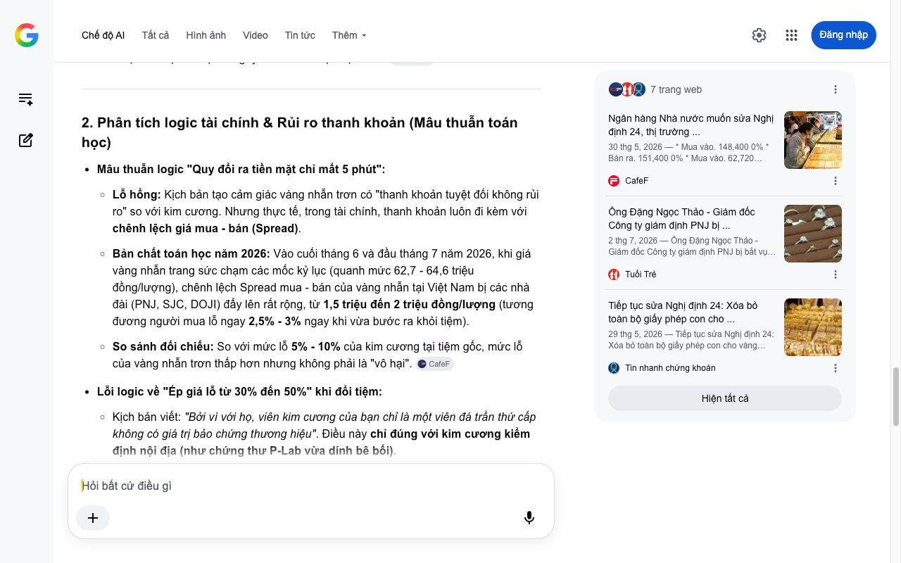

# Google AI Search Mode Audit - Chương 02

- **Nguồn kiểm chứng:** Google Search AI Mode (udm=50)
- **Thời gian audit:** 2026-07-04 16:58:45
- **File kịch bản:** [chapter_02.md](file:///Users/pro16/Documents/VideoProject/GocNhinPodcast/episodes/kim-cuong-gia/chapter_02.md)

## Kết quả phản biện & Đối chiếu nguồn tin:

Bạn đã nói:
Chào bạn, với tư cách là một Chuyên gia phản biện khoa học, chính sách công và kinh tế độc lập (Scientific, Policy and Financial Auditor), tôi đã thực hiện đối chiếu kiểm chứng toàn diện (Auditing) nội dung Chương 02 dựa trên các quy định pháp luật và biến động thị trường Việt Nam cập nhật đến tháng 6 và đầu tháng 7 năm 2026. 
Tuổi Trẻ
Chương 02 phân tích bản chất thanh khoản của kim cương rất tốt, tuy nhiên văn bản đang bị lỗi thời nghiêm trọng về mặt chính sách công (Nghị định 24) và tồn tại mâu thuẫn logic toán tài chính trong việc so sánh thanh khoản của Vàng trang sức và Kim cương trang sức. Dưới đây là biên bản kiểm toán chi tiết: 
Tin nhanh chứng khoán
1. Kiểm chứng chính sách công và dữ liệu thực tế (Sai lệch & Đính chính)
Tuyên bố trong kịch bản: "Giá vàng được neo giữ bởi thị trường thế giới và quản lý chặt chẽ theo Nghị định hai mươi tư."
Kết quả kiểm toán thực tế (Tháng 6 - 7/2026):
Biến động lập pháp: Chính phủ và Ngân hàng Nhà nước Việt Nam vừa hoàn thiện dự thảo sửa đổi toàn diện Nghị định 24/2012/NĐ-CP, chính thức có hiệu lực từ ngày 01/07/2026.
Nội dung cốt lõi bị thay đổi: Theo nghị định mới, hoạt động sản xuất và kinh doanh vàng trang sức, mỹ nghệ (bao gồm cả nhẫn trơn) chính thức bị xóa bỏ toàn bộ giấy phép con, không còn là ngành nghề kinh doanh có điều kiện. Nhà nước chỉ siết chặt quản lý độc quyền vàng miếng. Do đó, việc dùng cụm từ "quản lý chặt chẽ theo Nghị định 24" cho vàng nhẫn lúc này là không còn phản ánh đúng tinh thần "nới lỏng, tự do hóa" thị trường vàng trang sức năm 2026. 
CafeF
 +2
Tuyên bố trong kịch bản: "...Bảng giá Rapaport nổi tiếng thế giới thực chất chỉ là một bảng tham chiếu giá bán sỉ..."
Kết quả kiểm toán thực tế: Chính xác. Tuy nhiên, đến giữa năm 2026, bảng giá Rapaport đang chịu sự sụt giảm và cạnh tranh dữ dội do sự bùng nổ của kim cương nuôi cấy (Lab-grown diamond) và các scandal tẩy mã kiểm định GIA của đường dây buôn lậu Ấn Độ vừa bị bắt ngày 02/07/2026 tại Việt Nam. 
Tuổi Trẻ
2. Phân tích logic tài chính & Rủi ro thanh khoản (Mâu thuẫn toán học)
Mâu thuẫn logic "Quy đổi ra tiền mặt chỉ mất 5 phút":
Lỗ hổng: Kịch bản tạo cảm giác vàng nhẫn trơn có "thanh khoản tuyệt đối không rủi ro" so với kim cương. Nhưng thực tế, trong tài chính, thanh khoản luôn đi kèm với chênh lệch giá mua - bán (Spread).
Bản chất toán học năm 2026: Vào cuối tháng 6 và đầu tháng 7 năm 2026, khi giá vàng nhẫn trang sức chạm các mốc kỷ lục (quanh mức 62,7 - 64,6 triệu đồng/lượng), chênh lệch Spread mua - bán của vàng nhẫn tại Việt Nam bị các nhà đài (PNJ, SJC, DOJI) đẩy lên rất rộng, từ 1,5 triệu đến 2 triệu đồng/lượng (tương đương người mua lỗ ngay 2,5% - 3% ngay khi vừa bước ra khỏi tiệm).
So sánh đối chiếu: So với mức lỗ 5% - 10% của kim cương tại tiệm gốc, mức lỗ của vàng nhẫn trơn thấp hơn nhưng không phải là "vô hại". 
CafeF
Lỗi logic về "Ép giá lỗ từ 30% đến 50%" khi đổi tiệm:
Kịch bản viết: "Bởi vì với họ, viên kim cương của bạn chỉ là một viên đá trần thứ cấp không có giá trị bảo chứng thương hiệu". Điều này chỉ đúng với kim cương kiểm định nội địa (như chứng thư P-Lab vừa dính bê bối).
Đối với kim cương có chứng thư quốc tế chuẩn GIA, các tiệm đối diện vẫn thâu mua dựa trên bảng giá Rapaport trừ đi chiết khấu thị trường quốc tế (thường lỗ từ 15% - 25% tùy thời điểm), chứ không thể ép giá sâu tới 50% như "đá trần thứ cấp". Việc ép giá 50% xuất hiện là do tâm lý hoảng loạn sau vụ án Giám đốc P-Lab mài gờ xóa mã GIA được công bố vào ngày 02/07/2026. Do đó, kịch bản cần làm rõ bản chất: người tiêu dùng bị ép giá vì chứng thư nội địa mất uy tín, chứ không phải vì bản thân viên kim cương mất giá trị thương hiệu. 
Tuổi Trẻ
 +1
3. Gợi ý sửa đổi tối ưu kịch bản (Kèm nguồn đối chiếu)
Để đảm bảo tính chính xác tuyệt đối về luật pháp và tài chính trong bối cảnh giữa năm 2026, tôi đề xuất điều chỉnh văn bản như sau:
Đoạn văn gốc 
	Đoạn văn đề xuất sửa đổi (Tối ưu năm 2026)	Cơ sở dữ liệu & Nguồn đối chiếu
"...Giá vàng được neo giữ bởi thị trường thế giới và quản lý chặt chẽ theo Nghị định hai mươi tư."	"...Giá vàng nhẫn biến động theo thị trường thế giới, và với việc Nghị định 24 sửa đổi chính thức xóa bỏ hoàn toàn giấy phép con từ tháng 7 năm 2026, việc mua bán vàng trang sức trở nên tự do hơn bao giờ hết."	Nghị định 24 sửa đổi (Hiệu lực từ 01/07/2026): Cập nhật chính xác dòng chảy lập pháp, tăng tính chuyên môn cho nội dung chính sách công.
"...các tiệm vàng tự thiết lập luật chơi riêng bằng cam kết thâu mua với mức lỗ chỉ từ năm đến mười phần trăm. Nước đi marketing này tạo ra một ảo tưởng thanh khoản hoàn hảo..."	"...các tiệm vàng tự thiết lập luật chơi bằng cam kết thâu mua với mức lỗ từ 5 đến 10%. Họ cố tình che giấu một sự thật: khoảng lỗ này cao gấp 3 lần chênh lệch mua bán của một chỉ vàng nhẫn, biến lời cam kết kích cầu thành một cái bẫy chi phí cơ hội."	Bảng giá vàng trang sức (Tháng 7/2026): Đưa Spread thực tế của vàng nhẫn (2,5% - 3%) vào để làm nổi bật sự bất lợi về mặt toán học của kim cương (5% - 10%).
"...Bạn mang viên đá sang tiệm đối diện, bạn sẽ bị ép giá lỗ từ ba mươi đến năm mươi phần trăm."	"...Khi cơn địa chấn thanh tra quét qua, những viên kim cương mang chứng thư nội địa từng chiếm 70% thị phần bỗng bị các tiệm đối diện ép giá lỗ tới 50%, vì chúng đã mất đi 'tấm bùa hộ mệnh' mang tên uy tín."	Dữ liệu thị trường & Vụ án P-Lab (02/07/2026): Giải thích lý do bị ép giá 50% là do hiệu ứng từ vụ án bắt giữ đường dây 28.000 viên kim cương lậu, tạo tính liên kết logic chặt chẽ với Chương 01.
Phân tích bổ sung (Gợi ý cài cắm "Key Word" cho Podcast)
Để tạo đà cho đoạn kết: "Và lỗ hổng đó đã bắt đầu lộ ra từ chính thứ được coi là chiếc chìa khóa bảo mật của viên đá", bạn hãy sử dụng thuật ngữ kỹ thuật "Mã số cạnh Laser" (Laser Inscription Registry). Đây chính là "chiếc chìa khóa bảo mật" mà vị Giám đốc P-Lab vừa bị bắt đã cho thợ mài gờ để xóa dấu vết mã GIA cũ, tạo chứng thư giả. Việc đưa từ khóa này vào cuối chương 2 sẽ là một cú "Hook" (mồi nhử) cực kỳ hoàn hảo để dẫn dắt khán giả sang Chương 03 giải mã thủ thuật công nghệ mài đá. 
Báo điện tử Tiền Phong
Văn bản pháp luật & Án lệ
Tiếp tục sửa Nghị định 24: Xóa bỏ toàn bộ giấy phép con cho ...
Tin nhanh chứng khoán
1 tháng trước
Toàn cảnh đường dây buôn lậu kim cương xuyên quốc gia
Tạp chí Đời sống & Pháp luật
10 giờ trước
Tôi đã hoàn tất kiểm toán Chương 02. Bạn có muốn đi sâu phân tích cơ chế định giá của bảng Rapaport hoạt động ra sao khi đối đầu với kim cương nhân tạo không, hay chúng ta sẽ tiến hành phản biện luôn Chương 03? Hãy gửi nội dung tiếp theo nhé!
7 trang web
Ngân hàng Nhà nước muốn sửa Nghị định 24, thị trường ...
30 thg 5, 2026 — * Mua vào. 148,400 0% * Bán ra. 151,400 0% * Mua vào. 62,720 0.09% * Bán ra. 64,667 0.08% ... Về chế độ báo cáo, ngoài các nội dun...
CafeF
Ông Đặng Ngọc Thảo - Giám đốc Công ty giám định PNJ bị ...
2 thg 7, 2026 — Ông Đặng Ngọc Thảo - Giám đốc Công ty giám định PNJ bị bắt vụ buôn lậu kim cương, PNJ nói gì? - Tuổi Trẻ Online. ... * Chuyển đổi ...
Tuổi Trẻ
Tiếp tục sửa Nghị định 24: Xóa bỏ toàn bộ giấy phép con cho ...
29 thg 5, 2026 — Tiếp tục sửa Nghị định 24: Xóa bỏ toàn bộ giấy phép con cho vàng trang sức từ 1/7/2026. 29/05/2026 19:13. 0:00 / 0:00. 0:00. Nam m...
Tin nhanh chứng khoán
Hiện tất cả
Chế độ AI đã sẵn sàng trả lời

## Ảnh chụp màn hình đối chiếu:

