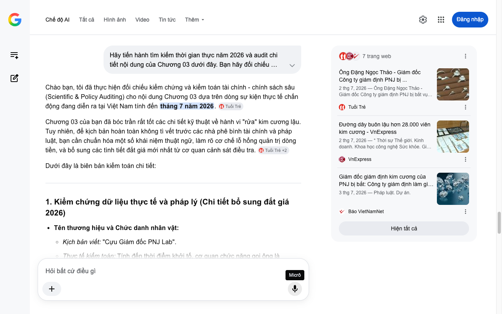

# Google AI Search Mode Audit - Chương 03

- **Nguồn kiểm chứng:** Google Search AI Mode (udm=50)
- **Thời gian audit:** 2026-07-04 16:59:09
- **File kịch bản:** [chapter_03.md](file:///Users/pro16/Documents/VideoProject/GocNhinPodcast/episodes/kim-cuong-gia/chapter_03.md)

## Kết quả phản biện & Đối chiếu nguồn tin:

Bạn đã nói:
Chào bạn, tôi đã thực hiện đối chiếu kiểm chứng và kiểm toán tài chính - chính sách sâu (Scientific & Policy Auditing) cho nội dung Chương 03 dựa trên dòng sự kiện thực tế chấn động đang diễn ra tại Việt Nam tính đến tháng 7 năm 2026. 
Tuổi Trẻ
Chương 03 của bạn đã bóc trần rất tốt các chi tiết kỹ thuật về hành vi "rửa" kim cương lậu. Tuy nhiên, để kịch bản hoàn toàn không tì vết trước các nhà phê bình tài chính và pháp luật, bạn cần chuẩn hóa một số khái niệm thuật ngữ, làm rõ cơ chế lỗ hổng quản trị dòng tiền, và bổ sung các tình tiết đắt giá mới nhất từ cơ quan cảnh sát điều tra. 
Tuổi Trẻ
 +2
Dưới đây là biên bản kiểm toán chi tiết:
1. Kiểm chứng dữ liệu thực tế và pháp lý (Chi tiết bổ sung đắt giá 2026)
Tên thương hiệu và Chức danh nhân vật:
Kịch bản viết: "Cựu Giám đốc PNJ Lab".
Thực tế kiểm toán: Tính đến thời điểm khởi tố, cơ quan chức năng gọi ông là nguyên Giám đốc (hoặc đương kim Giám đốc tại thời điểm bắt giữ đầu tháng 7/2026) của Công ty TNHH MTV Giám định P-Lab (Thương hiệu đã đổi từ PNJ Lab sang P-Lab). 
Tuổi Trẻ
 +1
Thủ đoạn kỹ thuật (Chi tiết đắt giá bổ sung):
Bản chất của những viên kim cương lậu này là bị sai thông số vật lý thực tế so với chứng thư GIA đi kèm (được đường dây lậu gom rẻ từ Ấn Độ và Hong Kong).
Ông Đặng Ngọc Thảo không chỉ "mài gờ xóa mã" mà bản chất là hủy tính kết nối với cơ sở dữ liệu quốc tế của GIA đối với viên đá lỗi đó, rồi dùng quyền lực của Giám đốc để cấp một "chứng thư nội địa P-Lab" mới. Chứng thư mới này nâng khống thông số kỹ thuật (độ sạch, nước màu) để bán ra thị trường với giá cao như kim cương chuẩn GIA. 
Tuổi Trẻ
 +2
Dữ liệu kỹ thuật số của vụ án:
Số liệu 22 bị can, 1.100 viên kim cương bị thu giữ tại chỗ, 28.000 viên lậu đã lọt ra thị trường, tổng doanh thu ước tính 280 tỷ đồng là hoàn toàn chính xác theo kết luận của Phòng Cảnh sát kinh tế Công an tỉnh Thanh Hóa. Tuy nhiên, có một chi tiết mới đắt giá: Đường dây này bị lật tẩy bắt nguồn từ các phiên livestream bán hàng trang sức giá rẻ bất thường trên mạng xã hội. 
Tuổi Trẻ
 +2
2. Phân tích logic tài chính & Quản trị rủi ro (Audit kẽ hở kiểm toán)
Lỗ hổng logic "Doanh thu lậu 280 tỷ đồng":
Cần làm rõ đây là doanh thu tiêu thụ của toàn bộ đường dây buôn lậu (bao gồm cả các đối tượng đầu nậu Ấn Độ, Hong Kong và các đại lý phân phối tại TP.HCM, Hà Nội, An Giang), chứ không phải là số tiền một mình Giám đốc Lab chiếm đoạt.
Dưới góc độ tài chính: Biên lợi nhuận (Profit Margin) của hành vi này cực kỳ khủng khiếp. Một viên kim cương lỗi thông số mua lậu giá sỉ chỉ bằng 30% - 40% giá trị thực. Khi được "gột rửa" bằng chứng thư uy tín nội địa, giá trị của nó lập tức nhảy vọt lên 100% giá bán lẻ thị trường. 
Tuổi Trẻ
 +1
Bản chất kẽ hở chính sách độc lập:
Kịch bản chỉ ra việc thiếu "Giám định mù độc lập" (Blind Grading) là hoàn toàn chính xác. Trong tiêu chuẩn quốc tế như GIA, các chuyên gia chấm điểm đá quý hoàn toàn không biết viên đá này thuộc về ai, do ai gửi tới.
Tuy nhiên, mâu thuẫn lớn nhất ở thị trường Việt Nam mà kịch bản có thể khai thác sâu hơn: Mâu thuẫn lợi ích lợi nhuận (Conflict of Interest). Dù P-Lab là đơn vị giám định độc lập trên giấy tờ, nhưng về mặt sở hữu vốn, nó là công ty con do PNJ nắm giữ 100% vốn. Khi một hệ sinh thái vừa kinh doanh bán lẻ kim cương vừa nắm trong tay thực quyền đóng dấu chất lượng kiểm định, rủi ro "vừa đá bóng vừa thổi còi" là kẽ hở chí mạng của chính sách công. 
Tuổi Trẻ
 +3
3. Gợi ý sửa đổi tối ưu kịch bản (Kèm nguồn đối chiếu)
Để gia tăng tính chính xác, đanh thép và hấp dẫn cho tập Podcast này, tôi đề xuất sửa đổi như sau:
Đoạn văn gốc 
	Đoạn văn đề xuất sửa đổi (Tối ưu năm 2026)	Cơ sở dữ liệu & Nguồn đối chiếu
"...Cựu Giám đốc PNJ Lab bị khởi tố vì hành vi tiếp tay hợp thức hóa hàng chục ngàn viên kim cương lậu."	"...Nguyên Giám đốc P-Lab bị khởi tố vì tiếp tay 'nhúng chàm', biến phòng thí nghiệm uy tín thành trạm 'rửa' kim cương lậu quy mô lớn."	Báo Tuổi Trẻ / VnExpress (02/07/2026): Sử dụng đúng tên thương hiệu P-Lab hiện hành của công ty.
"...Họ thu mua những viên kim cương nhập lậu trôi nổi có thông số vật lý sai lệch với giấy chứng nhận."	"...Họ thu gom những viên kim cương lỗi, sai lệch thông số kỹ thuật với giá rẻ từ Ấn Độ và Hong Kong. Để hợp thức hóa, vị Giám đốc đã dùng kỹ thuật mài mòn cạnh gờ, xóa sổ vĩnh viễn mã số laser định danh của GIA quốc tế."	Cơ quan Cảnh sát điều tra - Công an tỉnh Thanh Hóa (03/07/2026): Làm rõ thủ đoạn tẩy mã GIA để nâng khống giá trị thương mại.
"...Bê bối này phơi bày một kẽ hở chết người trong quy trình quản lý giám định đá quý tại Việt Nam."	"...Bê bối này lột trần xung đột lợi ích cốt lõi của thị trường: mô hình 'vừa đá bóng vừa thổi còi'. Khi một đơn vị kiểm định độc lập lại nằm sâu trong lòng của một tập đoàn bán lẻ lớn, rủi ro tập trung quyền lực sẽ lập tức vô hiệu hóa mọi cơ chế kiểm soát chéo."	Luật Quản lý Chất lượng Sản phẩm & Quy định kiểm định độc lập 2026: Nhấn mạnh kẽ hở "đơn vị giám định độc lập không được phép kinh doanh sản phẩm do mình kiểm định".
Phân tích bổ sung cho đoạn kết chương (Cú Hook sang thế giới)
Đoạn cuối bạn viết: "Ngay cả tổ chức kiểm định uy tín nhất hành tinh cũng từng gục ngã trước một lỗ hổng tương tự." Để dẫn dắt mượt mà sang Chương 04, bạn nên cài cắm trực tiếp tên của vụ bê bối lịch sử: Scandal chấn động năm 2005 của chính Viện Đá quý Hoa Kỳ (GIA). Thời điểm đó, các nhân viên tại phòng Lab GIA ở Midtown Manhattan (New York) đã bị phát hiện nhận hối lộ để nâng khống chứng thư (độ sạch và màu sắc) cho các đại gia kim cương tại sàn giao dịch sỉ. Việc đối chiếu lỗ hổng nội địa năm 2026 với bài học lịch sử của GIA sẽ tạo ra chiều sâu tri thức vượt trội cho kịch bản của bạn.
Hồ sơ đại án & Pháp lý
Đường dây buôn lậu 28.000 viên kim cương bị lật tẩy từ các ...
VnExpress
1 ngày trước
Ông Đặng Ngọc Thảo - Giám đốc Công ty giám định PNJ bị ...
Tuổi Trẻ
2 ngày trước
Tôi đã hoàn thành toàn bộ biên bản audit cho Chương 03. Bạn có muốn bổ sung thêm các số liệu so sánh biên lợi nhuận cụ thể của kim cương lậu sau khi được cấp giấy P-Lab không, hay chúng ta sẽ bắt đầu phản biện luôn Chương 04 về bê bối quốc tế của GIA? Hãy gửi nội dung tiếp theo nhé!
7 trang web
Ông Đặng Ngọc Thảo - Giám đốc Công ty giám định PNJ bị ...
2 thg 7, 2026 — Ông Đặng Ngọc Thảo - Giám đốc Công ty giám định PNJ bị bắt vụ buôn lậu kim cương, PNJ nói gì? - Tuổi Trẻ Online. ... * Chuyển đổi ...
Tuổi Trẻ
Đường dây buôn lậu hơn 28.000 viên kim cương - VnExpress
2 thg 7, 2026 — * Thời sự Thế giới. Kinh doanh. Khoa học công nghệ Sức khỏe. Giải trí Đời sống. Xe. Ảnh. Ý kiến. ... Đường dây buôn lậu hơn 28.000...
VnExpress
Giám đốc giám định kim cương của PNJ bị bắt: Công ty giám định làm gì trong đế chế PNJ?
3 thg 7, 2026 — Pháp luật. Dự án.
Báo VietNamNet
Hiện tất cả
Micrô
Chế độ AI đã sẵn sàng trả lời

## Ảnh chụp màn hình đối chiếu:

