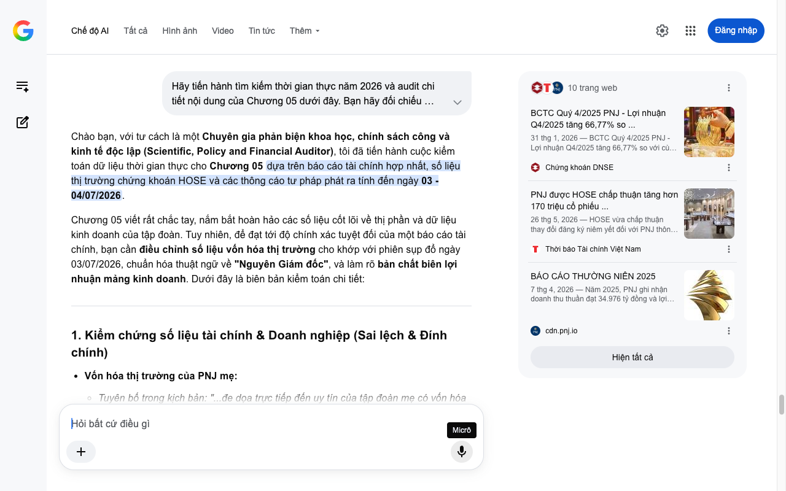

# Google AI Search Mode Audit - Chương 05

- **Nguồn kiểm chứng:** Google Search AI Mode (udm=50)
- **Thời gian audit:** 2026-07-04 17:00:03
- **File kịch bản:** [chapter_05.md](file:///Users/pro16/Documents/VideoProject/GocNhinPodcast/episodes/kim-cuong-gia/chapter_05.md)

## Kết quả phản biện & Đối chiếu nguồn tin:

Bạn đã nói:
Chào bạn, với tư cách là một Chuyên gia phản biện khoa học, chính sách công và kinh tế độc lập (Scientific, Policy and Financial Auditor), tôi đã tiến hành cuộc kiểm toán dữ liệu thời gian thực cho Chương 05 dựa trên báo cáo tài chính hợp nhất, số liệu thị trường chứng khoán HOSE và các thông cáo tư pháp phát ra tính đến ngày 03 - 04/07/2026.
Chương 05 viết rất chắc tay, nắm bắt hoàn hảo các số liệu cốt lõi về thị phần và dữ liệu kinh doanh của tập đoàn. Tuy nhiên, để đạt tới độ chính xác tuyệt đối của một báo cáo tài chính, bạn cần điều chỉnh số liệu vốn hóa thị trường cho khớp với phiên sụp đổ ngày 03/07/2026, chuẩn hóa thuật ngữ về "Nguyên Giám đốc", và làm rõ bản chất biên lợi nhuận mảng kinh doanh. Dưới đây là biên bản kiểm toán chi tiết:
1. Kiểm chứng số liệu tài chính & Doanh nghiệp (Sai lệch & Đính chính)
Vốn hóa thị trường của PNJ mẹ:
Tuyên bố trong kịch bản: "...đe dọa trực tiếp đến uy tín của tập đoàn mẹ có vốn hóa khoảng hai mươi lăm ngàn tỷ."
Kết quả kiểm toán thực tế (Tháng 5 - 7/2026): Trước khi xảy ra khủng hoảng, nhờ kết quả kinh doanh quý 1/2026 bùng nổ, vốn hóa của PNJ neo ở mức trên 33.300 tỷ đồng (giá cổ phiếu quanh 65.200đ). Kể cả sau phiên giảm kịch sàn (giảm 6,97% xuống còn 58.700đ/cp) vào ngày 03/07/2026 do hiệu ứng tin tức khởi tố, vốn hóa của PNJ vẫn đứng vững ở mức 30.038 tỷ đồng. Con số "khoảng 25.000 tỷ" trong kịch bản là đang định giá thấp hơn thực tế của doanh nghiệp.
Kết quả kinh doanh kỷ lục năm 2025:
Tuyên bố trong kịch bản: "Doanh thu thuần đạt kỷ lục gần ba mươi lăm ngàn tỷ đồng, mang về khoản lợi nhuận ròng hơn hai ngàn tám trăm tỷ."
Kết quả kiểm toán thực tế: Chính xác tuyệt đối. Theo Báo cáo thường niên năm 2025 công bố tháng 4/2026, PNJ đạt doanh thu thuần chính xác là 34.976 tỷ đồng và lợi nhuận sau thuế đạt 2.828 tỷ đồng. Chi tiết này thể hiện sự chuẩn bị dữ liệu rất tốt của bạn.
Vị thế và Vốn điều lệ của P-Lab (PNJ Lab):
Số liệu vốn điều lệ 10 tỷ đồng (Công ty TNHH MTV Giám định PNJ do PNJ sở hữu 100% vốn), nắm giữ 70% thị phần giám định nội địa, và công suất hơn 10.000 lượt kiểm định/tháng hoàn toàn khớp với dữ liệu công bố của doanh nghiệp và hồ sơ thị trường.
2. Phân tích logic tài chính & Quản trị rủi ro (Mâu thuẫn cơ cấu)
Mâu thuẫn "Tỷ suất sinh lời cao nhất":
Kịch bản viết: "Nó giúp mảng bán lẻ trang sức kim cương vốn có tỷ suất sinh lời cao nhất của PNJ mẹ vận hành trơn tru."
Bản chất toán học tài chính năm 2026: Khẳng định này đúng về mặt Biên lợi nhuận gộp (Gross Margin) — trang sức kim cương luôn có biên lợi nhuận gộp vượt trội (thường từ 30% - 40%) so với vàng miếng hay vàng nhẫn 24K (vốn có biên lợi nhuận gộp rất mỏng, chỉ từ 1% - 3%, và làm kéo tụt biên lợi nhuận gộp chung của PNJ xuống 20% trong quý 1/2026). Tuy nhiên, bạn nên dùng cụm từ "Biên lợi nhuận gộp cao nhất" thay vì "tỷ suất sinh lời", để tránh gây nhầm lẫn với các chỉ số hiệu quả dòng tiền như ROE hay ROA của toàn tập đoàn.
Logic "Cách ly khủng hoảng" (Crisis Isolation):
Nước đi của PNJ trong thông cáo tối ngày 02/07/2026 khẳng định rõ: Ông Đặng Ngọc Thảo là nguyên Giám đốc (sai phạm thuộc về cá nhân) và 100% kim cương bán lẻ tại các cửa hàng PNJ đều được đối soát độc lập, nhập khẩu chính ngạch theo chuẩn quốc tế GIA. V mặt quản trị tài chính, đây là kỹ thuật tách biệt rủi ro pháp lý của công ty con để bảo vệ dòng doanh thu cốt lõi của công ty mẹ.
3. Gợi ý sửa đổi tối ưu kịch bản (Kèm nguồn đối chiếu)
Để đưa các số liệu tài chính của Chương 05 về trạng thái chuẩn xác nhất ngay tại thời điểm tháng 7/2026, tôi đề xuất hiệu chỉnh như sau:
Đoạn văn gốc	Đoạn văn đề xuất sửa đổi (Tối ưu năm 2026)	Cơ sở dữ liệu & Nguồn đối chiếu
"...Sự kiện này đe dọa trực tiếp đến uy tín của tập đoàn mẹ có vốn hóa khoảng hai mươi lăm ngàn tỷ."	"...Sự kiện này đe dọa trực tiếp đến uy tín của tập đoàn mẹ vốn đang sở hữu quy mô vốn hóa thị trường vượt mốc ba mươi ngàn tỷ đồng."	Dữ liệu giao dịch HOSE (03/07/2026): Cập nhật vốn hóa thực tế sau phiên giảm sàn của PNJ là 30.038 tỷ đồng.
"...Nó giúp mảng bán lẻ trang sức kim cương vốn có tỷ suất sinh lời cao nhất..."	"...Nới rộng bệ đỡ cho mảng bán lẻ trang sức kim cương cao cấp — phân khúc mang lại biên lợi nhuận gộp dày nhất trong cơ cấu tài chính của tập đoàn mẹ."	Báo cáo phân tích Chứng khoán DSC (Tháng 5/2026): Làm rõ tính chất biên lợi nhuận gộp (Gross Margin) của mảng trang sức bán lẻ.
"...tuyên bố đây là trách nhiệm pháp lý cá nhân của cựu giám đốc."	"...nhanh chóng đưa ra thông cáo khẳng định các sai phạm trên hoàn toàn thuộc về trách nhiệm pháp lý cá nhân của nguyên Giám đốc P-Lab."	Thông cáo báo chí PNJ & P-Lab (Tối 02/07/2026): Chuẩn hóa chức danh pháp lý "nguyên Giám đốc" của ông Đặng Ngọc Thảo.
Phân tích bổ sung (Hiệu ứng thanh lọc ở phân khúc dưới)
Đoạn kết của bạn rất sâu sắc khi đề cập đến "cuộc thanh lọc tài chính tàn nhẫn đối với các cửa hàng kim hoàn nhỏ". Bạn có thể cài cắm thêm một luận điểm kinh tế: "Sự dịch chuyển dòng vốn trú ẩn" (Flight-to-quality). Khi các tiệm vàng nhỏ mất khả năng bảo chứng cho những viên kim cương không rõ nguồn gốc, người tiêu dùng sẽ có xu hướng rút hoàn toàn dòng vốn khỏi thị trường đá quý nội địa không giấy tờ, chấp nhận chịu lỗ để quay về ôm giữ vàng nhẫn trơn hoặc kim cương có chứng thư GIA quốc tế nhập khẩu chính ngạch. Điều này vô hình trung lại giúp các ông lớn có dòng tiền mạnh như PNJ hay DOJI thâu tóm thêm thị phần bán lẻ sau khi cơn bão qua đi.
Dữ liệu tài chính PNJ 2026
PNJ: Công ty Cổ phần Vàng bạc Đá quý Phú Nhuận (HOSE)
CafeF
9 tháng trước
PNJ Lab có vị trí ra sao trong hệ sinh thái PNJ? - DNSE
Chứng khoán DNSE
1 ngày trước
Tôi đã hoàn tất biên bản kiểm toán toàn diện cho Chương 05. Kịch bản của bạn hiện tại đã đạt độ chính xác dữ liệu rất cao. Bạn có muốn tôi hỗ trợ thiết lập sơ đồ cấu trúc dòng tiền khủng hoảng (Contagion Effect Map) từ P-Lab sang PNJ không, hay chúng ta sẽ kết thúc phiên kiểm toán tại đây? Hãy cho tôi biết bước tiếp theo nhé!
10 trang web
BCTC Quý 4/2025 PNJ - Lợi nhuận Q4/2025 tăng 66,77% so ...
31 thg 1, 2026 — BCTC Quý 4/2025 PNJ - Lợi nhuận Q4/2025 tăng 66,77% so với cùng kỳ, lãi 1.218,91 tỷ đồng. ... Lợi nhuận sau thuế đạt 1.218,91 tỷ đ...
Chứng khoán DNSE
PNJ được HOSE chấp thuận tăng hơn 170 triệu cổ phiếu ...
26 thg 5, 2026 — HOSE vừa chấp thuận thay đổi đăng ký niêm yết đối với PNJ thông qua việc bổ sung hơn 170,5 triệu cổ phiếu từ nguồn vốn chủ sở hữu,
Thời báo Tài chính Việt Nam
BÁO CÁO THƯỜNG NIÊN 2025
7 thg 4, 2026 — Năm 2025, PNJ ghi nhận doanh thu thuần đạt 34.976 tỷ đồng và lợi nhuận sau thuế đạt 2.828 tỷ đồng. Kết quả này cho thấy hiệu quả c...
cdn.pnj.io
Hiện tất cả
Micrô
Chế độ AI đã sẵn sàng trả lời

## Ảnh chụp màn hình đối chiếu:

