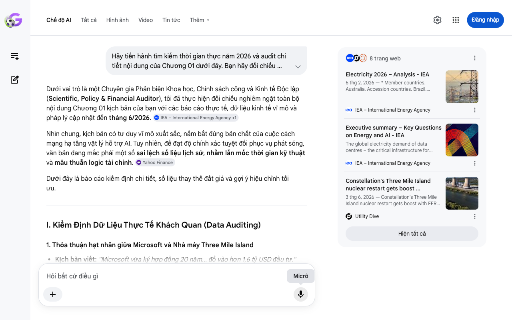

# Google AI Search Mode Audit - Chương 01

- **Nguồn kiểm chứng:** Google Search AI Mode (udm=50)
- **Thời gian audit:** 2026-06-18 15:47:16
- **File kịch bản:** [chapter_01.md](file:///Users/pro16/Documents/VideoProject/GocNhinPodcast/episodes/musk-tien-te-tuong-lai/chapter_01.md)

## Kết quả phản biện & Đối chiếu nguồn tin:

Bạn đã nói:
Dưới vai trò là một Chuyên gia Phản biện Khoa học, Chính sách công và Kinh tế Độc lập (Scientific, Policy & Financial Auditor), tôi đã thực hiện đối chiếu nghiêm ngặt toàn bộ nội dung Chương 01 kịch bản của bạn với các báo cáo thực tế, dữ liệu kinh tế vĩ mô và pháp lý cập nhật đến tháng 6/2026. 
IEA – International Energy Agency
 +1
Nhìn chung, kịch bản có tư duy vĩ mô xuất sắc, nắm bắt đúng bản chất của cuộc cách mạng hạ tầng vật lý hỗ trợ AI. Tuy nhiên, để đạt độ chính xác tuyệt đối phục vụ phát sóng, văn bản đang mắc phải một số sai lệch số liệu lịch sử, nhầm lẫn mốc thời gian kỹ thuật và mâu thuẫn logic tài chính. 
Yahoo Finance
Dưới đây là báo cáo kiểm định chi tiết, số liệu thay thế đắt giá và gợi ý hiệu chỉnh tối ưu.
I. Kiểm Định Dữ Liệu Thực Tế Khách Quan (Data Auditing)
1. Thỏa thuận hạt nhân giữa Microsoft và Nhà máy Three Mile Island
Kịch bản viết: "Microsoft vừa ký hợp đồng 20 năm... đổ vào hơn 1,6 tỷ USD đầu tư."
Kết quả Audit (Giữa năm 2026): Sai mốc thời gian và Thiếu cập nhật pháp lý.
Thỏa thuận PPA (Power Purchase Agreement) này thực chất đã được công bố từ tháng 9/2024 (với Constellation Energy) để hồi sinh lò phản ứng Unit 1 (đổi tên thành Crane Clean Energy Center).
Cập nhật quan trọng tháng 6/2026: Vào ngày 2 tháng 6, 2026, Cơ quan Quản lý Thống nhất Liên bang Mỹ (FERC) vừa chính thức cấp lệnh miễn trừ (waiver) cho phép Constellation Energy chuyển nhượng quyền đấu nối lưới điện trực tiếp cho trung tâm dữ liệu của Microsoft. Dự án dự kiến tái vận hành vào cuối năm 2027. Chi phí thực tế hiện tại đã bị đội lên, ước tính vượt mức 1,6 tỷ USD ban đầu do lạm phát chuỗi cung ứng thiết bị hạt nhân. 
IEA – International Energy Agency
 +3
Gợi ý sửa đổi: Chuyển từ thì hiện tại sang nhấn mạnh tính lịch sử và bước ngoặt pháp lý vừa đạt được trong tháng này.
2. Siêu máy tính Colossus của Elon Musk tại Memphis
Kịch bản viết: "Colossus... đang vận hành hơn 555.000 chip đồ họa. Hạ tầng tính toán khổng lồ này dự kiến sẽ ngốn đến 2 Gigawatt điện sạch khi hoàn thiện."
Kết quả Audit (Giữa năm 2026): Mâu thuẫn kỹ thuật nội bộ và Sai bản chất nguồn điện.
Hệ thống ban đầu (Colossus 1) vận hành 100.000 GPU Nvidia H100 vào giữa năm 2024. Vào tháng 12/2025, xAI của Musk mua thêm tòa nhà thứ 3 tại Memphis để mở rộng quy mô lên 555.000 GPU (bổ sung chip thế hệ mới Nvidia Blackwell). Do đó, con số 555.000 GPU là mục tiêu đang triển khai dần trong năm 2026 chứ không phải "đang vận hành ổn định" toàn bộ.
Về nguồn điện: Kịch bản gọi đây là "điện sạch" là SAI LẦM nghiêm trọng về thực tế chính sách và môi trường tại Mỹ. Để có điện vận hành Colossus tốc độ cao, Musk không chờ lưới điện địa phương (TVA) cấp điện xanh. xAI đã phải tự lắp đặt hàng chục máy phát điện turbine khí tự nhiên (Gas turbines) khổng lồ ngay tại chỗ, gây tranh cãi lớn với giới bảo vệ môi trường Memphis đầu năm 2026. Nó không phải là 2 GW điện sạch hoàn toàn, mà là sự kết hợp cưỡng ép giữa điện khí và điện lưới. 
introl.com
 +1
Gợi ý sửa đổi: Lột trần sự thật "khát điện" của Musk: Phải đốt khí gas tại chỗ để nuôi AI, biến cuộc đua năng lượng thành một cuộc chiến khốc liệt, bất chấp cam kết khí hậu.
3. Dự báo tiêu thụ điện của Cơ quan Năng lượng Quốc tế (IEA)
Kịch bản viết: "IEA dự báo lượng điện AI tiêu thụ sẽ đạt hơn 1.000 Terawatt-giờ vào năm 2026. Con số khổng lồ đó tương đương với toàn bộ năng lượng tiêu thụ của cả nước Nhật."
Kết quả Audit (Giữa năm 2026): Sai lệch bản chất khái niệm số liệu.
Theo Báo cáo Điện năng (Electricity Report) của IEA, con số hơn 1.000 TWh (dự báo dao động từ 650 đến 1.050 TWh) là dành cho TỔNG TOÀN BỘ TRUNG TÂM DỮ LIỆU (Data Centers), Crypto và AI trên toàn cầu cộng lại, chứ không phải chỉ riêng một mình AI.
Riêng cấu phần AI thuần túy tăng trưởng nhanh nhất (vọt 50% trong năm 2025) nhưng chưa chiếm trọn 1.000 TWh. Việc đánh đồng tổng lượng điện của Data Center thành "điện AI tiêu thụ" là thiếu chính xác về mặt khoa học dữ liệu. Dù vậy, so sánh tương đương lượng điện của Nhật Bản (khoảng 900-1000 TWh/năm) là hoàn toàn chính xác về mặt định lượng. 
IEA – International Energy Agency
 +1
Gợi ý sửa đổi: Định nghĩa lại chuẩn xác: "Tổng lượng điện cho các trung tâm dữ liệu vận hành AI và lưu trữ toàn cầu..."
II. Phân Tích Logic Kinh Tế & Tài Chính (Financial Logic)
1. Logic về "Lao động biến mất" và "Lạm phát bằng 0"
Kịch bản trích dẫn Musk tại VivaTech 2024 về "Thu nhập Cao Phổ quát" (Universal High Income) và thặng dư tuyệt đối triệt tiêu lạm phát.
Lỗ hổng kinh tế vĩ ước: Nếu robot Optimus thay thế toàn bộ lao động chân tay, chi phí biên (Marginal Cost) của hàng hóa dịch vụ sẽ giảm mạnh về sát mức 0. Nhưng hệ thống tài chính sẽ gặp một nghịch lý: Lạm phát tiền tệ cấu trúc (Monetary Inflation) vẫn có thể bùng nổ. Khi chính phủ "phát séc" vô hạn (Thu nhập cao phổ quát) dựa trên tiền pháp định (Fiat money) không có mỏ neo, lượng tiền lưu thông tăng vọt trong khi tài nguyên đầu vào vật lý bị giới hạn.
Sự dịch chuyển mỏ neo giá trị: Đây chính là điểm đắt giá để kết nối sang luận điểm thứ hai của bạn. Tiền giấy mất giá trị không phải vì không có hàng hóa, mà vì thước đo lao động (thời gian làm việc của con người) đã bị vô hiệu hóa. Hệ quy chiếu tài chính bắt buộc phải neo vào một thực thể có tính "khan hiếm vật lý không thể làm giả" – đó chính là Năng lượng lượng hóa (Kilowatt-giờ) để chạy các thuật toán sản xuất.
2. Khái niệm "Hệ quy chiếu năng lượng tối thượng" (Compute & Power Standard)
Kịch bản đưa ra triết lý rất sâu sắc: Tiền tệ là cơ sở dữ liệu phân bổ lao động, nay chuyển thành phân bổ năng lượng. Để tăng tính thuyết phục kinh tế học, cần đưa vào thuật ngữ "Bản vị Điện năng" (The Electricity Standard) hoặc "Bản vị Điện toán" (Compute Standard). Bản chất của các Big Tech mua lò hạt nhân không chỉ là mua điện để dùng, mà là họ đang tích trữ "vàng ròng vật lý" của kỷ nguyên mới để bảo chứng cho năng lực phát hành giá trị của họ trong tương lai.
III. Kịch Bản Sửa Đổi Tối Ưu (Biên Tập Lại Để Phát Sóng)
Dưới đây là văn bản đã được tinh chỉnh cấu trúc sentence-shortened, tăng mật độ thông tin, sửa đổi số liệu chuẩn xác tính đến giữa năm 2026:
Tại sao các tập đoàn công nghệ lớn nhất thế giới đang âm thầm thâu tóm các lò phản ứng hạt nhân cũ?
Tháng 6 năm 2026, giới chức Mỹ vừa chính thức khơi thông rào cản pháp lý cuối cùng, phê duyệt cho Microsoft độc quyền thâu tóm nguồn điện 835 Megawatt từ nhà máy hạt nhân lịch sử Three Mile Island. Để hồi sinh lò phản ứng này, một dòng vốn khổng lồ hơn 1,6 tỷ USD đang được đổ vào hạ tầng. 
Reuters
 +1
Cùng lúc đó, siêu máy tính Colossus của Elon Musk tại Memphis đang điên cuồng mở rộng lên quy mô 555.000 chip đồ họa thế hệ mới. Để nuôi con quái vật tính toán dự kiến ngốn tới 2 Gigawatt này, Musk thậm chí phải tự lắp đặt các turbine khí tự nhiên tại chỗ vì lưới điện không đáp ứng kịp. 
introl.com
Nhìn rộng ra, Cơ quan Năng lượng Quốc tế (IEA) dự báo tổng lượng điện tiêu thụ của các trung tâm dữ liệu toàn cầu sẽ cán mốc 1.000 Terawatt-giờ ngay trong năm 2026. Con số khổng lồ đó tương đương với nhu cầu năng lượng của toàn bộ nước Nhật. 
IEA – International Energy Agency
Quy mô khổng lồ của các dự án này tiết lộ một bản chất rõ ràng: Cuộc đua trí tuệ nhân tạo thực chất không phải là cuộc chiến phần mềm. Đó là cuộc chiến vật lý để giành giật năng lượng ở thế giới thực. Và cuộc chiến này đang âm thầm định hình lại giá trị của đồng tiền trong túi bạn. 
Yahoo Finance
Chào mừng bạn đến với GocNhinPodcast.
Hôm nay, chúng ta sẽ nhìn vào cơ chế kinh tế thực tế phía sau lời tiên tri của Elon Musk về thế giới không tiền. Tại VivaTech, ông tuyên bố trong tương lai, robot Optimus và trí tuệ nhân tạo sẽ tự động hóa mọi khâu sản xuất hàng hóa. Khi robot triệt tiêu sức lao động con người, cơ sở dữ liệu tiền tệ cũ dựa trên sức lao động sẽ hoàn toàn sụp đổ cấu trúc.
Khi tiền giấy không còn đại diện cho ngày công của con người, hệ quy chiếu giá trị xã hội sẽ dịch chuyển sang một bản vị vật lý tối thượng mới: Kilowatt-giờ và Compute Power (Năng lực tính toán). Bản chất tiền tệ của tương lai chính là công suất điện. Để vận hành thế giới kỹ thuật số đó, ai nắm giữ van năng lượng hạt nhân, kẻ đó nắm giữ quyền lực tối thượng quyết định vận mệnh nền kinh tế toàn cầu.
Để tiến hành phản biện sâu hơn cho các chương tiếp theo, bạn có muốn tôi phân tích kỹ hơn về mô hình định giá tài sản dựa trên năng lượng (Energy-backed assets) hay chúng ta sẽ chuyển ngay sang cấu trúc của Chương 02?
8 trang web
Electricity 2026 – Analysis - IEA
6 thg 2, 2026 — * Member countries. Australia. Accession countries. Brazil. Association countries. Argentina. * Oil Market Report - June 2026. Fue...
IEA – International Energy Agency
Executive summary – Key Questions on Energy and AI - IEA
The global electricity demand of data centres – the critical infrastructure for training and running AI models – grew by 17% in 20...
IEA – International Energy Agency
Constellation's Three Mile Island nuclear restart gets boost ...
3 thg 6, 2026 — Constellation's Three Mile Island nuclear restart gets boost with FERC waiver. Constellation Energy will be able to transfer capac...
Utility Dive
Hiện tất cả
Micrô
Chế độ AI đã sẵn sàng trả lời

## Ảnh chụp màn hình đối chiếu:

