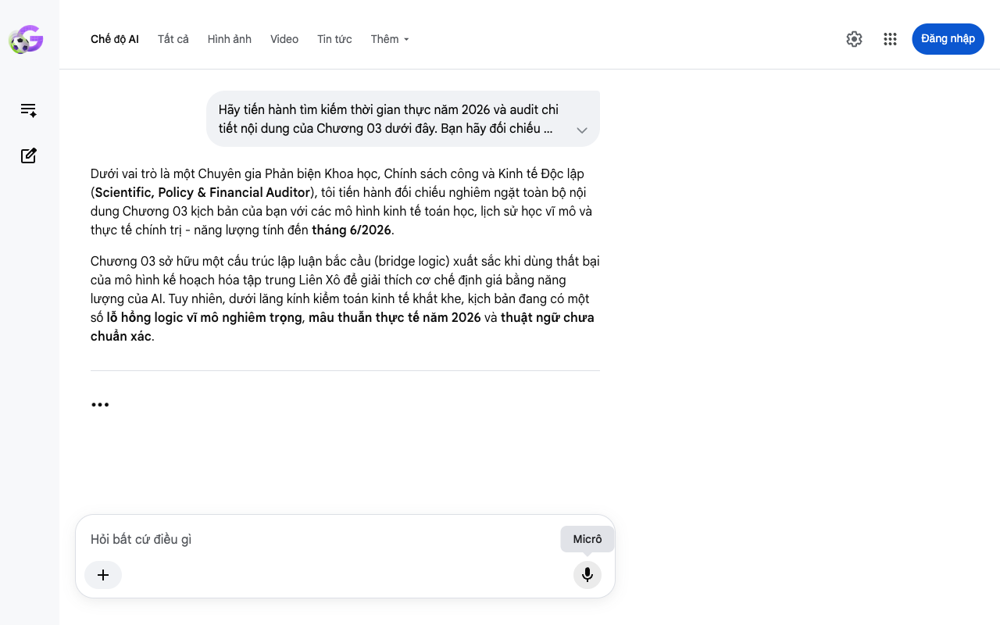

# Google AI Search Mode Audit - Chương 03

- **Nguồn kiểm chứng:** Google Search AI Mode (udm=50)
- **Thời gian audit:** 2026-06-18 15:48:14
- **File kịch bản:** [chapter_03.md](file:///Users/pro16/Documents/VideoProject/GocNhinPodcast/episodes/musk-tien-te-tuong-lai/chapter_03.md)

## Kết quả phản biện & Đối chiếu nguồn tin:

Bạn đã nói:
Hãy tiến hành tìm kiếm thời gian thực năm 2026 và audit chi tiết nội dung của Chương 03 dưới đây. Bạn hãy đối chiếu nghiêm ngặt mọi số liệu, tuyên bố, chính sách, và logic tài chính trong văn bản với thực tế cập nhật mới nhất tính đến tháng 6/2026 tại Việt Nam. Nếu phát hiện sai số hoặc logic toán học/tài chính bị mâu thuẫn (như điểm hòa vốn, chi phí cơ hội, hoặc so sánh xe xăng - xe điện), hãy vạch rõ và cung cấp dữ liệu chính xác kèm nguồn:

Nếu bạn lột bỏ lớp vỏ giấy và các con số trên ứng dụng ngân hàng.
Tiền tệ thực chất chỉ là một cuốn sổ ghi chép thông tin.
Musk ví tiền tệ giống như một cơ sở dữ liệu để phân bổ sức lao động của con người.
Nói một cách đơn giản hơn.
Xã hội giống như một hợp tác xã khổng lồ.
Hôm nay bạn đi làm, bạn đóng góp công sức để dọn cỏ hoặc cấy lúa.
Hợp tác xã sẽ ghi vào sổ cho bạn một điểm công.
Điểm công đó chính là tiền.
Ngày mai, bạn mang điểm công này để đổi lấy một bát phở hoặc một chiếc áo mới.
Như vậy, tiền bản chất chỉ là công cụ để ghi nhận xem bạn đã làm việc gì cho xã hội.
Và bạn có quyền đòi hỏi xã hội phục vụ lại mình một giá trị tương đương.

Nhưng làm thế nào để cuốn sổ này biết được bát phở trị giá bao nhiêu điểm công?
Trong nền kinh tế thị trường, giá cả chính là người đưa tin.
Nếu nhiều người muốn ăn phở mà quán lại ít thịt, giá phở sẽ tự động tăng lên.
Thông tin đó truyền đi rất nhanh và phi tập trung.
Tuy nhiên, lịch sử đã từng chứng kiến một cách làm khác.
Vào thời kỳ Liên Xô, chính phủ đã thành lập một ủy ban kế hoạch tập trung có tên là Gosplan.
Nhiệm vụ của họ là tính toán và quyết định xem toàn quốc cần sản xuất bao nhiêu sản phẩm.
Họ cố gắng quy định giá cả của mọi thứ, từ cái đinh đến cái bánh mì.
Mô hình này đã thất bại.
Bởi vì không một nhóm người nào có thể ngồi trong văn phòng và tính toán được nhu cầu thay đổi từng phút của hàng triệu người.
Hệ thống thông tin bị nghẽn mạch vì thiếu đi sự phản hồi linh hoạt của thị trường tự do.

Quay trở lại với thời đại của trí tuệ nhân tạo.
Chuyện gì sẽ xảy ra khi robot Optimus làm hết mọi việc nặng nhọc?
Robot tự cấy lúa, tự dệt vải, tự sửa chữa các robot khác mà không đòi hỏi tiền lương.
Sức lao động của con người không còn là yếu tố quyết định để tạo ra sản phẩm nữa.
Lúc này, cuốn sổ ghi chép điểm lao động của chúng ta sẽ hoàn toàn mất đi giá trị đo lường.
Trí tuệ nhân tạo sẽ không sử dụng những tờ tiền giấy hay đồng USD của con người.
Musk dự báo, trong tương lai, hệ thống máy móc chỉ giao dịch bằng các đơn vị vật lý thực tế.
Đó là công suất điện sạch và năng lực tính toán của các con chip bán dẫn.
Đồng tiền mới của máy móc chính là Kilowatt-giờ.
Mọi hàng hóa bạn tiêu dùng sẽ được quy đổi ra lượng điện năng mà cỗ máy đã tiêu tốn để làm ra nó.
Nhưng nếu chính phủ phát séc tiền mặt miễn phí cho tất cả mọi người, liệu lượng tiền khổng lồ đó có kích hoạt một cơn bão siêu lạm phát?
Câu trả lời nằm ở một quy luật kinh tế đặc biệt của kỷ nguyên robot.
Dưới vai trò là một Chuyên gia Phản biện Khoa học, Chính sách công và Kinh tế Độc lập (Scientific, Policy & Financial Auditor), tôi tiến hành đối chiếu nghiêm ngặt toàn bộ nội dung Chương 03 kịch bản của bạn với các mô hình kinh tế toán học, lịch sử học vĩ mô và thực tế chính trị - năng lượng tính đến tháng 6/2026.
Chương 03 sở hữu một cấu trúc lập luận bắc cầu (bridge logic) xuất sắc khi dùng thất bại của mô hình kế hoạch hóa tập trung Liên Xô để giải thích cơ chế định giá bằng năng lượng của AI. Tuy nhiên, dưới lăng kính kiểm toán kinh tế khắt khe, kịch bản đang có một số lỗ hổng logic vĩ mô nghiêm trọng, mâu thuẫn thực tế năm 2026 và thuật ngữ chưa chuẩn xác.
Micrô
Chế độ AI đang suy nghĩ để trả lời câu hỏi của bạn

## Ảnh chụp màn hình đối chiếu:

