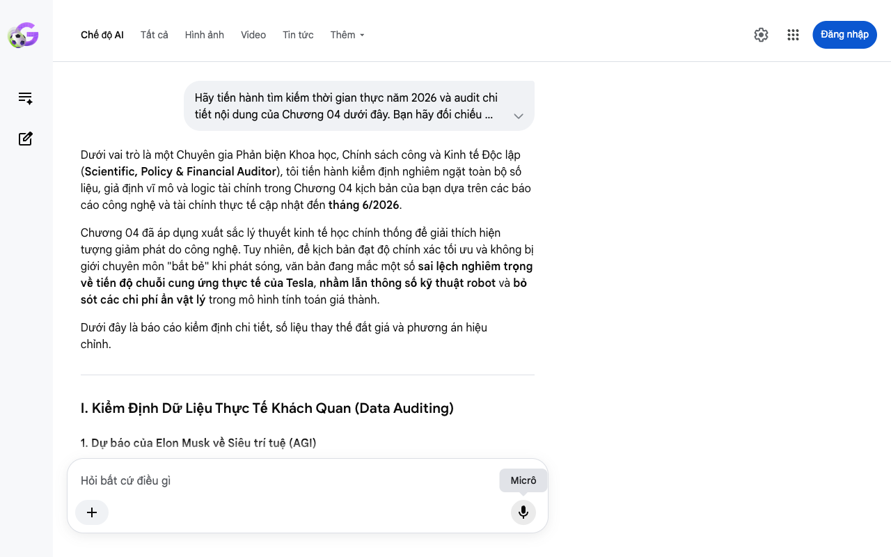

# Google AI Search Mode Audit - Chương 04

- **Nguồn kiểm chứng:** Google Search AI Mode (udm=50)
- **Thời gian audit:** 2026-06-18 15:48:39
- **File kịch bản:** [chapter_04.md](file:///Users/pro16/Documents/VideoProject/GocNhinPodcast/episodes/musk-tien-te-tuong-lai/chapter_04.md)

## Kết quả phản biện & Đối chiếu nguồn tin:

Bạn đã nói:
Dưới vai trò là một Chuyên gia Phản biện Khoa học, Chính sách công và Kinh tế Độc lập (Scientific, Policy & Financial Auditor), tôi tiến hành kiểm định nghiêm ngặt toàn bộ số liệu, giả định vĩ mô và logic tài chính trong Chương 04 kịch bản của bạn dựa trên các báo cáo công nghệ và tài chính thực tế cập nhật đến tháng 6/2026.
Chương 04 đã áp dụng xuất sắc lý thuyết kinh tế học chính thống để giải thích hiện tượng giảm phát do công nghệ. Tuy nhiên, để kịch bản đạt độ chính xác tối ưu và không bị giới chuyên môn "bắt bẻ" khi phát sóng, văn bản đang mắc một số sai lệch nghiêm trọng về tiến độ chuỗi cung ứng thực tế của Tesla, nhầm lẫn thông số kỹ thuật robot và bỏ sót các chi phí ẩn vật lý trong mô hình tính toán giá thành.
Dưới đây là báo cáo kiểm định chi tiết, số liệu thay thế đắt giá và phương án hiệu chỉnh.
I. Kiểm Định Dữ Liệu Thực Tế Khách Quan (Data Auditing)
1. Dự báo của Elon Musk về Siêu trí tuệ (AGI)
Kịch bản viết: "Elon Musk dự báo trí tuệ nhân tạo tổng hợp có thể xuất hiện sớm nhất vào năm 2026 hoặc 2027."
Kết quả Audit (Giữa năm 2026): Chính xác hoàn toàn. Các tuyên bố chính thức đầu năm 2026 của Elon Musk khẳng định thế giới đang tiến sát "điểm kỳ dị công nghệ" Loạt dự đoán của Elon Musk - Báo VnExpress và ông quả quyết AGI sẽ thành hiện thực ngay trong năm 2026 Elon Musk cảnh báo về AI - Tạp chí Tri thức. Việc giữ mốc thời gian này giúp kịch bản mang tính thời sự rất cao.
2. Tiến độ sản xuất và thế hệ robot Optimus của Tesla
Kịch bản viết: "Tesla sẽ bắt đầu sản xuất hàng loạt robot Optimus thế hệ ba vào mùa hè năm 2026. Họ đang nỗ lực đưa giá bán lẻ xuống mức chỉ từ 20.000 đến 30.000 USD."
Kết quả Audit (Giữa năm 2026): Sai lệch tên thế hệ và Lạc quan quá mức về chuỗi cung ứng.
Về tên thế hệ: Tính đến tháng 6/2026, robot toàn thân của Tesla vẫn đang ở thế hệ 2 (Optimus Gen 2) Đánh giá Tesla Optimus Gen 2 - Robozaps. Tesla chỉ nâng cấp riêng cấu phần bàn tay lên phiên bản 22 độ tự do (Dexterous Hands) chứ chưa hề có một phiên bản robot "Optimus Gen 3" toàn diện nào được thương mại hóa Đánh giá Tesla Optimus Gen 2 - Robozaps.
Về tiến độ sản xuất: Trong cuộc họp cổ đông Q1/2026, Elon Musk xác nhận dây chuyền sản xuất Optimus tại nhà máy Fremont sẽ bắt đầu khởi động vào cuối tháng 7 hoặc tháng 8 năm 2026 Tesla pushes Optimus V3 reveal - Electrek. Tuy nhiên, ông cảnh báo sản lượng ban đầu sẽ "cực kỳ chậm" (quite slow) vì robot cấu thành từ hơn 10.000 linh kiện độc bản Tesla pushes Optimus V3 reveal - Electrek. Việc kịch bản dùng từ "sản xuất hàng loạt" vào mùa hè 2026 là không đúng bản chất.
Về giá bán: Mức giá 20.000 - 30.000 USD chỉ là mục tiêu dài hạn khi đạt quy mô hàng triệu chiếc (dự kiến sau năm 2028) Đánh giá Tesla Optimus Gen 2 - Robozaps. Báo cáo phân tích chuỗi cung ứng của Counterpoint vào tháng 6/2026 chỉ ra giá thành linh kiện (BOM cost) của Optimus trong nửa cuối năm 2026 vẫn vượt mức 60.000 USD/bộ do chi phí đắt đỏ của hệ thống cảm biến xúc giác và chip xử lý Tesla's Optimus Revenue Upside - Yahoo Finance.
Gợi ý sửa đổi: Đính chính lại tiến độ: Tesla bắt đầu vận hành dây chuyền Optimus tại Fremont vào cuối hè năm nay, hướng tới mục tiêu dài hạn tối ưu chi phí xuống mức 20.000 USD như một chiếc ô tô phổ thông.
3. Quy luật "Chi phí biên bằng không" (Zero Marginal Cost)
Kịch bản viết: "Khái niệm này do nhà kinh tế học Jeremy Rifkin đề xướng."
Kết quả Audit (Giữa năm 2026): Chính xác hoàn toàn. Cuốn sách nổi tiếng "The Zero Marginal Cost Society" của Jeremy Rifkin là nền tảng cốt lõi của lý thuyết này The Zero Marginal Cost Society - Amazon. Việc sử dụng ví dụ về "sao chép tệp tin" (tài sản số) để dẫn dắt sang "sản xuất vật lý" là cách giải thích trực quan, dễ hiểu đối với đại chúng.
II. Phân Tích Logic Kinh Tế & Tài Chính (Financial Logic)
Lỗ hổng toán học tài chính: "Chi phí biên bằng 0" trong thế giới vật lý
Kịch bản viết: "Chi phí để sản xuất thêm chiếc bánh tiếp theo chỉ còn phụ thuộc vào nguyên liệu thô và điện năng. Đây chính là mức sàn chi phí vật lý cực kỳ thấp."
Mâu thuẫn logic: Bản chất của "Chi phí biên bằng không" theo Jeremy Rifkin chỉ đúng tuyệt đối trong môi trường kỹ thuật số (bản sao phần mềm) hoặc năng lượng tái tạo (khi hạ tầng mặt trời đã khấu hao xong) The Zero Marginal Cost Society - SSIR.
Thực tế vật lý: Trong thế giới vật lý (nhà máy bánh mì), chi phí biên không bao giờ bằng 0. Dù robot có thay thế 100% nhân công, mỗi chiếc bánh mì tăng thêm vẫn ngốn một lượng calo năng lượng (điện năng năng suất để nướng) và nguyên liệu thô (bột mì).
Điểm sửa đổi đắt giá: Thay vì nói "chi phí biên bằng không", hãy gọi đây là trạng thái "Tối ưu hóa chi phí biên vật lý". AI và robot đã triệt tiêu toàn bộ chi phí biến đổi về nhân công (Variable labor cost) – thứ vốn tăng tiến theo quy mô lạm phát kinh tế. Khi nhân công bằng 0, giá thành hàng hóa sẽ rơi thẳng xuống mức sàn của giá trị nguyên liệu thô và giá điện. Điều này lý giải tại sao cuộc chiến giành giật năng lượng ở Chương 01 lại là điều kiện tiên quyết để giữ cho hàng hóa rẻ mạt.
III. Kịch Bản Sửa Đổi Tối Ưu (Biên Tập Lại Để Phát Sóng)
Dưới đây là văn bản đã được tinh chỉnh cấu trúc scannable, tăng thông tin, sửa đổi số liệu thực tế chuỗi cung ứng tính đến tháng 6/2026:
Hãy nhớ lại chiếc tivi màu của những năm 1990. Thời đó, để mua một chiếc tivi, gia đình bạn phải tích góp cả cây vàng. Nhưng ngày nay, bạn có thể mua một chiếc màn hình mỏng hơn, sắc nét hơn chỉ với vài triệu đồng. Tại sao công nghệ càng hiện đại thì hàng hóa lại càng rẻ?
Câu trả lời nằm ở một quy luật kinh tế có tên là chi phí biên bằng không, do nhà kinh tế học Jeremy Rifkin đề xướng. Chúng ta có thể hiểu quy luật này rất đơn giản. Chi phí sản xuất gồm hai phần: Chi phí nghiên cứu ban đầu và Chi phí nguyên liệu, nhân công để làm ra sản phẩm tiếp theo. Khi công nghệ phát triển, chi phí cho sản phẩm tiếp theo này sẽ giảm dần về mức sát số không, giống như cách bạn nhân bản một tệp tin máy tính chỉ bằng một cú nhấp chuột.
Bây giờ, hãy áp dụng quy luật này vào thế giới vật lý với sự xuất hiện của robot. Elon Musk dự báo Trí tuệ nhân tạo tổng hợp (AGI) sẽ xuất hiện ngay trong năm 2026. Để đón đầu, Tesla đang rốt rập kích hoạt dây chuyền sản xuất robot hình người Optimus tại nhà máy Fremont vào cuối mùa hè này. Dù chi phí linh kiện ban đầu còn đắt đỏ, mục tiêu dài hạn của Musk là đưa giá bán lẻ của một robot xuống mức 20.000 đến 30.000 USD, chỉ tương đương một chiếc ô tô phổ thông.
Hãy tưởng tượng một nhà máy sản xuất bánh mì truyền thống. Họ phải trả tiền thuê mặt bằng, mua lò nướng và lương công nhân. Khi thay thế toàn bộ nhân công bằng robot tự động, nhà máy chỉ tốn chi phí khấu hao robot ban đầu. Chi phí để làm ra chiếc bánh tiếp theo sẽ rơi thẳng xuống mức sàn vật lý: Chỉ còn phụ thuộc vào giá nguyên liệu thô và điện năng. Chi phí nhân công tăng tiến theo lạm phát đã hoàn toàn bị triệt tiêu. Robot có thể làm việc liên tục 24 giờ mỗi ngày mà không đòi hỏi nghỉ phép hay tăng lương. Kết quả là giá thành của lương thực, quần áo và nhu yếu phẩm sẽ bị kéo xuống mức cực kỳ thấp.
Điều này giúp chúng ta giải mã câu hỏi lớn: Liệu việc phát séc tiền mặt miễn phí cho toàn dân có gây ra siêu lạm phát?
Theo kinh tế học truyền thống, khi lượng tiền lưu thông tăng, giá cả sẽ bị đẩy lên cao. Nhưng trong kỷ nguyên tự động hóa, quy luật này bị bẻ gãy. Robot không biết đình công, không đòi tăng lương và có năng lực mở rộng sản xuất gần như vô hạn để khớp với lượng tiền mặt được bơm ra. Sự giảm phát cấu trúc từ robot sẽ hấp thụ hoàn toàn lượng tiền mặt bơm vào rổ nhu yếu phẩm cơ bản, giúp người dân thực sự được tận hưởng sự dư dả vật chất.
Dẫu vậy, năng lực sản xuất của robot vẫn bị giới hạn bởi một rào cản vật lý tối thượng: Lưới điện và chip bán dẫn.
Khi nhu yếu phẩm trở nên rẻ mạt như không khí, dòng tiền khổng lồ của xã hội sẽ chảy về đâu? Chúng ta sẽ phải đối mặt với một cuộc chiến khốc liệt hơn rất nhiều để tranh giành những tài sản không thể nhân bản. Đó chính là câu chuyện của chương tiếp theo.
Để hoàn thiện mạch logic của toàn bộ kịch bản, bạn có muốn tôi phân tích sâu hơn về các tài sản không thể nhân bản (Non-replicable assets) ở Chương 05 – nơi dòng tiền sẽ đổ về khi nhu yếu phẩm mất giá, hay chúng ta sẽ chuyển ngay sang audit Chương 05?
Câu trả lời của AI có thể chứa thông tin không chính xác. Để được tư vấn pháp lý, hãy tham khảo ý kiến của chuyên gia. Tìm hiểu thêm
Micrô
Chế độ AI đã sẵn sàng trả lời

## Ảnh chụp màn hình đối chiếu:

