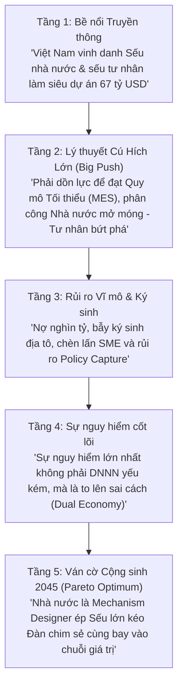

# Pha 5: Thesis Map (Bản Đồ Luận Đề & Phản Đề)
**Episode Slug:** `seu-dau-dan`
**Tên Kênh:** GocNhinPodcast

---

## 1. Luận Đề Trung Tâm (Core Thesis)
> **Sứ mệnh "Big Push" & Cỗ xe Song mã Vĩ mô:** Việt Nam không thể thoát khỏi bẫy thu nhập trung bình bằng sự phát triển dàn trải của hàng triệu doanh nghiệp nhỏ lẻ. Việc dồn nguồn lực kiến tạo lực lượng "Sếu Đầu Đàn" (7 DNNN hạ tầng lõi + Top 20 DNTN mũi nhọn) là một mệnh lệnh vĩ mô tất yếu nhằm đạt Quy mô Hiệu quả Tối thiểu (MES), làm chủ công nghệ lõi và gánh vác các siêu dự án quốc gia (đường sắt 67 tỷ USD, hạ tầng 5G/AI, Net Zero).

---

## 2. Phản Đề Đa Tầng (Counter-Thesis)
> **Cạm Bẫy "Quá Lớn Để Sụp Đổ" (Too Big To Fail) & Ký Sinh Địa Tô:** Sự tập trung nguồn lực bất đối xứng tạo ra hai nguy cơ chí mạng: (1) Các tập đoàn tư nhân phình to bằng nợ vay nghìn tỷ và kinh doanh đất đai có thể bắt cóc hệ thống tài chính làm "con tin"; (2) Sự độc quyền tự nhiên của các sếu Nhà nước tạo hiệu ứng chèn lấn (Crowding-out), hút cạn tín dụng.
>
> **Nền kinh tế kép (Dual Economy):** Nếu Sếu không tạo hiệu ứng lan tỏa, nền kinh tế sẽ chia đôi ranh giới: Một bên là nhóm tinh hoa đặc quyền, một bên là "biển" SME sống mòn.
>
> **Policy Capture (Thao túng Chính sách):** Các siêu doanh nghiệp dùng quyền lực mặc cả khổng lồ để bẻ cong chính sách quốc gia có lợi cho riêng mình, bóp nghẹt sự công bằng.
>
> **COUNTER-COUNTER THESIS (Cây thánh giá đa mục tiêu):** Phản biện lại những ai chỉ trích DNNN kém hiệu quả. Đánh giá DNNN chỉ thông qua chỉ số sinh lời ROE là khập khiễng, vì chúng đang phải vác trên vai "cây thánh giá" đa mục tiêu: vừa phải sinh lời, vừa phải lo an sinh, bình ổn giá và gánh các nhiệm vụ chính trị vĩ mô mà tư nhân không bao giờ nhận.

---

## 3. Counter-Thesis Data Points (Bảng Rủi ro Hệ thống từ Vault)

| # | Tên Rủi ro / Phản đề | Con số & Dữ liệu Thực chứng | Nguồn Vault | Chương xử lý |
|---|---|---|---|---|
| 1 | Áp lực Nợ vay nghìn tỷ | Minh họa Vingroup: Tổng nợ phải trả ~925k tỷ, nợ vay ~321k tỷ. | `Baocao2.md` | Chương 4 |
| 2 | Hiệu ứng Chèn lấn SMEs | 2023-2025 có 597,7k DN rút lui. Room tín dụng & đất đẹp bị tập đoàn lớn hút sạch. | `Baocao1.md` | Chương 4 |
| 3 | Bẫy Ký sinh Địa tô | Doanh nghiệp giàu lên nhờ chênh lệch BĐS, lấy tiền BĐS sang gồng lỗ R&D. | `Baocao2.md` | Chương 5 |
| 4 | Trì trệ thể chế DNNN | Chiếc áo "bảo toàn vốn cơ học" khiến lãnh đạo DNNN sợ trách nhiệm. | `Baocao1.md` | Chương 5 |
| 5 | Ách tắc dự án tư nhân | Tập đoàn REE dự án xử lý rác Trà Vinh/TP.HCM chờ thủ tục 3 năm. | `Baocao1.md` | Chương 5 |
| 6 | Bế tắc tài chính công ích | EVN/VNPT gánh nhiệm vụ an ninh năng lượng nhưng giá đầu ra bị khống chế. | `baocao3.md` | Chương 2 & 5 |
| 7 | Vết xe đổ Chaebol 1997 | Top 5 Chaebol chiếm 45-50% GDP và 50% TTCK Hàn Quốc. Bảo hộ lạm dụng đòn bẩy nợ -> Khủng hoảng 1997. | Cập nhật | Chương 6 |
| 8 | Bài học Trung Quốc | "Nắm lớn buông nhỏ" của Chu Dung Cơ tạo ra Baowu Steel - Sức mạnh tập trung kinh khủng nhưng bài học cắt giảm biên chế đau đớn. | Cập nhật | Chương 6 |

---

## 4. Điểm Mù (Blind Spots) cần Kiểm chứng & Phản biện
1. *Ảo tưởng "Nhà nước sẽ luôn cứu"*: Tâm lý ỷ ỷ lại của một số tập đoàn lớn. Bài học thanh lọc thị trường.
2. *Định kiến "Doanh nghiệp Nhà nước luôn yếu kém"*: Bỏ qua hiệu quả của khối Ngân hàng Big 4 (như Vietcombank), Viettel hay vai trò của Temasek Singapore. Cần nhìn nhận qua lăng kính "Cây thánh giá đa mục tiêu".
3. *Định kiến "Doanh nghiệp Tư nhân chỉ biết làm BĐS"*: Bỏ qua bước dấn thân của Hòa Phát, Thaco, T&T và KN Holdings.

---

## 5. Các Tầng Nhận Thức (Cognitive Layers)

