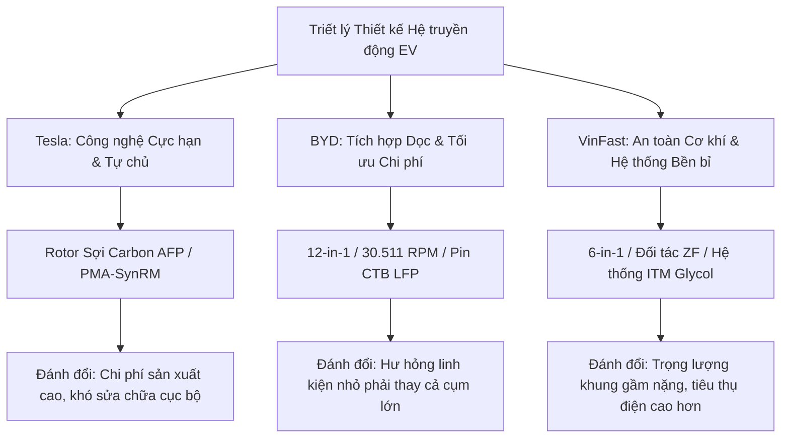

# Global Research Synthesis — so-sanh-dong-co-vinfast-tesla-byd

Bản tổng hợp nghiên cứu này cung cấp cái nhìn toàn cảnh về bản chất cơ chế vật lý và sự đánh đổi chiến lược trong thiết kế hệ thống truyền động điện (Electric Powertrain) của ba thương hiệu hàng đầu: **Tesla, BYD và VinFast**. Tài liệu này đóng vai trò làm kim chỉ nam kỹ thuật cho đội ngũ biên kịch trong các giai đoạn viết brief, outline và phát triển nội dung chi tiết.

---

## I. Bản Chất Các Cơ Chế Vật Lý & Kỹ Thuật Cốt Lõi

Động cơ xe điện (EV Motor) thường bị hiểu nhầm là một thành phần cơ điện đơn giản gồm "cuộn dây và nam châm". Thực tế, khi đẩy công suất và tốc độ vòng quay lên các giới hạn cực hạn, hệ thống này phải đối mặt với những thách thức vật lý khốc liệt. Các nhà sản xuất bắt buộc phải giải quyết năm bài toán động học cốt lõi sau:

### 1. Ứng suất Ly tâm Hướng vòng ở Tua máy Cực cao (Centrifugal Stress)
Khi rotor quay ở tốc độ trên 20.000 RPM (vòng/phút), các khối nam châm vĩnh cửu chôn bên trong lõi sắt phải chịu lực ly tâm khổng lồ. Ứng suất kéo hướng vòng ($\sigma_\theta$) xuất hiện trong lõi rotor tỷ lệ thuận với bình phương tốc độ góc ($\omega$) và bình phương bán kính ($r$):
$$\sigma_\theta = \rho \cdot \omega^2 \cdot r^2$$
Ở dải tua máy này, nếu sử dụng cấu trúc giữ nam châm truyền thống bằng kim loại phi từ tính (như Titanium hay Inconel), dòng điện xoáy Foucault (eddy currents) sẽ phát sinh cực lớn trên bề mặt kim loại do cắt qua từ trường biến thiên tần số cao, gây nóng rotor và dẫn đến nguy cơ khử từ vĩnh viễn của nam châm đất hiếm. 
- *Giải pháp đột phá:* Sử dụng ống bọc sợi carbon composite (CFRP) quấn lực căng lớn (100–200 N) bằng công nghệ đặt sợi tự động AFP. Độ bền kéo cực hạn của carbon ($>2.000\text{ MPa}$) thiết lập một áp lực nén trước (compressive pre-stress) từ 50 đến 150 MPa lên lõi rotor, giữ chặt các khối nam châm và cho phép khe hở không khí (air gap) cơ học giữa stator và rotor được thu hẹp về mức micrometer mà không sợ biến dạng rotor do ly tâm.

### 2. Tổn hao Sắt Stator ở Tần số cao (High-Frequency Iron Losses)
Ở tốc độ quay siêu cao từ 23.000 đến 30.511 RPM, tần số chuyển mạch của dòng điện xoay chiều trong stator vượt ngưỡng 1.000 Hz. Tổn hao sắt (bao gồm hao tổn từ trễ và tổn hao dòng điện xoáy Foucault trong lõi thép stator) tăng mạnh theo bình phương của tần số dòng điện.
- *Giải pháp đột phá:* Sử dụng các lá thép silic phi định hướng siêu mỏng chỉ 0.20 mm (so với tiêu chuẩn ngành là 0.35 mm). Lá thép càng mỏng thì đường dẫn dòng điện xoáy khép kín trong lõi thép càng nhỏ, giúp giảm hao tổn sắt từ 17% đến 21%.
- *Công nghệ ghép lõi Backlack:* Thay vì dập interlocking cơ học hoặc hàn dọc trục (gây ngắn mạch mạch từ giữa các lá thép), các lá thép được phủ polymer nhạy nhiệt và ép dính dưới áp suất 6-10 bar ở nhiệt độ 130°C - 220°C. Phương pháp này triệt tiêu hoàn toàn tổn hao ngắn mạch dòng xoáy giữa các lá thép, nâng độ bão hòa từ thông lõi stator lên 2.1 Tesla.

### 3. Tổn hao Đồng và Hệ số Lấp đầy Rãnh (Copper Losses & Fill Factor)
Tổn hao đồng (tổn hao Joule do điện trở cuộn dây) chiếm tỷ trọng lớn trong tổng thất thoát năng lượng của động cơ. Công nghệ dây quấn tròn truyền thống để lại nhiều khoảng trống rỗng trong rãnh stator (hệ số lấp đầy rãnh chỉ đạt khoảng 45-50%).
- *Giải pháp đột phá:* Công nghệ dây quấn dẹt chữ U (Hairpin) và X-pin giúp tăng tiết diện dẫn điện hiệu dụng của dây đồng, nâng hệ số lấp đầy rãnh lên trên 70%. Riêng BYD thiết kế cấu hình Hairpin dẹt ngắn bước xếp chồng tới 10 lớp (10 wires/slot) để giảm tổn hao đồng tổng cộng tới 57%. Công nghệ X-pin của VinFast đan chéo đầu dây giúp giảm 15% chiều cao đầu cuộn dây thừa (end-winding), từ đó rút ngắn kích thước dọc trục của động cơ và giảm hao tổn đồng ký sinh.

### 4. Hiện tượng Phóng điện Trục phá hủy Vòng bi (Electrical Discharge Machining - EDM)
Sự chuyển mạch tần số cao của bộ biến tần (Inverter) sử dụng bóng bán dẫn Silicon Carbide (SiC) tạo ra điện áp cảm ứng ký sinh trên trục rotor (shaft voltage). Khi điện áp này tích tụ đủ lớn, nó sẽ phóng điện xuyên qua lớp màng mỡ bôi trơn cách điện của vòng bi để truyền xuống vỏ máy. Hiện tượng phóng điện trục (EDM) này tạo ra các tia lửa điện siêu nhỏ làm nóng chảy cục bộ và rỗ bề mặt rãnh trượt vòng bi kim loại, gây ra tiếng hú tần số cao và phá hủy bearing nhanh chóng.
- *Giải pháp đột phá:* ZF trang bị cho động cơ VinFast hệ thống vòng bi Hybrid sử dụng các hạt bi gốm Silicon Nitride ($Si_3N_4$) cách điện hoàn toàn, có độ cứng siêu cao và ma sát thấp, triệt tiêu hoàn toàn hiện tượng phóng điện EDM và kéo dài tuổi thọ hệ truyền động.

### 5. Nhiệt động học và Sự liên kết hệ thống (Thermal Dynamics & System Integration)
Nhiệt độ là kẻ thù số một của động cơ điện. Quá nhiệt cục bộ (hotspots) tại đầu cuộn dây stator hoặc trong rotor sẽ làm hỏng lớp sơn cách điện epoxy và làm nam châm Neodymium mất từ tính vĩnh viễn ở nhiệt độ trên 150°C.
- *Làm mát bằng dầu trực tiếp (ATF) của Tesla/BYD:* Bơm dầu ATF chạy thẳng vào trục rotor rỗng, tận dụng lực ly tâm văng dầu qua các lỗ nhỏ để phun trực tiếp lên cuộn dây trần stator. Phương pháp này giải nhiệt trực tiếp tại nguồn phát sinh nhiệt mà không qua vách ngăn. BYD nâng cấp bằng công nghệ làm mát composite đa lớp trực tiếp bằng môi chất lạnh (gas lạnh) đưa nhiệt độ nước làm mát của hệ truyền động xuống dưới 30°C nhanh chóng.
- *Hệ thống Quản lý Nhiệt Tích hợp (ITM) của VinFast:* Dung dịch glycol tuần hoàn gián tiếp qua áo nước bao quanh stator. ITM không giải nhiệt cô lập mà kết nối liên kết chéo thông minh giữa bốn khu vực: Động cơ - Pin - Cabin - HVAC. Khi động cơ/biến tần hoạt động sinh nhiệt dư thừa, ITM thu hồi lượng nhiệt này qua chiller để sưởi ấm pin (chuẩn bị sạc nhanh trong thời tiết lạnh) hoặc hỗ trợ sưởi cabin để tiết kiệm điện. Khi pin sạc nhanh sinh nhiệt lớn, HVAC sẽ kích hoạt chiller làm mát cưỡng bức cho dòng glycol để hạ nhiệt độ hệ thống nhanh chóng.

---

## II. Trục Xung Đột & Sự Đánh Đổi Chiến Lược (Conflicts & Trade-offs)

Mỗi nhà sản xuất lựa chọn một triết lý kỹ nghệ riêng biệt để giải bài toán kinh doanh và định vị thương hiệu của mình. Không có giải pháp nào hoàn hảo tuyệt đối; mọi thiết kế đều là một chuỗi đánh đổi nguồn lực:

### 1. Tesla: Khoa học Vật liệu Cực hạn và Định hướng Phi Đất hiếm
- **Chiến lược:** Tập trung đẩy giới hạn vật lý của một linh kiện đơn lẻ (rotor sợi carbon AFP) để đạt dải hiệu suất cao nhất ở tua máy cực đại, giúp xe có gia tốc ấn tượng. Đồng thời, nghiên cứu cấu trúc PMA-SynRM dùng nam châm Ferrite/Sắt Nitrua ($Fe_{16}N_2$) để loại bỏ hoàn toàn đất hiếm nhằm thoát khỏi thế độc quyền chuỗi cung ứng của Trung Quốc.
- **Sự đánh đổi:** Công nghệ quấn sợi carbon đòi hỏi dây chuyền tự động hóa AFP cực kỳ đắt đỏ. Thiết kế tích hợp sâu khiến việc sửa chữa cục bộ rotor hoặc stator khi xảy ra sự cố trở nên bất khả thi, buộc phải thay thế toàn bộ khối động cơ.

### 2. BYD: Tích hợp Nguyên khối Dọc và Tối đa hóa Quy mô
- **Chiến lược:** Tận dụng tối đa chuỗi cung ứng in-house (tự sản xuất chip bán dẫn SiC, pin Blade và linh kiện biến tần). Hợp nhất 8 thành phần thành 12 thành phần trên e-Platform 3.0 Evo để giảm 50% thể tích khoang máy và loại bỏ cáp nối trung gian. Đẩy tua máy thương mại lên kỷ lục 30.511 RPM để giảm kích thước động cơ mà vẫn giữ công suất cao (đạt mật độ 16.4 kW/kg).
- **Sự đánh đổi:** Việc đóng gói nguyên khối 12-trong-1 tạo ra rủi ro lớn về bảo dưỡng. Khi một bộ phận thứ cấp như sạc OBC hoặc DC-DC bị lỗi, khách hàng không thể bóc tách sửa chữa độc lập mà bắt buộc phải thay thế toàn bộ cụm truyền động tích hợp, dẫn đến chi phí bảo trì lũy tiến cực lớn cho người dùng sau thời hạn bảo hành.

### 3. VinFast: An toàn Cơ khí, Đối tác Toàn cầu & Tối ưu hóa Hệ thống Nhiệt
- **Chiến lược:** Định vị là hãng xe chú trọng an toàn và độ tin cậy cơ khí. VinFast chọn cách bắt tay với các đối tác hàng đầu thế giới (ZF cung cấp cơ khí hộp số/vòng bi gốm hybrid, Haosen cung cấp dây chuyền quấn stator Hairpin/X-pin tự động hóa cao). Nhận diện điều kiện vận hành khí hậu nhiệt đới gió mùa nóng ẩm khắc nghiệt, họ tự phát triển và tối ưu hóa Hệ thống Quản lý Nhiệt Tích hợp (ITM) tuần hoàn glycol để bảo vệ pin và động cơ đồng đều.
- **Sự đánh đổi:** Triết lý chú trọng khung gầm thép cường lực dày để bảo vệ hành khách khiến xe VinFast thế hệ cũ (như VF 8 Plus 2024) nặng tới 2.5 tấn, bắt buộc động cơ phải cung cấp mô-men xoắn cực lớn (620 Nm) và gánh tải mỏi cơ học liên tục, kéo theo mức tiêu thụ điện cao (~224 Wh/km). Tuy nhiên, trên thế hệ All-New 2026, cuộc cách mạng giảm cân 600 kg nhờ hợp kim thép mới và cụm truyền động 6-trong-1 đã đưa trọng lượng về ~1.9 tấn, giúp tối ưu hóa hiệu suất truyền động và đạt cự ly 500 km NEDC với pin LFP 60.13 kWh.

---

## III. Điểm Nối Thực Tế Tại Việt Nam (Vietnam Connectivity)

Khi đưa các phân tích kỹ thuật này vào kịch bản, biên tập viên cần kéo các con số vĩ mô xuống tầng trải nghiệm thực tế của người dùng Việt Nam:

1. **Thách thức Thời tiết Nhiệt đới khắc nghiệt:** Thời tiết mùa hè tại Việt Nam thường xuyên vượt ngưỡng 40°C. Đỗ xe ngoài nắng nóng làm nhiệt độ khối pin LFP và động cơ tăng cao. Lúc này, hệ thống ITM của VinFast thể hiện vai trò cứu cánh: chiller trao đổi nhiệt kết hợp máy nén điều hòa cabin sẽ chủ động giải nhiệt cưỡng bức cho pin và động cơ xuống dưới ngưỡng tới hạn ngay khi sạc nhanh, ngăn chặn hiện tượng quá nhiệt cục bộ (hotspots).
2. **Khung gầm Đầm chắc vs Bài toán Tiêu hao Năng lượng:** Người lái xe Việt Nam thường đánh giá rất cao cảm giác lái "đầm chắc", cách âm gầm tốt và vào cua bám đường của xe VinFast. Bản chất của cảm giác này chính là hệ khung gầm thép dày vững chắc và nặng. K kịch bản cần giải thích rõ: Khán giả đang đánh đổi một chút hiệu suất tiêu hao năng lượng để lấy sự an toàn tính mạng tối đa cho gia đình và trải nghiệm lái đầm chắc tiêu chuẩn Đức (ZF).
3. **Chế độ Bảo hành 10 năm vượt trội:** Khán giả Việt Nam thường e ngại về độ bền và rủi ro hỏng hóc của xe điện sau vài năm sử dụng. Việc VinFast tự tin bảo hành động cơ và pin lên tới 10 năm hoặc 200.000 km là nhờ điểm tựa kỹ thuật vững chắc: Các linh kiện cơ khí cơ học bền bỉ từ ZF (bánh răng nghiêng mài siêu mịn, vòng bi gốm hybrid chống hiện tượng phóng điện EDM) và hệ thống ITM kiểm soát nhiệt độ nghiêm ngặt không cho cuộn dây vượt quá ngưỡng Class H ($180^\circ\text{C}$).
