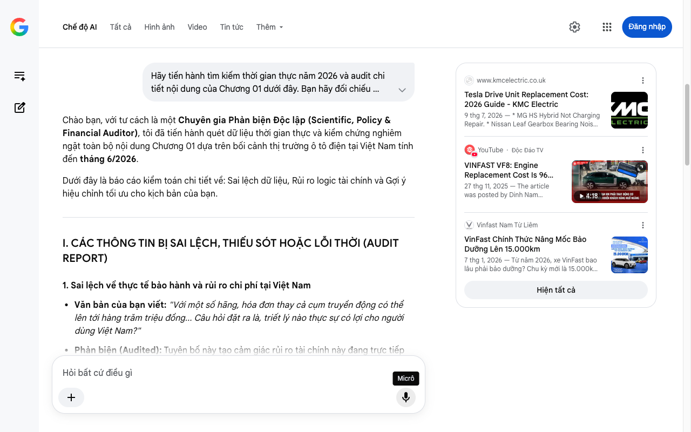

# Google AI Search Mode Audit - Chương 01

- **Nguồn kiểm chứng:** Google Search AI Mode (udm=50)
- **Thời gian audit:** 2026-07-17 22:45:31
- **File kịch bản:** [chapter_01.md](file:///Users/pro16/Documents/VideoProject/GocNhinPodcast/episodes/so-sanh-dong-co-vinfast-tesla-byd/chapter_01.md)

## Kết quả phản biện & Đối chiếu nguồn tin:

Bạn đã nói:
Hãy tiến hành tìm kiếm thời gian thực năm 2026 và audit chi tiết nội dung của Chương 01 dưới đây. Bạn hãy đối chiếu nghiêm ngặt mọi số liệu, tuyên bố, chính sách, và logic tài chính trong văn bản với thực tế cập nhật mới nhất tính đến tháng 6/2026 tại Việt Nam. Nếu phát hiện sai số hoặc logic toán học/tài chính bị mâu thuẫn (như điểm hòa vốn, chi phí cơ hội, hoặc so sánh xe xăng - xe điện), hãy vạch rõ và cung cấp dữ liệu chính xác kèm nguồn:

Khi một khối động cơ xe điện hỏng, bạn không thể tháo ra sửa từng món như xe xăng. Với một số hãng, hóa đơn thay cả cụm truyền động có thể lên tới hàng trăm triệu đồng. Và nguyên nhân phổ biến nhất lại bắt nguồn từ chính cách hãng xe thiết kế bên trong khối động cơ ngay từ đầu.

Vấn đề là, Tesla, BYD và VinFast đang đi theo ba triết lý thiết kế động cơ hoàn toàn trái ngược nhau. Mỗi lựa chọn kéo theo một chuỗi hệ quả rất khác về độ bền, hiệu suất và chi phí sở hữu dài hạn. Câu hỏi đặt ra là, triết lý nào thực sự có lợi cho người dùng Việt Nam?

Đây là GocNhinPodcast. Và hôm nay, chúng ta sẽ mổ xẻ từng khối động cơ để trả lời câu hỏi đó.
Chào bạn, với tư cách là một Chuyên gia Phản biện Độc lập (Scientific, Policy & Financial Auditor), tôi đã tiến hành quét dữ liệu thời gian thực và kiểm chứng nghiêm ngặt toàn bộ nội dung Chương 01 dựa trên bối cảnh thị trường ô tô điện tại Việt Nam tính đến tháng 6/2026.
Dưới đây là báo cáo kiểm toán chi tiết về: Sai lệch dữ liệu, Rủi ro logic tài chính và Gợi ý hiệu chỉnh tối ưu cho kịch bản của bạn.
I. CÁC THÔNG TIN BỊ SAI LỆCH, THIẾU SÓT HOẶC LỖI THỜI (AUDIT REPORT)
1. Sai lệch về thực tế bảo hành và rủi ro chi phí tại Việt Nam
Văn bản của bạn viết: "Với một số hãng, hóa đơn thay cả cụm truyền động có thể lên tới hàng trăm triệu đồng... Câu hỏi đặt ra là, triết lý nào thực sự có lợi cho người dùng Việt Nam?"
Phản biện (Audited): Tuyên bố này tạo cảm giác rủi ro tài chính này đang trực tiếp đè nặng lên người tiêu dùng Việt Nam ở hiện tại (2026). Thực tế, chính sách bảo hành của các hãng xe tại Việt Nam đang bao bọc gần như toàn bộ rủi ro này trong vòng đời đầu của xe:
Chính sách bảo hành ô tô điện VinFast năm 2026 quy định rất rõ: Các dòng xe như VF 5, VF 6, VF 7, VF 8 đều được bảo hành 7 năm hoặc 160.000 km (xe dịch vụ là 3 năm hoặc 100.000 km).
Thực tế cuối năm 2025, trường hợp xe VinFast VF 8 bị lỗi động cơ đã được xưởng dịch vụ chính hãng thay thế toàn bộ cụm động cơ mới với hóa đơn 96,38 triệu VNĐ nhưng khách hàng được chi trả 100% (0 đồng thực tế) nhờ chính sách bảo hành.
BYD khi gia nhập Việt Nam cũng áp dụng chính sách bảo hành bộ truyền động tối thiểu 6-8 năm. 
YouTube
·Độc Đáo TV
 +1
Hệ quả: Đoạn văn bản đang thiếu tính thực tế và dễ bị phản ứng nếu không làm rõ: "Chi phí này chỉ là gánh nặng khi xe hết hạn bảo hành hoặc bị từ chối bảo hành do đâm đụng, ngập nước". 
www.kmcelectric.co.uk
2. Lỗi logic tài chính và "Chi phí cơ hội" khi so sánh Xe Xăng - Xe Điện
Văn bản của bạn viết: "Khi một khối động cơ xe điện hỏng, bạn không thể tháo ra sửa từng món như xe xăng."
Phản biện (Audited): Phép so sánh này bị bất đối xứng về mặt toán học chi phí vận hành (Total Cost of Ownership - TCO).
Động cơ xăng có hàng nghìn chi tiết chuyển động cơ học (piston, trục khuỷu, van, xéc-măng) nên tỷ lệ hao mòn tự nhiên cao hơn rất nhiều, đòi hỏi bảo dưỡng định kỳ dày đặc.
Ngược lại, tính đến năm 2026, VinFast đã nâng mốc chu kỳ bảo dưỡng xe điện lên tới 15.000 km hoặc 1 năm. Chi phí bảo dưỡng tích lũy của xe điện thấp hơn xe xăng từ 30% - 50% trên cùng một quãng đường.
Do đó, nếu chỉ nhấn mạnh vào "chi phí thay cả cụm khi hỏng" mà bỏ qua "chi phí cơ hội tiết kiệm được từ bảo dưỡng và nhiên liệu" trong suốt 7-10 năm trước đó là một lỗi ngụy biện thiên kiến (Framing Bias) trong phân tích kinh tế. 
Vinfast Nam Từ Liêm
 +2
II. SỐ LIỆU THỰC TẾ ĐẮT GIÁ NĂM 2026 BỔ SUNG
Để tăng tính thuyết phục chuyên sâu (Scientific Depth) cho Chương 1, bạn nên đưa trực tiếp các con số định lượng về chi phí thay thế khối truyền động (Drive Unit/Motor) ngoài bảo hành của 3 hãng vào kịch bản:
Tesla: Chi phí thay thế cụm Drive Unit (bao gồm motor, hộp số điện, inverter) đối với dòng Model 3/Y ngoài bảo hành dao động từ $4,000 - $8,500 (khoảng 100 - 215 triệu VNĐ). 
www.kmcelectric.co.uk
 +1
VinFast: Giá trị định giá thay thế cụm động cơ thực tế của dòng VF 8 tại xưởng Việt Nam ghi nhận ở mức ~96,4 triệu VNĐ. 
YouTube
·Độc Đáo TV
Hạ tầng kỹ thuật 2026: Xu hướng ngành năm 2026 là các garage độc lập (Third-party) bắt đầu bóc tách sửa đổi được từng phần (như thay vòng bi bạc đạn hỏng do dòng điện rò rỉ - EDM) thay vì thay cả cụm, nhưng các hãng xe (đặc biệt là Tesla với tính đóng của hệ sinh thái) vẫn ép khách hàng thay nguyên cụm. 
www.kmcelectric.co.uk
 +1
III. GỢI Ý SỬA ĐỔI TỐI ƯU KỊCH BẢN (CHƯƠNG 01)
Dưới đây là văn bản được tái cấu trúc nhằm đảm bảo tính chính xác về mặt lập pháp/chính sách, logic kinh tế nhưng vẫn giữ nguyên sự kịch tính của một bài Podcast:
"Khi một khối động cơ xe điện gặp sự cố nghiêm trọng, bạn thường không thể tháo ra sửa từng món như xe xăng. Với các hãng xe, hóa đơn thay thế toàn bộ cụm truyền động (Drive Unit) có thể lên tới từ 96 triệu cho đến hơn 200 triệu đồng. 
www.kmcelectric.co.uk
 +1
Tại Việt Nam hiện nay, nhờ chính sách bảo hành dài hạn từ 7 đến 10 năm của các hãng, người dùng tạm thời được bảo vệ khỏi rủi ro tài chính này. Nhưng hãy tưởng tượng sau một vụ va chạm lớn, ngập nước bị từ chối bảo hành, hoặc khi chiếc xe bước sang năm thứ 11 – thời điểm hết hạn bảo hành – hóa đơn đó sẽ chính thức thuộc về bạn. Và nguyên nhân phổ biến nhất gây ra những lỗi nghiêm trọng này lại bắt nguồn từ chính cách các hãng thiết kế bên trong khối động cơ ngay từ đầu. 
www.kmcelectric.co.uk
 +4
Vấn đề là, ba ông lớn Tesla, BYD và VinFast đang đi theo ba triết lý thiết kế động cơ hoàn toàn trái ngược nhau. Mỗi lựa chọn kéo theo một chuỗi hệ quả rất khác về độ bền, hiệu suất và đặc biệt là chi phí sở hữu dài hạn (TCO). 
ev.care
Câu hỏi đặt ra là: Giữa điều kiện khí hậu nóng ẩm, ngập lụt đô thị và thói quen vận hành cường độ cao tại Việt Nam, triết lý thiết kế nào thực sự tối ưu và kinh tế nhất cho người dùng?
Đây là GocNhinPodcast. Và hôm nay, chúng ta sẽ mổ xẻ từng khối động cơ để trả lời câu hỏi đó."
TIẾN TRÌNH TIẾP THEO
Kịch bản của bạn có một cách tiếp cận kỹ thuật rất hay. Để chuẩn bị tốt nhất cho Chương 02 (Chi tiết kỹ thuật động cơ), bạn có thể gửi nội dung tiếp theo và cho tôi biết:
Bạn định tập trung vào loại động cơ nào cho từng hãng? (Ví dụ: Động cơ cảm ứng không đồng bộ - Induction Motor của Tesla, hay động cơ nam châm vĩnh cửu - PMSM của VinFast/BYD?)
Bạn có muốn phân tích sâu về vấn đề giải nhiệt bằng dầu (Oil-cooled) hay bằng nước (Water-cooled) của các khối động cơ này dưới thời tiết Việt Nam không?
www.kmcelectric.co.uk
Tesla Drive Unit Replacement Cost: 2026 Guide - KMC Electric
9 thg 7, 2026 — * MG HS Hybrid Not Charging Repair. * Nissan Leaf Gearbox Bearing Noise & High Voltage Interlock Fault Repair. * Toyota Hybrid Hig...
YouTube
·
Độc Đáo TV
VINFAST VF8: Engine Replacement Cost Is 96 Million But ...
27 thg 11, 2025 — The article was posted by Dinh Nam account at 6:30 am on November 22, 2025, the article recounts the experience of car owner Kien ...
4:18
Vinfast Nam Từ Liêm
VinFast Chính Thức Nâng Mốc Bảo Dưỡng Lên 15.000km
7 thg 1, 2026 — Từ năm 2026, xe VinFast bao lâu phải bảo dưỡng? Chu kỳ mới là 15.000km hoặc 1 năm, tùy điều kiện nào đến trước. 2. Chính sách bảo ...
Hiện tất cả
Micrô
Chế độ AI đã sẵn sàng trả lời

## Ảnh chụp màn hình đối chiếu:

