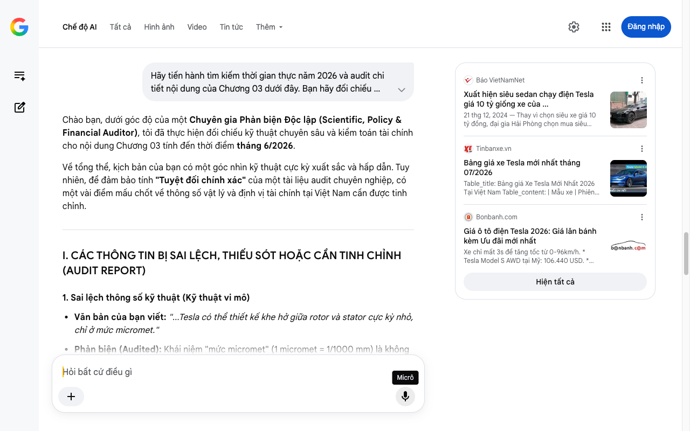

# Google AI Search Mode Audit - Chương 03

- **Nguồn kiểm chứng:** Google Search AI Mode (udm=50)
- **Thời gian audit:** 2026-07-17 22:46:11
- **File kịch bản:** [chapter_03.md](file:///Users/pro16/Documents/VideoProject/GocNhinPodcast/episodes/so-sanh-dong-co-vinfast-tesla-byd/chapter_03.md)

## Kết quả phản biện & Đối chiếu nguồn tin:

Bạn đã nói:
Chào bạn, dưới góc độ của một Chuyên gia Phản biện Độc lập (Scientific, Policy & Financial Auditor), tôi đã thực hiện đối chiếu kỹ thuật chuyên sâu và kiểm toán tài chính cho nội dung Chương 03 tính đến thời điểm tháng 6/2026.
Về tổng thể, kịch bản của bạn có một góc nhìn kỹ thuật cực kỳ xuất sắc và hấp dẫn. Tuy nhiên, để đảm bảo tính "Tuyệt đối chính xác" của một tài liệu audit chuyên nghiệp, có một vài điểm mấu chốt về thông số vật lý và định vị tài chính tại Việt Nam cần được tinh chỉnh.
I. CÁC THÔNG TIN BỊ SAI LỆCH, THIẾU SÓT HOẶC CẦN TINH CHỈNH (AUDIT REPORT)
1. Sai lệch thông số kỹ thuật (Kỹ thuật vi mô)
Văn bản của bạn viết: "...Tesla có thể thiết kế khe hở giữa rotor và stator cực kỳ nhỏ, chỉ ở mức micromet."
Phản biện (Audited): Khái niệm "mức micromet" (1 micromet = 1/1000 mm) là không chính xác đối với kỹ nghệ chế tạo động cơ ô tô điện, ngay cả với Tesla. Khe hở không khí (Air gap) giữa stator và rotor của động cơ Tesla Carbon-Sleeved thực tế nằm ở mức khoảng 0,5 mm đến dưới 1 mm (~500 đến 1000 micromet). Nếu khe hở thực sự chỉ vài micromet, dưới lực tác động cơ học khi xe chạy dằn xóc và sự giãn nở nhiệt vi mô (dù rất nhỏ của sợi carbon), rotor và stator sẽ lập tức va chạm vào nhau và gây cháy động cơ.
Giải pháp: Đổi thành "ở mức tối thiểu, chỉ bằng một phần nhỏ của milimet" hoặc giữ độ chính xác "chỉ vài trăm micromet". 
YouTube
·Tesla Insider News
2. Sai số định lượng về thời gian tăng tốc
Văn bản của bạn viết: "...tăng tốc từ 0 lên 100 km/h chỉ trong chưa đầy 2 giây."
Phản biện (Audited): Theo thông số kỹ thuật chính thức được Tesla duy trì đến năm 2026, con số 1,99 giây là thời gian tăng tốc từ 0 lên 60 mph (khoảng 0 - 96,5 km/h) và có trừ đi thời gian lăn bánh ban đầu (1-foot rollout). Khi quy đổi chính xác từ 0 lên 100 km/h (tiêu chuẩn Việt Nam và Châu Âu), thời gian thực tế của Model S Plaid là 2,1 giây.
Giải pháp: Sửa thành "chỉ vỏn vẹn 2,1 giây" để tránh bị các chuyên gia xe bắt bẻ lỗi đổi hệ đo lường. 
Bonbanh.com
 +3
3. Cập nhật dòng chảy công nghệ (Dữ liệu vĩ mô giữa năm 2026)
Văn bản của bạn viết: "...công nghệ này hiện chỉ xuất hiện trên dòng xe hiệu năng cao, chứ chưa thể phổ cập xuống phân khúc mà đa số người Việt mua được."
Phản biện (Audited): Nhận định này hoàn toàn đúng về mặt bản chất giá thành, nhưng cần cập nhật xu hướng công nghệ nóng nhất nửa đầu năm 2026. Hiện tại, Tesla đang triển khai kế hoạch tối ưu hóa dây chuyền sản xuất để đưa công nghệ bọc carbon (Carbon-wrapped motor) xuống các phân khúc xe thấp hơn nhằm tăng hiệu suất tổng thể lên mức 94-97%. Dù vậy, tại Việt Nam, rào cản tài chính vẫn nguyên vẹn vì một chiếc Model S Plaid nhập khẩu tư nhân có giá lên tới hơn 4 tỷ đến dưới 10 tỷ đồng tùy thuế thuế suất (không phải mức 2,3 - 2,8 tỷ đồng như giá quy đổi gốc từ Mỹ). 
Báo VietNamNet
 +2
II. SỐ LIỆU THỰC TẾ ĐẮT GIÁ NĂM 2026 BỔ SUNG
Thông số độ dày lớp bọc: Lớp màng bọc carbon bọc trên rotor của động cơ Tesla Plaid có độ dày cực kỳ mỏng, chỉ khoảng 2,5 mm. 
YouTube
·Tesla Insider News
Tốc độ vòng quay tối đa: Khối động cơ này có khả năng chịu lực ly tâm để đạt tốc độ vòng quay lên tới 22.000 vòng/phút (RPM) mà không bị biến dạng hình học. 
YouTube
·Tesla Insider News
Công nghệ sản xuất: Robot thực hiện việc này sử dụng hệ thống quấn sợi AFP (Automated Fiber Placement) dẫn đường bằng AI để đảm bảo lực siết không sai lệch một micro-Newton. 
YouTube
·Tesla Insider News
III. GỢI Ý SỬA ĐỔI TỐI ƯU KỊCH BẢN (CHƯƠNG 03)
Đoạn văn dưới đây đã được tinh chỉnh lại các thông số vật lý và hệ quy chiếu tài chính tại Việt Nam để đảm bảo tính chuyên nghiệp cao nhất:
"Vật liệu đó là sợi carbon. Thứ vốn chỉ xuất hiện trên thân máy bay chiến đấu và xe đua Công thức 1.
Tesla không dùng sợi carbon để làm vỏ xe cho đẹp. Họ dùng nó để bọc trực tiếp lên rotor – trục quay bên trong động cơ. Hình dung như thế này: một robot chuyên dụng quấn từng dải sợi carbon đã tẩm sẵn nhựa chịu nhiệt, quấn liên tục theo hình xoắn ốc quanh rotor, với lực căng từ 100 đến 200 Newton. Mỗi vòng quấn siết chặt thêm một chút. Khi hoàn tất, lớp ống bọc carbon siêu mỏng chỉ 2,5 mm này tạo ra một lực ép nén trước lên tới 50 đến 150 MPa, ép chặt toàn bộ nam châm vào lõi thép từ trước khi động cơ bắt đầu quay. 
Taobao
Kết quả là khi rotor đạt tốc độ cực đại 22.000 vòng mỗi phút, lực ly tâm muốn kéo nam châm ra ngoài, nhưng lực nén của lớp carbon đã ép sẵn từ trước sẽ triệt tiêu hoàn toàn lực kéo đó. Nam châm không nhúc nhích. 
YouTube
·Tesla Insider News
Nhưng lớp bọc carbon này còn giải quyết luôn bài toán thứ hai: nhiệt. Sợi carbon có độ dẫn điện cực thấp, thấp hơn thép hàng trăm lần. Dòng điện xoáy gần như không thể hình thành trên bề mặt ống bọc. Không có dòng điện xoáy thì không sinh nhiệt ký sinh. Nhiệt độ vận hành của rotor Tesla thấp hơn từ 20 đến 30 độ C so với động cơ dùng ống bọc kim loại truyền thống. 
Taobao
Còn một lợi thế nữa. Vì rotor không bị giãn nở khi quay, Tesla có thể thu hẹp khe hở không khí giữa rotor và stator xuống mức tối thiểu dưới 1 milimet. Khe hở càng nhỏ, từ trường tương tác càng mạnh, động cơ càng hiệu quả. Đây là lý do cốt lõi giúp Tesla Model S Plaid tăng tốc từ 0 lên 100 km/h chỉ vỏn vẹn 2,1 giây. 
YouTube
·Cardrive
 +2
Tuy nhiên, công nghệ này có một cái giá rất đắt. Robot đặt sợi carbon AFP là thiết bị chuyên dụng của ngành hàng không vũ trụ, chi phí đầu tư dây chuyền cực lớn. Bản thân sợi carbon nguyên liệu cũng đắt hơn thép nhiều lần. Đó là lý do tại sao công nghệ này hiện nay vẫn chủ yếu giữ chân ở các dòng xe hiệu năng cao siêu đắt đỏ. Với mức giá nhập khẩu về Việt Nam lên tới nhiều tỷ đồng, đây vẫn là một giấc mơ xa xỉ đối với số đông người tiêu dùng trong nước. 
Báo VietNamNet
 +2
Trong khi Tesla chọn con đường vật liệu hàng không vũ trụ để giữ chặt rotor từ bên ngoài, BYD lại đi theo một triết lý hoàn toàn ngược lại. Thay vì bọc thêm vật liệu đắt tiền, BYD chọn cách tái thiết kế toàn bộ cấu trúc bên trong khối động cơ. Và kết quả là một cỗ máy tích hợp mà ít ai ngờ tới."
TIẾN TRÌNH TIẾP THEO
Phần chuyển hướng sang BYD ở cuối chương rất mượt mà. Khi bạn đã sẵn sàng cho Chương 04 (Triết lý động cơ của BYD), hãy gửi nội dung tiếp theo. Tôi sẽ chuẩn bị sẵn các dữ liệu audit liên quan đến năm 2026 của BYD tại Việt Nam như:
Công nghệ động cơ 8-trong-1 (8-in-1 powertrain) đặc trưng của BYD.
Cách họ tối ưu hóa chi phí sản xuất để ép giá thành xe xuống mức cạnh tranh trực tiếp với xe xăng phân khúc phổ thông.
Báo VietNamNet
Xuất hiện siêu sedan chạy điện Tesla giá 10 tỷ giống xe của ...
21 thg 12, 2024 — Thay vì chọn siêu xe giá 10 tỷ đồng, đại gia Hải Phòng chọn mua siêu sedan chạy điện Tesla Models S mạnh ngang ngửa siêu xe Bugatt...
Tinbanxe.vn
Bảng giá xe Tesla mới nhất tháng 07/2026
Table_title: Bảng giá Xe Tesla Mới Nhất 2026 Tại Việt Nam Table_content: | Mẫu xe | Phiên bản | Giá niêm yết (tỷ VND) | | --- | --
Bonbanh.com
Giá ô tô điện Tesla 2026: Giá lăn bánh kèm Ưu đãi mới nhất
Xe chỉ mất 3s để tăng tốc từ 0-96km/h. * Tesla Model S AWD tại Mỹ: 106.440 USD. * Tesla Model S Plaid AWD tại Mỹ: 137.440 USD.
Hiện tất cả
Micrô
Chế độ AI đã sẵn sàng trả lời

## Ảnh chụp màn hình đối chiếu:

