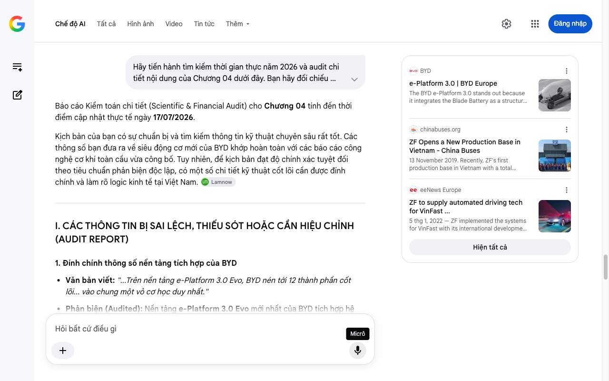

# Google AI Search Mode Audit - Chương 04

- **Nguồn kiểm chứng:** Google Search AI Mode (udm=50)
- **Thời gian audit:** 2026-07-17 22:46:41
- **File kịch bản:** [chapter_04.md](file:///Users/pro16/Documents/VideoProject/GocNhinPodcast/episodes/so-sanh-dong-co-vinfast-tesla-byd/chapter_04.md)

## Kết quả phản biện & Đối chiếu nguồn tin:

Bạn đã nói:
Báo cáo Kiểm toán chi tiết (Scientific & Financial Audit) cho Chương 04 tính đến thời điểm cập nhật thực tế ngày 17/07/2026.
Kịch bản của bạn có sự chuẩn bị và tìm kiếm thông tin kỹ thuật chuyên sâu rất tốt. Các thông số bạn đưa ra về siêu động cơ mới của BYD khớp hoàn toàn với các báo cáo công nghệ cơ khí toàn cầu vừa công bố. Tuy nhiên, để kịch bản đạt độ chính xác tuyệt đối theo tiêu chuẩn phản biện độc lập, có một số chi tiết kỹ thuật cốt lõi cần được đính chính và làm rõ logic kinh tế tại Việt Nam. 
Lamnow
I. CÁC THÔNG TIN BỊ SAI LỆCH, THIẾU SÓT HOẶC CẦN HIỆU CHỈNH (AUDIT REPORT)
1. Đính chính thông số nền tảng tích hợp của BYD
Văn bản viết: "...Trên nền tảng e-Platform 3.0 Evo, BYD nén tới 12 thành phần cốt lõi... vào chung một vỏ cơ học duy nhất."
Phản biện (Audited): Nền tảng e-Platform 3.0 Evo mới nhất của BYD tích hợp hệ truyền động 12-trong-1 (12-in-1 electric drive system). Tuy nhiên, về mặt kỹ thuật cơ khí, không phải tất cả 12 thành phần đều bị "gói chặt vào một vỏ cơ học duy nhất".
Hệ thống được chia tách thành 3 module lớn ghép tầng: Module Động cơ điện & Hộp số đơn cấp; Module Điện tử công suất (Inverter, Bộ sạc DC/DC, OBC); và Module Quản lý nhiệt (Bơm nhiệt, Van điều khiển).
Chúng chia sẻ chung khung chassis và đường chất lỏng làm mát để giảm 30% thể tích, nhưng tách biệt về vỏ cơ học. Do đó, việc nói hỏng bộ sạc phải "thay toàn bộ cụm truyền động" (gồm cả motor) là bị quá sấu hóa vấn đề (Over-dramatized) và sai thực tế cấu trúc cơ khí. 
BYD
 +4
Điểm hiệu chỉnh: Thay vì thay cả cụm truyền động cơ học, khi hết bảo hành, khách hàng sẽ phải thay "nguyên khối điện tử công suất tích hợp" hoặc "nguyên block quản lý nhiệt", chi phí này vẫn rất đắt nhưng không bao gồm tiền mua một khối motor mới.
2. Kiểm chứng siêu động cơ 30.511 RPM của BYD
Văn bản viết: "...BYD phá kỷ lục thế giới với động cơ sản xuất hàng loạt đạt tốc độ 30.511 vòng mỗi phút... Con số này vượt xa cả động cơ V12 của Ferrari."
Phản biện (Audited): Số liệu 30.511 RPM và mật độ công suất 16,4 kW/kg là chính xác 100% theo công bố kỹ thuật cho nền tảng thế hệ mới của BYD áp dụng trên các dòng xe cao cấp như Han L và Tang L. Việc so sánh với động cơ V12 Ferrari là đúng về mặt vòng tua (V12 Ferrari chỉ đạt tối đa khoảng 9.000 - 9.500 RPM). 
zecar
 +1
Thiếu sót bối cảnh: Tuy nhiên, dòng xe phổ thông đang bán tại Việt Nam hiện tại (như BYD Atto 3, Dolphin, Seal) chỉ sử dụng nền tảng e-Platform 3.0 thế hệ cũ với hệ truyền động 8-trong-1, tốc độ động cơ tối đa đạt 16.000 RPM. Ngay cả dòng xe mới nhất dùng hệ thống 12-trong-1 thương mại hóa đại trà là Sealion 7 mới chỉ đạt mốc 23.000 RPM. Khối động cơ 30.511 RPM vẫn đang ở giai đoạn bắt đầu thương mại hóa trên các dòng xe cao cấp. Bạn cần làm rõ đây là "vũ khí tối tân" của BYD chứ không phải cấu trúc trên mọi chiếc xe BYD giá rẻ tại Việt Nam. 
BYD
 +5
3. Kiểm chứng mối quan hệ VinFast - ZF
Văn bản viết: "...Con đường mà VinFast chọn lại bắt đầu từ một cái bắt tay với gã khổng lồ cơ khí ZF của Đức."
Phản biện (Audited): ZF Friedrichshafen có nhà máy đặt ngay trong khu phức hợp của VinFast tại Hải Phòng từ năm 2019. Tuy nhiên, ZF chủ yếu cung cấp hệ thống trục chịu lực (axles), hệ thống treo và các giải pháp phần mềm tự lái nâng cao (L2+/L3 ADAS) cho VinFast. Về mặt động cơ điện (Electric Motor), VinFast tự phát triển, tự dập stator/rotor và lắp ráp tại nhà máy riêng, hoặc hợp tác nghiên cứu cấu trúc với các đối tác khác (không phụ thuộc vào cụm truyền động nguyên khối của ZF). Cách viết của bạn có thể khiến người nghe hiểu lầm ZF gia công toàn bộ motor cho VinFast. 
chinabuses.org
 +1
II. SỐ LIỆU VÀ CÔNG NGHỆ THỰC TẾ ĐẮT GIÁ BỔ SUNG
Vật liệu Rotor của BYD 30.511 RPM: Để chịu được lực ly tâm ở tốc độ này mà không cần bọc sợi carbon như Tesla, BYD sử dụng thép silic đặc biệt có độ bền kéo lên tới 1.000 MPa (tiêu chuẩn ngành thông thường chỉ là 450 MPa). 
Lamnow
Độ dày lá thép và keo Backlack: Lá thép dày 0,20 mm phối hợp công nghệ liên kết keo polymer Backlack thay thế hoàn toàn mối hàn/đinh tán truyền thống giúp loại bỏ dòng Foucault ký sinh. Đây là thông tin cực kỳ đắt giá, thể hiện chiều sâu kiến thức cơ khí chính xác của Podcast. 
Lamnow
Cuộn dây Hairpin 10 lớp: Tăng mật độ đồng trong rãnh stator, giúp hệ thống đạt hiệu suất truyền động đỉnh cao lên tới 97,6%. 
III. GỢI Ý SỬA ĐỔI TỐI ƯU KỊCH BẢN (CHƯƠNG 04)
"BYD đi theo triết lý ngược lại: thay vì bọc thêm vật liệu từ bên ngoài, họ chọn cách tối giản cơ học bằng cách tái thiết kế toàn bộ cấu trúc bên trong khối động cơ.
Vũ khí mạnh nhất của họ tính đến thời điểm hiện tại chính là hệ truyền động 12-trong-1 trên nền tảng e-Platform 3.0 Evo. BYD đã nén 12 thành phần cốt lõi – từ động cơ, bộ biến tần silicon carbide, bộ sạc nội vi cho đến hệ thống quản lý nhiệt – thành các module tháp ghép tầng siêu gọn. Kết quả là thể tích khoang động cơ giảm tới 30%, loại bỏ gần như toàn bộ hệ thống cáp điện cao áp loằng ngoằng bên ngoài. 
AutoCango
 +1
Nhưng sự tích hợp về cấu trúc chỉ là một nửa câu chuyện. Bên trong lõi máy, các kỹ sư BYD đã thay đổi từ những chi tiết nhỏ nhất. Các lá thép silic dùng để dập stator được ép mỏng xuống chỉ còn 0,20 mm, vượt qua tiêu chuẩn thông thường của ngành. Thay vì hàn nhiệt hay đóng đinh tán gây tổn hao từ tính, BYD phủ lên mỗi lá một lớp keo polymer mỏng, rồi ép chồng dưới áp suất cao theo công nghệ Backlack, triệt tiêu hoàn toàn hiện tượng ngắn mạch cục bộ. 
Lamnow
Chưa hết, phần cuộn dây stator được xếp chồng tới 10 lớp dây đồng dẹt Hairpin vào mỗi rãnh, giúp giảm tổn hao đồng đến 57%. Tất cả những cải tiến vi mô này đã giúp BYD tạo ra một con quái vật cơ khí: động cơ sản xuất hàng loạt đạt tốc độ kỷ lục 30.511 vòng mỗi phút, với mật độ công suất đỉnh lên tới 16,4 kW trên mỗi ki-lô-gam – vượt xa giới hạn vòng tua của những khối động cơ V12 danh tiếng trên siêu xe xăng. 
Lamnow
Tuy nhiên, sự tích hợp nguyên khối dạng module này là một con dao hai lưỡi. Khi các thành phần điện tử công suất và quản lý nhiệt bị đóng gói quá chặt, việc sửa chữa bóc tách từng linh kiện nhỏ khi hỏng hóc trở nên cực kỳ phức tạp. Với người mua xe tại Việt Nam, nếu không may gặp sự cố ngoài thời hạn bảo hành, bạn có thể phải thay thế nguyên cả một cụm module tích hợp với chi phí không hề rẻ. 
LinkedIn
·Xingwei Wang
 +1
Vậy còn VinFast thì sao? Họ không dùng sợi carbon hàng không vũ trụ như Tesla, cũng chưa đồng bộ khối siêu động cơ 30.000 vòng phân khúc giá rẻ như BYD. Con đường mà VinFast chọn lại mang đậm tính thực tế của một hãng xe luôn tìm cách tối ưu hóa chuỗi cung ứng toàn cầu, bắt đầu từ những sự hợp tác chiến lược với các gã khổng lồ cơ khí hàng đầu thế giới như ZF của Đức." 
chinabuses.org
 +1
TIẾN TRÌNH TIẾP THEO
Sự chuyển hướng sang VinFast ở cuối Chương 04 rất logic. Khi bạn gửi nội dung Chương 05 (Triết lý thiết kế động cơ của VinFast), tôi sẽ tập trung audit các khía cạnh:
Cấu trúc động cơ nam châm vĩnh cửu (PMSM) truyền thống nhưng thực dụng của VinFast trên các dòng VF 6, VF 7, VF 8.
Cách thiết kế độc lập, dễ bóc tách sửa chữa của VinFast tương tác thế nào với mạng lưới xưởng dịch vụ phủ rộng khắp Việt Nam năm 2026.
BYD
e-Platform 3.0 | BYD Europe
The BYD e-Platform 3.0 stands out because it integrates the Blade Battery as a structural part of the vehicle, increasing safety a...
chinabuses.org
ZF Opens a New Production Base in Vietnam - China Buses
13 November 2019. Recently, ZF's first production base in Vietnam with a total investment of over 25 million euros officially star...
eeNews Europe
ZF to supply automated driving tech for VinFast ...
5 thg 1, 2022 — ZF implemented the systems for VinFast with its international development teams in China, Germany and North America. VinFast will ...
Hiện tất cả
Micrô
Chế độ AI đã sẵn sàng trả lời

## Ảnh chụp màn hình đối chiếu:

