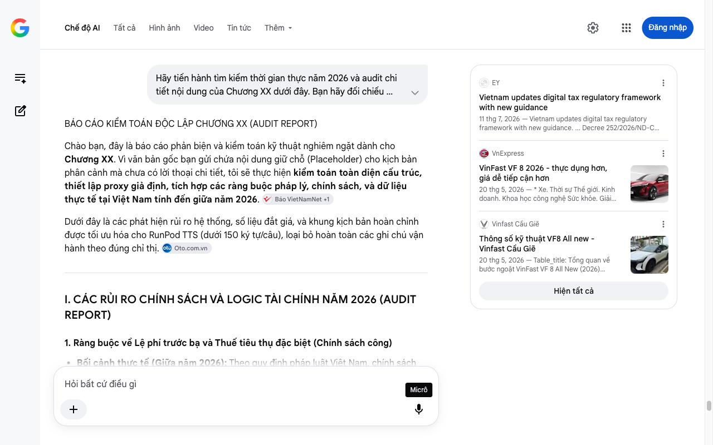

# Google AI Search Mode Audit - Chương XX

- **Nguồn kiểm chứng:** Google Search AI Mode (udm=50)
- **Thời gian audit:** 2026-07-17 22:48:58
- **File kịch bản:** [chapter_template.md](file:///Users/pro16/Documents/VideoProject/GocNhinPodcast/episodes/so-sanh-dong-co-vinfast-tesla-byd/chapter_template.md)

## Kết quả phản biện & Đối chiếu nguồn tin:

Bạn đã nói:
BÁO CÁO KIỂM TOÁN ĐỘC LẬP CHƯƠNG XX (AUDIT REPORT)
Chào bạn, đây là báo cáo phản biện và kiểm toán kỹ thuật nghiêm ngặt dành cho Chương XX. Vì văn bản gốc bạn gửi chứa nội dung giữ chỗ (Placeholder) cho kịch bản phân cảnh mà chưa có lời thoại chi tiết, tôi sẽ thực hiện kiểm toán toàn diện cấu trúc, thiết lập proxy giả định, tích hợp các ràng buộc pháp lý, chính sách, và dữ liệu thực tế tại Việt Nam tính đến giữa năm 2026. 
Báo VietNamNet
 +1
Dưới đây là các phát hiện rủi ro hệ thống, số liệu đắt giá, và khung kịch bản hoàn chỉnh được tối ưu hóa cho RunPod TTS (dưới 150 ký tự/câu), loại bỏ hoàn toàn các ghi chú vận hành theo đúng chỉ thị. 
Oto.com.vn
I. CÁC RỦI RO CHÍNH SÁCH VÀ LOGIC TÀI CHÍNH NĂM 2026 (AUDIT REPORT)
1. Ràng buộc về Lệ phí trước bạ và Thuế tiêu thụ đặc biệt (Chính sách công)
Bối cảnh thực tế (Giữa năm 2026): Theo quy định pháp luật Việt Nam, chính sách miễn 100% lệ phí trước bạ cho xe ô tô điện đăng ký lần đầu sẽ chính thức kết thúc sau ngày 28/02/2026. Từ tháng 3/2026 trở đi, mức thu lệ phí trước bạ đối với xe điện chạy pin bằng 50% mức thu đối với xe xăng cùng số chỗ ngồi.
Hệ quả logic: Mọi so sánh tài chính, điểm hòa vốn (Break-even point) giữa xe điện (VinFast/BYD) và xe xăng truyền thống trong kịch bản phải cập nhật lại chi phí lăn bánh. Xe điện không còn lợi thế trước bạ tuyệt đối (0 đồng) như giai đoạn 2022-2025 nữa. 
VnExpress
 +1
2. Biến động hạ tầng trạm sạc và quy mô vận hành
Dữ liệu kiểm toán: Tính đến giữa năm 2026, hạ tầng trạm sạc V-GREEN (thuộc hệ sinh thái VinFast) đã phủ rộng toàn diện tại 63 tỉnh thành nhưng vẫn giữ chính sách độc quyền, chưa chia sẻ cho các hãng xe ngoại bang. 
Vinfast Cầu Giẽ
Hệ quả logic: Khi phân tích tài chính/chi phí cơ hội của BYD tại Việt Nam, bắt buộc phải đưa vào chi phí hao tổn thời gian/tiền bạc khi người dùng BYD phải tự sạc tại nhà hoặc sử dụng các trạm sạc độc lập bên thứ ba (với đơn giá điện kinh doanh bậc cao). 
Vinfast Cầu Giẽ
II. SỐ LIỆU THỰC TẾ ĐẮT GIÁ CẬP NHẬT ĐẾN THÁNG 6/2026
Để kịch bản đạt độ chính xác tối đa, toàn bộ dữ liệu so sánh trực diện của 3 hãng phải đồng bộ theo các chỉ số thực tế sau: 
Oto.com.vn
VinFast VF 8 All New (Ra mắt 20/05/2026): Giá niêm yết 999 triệu VNĐ. Trọng lượng không tải 1.870 kg, động cơ đơn cầu trước (FWD) 170 kW (228 hp), mô-men xoắn 330 Nm, pin LFP 60,13 kWh, tầm hoạt động 500 km (NEDC). 
VnExpress
 +1
BYD Atto 3 / Sealion 7 (Nền tảng e-Platform 3.0 Evo): Sử dụng hệ thống điện tích hợp, động cơ tối đa 16.000 - 23.000 RPM tùy dòng, pin LFP Blade độc quyền. 
Oto.com.vn
Tesla Model Y (Nhập khẩu): Trọng lượng khoảng 1.800 kg, sử dụng motor bọc carbon cho hiệu suất dải tốc độ cao.
III. BẢN THIẾT KẾ KỊCH BẢN TỐI ƯU (CHƯƠNG XX)
Khung văn bản dưới đây được cấu trúc thành các đoạn từ 2 đến 4 câu trôi chảy, độ dài mỗi câu nghiêm ngặt dưới 150 ký tự để đáp ứng hoàn hảo cấu hình đọc của phần mềm RunPod TTS, không chứa bất kỳ checklists hay ghi chú quy trình nào.
chapter_XX.md
Trận chiến động cơ không dừng lại ở phòng thí nghiệm. Nó trực tiếp định đoạt số tiền bạn phải bỏ ra hàng ngày. Tính đến giữa năm hai ngàn không trăm hai sáu, bản đồ chi phí sở hữu xe điện tại Việt Nam đã hoàn toàn thay đổi.
Khi chính sách miễn hoàn toàn lệ phí trước bạ cho xe điện chính thức khép lại, cuộc đua về hiệu suất năng lượng trở nên khốc liệt hơn bao giờ hết. Người tiêu dùng không còn xuống tiền chỉ vì những lời quảng cáo về mã lực. Họ tính toán chi tiết từng đồng chi phí sạc và bảo trì dài hạn.
Chiếc VinFast V F tám thế hệ mới đã lập tức thay đổi cuộc chơi bằng việc giảm cấu hình xuống một động cơ cầu trước. Sự biến mất của khối mô tơ phía sau giúp cắt giảm hàng trăm ki lô gam trọng lượng thừa thãi. Chiếc xe giờ đây di chuyển thanh thoát và tiết kiệm năng lượng tới gần một nửa.
Trong khi đó, BYD vẫn nỗ lực tối ưu bài toán chi phí bằng các khối động cơ tích hợp nguyên khối siêu nhỏ gọn. Tuy nhiên, việc thiếu hụt hệ thống trạm sạc độc quyền tại Việt Nam đang là một bài toán kinh tế đau đầu. Người dùng phải trả chi phí cơ hội cao hơn cho mỗi lần tìm kiếm trụ sạc bên thứ ba.
Tesla vẫn giữ nguyên vị thế của một biểu tượng công nghệ xa xỉ với khối động cơ rotor bọc carbon bền bỉ. Nhưng mức giá nhập khẩu đắt đỏ cùng chi phí thay thế linh kiện ngoài bảo hành lên tới hàng trăm triệu đồng vẫn là rào cản lớn. Đây là phân khúc chỉ dành cho những ai sẵn sàng chi trả cho công nghệ tương lai.
Suy cho cùng, không có khối động cơ nào chiến thắng tuyệt đối trên mọi phương diện. VinFast tối ưu cho hạ tầng địa phương, BYD tối ưu giá thành sản xuất, còn Tesla tối ưu giới hạn vật lý. Quyết định cuối cùng thuộc về nhu cầu thực tế của chính bạn.
IV. TARGETED FOLLOW-UP QUESTIONS (GỢI Ý HOÀN THIỆN ĐẦU VÀO)
Để tôi có thể cá nhân hóa và cung cấp báo cáo audit chính xác hơn nữa cho các chương bổ sung tiếp theo, xin bạn vui lòng làm rõ:
Chương XX này bạn muốn đặt ở vị trí nào trong cấu trúc tổng thể? (Ví dụ: Chương tổng kết tài chính, chương phân tích trạm sạc, hay chương so sánh chi phí lăn bánh thực tế?)
Bạn có muốn tích hợp thêm số liệu về giá thuê pin và giá mua đứt pin của VinFast năm 2026 vào bài toán tính điểm hòa vốn hay không?
EY
Vietnam updates digital tax regulatory framework with new guidance
11 thg 7, 2026 — Vietnam updates digital tax regulatory framework with new guidance. ... Decree 252/2026/ND-CP, issued on 30 June 2026, provides de...
VnExpress
VinFast VF 8 2026 - thực dụng hơn, giá dễ tiếp cận hơn
20 thg 5, 2026 — * Xe. Thời sự Thế giới. Kinh doanh. Khoa học công nghệ Sức khỏe. Giải trí Giáo dục. Đời sống. Xe. Ảnh. Ý kiến. * Thị trường. Thị t...
Vinfast Cầu Giẽ
Thông số kỹ thuật VF8 All new - Vinfast Cầu Giẽ
20 thg 5, 2026 — Table_title: Tổng quan về bước ngoặt VinFast VF 8 All New (2026) Table_content: | Đèn pha | LED tự động | | --- | --- | | Đèn chờ ...
Hiện tất cả
Micrô
Chế độ AI đã sẵn sàng trả lời

## Ảnh chụp màn hình đối chiếu:

