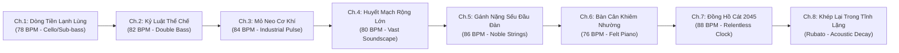

<!--
DOCUMENT PROVENANCE & EXECUTION LINEAGE:
- Output Document: episodes/su-phan-hoa-dong-nam-a/audio_cues.md
- Activated Persona: The Cinematic Sonic Alchemist (.agents/personas/the_cinematic_sonic_alchemist.md)
- Activated Skill: music_composer (.agents/skills/music_composer/SKILL.md)
- Source Documents Consulted:
  * episodes/su-phan-hoa-dong-nam-a/voiceover.md
  * 00_core/audio_music_style_guide.md
  * episodes/su-phan-hoa-dong-nam-a/audio/ (WAV voiceover files)
- Execution Timestamp: 2026-09-09 21:45
-->

# BẢNG TỔNG PHỔ NHẠC NỀN & THIẾT KẾ ÂM THANH ĐIỆN ẢNH (AUDIO CUES & SONIC ARCHITECTURE)
## TẬP PHIM: VIỆT NAM ĐANG ĐI NHANH HAY LÁNG GIỀNG ĐANG CHẬM LẠI? — SỰ THẬT CUỘC ĐỔI NGÔI ĐÔNG NAM Á 2026

---

## 1. TIÊU CHUẨN KỸ THUẬT PHÁT SÓNG & THIẾT KẾ KHOẢNG TRỐNG TẦN SỐ (BROADCAST & VOCAL POCKET STANDARDS)

> 🎙️ **NGUYÊN TẮC BẤT DI BẤT DỊCH CỦA NHÀ SOẠN NHẠC:**  
> *"Âm nhạc không được phép trang trí hay gồng mình chứng tỏ. Nhạc nền là bầu khí quyển nhận thức. Khi lời bình đang giải thích số liệu và cơ chế, nhạc phải lùi sâu vào hậu cảnh. Khi sự thật chốt hạ rơi xuống, nhạc phải biết im lặng để câu nói chạm tới đáy sâu nhận thức của thính giả."*

### 1.1. Cấu Hình Âm Lượng & Loudness (Target Loudness Specification)
* **Voiceover Master Track:**
  - Integrated Loudness: **-14.0 LUFS** (Chuẩn YouTube / Spotify Podcast).
  - True Peak: **-1.0 dBTP** (Chống méo biên độ khi mã hóa AAC/Opus).
  - Vocal Clarity EQ: High-pass filter tại **80 Hz** (cắt sạch rumble ồn nền), Boost nhẹ **+1.5 dB tại 4.5 kHz** (tăng độ rõ của phụ âm tiếng Việt).
* **Music Background Track (BGM):**
  - Mức âm lượng nền khi có lời thoại: **-22.0 dB đến -24.0 dB** (so với Voiceover).
  - Mức âm lượng nền khi không có lời thoại (khoảng nghỉ): **-16.0 dB đến -18.0 dB**.
  - Sidechain Auto-Ducking: Thiết lập tự động giảm **-4.0 dB đến -5.0 dB** ngay khi tín hiệu Voiceover xuất hiện (Attack: **25ms**, Release: **350ms**, Knee: **Soft**).

### 1.2. Kỹ Thuật Khoét Rỗng Tần Số Giọng Đọc (Frequency Carving / Vocal Pocket EQ)
Để đảm bảo **100% không bao giờ lấn át giọng đọc**, kênh nhạc nền bắt buộc phải đặt một bộ lọc EQ thông minh trên BGM Master Bus:
* **Dip 1 (Hộp âm ngữ điệu):** Giảm **-3.5 dB** tại dải **350 Hz - 600 Hz** (vùng ấm đặc trưng của giọng nam trung trầm baritone).
* **Dip 2 (Vùng hiện diện & phát âm từ):** Giảm **-4.5 dB (Q = 1.4)** tại dải **1.2 kHz - 3.2 kHz** (vùng nhạy cảm nhất của tai người để nghe rõ từng chữ và số liệu).
* **High-Cut Lọc Mịn:** Low-pass filter nhẹ tại **14 kHz** để loại bỏ tiếng xì xào tần số cao gây mỏi tai trong video dài 28 phút.

---

## 2. BẢN ĐỒ CUNG BẬC CẢM XÚC 8 CHƯƠNG (THE 8-STAGE EMOTIONAL ARC)

---

## 3. BẢNG TỔNG PHỔ ĐIỀU PHỐI ÂM THANH CHI TIẾT THEO TỪNG CHƯƠNG (THE MASTER AUDIO CUE MATRIX)

### 🎼 CHƯƠNG 1: CÚ SỐC TÍN NHIỆM 2026 — NGHỊCH LÝ CUỘC ĐỔI NGÔI
* **Tệp Voiceover:** `audio/chapter_01.wav` (Thời lượng: **177.2s / 2m57s**)
* **Tác phẩm chỉ định:** Track 01 — *"The Cold Flow of Capital"* (Dòng Tiền Băng Lạnh) | 78 BPM | D minor
* **Đặc tính âm thanh:** Khởi đầu bằng tiếng drone sub-bass 45Hz lạnh lẽo, tiếng gõ vi mô tích tắc như dòng tiền đang chuyển dịch âm thầm trên bảng điện tử. Nốt cello trầm kéo dài, tiếng piano rải đơn nốt cách nhau 4 giây.

| Mốc Thời Gian (s) | Phân Cảnh & Câu Thoại Mỏ Neo | Chỉ Lệnh Âm Thanh & Âm Lượng (Cue Action) | Kỹ Thuật Dựng (Editing Notes) |
| :--- | :--- | :--- | :--- |
| **00:00 - 00:03** | `CH01_SC001` (Trước khi phát lời) | Tiếng drone 45Hz trồi lên êm ái từ cõi lặng (-18dB), nốt Cello trầm C2 ngân dài. | Mở không gian tò mò, lạnh lùng. |
| **00:03 - 00:35** | `CH01_SC001` -> `CH01_SC006`: "Dòng tiền tư bản toàn cầu không có cảm xúc..." | Sidechain Ducking ép nhạc xuống **-23dB**. Tiếng click tích tắc 78 BPM giữ nhịp điệu logic. | Voiceover nổi bật hoàn toàn, nhạc lùi sâu sau lưng. |
| **00:35 - 01:10** | `CH01_SC007a` -> `CH01_SC012`: Phân tích Bangkok nợ 87% GDP, Manila giá điện đắt, Jakarta dời đô. | Thêm nốt piano đanh mảnh rơi ở các nốt chuyển nước (Bangkok -> Manila -> Jakarta). | Tăng độ sắc nét của sự tương phản khu vực. |
| **01:45 - 01:52** | `CH01_SC019a`: "...gần 80% kim ngạch vẫn nằm trọn trong tay khối ngoại..." | Bass rải chậm lại, dải trung của nhạc mỏng dần, tạo cảm giác trơ trọi của nền gia công. | Chuẩn bị cho điểm rơi sự thật. |
| **02:00 - 02:05** | `CH01_SC021`: *"Dòng vốn kỷ lục này vì thế không phải là chiếc cúp chiến thắng để ngạo nghễ, mà chỉ là một tấm vé vào cửa đầy thách thức."* | 🛑 **THE TRUTH DROP 1:** Toàn bộ nhạc nền câm lặng (Drop to -inf dB) đúng 0.5s trước chữ "không phải là chiếc cúp", giữ im lặng hoàn toàn suốt câu nói, để đuôi reverb tan 1.0s sau chữ "thách thức" rồi mới cho cello quay lại. | Điểm nhấn triết học mạnh nhất của chương mở đầu. |
| **02:50 - 02:57** | `CH01_SC028`: "...trận địa đầu tiên quyết định cuộc đổi ngôi ấy chính là sự vận hành của bộ máy công quyền." | Cello ngân nốt trầm D2 và hạ dần (fade-out xuống câm lặng trong 3 giây). | Chừa 2.0s tĩnh lặng chuyển chương (The Transition Pause). |

---

### 🎼 CHƯƠNG 2: TRẬN ĐỊA THỂ CHẾ — KỶ LUẬT THỜI CHIẾN & NĂNG LỰC TỰ CỞI TRÓI
* **Tệp Voiceover:** `audio/chapter_02.wav` (Thời lượng: **223.9s / 3m44s**)
* **Tác phẩm chỉ định:** Track 02 — *"The Bedrock of Governance"* (Mỏ Neo Thể Chế) | 82 BPM | C minor
* **Đặc tính âm thanh:** Tiếng gõ khối gỗ (muted woodblock) đanh chắc tượng trưng cho kỷ cương hành chính. Tiếng double bass pizzicato gãy gọn phối cùng bè cello trầm hùng, biểu đạt sức mạnh của sự ổn định và tính kiên định vĩ mô.

| Mốc Thời Gian (s) | Phân Cảnh & Câu Thoại Mỏ Neo | Chỉ Lệnh Âm Thanh & Âm Lượng (Cue Action) | Kỹ Thuật Dựng (Editing Notes) |
| :--- | :--- | :--- | :--- |
| **00:00 - 00:04** | Đầu chương 2: "Khi đầu tư hàng tỷ đô la xây nhà máy bán dẫn..." | Double bass pizzicato bắt đầu nhịp 82 BPM vững chãi (-22dB), không gian mở rộng. | Nhịp điệu kỷ luật, đĩnh đạc. |
| **00:30 - 01:15** | Đối chiếu Thái Lan 3 năm 3 đời thủ tướng, Manila rạn nứt chính trị. | Âm hưởng hơi trầm đục, bè dây đi xuống (descending progression) tạo cảm giác bế tắc thể chế. | Khắc họa sự trả giá của bất ổn. |
| **01:40 - 02:10** | Việt Nam: "tâm lý co cụm, sợ sai, đùn đẩy trách nhiệm..." | Nhạc nền giảm xuống -25dB, tiếng click gõ gỗ tạm dừng, chỉ giữ drone nền mỏng. | Không khí nghiêm túc, nhìn thẳng vào khuyết tật. |
| **02:15 - 02:22** | *"Nhưng điểm khác biệt mang tính quyết định nằm ở năng lực tự cởi trói của hệ thống."* | 🛑 **THE TRUTH DROP 2:** Nhạc ngắt đột ngột 1 giây trước cụm "năng lực tự cởi trói", sau đó bùng nhẹ một âm sub-swell trầm ấm đón đầu câu tiếp theo. | Đánh thức sự chú ý của người nghe trước bước ngoặt. |
| **02:40 - 03:20** | Chiến dịch 500kV mạch 3 (200 ngày) và 500 ngày đêm 3.300km cao tốc. | Nhạc dây ostinato dâng lên nhẹ nhàng (-20dB), tiếng gõ gỗ quay trở lại dồn dập hơn. | Tạo khí thế xung trận, thần tốc mà không bị ồn ào. |
| **03:40 - 03:44** | Cuối chương 2: "...trước khi tính đến chuyện đặt nhà xưởng... Trận địa công nghiệp chế tạo." | Dàn dây vuốt nhẹ rồi tắt hẳn. 2 giây tĩnh lặng hoàn toàn trước khi vào Chương 3. | Khoảng nghỉ chuyển trận địa. |

---

### 🎼 CHƯƠNG 3: TRẬN ĐỊA CÔNG NGHIỆP — MỎ NEO PHẦN CỨNG VS ẢO ẢNH TIÊU DÙNG
* **Tệp Voiceover:** `audio/chapter_03.wav` (Thời lượng: **253.9s / 4m14s**)
* **Tác phẩm chỉ định:** Track 03 — *"The Weight of Hardware"* (Sức Nặng Mỏ Neo Cơ Khí) | 84 BPM | F minor
* **Đặc tính âm thanh:** Nhịp đập cơ khí bọc nhung mờ như tiếng máy dập thủy lực từ xa. Âm thanh kim loại kéo vĩ (bowed metal) và tiếng marimba thủy tinh tạo cảm giác sắc lạnh của nhà xưởng sản xuất thực chất.

| Mốc Thời Gian (s) | Phân Cảnh & Câu Thoại Mỏ Neo | Chỉ Lệnh Âm Thanh & Âm Lượng (Cue Action) | Kỹ Thuật Dựng (Editing Notes) |
| :--- | :--- | :--- | :--- |
| **00:00 - 00:05** | "Sản xuất phần cứng chưa bao giờ là hành trình dễ dàng..." | Muffled industrial kick đập nhịp 84 BPM mộc (-23dB), cello đi giai điệu staccato sắc lạnh. | Trực giác xúc giác về cơ khí. |
| **00:30 - 01:20** | Philippines: Kiều hối $38B, dịch vụ BPO, giá điện đắt 0.22$/kWh khiến công nghiệp chế tạo rơi tự do. | Bỏ tiếng kick, chỉ để lại âm synth rỗng không đáy (hollow pad) phản chiếu sự thiếu vắng nhà máy. | Âm thanh của "nền kinh tế tiêu dùng không rễ". |
| **01:30 - 02:15** | Thái Lan: Nợ hộ gia đình 90% GDP, dân số già hóa, 2.000 xưởng phụ tùng xe xăng lao đao. | Tiếng kim loại bowed metal rít nhẹ ở hậu cảnh xa, gợi cảm giác han rỉ, đình đốn của chuỗi phụ tùng cũ. | Bi kịch của kẻ chậm chuyển mình. |
| **02:30 - 03:15** | Việt Nam: Kim ngạch điện tử $165 tỷ, mồ hôi lắp ráp chắt chiu từng đồng thặng dư. | Nhịp máy dập quay trở lại chắc chắn, hòa âm cello ấm áp mở rộng (-21dB). | Tôn vinh giọt mồ hôi của người lao động. |
| **03:40 - 03:48** | *"Nếu không có các phân xưởng phần cứng, cánh cửa bước vào ngành bán dẫn và trí tuệ nhân tạo sẽ vĩnh viễn không thể mở ra."* | 🛑 **THE TRUTH DROP 3:** Tắt toàn bộ nhạc trong suốt câu nói này. Chỉ có giọng đọc mộc hoàn toàn vang lên trên nền tĩnh mịch. | Đóng đinh chân lý vào tâm trí thính giả. |
| **04:10 - 04:14** | Kết chương 3 chuyển sang Trận địa Siêu Hạ Tầng & An Ninh Năng Lượng. | Fade-out nhịp đập cơ khí trong 3 giây. | Transition Pause 2.0s. |

---

### 🎼 CHƯƠNG 4: TRẬN ĐỊA SIÊU HẠ TẦNG & CÚ SỐC NĂNG LƯỢNG MỚI
* **Tệp Voiceover:** `audio/chapter_04.wav` (Thời lượng: **371.0s / 6m11s**)
* **Tác phẩm chỉ định:** Track 04 — *"The Arteries of the Dragon"* (Huyết Mạch Rồng) | 80 BPM | G minor
* **Đặc tính âm thanh:** Không gian địa lý mênh mông, tiếng sub-bass swell sâu thẳm như sóng ngầm đại dương, tiếng rung tần số cao siêu mỏng mô phỏng dòng điện 500kV, nhịp gõ mallet rải đều như đoàn tàu cao tốc lướt trên đường ray.

| Mốc Thời Gian (s) | Phân Cảnh & Câu Thoại Mỏ Neo | Chỉ Lệnh Âm Thanh & Âm Lượng (Cue Action) | Kỹ Thuật Dựng (Editing Notes) |
| :--- | :--- | :--- | :--- |
| **00:00 - 00:06** | "Sản xuất công nghiệp không thể chỉ tồn tại bên trong những bức tường nhà xưởng..." | Sub-bass swell êm ái trồi lên từ 40Hz, tiếng cello ngân nốt G1 trầm hùng (-22dB). | Cảm giác quy mô lục địa, không gian mở. |
| **00:40 - 01:50** | Indonesia: 17.000 đảo, logistics 23% GDP, bẫy niken LFP và thuế carbon EU CBAM 2026. | Tiếng pad âm u, tiếng sóng biển viễn xứ, âm thanh điện than nặng nề. | Thể hiện sự chia cắt địa lý và gánh nặng carbon. |
| **02:00 - 02:40** | Nusantara dời đô hụt vốn vs an sinh bữa ăn học đường. | Giai điệu piano trầm buồn ngập ngừng, thể hiện thế lưỡng nan tài khóa. | Tương phản giữa tham vọng và nguồn lực. |
| **02:50 - 03:45** | Việt Nam: Dải đất liền hình chữ S, 3.300km cao tốc trục dọc thông suốt từ Bắc tới Cà Mau. | Mallet gõ nhịp 80 BPM tươi sáng, dàn dây mở rộng panorama (-20dB). | Sự kết nối địa hình liền mạch, tốc độ luân chuyển. |
| **04:00 - 04:45** | Bóc tách tử huyệt: Đường sắt khổ 1 mét thời thuộc địa, logistics 16-18% GDP, chi phí gánh nặng. | Nhạc hạ nhịp, tiếng cello kéo nốt chùng gai góc, tiếng kim loại gỉ sét rít nhẹ. | Kéo thính giả trở về với thực tế nhức nhối. |
| **05:00 - 05:40** | Quy hoạch điện 8, điện nền sạch 24/7 cho chip bán dẫn và AI data center. | Xuất hiện tiếng electrical hum tinh tế ở tần số cực cao mô phỏng mạch điện sạch. | Ranh giới sống còn của độ tin cậy năng lượng. |
| **06:05 - 06:11** | *"Ai sẽ là những cỗ đầu tàu vận hành trên những đường ray ấy?"* | 🛑 **THE TRUTH DROP 4:** Nhạc ngắt câm lặng hoàn toàn ngay trước câu hỏi tu từ, để câu hỏi ngân vang trong hư không. | Cú móc nghẹt thở dẫn sang Chương 5. |

---

### 🎼 CHƯƠNG 5: TRẬN ĐỊA NỘI LỰC — NHỮNG CỘT TRỤ ĐỠ BÃO & KHÁT VỌNG TỰ CƯỜNG
* **Tệp Voiceover:** `audio/chapter_05.wav` (Thời lượng: **267.3s / 4m27s**)
* **Tác phẩm chỉ định:** Track 05 — *"The Pioneer's Burden"* (Gánh Nặng Sếu Đầu Đàn) | 86 BPM | B minor / D major
* **Đặc tính âm thanh:** Chất bi tráng, kiên cường, danh dự dân tộc nhưng tuyệt đối không ồn ào khoa trương. Cello độc tấu đầy cảm xúc kết hợp tiếng piano mộc ấm áp, tiếng french horn xa vắng trầm hùng tượng trưng cho khát vọng tự cường công nghệ.

| Mốc Thời Gian (s) | Phân Cảnh & Câu Thoại Mỏ Neo | Chỉ Lệnh Âm Thanh & Âm Lượng (Cue Action) | Kỹ Thuật Dựng (Editing Notes) |
| :--- | :--- | :--- | :--- |
| **00:00 - 00:05** | "Nhìn lại các nước láng giềng, chúng ta mới thấy cái giá phải trả khi thiếu vắng tập đoàn công nghiệp dân tộc..." | Solo Cello vào nốt B2 trầm buồn, tiếng piano acoustic rải từng nốt thưa (-22dB). | Sự suy ngẫm sâu sắc về tính tự chủ. |
| **00:40 - 01:25** | Viettel chip 5G ($8B brand), Hòa Phát thép ray đường sắt tốc độ cao. | Nhạc chuyển dần sang hợp âm D major ấm áp, dàn dây thính phòng dâng nhẹ (-21dB). | Niềm tự hào công nghiệp nội sinh. |
| **01:30 - 02:20** | VinFast 175.000 xe, trạm sạc V-Green 150.000 cổng phủ 63 tỉnh thành vs Thái 3.000 / Indo 1.000. | Nhịp điệu 86 BPM ổn định, tiếng điện tử charging-pulse nhẹ nhàng tạo cảm giác hạ tầng sạc dày đặc. | Con hào kinh tế của quốc gia 100 triệu dân. |
| **02:40 - 03:30** | Lăng kính kinh tế học sòng phẳng: Áp lực đốt vốn hàng tỷ USD, nợ vay, rủi ro sụp đổ, chống thân hữu. | Giai điệu quay về B minor trĩu nặng, tiếng cello độc tấu đơn côi, lạnh lùng. | Nhìn thẳng vào cái giá đắt đỏ của sự tự cường. |
| **03:55 - 04:05** | *"Nếu không có những cánh chim sếu đầu đàn dám đứng mũi chịu sào, đất nước sẽ mãi mãi chỉ là người làm thuê trên chính sân nhà của mình."* | 🛑 **THE TRUTH DROP 5:** Nhạc tắt lịm hoàn toàn trong suốt câu nói này. Tĩnh lặng tuyệt đối, tôn vinh bản lĩnh của người dấn thân. | Trọng tâm cảm xúc của toàn bộ tập phim. |
| **04:20 - 04:27** | Kết chương 5: "...đặt toàn bộ sự thật lên bàn cân đối chiếu." | Tiếng piano buông 1 nốt đơn độc, fade-out sạch sẽ. | Transition Pause 2.0s. |

---

### 🎼 CHƯƠNG 6: BỨC TRANH ĐỊNH LƯỢNG — 60% NỘI SINH VS 40% THIÊN THỜI ĐỊA LÝ
* **Tệp Voiceover:** `audio/chapter_06.wav` (Thời lượng: **211.2s / 3m31s**)
* **Tác phẩm chỉ định:** Track 06 — *"The Scale of Humility"* (Bàn Cân Khiêm Nhường) | 76 BPM | E minor / G major
* **Đặc tính âm thanh:** Tuyệt đối không nhạc cụ gõ (Zero Drums, Zero Percussion). Solo felt-piano mộc mạc giảm âm, nốt đàn rơi êm như sương sớm cách nhau 5-6 giây trên nền cello pedal note sâu thẳm. Sự khiêm nhường và minh triết của một nhà quan sát độc lập.

| Mốc Thời Gian (s) | Phân Cảnh & Câu Thoại Mỏ Neo | Chỉ Lệnh Âm Thanh & Âm Lượng (Cue Action) | Kỹ Thuật Dựng (Editing Notes) |
| :--- | :--- | :--- | :--- |
| **00:00 - 00:06** | "Khi bàn về sự trỗi dậy... dư luận rất dễ bị dao động giữa hai thái cực: tự ti mặc cảm và ngạo nghễ ru ngủ..." | Tiếng piano nốt E3 buông lơi, ngân vang tự nhiên trên phòng thu tĩnh lặng (-24dB). | Khử tan mọi sự kích động hay thiên kiến. |
| **00:35 - 01:20** | Phân định 60% nỗ lực nội sinh: Tự cởi trói thể chế, cao tốc 3.300km, đường dây 200 ngày, tài sản vật lý thực tế. | Nhạc nền dâng nhẹ một lớp synth pad ấm mỏng như làn gió mai (-22dB). | Công nhận sự thật khách quan. |
| **01:30 - 02:10** | Phân định 40% ngoại sinh: Đối thủ tự vấp ngã (Thái, Manila, Indo) và thiên thời địa chính trị cạnh công xưởng thế giới. | Nốt piano chuyển sang sắc thái trầm ngâm, bass kéo dài không đổi. | Tỉnh táo, không ngộ nhận may mắn thành thiên tài. |
| **02:30 - 03:00** | *"GDP bình quân đầu người của Thái Lan hiện nay đã vượt mốc 8.000 USD... gấp hơn 1.6 lần cột mốc 5.000 USD của Việt Nam... Đằng sau đó là hơn 30 năm người Thái tích lũy của cải..."* | 🛑 **THE TRUTH DROP 6:** Giảm nhạc xuống -30dB (gần như im lặng hoàn toàn), chỉ còn tiếng búa gõ piano rơi từng nhịp cực thưa. | Đánh vào tâm thức thính giả bằng sự thật định lượng. |
| **03:20 - 03:31** | "...Thời gian đang là thứ tài sản khan hiếm nhất của chúng ta... giẫm vào vết xe đổ của người đi trước." | Nốt piano cuối cùng tan dần vào cõi lặng tuyệt đối. | Chuẩn bị bước vào chương cảnh tỉnh quyết định. |

---

### 🎼 CHƯƠNG 7: TẤM GƯƠNG CẢNH TỈNH — 5 TỬ HUYỆT TRÊN CON ĐƯỜNG HÓA RỒNG 2045
* **Tệp Voiceover:** `audio/chapter_07.wav` (Thời lượng: **199.1s / 3m19s**)
* **Tác phẩm chỉ định:** Track 07 — *"The Hourglass of 2045"* (Đồng Hồ Cát 2045) | 88 BPM | C minor ostinato
* **Đặc tính âm thanh:** Tiếng kim đồng hồ tích tắc vô hình (clockwork pulse), dàn dây ostinato tối giản lặp đi lặp lại theo phong cách Max Richter / Philip Glass, tạo cảm giác một chiếc đồng hồ cát đang đếm ngược từng giây trước ngưỡng cửa lịch sử năm 2045.

| Mốc Thời Gian (s) | Phân Cảnh & Câu Thoại Mỏ Neo | Chỉ Lệnh Âm Thanh & Âm Lượng (Cue Action) | Kỹ Thuật Dựng (Editing Notes) |
| :--- | :--- | :--- | :--- |
| **00:00 - 00:06** | "Việc quy mô kinh tế tiệm cận các nước dẫn đầu không phải chiếc cúp để tự mãn..." | Tiếng tích tắc đồng hồ 88 BPM xuất hiện ngay giây đầu tiên cùng bè cello ostinato (-22dB). | Cảm giác cấp bách, không khí đếm ngược. |
| **00:25 - 00:50** | Tử huyệt 1 (Bán dẫn mới chỉ đóng gói 10-15%) & Tử huyệt 2 (Thiếu hụt 80% kỹ sư thiết kế). | Dàn dây violin bè trầm nhập cuộc, nhịp điệu siết chặt từng nốt. | Áp lực kỹ thuật và nhân lực chất lượng cao. |
| **00:55 - 01:30** | Tử huyệt 3 (Điện nền Quy hoạch 8) & Tử huyệt 4 (R&D chỉ 0.4% GDP - bẫy gia công phụ trợ). | Nốt piano cao gõ nhịp ngắt quãng đanh gọn như tiếng chuông báo động ngầm. | Sự cảnh tỉnh nghiêm khắc. |
| **01:40 - 02:15** | Tử huyệt 5: "Chiếc đồng hồ cát của thời kỳ dân số vàng... chỉ còn mở trong chưa đầy 10 năm nữa (2035-2039 già hóa nhanh kỷ lục)..." | Nhạc nền dâng lên mức đỉnh của chương (-19dB), nhịp tích tắc dồn dập, bè cello rền vang. | Điểm cao trào kịch tính lịch sử của toàn bộ podcast. |
| **02:45 - 03:10** | *"Đồng hồ cát vẫn đang chảy những hạt cát cuối cùng. Thời gian không chờ đợi bất kỳ ai. Và cơ hội lịch sử này chắc chắn sẽ không gõ cửa lần thứ hai."* | 🛑 **THE FINAL SILENCE DROP:** Đúng vào câu "Và cơ hội lịch sử này chắc chắn sẽ không gõ cửa lần thứ hai", TOÀN BỘ NHẠC NỀN DỨT HẲN. Giữ im lặng tuyệt đối 2.5 giây sau chữ cuối cùng. | Khép lại tập phim bằng sự tôn trọng và chấn động nội tâm. |
| **03:15 - 03:19** | Hết thoại Chương 7. | Hoàn toàn im lặng (Dead Silence). | Chuyển sang phần thẻ Disclaimer. |

---

### 🎼 CHƯƠNG 8: TUYÊN BỐ MIỄN TRỪ TRÁCH NHIỆM & KẾT THÚC (DISCLAIMER & OUTRO)
* **Tệp Voiceover:** Khoảng **20 giây**
* **Tác phẩm chỉ định:** Track 08 — *"The Scholar's Epilogue"* (Lời Kết Học Thuật) | Rubato / Free tempo | D major
* **Đặc tính âm thanh:** Một hợp âm piano acoustic mộc ấm áp, nốt cello sustain ngân dài mờ dần vào cõi lặng, mang phong thái học thuật đĩnh đạc và uy tín của kênh.

| Mốc Thời Gian (s) | Phân Cảnh & Câu Thoại Mỏ Neo | Chỉ Lệnh Âm Thanh & Âm Lượng (Cue Action) | Kỹ Thuật Dựng (Editing Notes) |
| :--- | :--- | :--- | :--- |
| **00:00 - 00:20** | Thẻ miễn trừ đầu tư & Lời cảm ơn khán giả đồng hành. | Hợp âm piano D major buông nhẹ ở -24dB, cello ngân êm dịu. | Thanh lịch, khách quan, chuyên nghiệp. |
| **00:20 - 00:25** | Thẻ Subscribe `@GocNhin_Podcast`. | Nhạc tắt lịm hoàn toàn, để lại logo kênh trên nền thinh lặng trang nghiêm. | Khép lại tập phim trọn vẹn. |

---

## 4. HƯỚNG DẪN KỸ THUẬT DỰNG NHẠC TRÊN PHẦN MỀM (DAW / NLE INTEGRATION)

1. **Trên CapCut Desktop:**
   - Đặt Voiceover ở Audio Track 1.
   - Đặt BGM ở Audio Track 2.
   - Bật tính năng **"Auto Ducking"** trên Audio Track 2, thiết lập giảm **-18% đến -22%**.
   - Tại các mốc **The Truth Drop** ghi trong bảng trên: Dùng công cụ cắt (Split), hạ volume đoạn 2-3 giây đó xuống **-inf dB** (hoặc dùng keyframe kéo xuống đáy và kéo lên lại sau khi dứt câu thoại).
2. **Trên Adobe Premiere Pro / DaVinci Resolve:**
   - Gán Voiceover là **Dialogue**, gán BGM là **Music** trong Essential Sound panel.
   - Đặt Ducking sensitivity = **5.0**, Duck amount = **-22 dB**, Fades = **800ms**.
   - Thêm plugin **FabFilter Pro-Q 3** trên Track BGM: Bật tính năng External Sidechain từ Track Voiceover, tự động nén dải **500Hz - 3.5kHz** động (Dynamic EQ) mỗi khi Narrator cất tiếng.
